# core


<!-- WARNING: THIS FILE WAS AUTOGENERATED! DO NOT EDIT! -->

TODO:

- ☒ Integrate yolo with minai.
- ☒ Train yolo on VOC data. (0.1 - 0.2 mAP)
- ☐ Combine yolo and bac notebooks. (easier to maintain)
- ☐ Fine-tune on bac data.
  - ☐ Convert oriented bounding box format into yolo box format.
  - ☐ Might need to increase `S`, split.
  - ☐ Might need to split images into smaller images.
  - ☐ Might need a bigger model with Resnet. (How fast should
    predictions be?)
- ☐ Pretrain on imagenet. (yolo authors trained classifier for 1 week
  before box predictions)
- ☐ Setup logging with weights and bias. (Logging loss, mAP,
  hyperparameters, etc.)
- ☐ Use `fasttransform` for data augmentation. (support for encode +
  decode)
- ☐ Add total time spent training.

## Image processing

### Bacteria image

We have videos of bacteria. However, let’s work with images with
bounding boxes first. We save first frame as images. Something was wrong
with `20mins021.nd2` file, so we won’t use it.

``` python
video_path = Path.home()/'data/pili/training_videos'
video_path.ls()
```

    (#9) [Path('/home/kappa/data/pili/training_videos/200ms-0.4%-005.nd2'),Path('/home/kappa/data/pili/training_videos/0N01002.nd2'),Path('/home/kappa/data/pili/training_videos/7.1- 003.nd2'),Path('/home/kappa/data/pili/training_videos/0.1%.004.nd2'),Path('/home/kappa/data/pili/training_videos/1hr01002.nd2'),Path('/home/kappa/data/pili/training_videos/dCpdA R1 FH 017.nd2'),Path('/home/kappa/data/pili/training_videos/4hrs incu004.nd2'),Path('/home/kappa/data/pili/training_videos/WT-A86C-LB-ice-002.nd2'),Path('/home/kappa/data/pili/training_videos/Chp B Replicate 2 200 MS060.nd2')]

Let’s take a look at an image of the first video.

``` python
vp = video_path.ls()[0]
vp
```

    Path('/home/kappa/data/pili/training_videos/200ms-0.4%-005.nd2')

For each video, we want to only use the first frame for now. This is
what it looks like:

``` python
with nd2.ND2File(vp) as nd2_file:
    first_frame = nd2_file.read_frame(0)
    plt.imshow(first_frame)
    plt.axis('off')
```

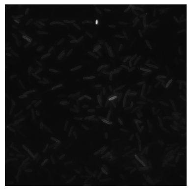

Now we turn the video into an image.

``` python
def save_first_frame(input_path, output_path, extension = '.png') -> None:
    """
    Save the first frame of an ND2 file as an image, using the same name as input file.
    """
    filename = input_path.name.removesuffix('.nd2')  # Some names have . in the filename
    output_path = (output_path/f'{filename}{extension}')
    Image.fromarray(nd2.imread(input_path)[0]).save(output_path)
```

``` python
# Save videos as images
# for p in video_path.ls(): 
#     if p.suffix == '.nd2': save_first_frame(p, path)
```

``` python
path = Path.home()/'data/pili/training_data'
path.ls()
```

    (#18) [Path('/home/kappa/data/pili/training_data/WT-A86C-LB-ice-002.png'),Path('/home/kappa/data/pili/training_data/200ms-0.4%-005.png'),Path('/home/kappa/data/pili/training_data/1hr01002.csv'),Path('/home/kappa/data/pili/training_data/dCpdA R1 FH 017.png'),Path('/home/kappa/data/pili/training_data/Chp B Replicate 2 200 MS060.png'),Path('/home/kappa/data/pili/training_data/4hrs incu004.csv'),Path('/home/kappa/data/pili/training_data/7.1- 003.png'),Path('/home/kappa/data/pili/training_data/4hrs incu004.png'),Path('/home/kappa/data/pili/training_data/200ms-0.4%-005.csv'),Path('/home/kappa/data/pili/training_data/WT-A86C-LB-ice-002.csv'),Path('/home/kappa/data/pili/training_data/0.1%.004.png'),Path('/home/kappa/data/pili/training_data/dCpdA R1 FH 017.csv'),Path('/home/kappa/data/pili/training_data/0N01002.csv'),Path('/home/kappa/data/pili/training_data/0N01002.png'),Path('/home/kappa/data/pili/training_data/Chp B Replicate 2 200 MS060.csv'),Path('/home/kappa/data/pili/training_data/7.1- 003.csv'),Path('/home/kappa/data/pili/training_data/1hr01002.png'),Path('/home/kappa/data/pili/training_data/0.1%.004.csv')]

We can now use `show_image` to display images.

``` python
img_path = path/'0N01002.png'
bac_im = np.array(Image.open(img_path))
show_image(bac_im, figsize=(4,4));
```

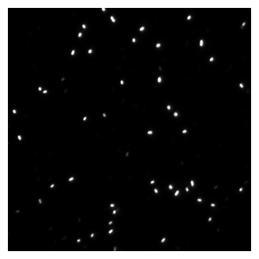

Now, we want to take care of bounding boxes. We first turn them into
YOLO bounding box format because they are in angle format.

YOLO bounding box format:

    'class_index', 'x1', 'y1', 'x2', 'y2', 'x3', 'y3', 'x4', 'y4'

where `x1`, …, `y4` are edge points for each box.

csv files have information about the box. `Length`, `Width`,
`Position X` and `Position Y` are in nanometer(?).

``` python
df = pd.read_csv(path/'0N01002.csv')
df.head()
```

<div>
<style scoped>
    .dataframe tbody tr th:only-of-type {
        vertical-align: middle;
    }
&#10;    .dataframe tbody tr th {
        vertical-align: top;
    }
&#10;    .dataframe thead th {
        text-align: right;
    }
</style>

<table class="dataframe" data-quarto-postprocess="true" data-border="1">
<thead>
<tr style="text-align: right;">
<th data-quarto-table-cell-role="th"></th>
<th data-quarto-table-cell-role="th">Name</th>
<th data-quarto-table-cell-role="th">Length</th>
<th data-quarto-table-cell-role="th">Width</th>
<th data-quarto-table-cell-role="th">Angle</th>
<th data-quarto-table-cell-role="th">Position X</th>
<th data-quarto-table-cell-role="th">Position Y</th>
<th data-quarto-table-cell-role="th">Color R</th>
<th data-quarto-table-cell-role="th">Color G</th>
<th data-quarto-table-cell-role="th">Color B</th>
<th data-quarto-table-cell-role="th">Type</th>
</tr>
</thead>
<tbody>
<tr>
<td data-quarto-table-cell-role="th">0</td>
<td>Box 1</td>
<td>2.100000e-06</td>
<td>0.000001</td>
<td>0.733038</td>
<td>0.000011</td>
<td>0.000082</td>
<td>0.509804</td>
<td>0.901961</td>
<td>0.509804</td>
<td>1</td>
</tr>
<tr>
<td data-quarto-table-cell-role="th">1</td>
<td>Box 2</td>
<td>2.300000e-06</td>
<td>0.000001</td>
<td>0.401426</td>
<td>0.000015</td>
<td>0.000083</td>
<td>0.509804</td>
<td>0.901961</td>
<td>0.509804</td>
<td>1</td>
</tr>
<tr>
<td data-quarto-table-cell-role="th">2</td>
<td>Box 3</td>
<td>2.000000e-06</td>
<td>0.000001</td>
<td>0.837758</td>
<td>0.000013</td>
<td>0.000072</td>
<td>0.509804</td>
<td>0.901961</td>
<td>0.509804</td>
<td>1</td>
</tr>
<tr>
<td data-quarto-table-cell-role="th">3</td>
<td>Box 4</td>
<td>2.100000e-06</td>
<td>0.000001</td>
<td>1.832596</td>
<td>0.000029</td>
<td>0.000075</td>
<td>0.509804</td>
<td>0.901961</td>
<td>0.509804</td>
<td>1</td>
</tr>
<tr>
<td data-quarto-table-cell-role="th">4</td>
<td>Box 5</td>
<td>9.000000e-07</td>
<td>0.000001</td>
<td>-1.553343</td>
<td>0.000026</td>
<td>0.000084</td>
<td>1.000000</td>
<td>0.000000</td>
<td>0.549020</td>
<td>6</td>
</tr>
</tbody>
</table>

</div>

TODO: make `class_index` 0-based.

------------------------------------------------------------------------

<a
href="https://github.com/galopyz/pilus_project/blob/main/pilus_project/core.py#L30"
target="_blank" style="float:right; font-size:smaller">source</a>

### calc_corners

>  calc_corners (csv, max_pos=8.458666666666666e-05)

``` python
bac_boxes = calc_corners(path/'0N01002.csv')
bac_boxes[:5]
```

    tensor([[1.0000, 0.1295, 0.9836, 0.1110, 0.9670, 0.1205, 0.9565, 0.1390, 0.9731],
            [1.0000, 0.1901, 0.9989, 0.1651, 0.9883, 0.1706, 0.9752, 0.1957, 0.9859],
            [1.0000, 0.1547, 0.8677, 0.1389, 0.8501, 0.1494, 0.8406, 0.1652, 0.8582],
            [1.0000, 0.3313, 0.8914, 0.3377, 0.8674, 0.3514, 0.8710, 0.3450, 0.8950],
            [6.0000, 0.3144, 0.9890, 0.3142, 0.9996, 0.3000, 0.9994, 0.3002, 0.9887]],
           dtype=torch.float64)

We want to take a look at images with bounding boxes.

    /opt/hostedtoolcache/Python/3.10.17/x64/lib/python3.10/site-packages/fastcore/docscrape.py:230: UserWarning: Unknown section Other Parameters
      else: warn(msg)
    /opt/hostedtoolcache/Python/3.10.17/x64/lib/python3.10/site-packages/fastcore/docscrape.py:230: UserWarning: Unknown section See Also
      else: warn(msg)

------------------------------------------------------------------------

### show_bac_img_with_boxes

>  show_bac_img_with_boxes (im, boxes, figsize=(8, 8), title=None, ax=None,
>                               legend=None, legend_loc='upper left', cmap=None,
>                               norm=None, aspect=None, interpolation=None,
>                               alpha=None, vmin=None, vmax=None,
>                               colorizer=None, origin=None, extent=None,
>                               interpolation_stage=None, filternorm=True,
>                               filterrad=4.0, resample=None, url=None,
>                               data=None)

*Display image with bounding boxes for different cell types, returns fig
and ax for further customization*

<table>
<colgroup>
<col style="width: 6%" />
<col style="width: 25%" />
<col style="width: 34%" />
<col style="width: 34%" />
</colgroup>
<thead>
<tr>
<th></th>
<th><strong>Type</strong></th>
<th><strong>Default</strong></th>
<th><strong>Details</strong></th>
</tr>
</thead>
<tbody>
<tr>
<td>im</td>
<td></td>
<td></td>
<td></td>
</tr>
<tr>
<td>boxes</td>
<td></td>
<td></td>
<td></td>
</tr>
<tr>
<td>figsize</td>
<td>tuple</td>
<td>(8, 8)</td>
<td></td>
</tr>
<tr>
<td>title</td>
<td>NoneType</td>
<td>None</td>
<td></td>
</tr>
<tr>
<td>ax</td>
<td>NoneType</td>
<td>None</td>
<td></td>
</tr>
<tr>
<td>legend</td>
<td>NoneType</td>
<td>None</td>
<td></td>
</tr>
<tr>
<td>legend_loc</td>
<td>str</td>
<td>upper left</td>
<td></td>
</tr>
<tr>
<td>cmap</td>
<td>NoneType</td>
<td>None</td>
<td>The Colormap instance or registered colormap name used to map scalar
data<br>to colors.<br><br>This parameter is ignored if <em>X</em> is
RGB(A).</td>
</tr>
<tr>
<td>norm</td>
<td>NoneType</td>
<td>None</td>
<td>The normalization method used to scale scalar data to the [0, 1]
range<br>before mapping to colors using <em>cmap</em>. By default, a
linear scaling is<br>used, mapping the lowest value to 0 and the highest
to 1.<br><br>If given, this can be one of the following:<br><br>- An
instance of <code>.Normalize</code> or one of its subclasses<br> (see
:ref:<code>colormapnorms</code>).<br>- A scale name, i.e. one of
“linear”, “log”, “symlog”, “logit”, etc. For a<br> list of available
scales, call <code>matplotlib.scale.get_scale_names()</code>.<br> In
that case, a suitable <code>.Normalize</code> subclass is dynamically
generated<br> and instantiated.<br><br>This parameter is ignored if
<em>X</em> is RGB(A).</td>
</tr>
<tr>
<td>aspect</td>
<td>NoneType</td>
<td>None</td>
<td>The aspect ratio of the Axes. This parameter is
particularly<br>relevant for images since it determines whether data
pixels are<br>square.<br><br>This parameter is a shortcut for explicitly
calling<br><code>.Axes.set_aspect</code>. See there for further
details.<br><br>- ‘equal’: Ensures an aspect ratio of 1. Pixels will be
square<br> (unless pixel sizes are explicitly made non-square in
data<br> coordinates using <em>extent</em>).<br>- ‘auto’: The Axes is
kept fixed and the aspect is adjusted so<br> that the data fit in the
Axes. In general, this will result in<br> non-square
pixels.<br><br>Normally, None (the default) means to use
:rc:<code>image.aspect</code>. However, if<br>the image uses a transform
that does not contain the axes data transform,<br>then None means to not
modify the axes aspect at all (in that case, directly<br>call
<code>.Axes.set_aspect</code> if desired).</td>
</tr>
<tr>
<td>interpolation</td>
<td>NoneType</td>
<td>None</td>
<td>The interpolation method used.<br><br>Supported values are ‘none’,
‘auto’, ‘nearest’, ‘bilinear’,<br>‘bicubic’, ‘spline16’, ‘spline36’,
‘hanning’, ‘hamming’, ‘hermite’,<br>‘kaiser’, ‘quadric’, ‘catrom’,
‘gaussian’, ‘bessel’, ‘mitchell’,<br>‘sinc’, ‘lanczos’,
‘blackman’.<br><br>The data <em>X</em> is resampled to the pixel size of
the image on the<br>figure canvas, using the interpolation method to
either up- or<br>downsample the data.<br><br>If <em>interpolation</em>
is ‘none’, then for the ps, pdf, and svg<br>backends no down- or
upsampling occurs, and the image data is<br>passed to the backend as a
native image. Note that different ps,<br>pdf, and svg viewers may
display these raw pixels differently. On<br>other backends, ‘none’ is
the same as ‘nearest’.<br><br>If <em>interpolation</em> is the default
‘auto’, then ‘nearest’<br>interpolation is used if the image is
upsampled by more than a<br>factor of three (i.e. the number of display
pixels is at least<br>three times the size of the data array). If the
upsampling rate is<br>smaller than 3, or the image is downsampled, then
‘hanning’<br>interpolation is used to act as an anti-aliasing filter,
unless the<br>image happens to be upsampled by exactly a factor of two
or
one.<br><br>See<br>:doc:<code>/gallery/images_contours_and_fields/interpolation_methods</code><br>for
an overview of the supported interpolation methods,
and<br>:doc:<code>/gallery/images_contours_and_fields/image_antialiasing</code>
for<br>a discussion of image antialiasing.<br><br>Some interpolation
methods require an additional radius parameter,<br>which can be set by
<em>filterrad</em>. Additionally, the antigrain image<br>resize filter
is controlled by the parameter <em>filternorm</em>.</td>
</tr>
<tr>
<td>alpha</td>
<td>NoneType</td>
<td>None</td>
<td>The alpha blending value, between 0 (transparent) and 1
(opaque).<br>If <em>alpha</em> is an array, the alpha blending values
are applied pixel<br>by pixel, and <em>alpha</em> must have the same
shape as <em>X</em>.</td>
</tr>
<tr>
<td>vmin</td>
<td>NoneType</td>
<td>None</td>
<td></td>
</tr>
<tr>
<td>vmax</td>
<td>NoneType</td>
<td>None</td>
<td></td>
</tr>
<tr>
<td>colorizer</td>
<td>NoneType</td>
<td>None</td>
<td>The Colorizer object used to map color to data. If None, a
Colorizer<br>object is created from a <em>norm</em> and
<em>cmap</em>.<br><br>This parameter is ignored if <em>X</em> is
RGB(A).</td>
</tr>
<tr>
<td>origin</td>
<td>NoneType</td>
<td>None</td>
<td>Place the [0, 0] index of the array in the upper left or
lower<br>left corner of the Axes. The convention (the default) ‘upper’
is<br>typically used for matrices and images.<br><br>Note that the
vertical axis points upward for ‘lower’<br>but downward for
‘upper’.<br><br>See the :ref:<code>imshow_extent</code> tutorial
for<br>examples and a more detailed description.</td>
</tr>
<tr>
<td>extent</td>
<td>NoneType</td>
<td>None</td>
<td>The bounding box in data coordinates that the image will
fill.<br>These values may be unitful and match the units of the
Axes.<br>The image is stretched individually along x and y to fill the
box.<br><br>The default extent is determined by the following
conditions.<br>Pixels have unit size in data coordinates. Their centers
are on<br>integer coordinates, and their center coordinates range from 0
to<br>columns-1 horizontally and from 0 to rows-1
vertically.<br><br>Note that the direction of the vertical axis and thus
the default<br>values for top and bottom depend on
<em>origin</em>:<br><br>- For <code>origin == 'upper'</code> the default
is<br> <code>(-0.5, numcols-0.5, numrows-0.5, -0.5)</code>.<br>- For
<code>origin == 'lower'</code> the default is<br>
<code>(-0.5, numcols-0.5, -0.5, numrows-0.5)</code>.<br><br>See the
:ref:<code>imshow_extent</code> tutorial for<br>examples and a more
detailed description.</td>
</tr>
<tr>
<td>interpolation_stage</td>
<td>NoneType</td>
<td>None</td>
<td>Supported values:<br><br>- ‘data’: Interpolation is carried out on
the data provided by the user<br> This is useful if interpolating
between pixels during upsampling.<br>- ‘rgba’: The interpolation is
carried out in RGBA-space after the<br> color-mapping has been applied.
This is useful if downsampling and<br> combining pixels visually.<br>-
‘auto’: Select a suitable interpolation stage automatically. This
uses<br> ‘rgba’ when downsampling, or upsampling at a rate less than 3,
and<br> ‘data’ when upsampling at a higher rate.<br><br>See
:doc:<code>/gallery/images_contours_and_fields/image_antialiasing</code>
for<br>a discussion of image antialiasing.</td>
</tr>
<tr>
<td>filternorm</td>
<td>bool</td>
<td>True</td>
<td>A parameter for the antigrain image resize filter (see
the<br>antigrain documentation). If <em>filternorm</em> is set, the
filter<br>normalizes integer values and corrects the rounding errors.
It<br>doesn’t do anything with the source floating point values,
it<br>corrects only integers according to the rule of 1.0 which
means<br>that any sum of pixel weights must be equal to 1.0. So,
the<br>filter function must produce a graph of the proper shape.</td>
</tr>
<tr>
<td>filterrad</td>
<td>float</td>
<td>4.0</td>
<td>The filter radius for filters that have a radius parameter,
i.e.<br>when interpolation is one of: ‘sinc’, ‘lanczos’ or
‘blackman’.</td>
</tr>
<tr>
<td>resample</td>
<td>NoneType</td>
<td>None</td>
<td>When <em>True</em>, use a full resampling method. When
<em>False</em>, only<br>resample when the output image is larger than
the input image.</td>
</tr>
<tr>
<td>url</td>
<td>NoneType</td>
<td>None</td>
<td>Set the url of the created <code>.AxesImage</code>. See
<code>.Artist.set_url</code>.</td>
</tr>
<tr>
<td>data</td>
<td>NoneType</td>
<td>None</td>
<td></td>
</tr>
</tbody>
</table>

``` python
show_bac_img_with_boxes(bac_im, bac_boxes, legend=True, legend_loc='best');
```

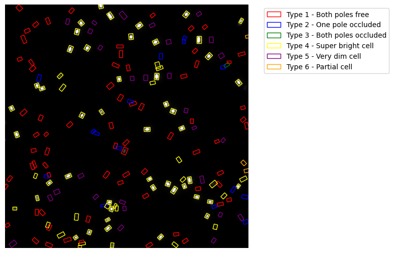

We want to train with yolov1, which has the
`['class_index', 'x_mid', 'y_mid', 'w', 'h']`. So we change the format
of our coordinates.

``` python
def calc_yolo_boxes(csv, max_pos=8.458666666666666e-05):
    df = pd.read_csv(csv)
    results = []
    for _, row in df.iterrows():
        length, width, angle = row['Length'], row['Width'], row['Angle']
        pos_x, pos_y = row['Position X'], row['Position Y']

        x1 = pos_x + length/2 * np.cos(angle) - width/2 * np.sin(angle)
        y1 = pos_y + length/2 * np.sin(angle) + width/2 * np.cos(angle)
        x2 = pos_x - length/2 * np.cos(angle) - width/2 * np.sin(angle)
        y2 = pos_y - length/2 * np.sin(angle) + width/2 * np.cos(angle)
        x3 = pos_x - length/2 * np.cos(angle) + width/2 * np.sin(angle)
        y3 = pos_y - length/2 * np.sin(angle) - width/2 * np.cos(angle)
        x4 = pos_x + length/2 * np.cos(angle) + width/2 * np.sin(angle)
        y4 = pos_y + length/2 * np.sin(angle) - width/2 * np.cos(angle)
        
        x_coords, y_coords = [x1, x2, x3, x4], [y1, y2, y3, y4]
        x_center, y_center = sum(x_coords) / 4, sum(y_coords) / 4
        bbox_width, bbox_height = max(x_coords) - min(x_coords), max(y_coords) - min(y_coords)
        
        results.append([row['Type'], x_center / max_pos, y_center / max_pos, bbox_width / max_pos, bbox_height / max_pos])

    return torch.tensor(results)
```

``` python
yolo_bac_boxes = calc_yolo_boxes(path/'0N01002.csv')
yolo_bac_boxes[:5]
```

    tensor([[1.0000, 0.1250, 0.9701, 0.0279, 0.0272],
            [1.0000, 0.1804, 0.9871, 0.0306, 0.0237],
            [1.0000, 0.1521, 0.8542, 0.0264, 0.0271],
            [1.0000, 0.3414, 0.8812, 0.0201, 0.0277],
            [6.0000, 0.3072, 0.9942, 0.0144, 0.0109]], dtype=torch.float64)

We can use `show_image_with_boxes` to show an image with boxes. Whether
it is bacteria image or VOC image.

``` python
VOC_CLASSES = ["aeroplane", "bicycle", "bird", "boat", "bottle", "bus", "car", 
           "cat", "chair", "cow", "diningtable", "dog", "horse", "motorbike", 
           "person", "pottedplant", "sheep", "sofa", "train", "tvmonitor"]
```

``` python
@fc.delegates(show_image)
def show_image_with_boxes(im, boxes, ax=None, figsize=(8,8), box_color='red', thickness=1, **kwargs):
    "Show image with bounding boxes with `[class_id, x_center, y_center, width, height]` format."
    ax = show_image(im, ax=ax, figsize=figsize, **kwargs)
    if isinstance(im, (PIL.JpegImagePlugin.JpegImageFile, PIL.PngImagePlugin.PngImageFile)):  # PIL.Image
        h, w = im.height, im.width
    elif len(im.shape) == 2:                               # Bac image w/o channel
        h, w = im.shape
    else:                                                  # VOC image
        h, w = im.shape[1:]
    
    for box in boxes:
        class_id, x_center, y_center, width, height = box
        x1, y1 = int((x_center - width/2) * w), int((y_center - height/2) * h)
        x2, y2 = int((x_center + width/2) * w), int((y_center + height/2) * h)
        
        rect = patches.Rectangle((x1, y1), x2-x1, y2-y1, linewidth=thickness, edgecolor=box_color, facecolor='none')
        ax.add_patch(rect)
        
        ax.text(x1, y1-5, f"{VOC_CLASSES[int(class_id)]}", color=box_color)
    
    return ax
```

TODO: Classes need to be changed for bac images.

``` python
show_image_with_boxes(bac_im, yolo_bac_boxes, figsize=(8,8));
```

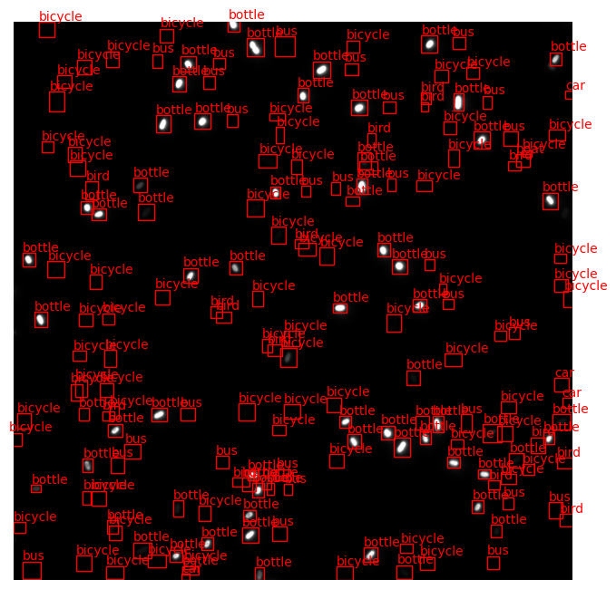

### VOC image

We will also work with [PASCAL VOC
dataset](http://host.robots.ox.ac.uk/pascal/VOC/index.html). VOC dataset
has images and bounding boxes for corresponding objects. We can train
our model on this dataset before training on bacteria dataset as we
don’t have too many samples for bacteria images.

``` python
voc_img_path = Path('../data/images')
voc_img_path
```

    Path('../data/images')

csv file has img and label.

``` python
df = pd.read_csv("../8examples.csv")
df
```

<div>
<style scoped>
    .dataframe tbody tr th:only-of-type {
        vertical-align: middle;
    }
&#10;    .dataframe tbody tr th {
        vertical-align: top;
    }
&#10;    .dataframe thead th {
        text-align: right;
    }
</style>

<table class="dataframe" data-quarto-postprocess="true" data-border="1">
<thead>
<tr style="text-align: right;">
<th data-quarto-table-cell-role="th"></th>
<th data-quarto-table-cell-role="th">img</th>
<th data-quarto-table-cell-role="th">label</th>
</tr>
</thead>
<tbody>
<tr>
<td data-quarto-table-cell-role="th">0</td>
<td>000007.jpg</td>
<td>000007.txt</td>
</tr>
<tr>
<td data-quarto-table-cell-role="th">1</td>
<td>000009.jpg</td>
<td>000009.txt</td>
</tr>
<tr>
<td data-quarto-table-cell-role="th">2</td>
<td>000016.jpg</td>
<td>000016.txt</td>
</tr>
<tr>
<td data-quarto-table-cell-role="th">3</td>
<td>000019.jpg</td>
<td>000019.txt</td>
</tr>
<tr>
<td data-quarto-table-cell-role="th">4</td>
<td>000020.jpg</td>
<td>000020.txt</td>
</tr>
<tr>
<td data-quarto-table-cell-role="th">5</td>
<td>000021.jpg</td>
<td>000021.txt</td>
</tr>
<tr>
<td data-quarto-table-cell-role="th">6</td>
<td>000122.jpg</td>
<td>000122.txt</td>
</tr>
<tr>
<td data-quarto-table-cell-role="th">7</td>
<td>000129.jpg</td>
<td>000129.txt</td>
</tr>
</tbody>
</table>

</div>

``` python
df.iloc[3]
```

    img      000019.jpg
    label    000019.txt
    Name: 3, dtype: object

Let’s take a look at an image of two cats chilling or dreaming on the
ground. 😺🐈

``` python
voc_im = Image.open(voc_img_path/df.iloc[3,0])
voc_im
```

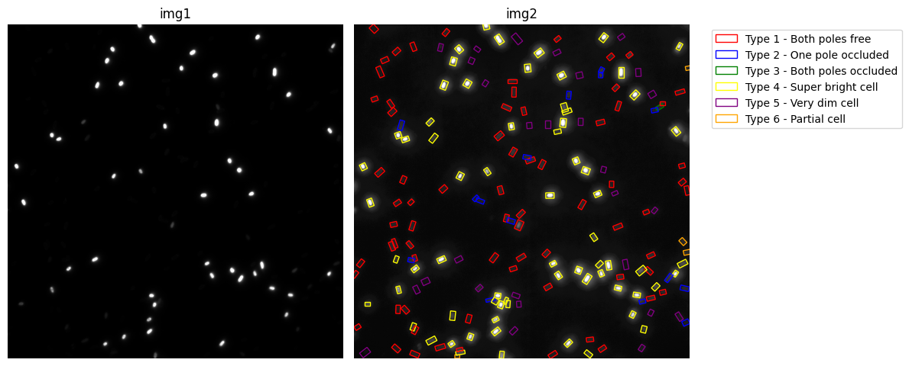

Now we get get the boxes. We also call boxes as labels because they are
the targets we are trying to predict.

``` python
voc_lbl_path = Path('../data/labels')
voc_lbl_path
```

    Path('../data/labels')

Label file has boxes for each row. Each row has the shape of
`['class_index', 'x_mid', 'y_mid', 'w', 'h']`. Those coordinates for
each box are normalized from 0 to 1, which makes them great for working
with different sized images. It is important to keep in mind that
`x_mid` and `y_mid` start from top left corner.

``` python
with open(voc_lbl_path/df.iloc[3,1]) as f:
    for label in f.readlines():
        print(label)
```

    7 0.712 0.45599999999999996 0.504 0.448

    7 0.275 0.4933333333333333 0.51 0.3893333333333333

Let’s turn those into tensors.

``` python
def get_boxes(label_path):
    with open(label_path) as f: 
        boxes = [[float(x) if '.' in x else int(x) for x in line.strip().split()] for line in f]
    return torch.tensor(boxes)
```

``` python
voc_boxes = get_boxes(voc_lbl_path/df.iloc[3,1])
voc_boxes
```

    tensor([[7.0000, 0.7120, 0.4560, 0.5040, 0.4480],
            [7.0000, 0.2750, 0.4933, 0.5100, 0.3893]])

We have 2 boxes, which have the same classes (cats) and bounding boxes.

``` python
voc_boxes.shape
```

    torch.Size([2, 5])

``` python
show_image_with_boxes(voc_im, voc_boxes, figsize=(6,6));
```

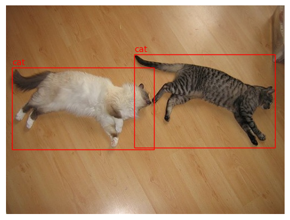

### yolo utils

``` python
seed = 123
torch.manual_seed(seed)

LEARNING_RATE = 2e-5
DEVICE = "cuda" if torch.cuda.is_available() else "cpu"
BATCH_SIZE = 4 
WEIGHT_DECAY = 0
NUM_WORKERS = 4
PIN_MEMORY = True
LOAD_MODEL = False
LOAD_MODEL_FILE = "overfit.pth.tar"
IMG_DIR = "../data/images"
LABEL_DIR = "../data/labels"
```

We have some utility functions we need. Let’s get the dataset for VOC.
For bounding boxes, we are converting coordinates based on each image
into split cells.

``` python
class VOCDataset(Dataset):
    def __init__(self, csv_file, img_dir, label_dir, S=7, B=2, C=20, transform=None):
        self.annotations, self.img_dir = pd.read_csv(csv_file), fc.Path(img_dir)
        self.label_dir, self.transform = fc.Path(label_dir), transform
        self.S, self.B, self.C = S, B, C

    def __len__(self): return len(self.annotations)

    def __getitem__(self, index):
        label_path = self.label_dir / self.annotations.iloc[index, 1]
        img_path = self.img_dir / self.annotations.iloc[index, 0]
        image = Image.open(img_path)
        boxes = get_boxes(label_path)

        if self.transform: image, boxes = self.transform(image, boxes)

        label_matrix = torch.zeros((self.S, self.S, self.C + 5 * self.B))
        for box in boxes:
            class_label, x, y, width, height = box
            class_label = int(class_label)
            i, j = int(self.S * y), int(self.S * x)
            x_cell, y_cell = self.S * x - j, self.S * y - i
            width_cell, height_cell = width * self.S, height * self.S

            if label_matrix[i, j, 20] == 0:
                label_matrix[i, j, 20] = 1
                label_matrix[i, j, 21:25] = torch.tensor([x_cell, y_cell, width_cell, height_cell])
                label_matrix[i, j, class_label] = 1

        return image, label_matrix
```

``` python
class Compose(object):
    def __init__(self, transforms):
        self.transforms = transforms

    def __call__(self, img, bboxes):
        if img.mode != 'RGB': img = img.convert('RGB')
        for t in self.transforms: img, bboxes = t(img), bboxes

        return img, bboxes

transform = Compose([transforms.Resize((448, 448)), transforms.ToTensor(),])

train_dataset = VOCDataset(
    "../8examples.csv",
    transform=transform,
    img_dir=IMG_DIR,
    label_dir=LABEL_DIR,
)
x0, y0 = train_dataset[3]
x0.shape, y0.shape
```

    (torch.Size([3, 448, 448]), torch.Size([7, 7, 30]))

``` python
y0[3]
```

    tensor([[0.0000, 0.0000, 0.0000, 0.0000, 0.0000, 0.0000, 0.0000, 0.0000, 0.0000,
             0.0000, 0.0000, 0.0000, 0.0000, 0.0000, 0.0000, 0.0000, 0.0000, 0.0000,
             0.0000, 0.0000, 0.0000, 0.0000, 0.0000, 0.0000, 0.0000, 0.0000, 0.0000,
             0.0000, 0.0000, 0.0000],
            [0.0000, 0.0000, 0.0000, 0.0000, 0.0000, 0.0000, 0.0000, 1.0000, 0.0000,
             0.0000, 0.0000, 0.0000, 0.0000, 0.0000, 0.0000, 0.0000, 0.0000, 0.0000,
             0.0000, 0.0000, 1.0000, 0.9250, 0.4533, 3.5700, 2.7253, 0.0000, 0.0000,
             0.0000, 0.0000, 0.0000],
            [0.0000, 0.0000, 0.0000, 0.0000, 0.0000, 0.0000, 0.0000, 0.0000, 0.0000,
             0.0000, 0.0000, 0.0000, 0.0000, 0.0000, 0.0000, 0.0000, 0.0000, 0.0000,
             0.0000, 0.0000, 0.0000, 0.0000, 0.0000, 0.0000, 0.0000, 0.0000, 0.0000,
             0.0000, 0.0000, 0.0000],
            [0.0000, 0.0000, 0.0000, 0.0000, 0.0000, 0.0000, 0.0000, 0.0000, 0.0000,
             0.0000, 0.0000, 0.0000, 0.0000, 0.0000, 0.0000, 0.0000, 0.0000, 0.0000,
             0.0000, 0.0000, 0.0000, 0.0000, 0.0000, 0.0000, 0.0000, 0.0000, 0.0000,
             0.0000, 0.0000, 0.0000],
            [0.0000, 0.0000, 0.0000, 0.0000, 0.0000, 0.0000, 0.0000, 1.0000, 0.0000,
             0.0000, 0.0000, 0.0000, 0.0000, 0.0000, 0.0000, 0.0000, 0.0000, 0.0000,
             0.0000, 0.0000, 1.0000, 0.9840, 0.1920, 3.5280, 3.1360, 0.0000, 0.0000,
             0.0000, 0.0000, 0.0000],
            [0.0000, 0.0000, 0.0000, 0.0000, 0.0000, 0.0000, 0.0000, 0.0000, 0.0000,
             0.0000, 0.0000, 0.0000, 0.0000, 0.0000, 0.0000, 0.0000, 0.0000, 0.0000,
             0.0000, 0.0000, 0.0000, 0.0000, 0.0000, 0.0000, 0.0000, 0.0000, 0.0000,
             0.0000, 0.0000, 0.0000],
            [0.0000, 0.0000, 0.0000, 0.0000, 0.0000, 0.0000, 0.0000, 0.0000, 0.0000,
             0.0000, 0.0000, 0.0000, 0.0000, 0.0000, 0.0000, 0.0000, 0.0000, 0.0000,
             0.0000, 0.0000, 0.0000, 0.0000, 0.0000, 0.0000, 0.0000, 0.0000, 0.0000,
             0.0000, 0.0000, 0.0000]])

To be able to visualize this, we have to convert it back to previous
format.

``` python
def cellboxes_to_boxes(predictions, S=7, conf_threshold=0.1):
    "Convert YOLO predictions to list of bounding boxes for each image"
    predictions = predictions.cpu().reshape(-1, S, S, 30)  # (bs, S, S, 2*B + C)
    bs = predictions.shape[0]
    
    bboxes1, bboxes2 = predictions[..., 21:25], predictions[..., 26:30]  # (bs, S, S, 4)
    scores = torch.stack([predictions[..., 20], predictions[..., 25]])   # (2, bs, S, S)
    best_box = scores.argmax(0).bool()
    best_boxes = torch.where(best_box.unsqueeze(-1), bboxes2, bboxes1)   # (bs, S, S, 4)
    
    i, j = torch.meshgrid(torch.arange(S), torch.arange(S), indexing='ij')
    grid = torch.stack([j, i], dim=-1).unsqueeze(0).repeat(bs, 1, 1, 1).to(predictions.device)
    x = (best_boxes[..., 0:1] + grid[..., 0:1]) / S                      # (bs, S, S, 2)
    y = (best_boxes[..., 1:2] + grid[..., 1:2]) / S                      # (bs, S, S, 2)
    w_h = best_boxes[..., 2:4] / S
    
    predicted_class = predictions[..., :20].argmax(-1).unsqueeze(-1)
    best_confidence = torch.max(predictions[..., 20], predictions[..., 25]).unsqueeze(-1)
    
    result = torch.cat([predicted_class, best_confidence, x, y, w_h], dim=-1)
    mask = best_confidence.squeeze(-1) < conf_threshold                  
    # remove xy cooordinates without object
    result[mask] = 0                                                     # (bs, S, S, 6)
    
    converted_pred = result.reshape(result.shape[0], S * S, -1)
    converted_pred[..., 0] = converted_pred[..., 0].long()
    return converted_pred.tolist()
```

``` python
cellboxes_to_boxes(y0)
```

    [[[0.0, 0.0, 0.0, 0.0, 0.0, 0.0],
      [0.0, 0.0, 0.0, 0.0, 0.0, 0.0],
      [0.0, 0.0, 0.0, 0.0, 0.0, 0.0],
      [0.0, 0.0, 0.0, 0.0, 0.0, 0.0],
      [0.0, 0.0, 0.0, 0.0, 0.0, 0.0],
      [0.0, 0.0, 0.0, 0.0, 0.0, 0.0],
      [0.0, 0.0, 0.0, 0.0, 0.0, 0.0],
      [0.0, 0.0, 0.0, 0.0, 0.0, 0.0],
      [0.0, 0.0, 0.0, 0.0, 0.0, 0.0],
      [0.0, 0.0, 0.0, 0.0, 0.0, 0.0],
      [0.0, 0.0, 0.0, 0.0, 0.0, 0.0],
      [0.0, 0.0, 0.0, 0.0, 0.0, 0.0],
      [0.0, 0.0, 0.0, 0.0, 0.0, 0.0],
      [0.0, 0.0, 0.0, 0.0, 0.0, 0.0],
      [0.0, 0.0, 0.0, 0.0, 0.0, 0.0],
      [0.0, 0.0, 0.0, 0.0, 0.0, 0.0],
      [0.0, 0.0, 0.0, 0.0, 0.0, 0.0],
      [0.0, 0.0, 0.0, 0.0, 0.0, 0.0],
      [0.0, 0.0, 0.0, 0.0, 0.0, 0.0],
      [0.0, 0.0, 0.0, 0.0, 0.0, 0.0],
      [0.0, 0.0, 0.0, 0.0, 0.0, 0.0],
      [0.0, 0.0, 0.0, 0.0, 0.0, 0.0],
      [7.0,
       1.0,
       0.2750000059604645,
       0.4933333396911621,
       0.5099999904632568,
       0.3893333375453949],
      [0.0, 0.0, 0.0, 0.0, 0.0, 0.0],
      [0.0, 0.0, 0.0, 0.0, 0.0, 0.0],
      [7.0,
       1.0,
       0.7120000123977661,
       0.4560000002384186,
       0.5040000081062317,
       0.4480000138282776],
      [0.0, 0.0, 0.0, 0.0, 0.0, 0.0],
      [0.0, 0.0, 0.0, 0.0, 0.0, 0.0],
      [0.0, 0.0, 0.0, 0.0, 0.0, 0.0],
      [0.0, 0.0, 0.0, 0.0, 0.0, 0.0],
      [0.0, 0.0, 0.0, 0.0, 0.0, 0.0],
      [0.0, 0.0, 0.0, 0.0, 0.0, 0.0],
      [0.0, 0.0, 0.0, 0.0, 0.0, 0.0],
      [0.0, 0.0, 0.0, 0.0, 0.0, 0.0],
      [0.0, 0.0, 0.0, 0.0, 0.0, 0.0],
      [0.0, 0.0, 0.0, 0.0, 0.0, 0.0],
      [0.0, 0.0, 0.0, 0.0, 0.0, 0.0],
      [0.0, 0.0, 0.0, 0.0, 0.0, 0.0],
      [0.0, 0.0, 0.0, 0.0, 0.0, 0.0],
      [0.0, 0.0, 0.0, 0.0, 0.0, 0.0],
      [0.0, 0.0, 0.0, 0.0, 0.0, 0.0],
      [0.0, 0.0, 0.0, 0.0, 0.0, 0.0],
      [0.0, 0.0, 0.0, 0.0, 0.0, 0.0],
      [0.0, 0.0, 0.0, 0.0, 0.0, 0.0],
      [0.0, 0.0, 0.0, 0.0, 0.0, 0.0],
      [0.0, 0.0, 0.0, 0.0, 0.0, 0.0],
      [0.0, 0.0, 0.0, 0.0, 0.0, 0.0],
      [0.0, 0.0, 0.0, 0.0, 0.0, 0.0],
      [0.0, 0.0, 0.0, 0.0, 0.0, 0.0]]]

``` python
len(cellboxes_to_boxes(y0)[0])
```

    49

``` python
my_boxes = cellboxes_to_boxes(y0)[0]
my_boxes[:4]
```

    [[0.0, 0.0, 0.0, 0.0, 0.0, 0.0],
     [0.0, 0.0, 0.0, 0.0, 0.0, 0.0],
     [0.0, 0.0, 0.0, 0.0, 0.0, 0.0],
     [0.0, 0.0, 0.0, 0.0, 0.0, 0.0]]

`my_boxes` has a shape of `[class, confidence, x, y, w, h]`. But we
don’t need confidence for showing an image. We could add that option in
the future.

``` python
[[boxes[0]] + boxes[2:] for boxes in my_boxes][:4]
```

    [[0.0, 0.0, 0.0, 0.0, 0.0],
     [0.0, 0.0, 0.0, 0.0, 0.0],
     [0.0, 0.0, 0.0, 0.0, 0.0],
     [0.0, 0.0, 0.0, 0.0, 0.0]]

``` python
[[[boxes[0]] + boxes[2:] for boxes in my_boxes][25]]
```

    [[7.0,
      0.7120000123977661,
      0.4560000002384186,
      0.5040000081062317,
      0.4480000138282776]]

``` python
[[[boxes[0]] + boxes[2:] for boxes in my_boxes]][0]
```

    [[0.0, 0.0, 0.0, 0.0, 0.0],
     [0.0, 0.0, 0.0, 0.0, 0.0],
     [0.0, 0.0, 0.0, 0.0, 0.0],
     [0.0, 0.0, 0.0, 0.0, 0.0],
     [0.0, 0.0, 0.0, 0.0, 0.0],
     [0.0, 0.0, 0.0, 0.0, 0.0],
     [0.0, 0.0, 0.0, 0.0, 0.0],
     [0.0, 0.0, 0.0, 0.0, 0.0],
     [0.0, 0.0, 0.0, 0.0, 0.0],
     [0.0, 0.0, 0.0, 0.0, 0.0],
     [0.0, 0.0, 0.0, 0.0, 0.0],
     [0.0, 0.0, 0.0, 0.0, 0.0],
     [0.0, 0.0, 0.0, 0.0, 0.0],
     [0.0, 0.0, 0.0, 0.0, 0.0],
     [0.0, 0.0, 0.0, 0.0, 0.0],
     [0.0, 0.0, 0.0, 0.0, 0.0],
     [0.0, 0.0, 0.0, 0.0, 0.0],
     [0.0, 0.0, 0.0, 0.0, 0.0],
     [0.0, 0.0, 0.0, 0.0, 0.0],
     [0.0, 0.0, 0.0, 0.0, 0.0],
     [0.0, 0.0, 0.0, 0.0, 0.0],
     [0.0, 0.0, 0.0, 0.0, 0.0],
     [7.0,
      0.2750000059604645,
      0.4933333396911621,
      0.5099999904632568,
      0.3893333375453949],
     [0.0, 0.0, 0.0, 0.0, 0.0],
     [0.0, 0.0, 0.0, 0.0, 0.0],
     [7.0,
      0.7120000123977661,
      0.4560000002384186,
      0.5040000081062317,
      0.4480000138282776],
     [0.0, 0.0, 0.0, 0.0, 0.0],
     [0.0, 0.0, 0.0, 0.0, 0.0],
     [0.0, 0.0, 0.0, 0.0, 0.0],
     [0.0, 0.0, 0.0, 0.0, 0.0],
     [0.0, 0.0, 0.0, 0.0, 0.0],
     [0.0, 0.0, 0.0, 0.0, 0.0],
     [0.0, 0.0, 0.0, 0.0, 0.0],
     [0.0, 0.0, 0.0, 0.0, 0.0],
     [0.0, 0.0, 0.0, 0.0, 0.0],
     [0.0, 0.0, 0.0, 0.0, 0.0],
     [0.0, 0.0, 0.0, 0.0, 0.0],
     [0.0, 0.0, 0.0, 0.0, 0.0],
     [0.0, 0.0, 0.0, 0.0, 0.0],
     [0.0, 0.0, 0.0, 0.0, 0.0],
     [0.0, 0.0, 0.0, 0.0, 0.0],
     [0.0, 0.0, 0.0, 0.0, 0.0],
     [0.0, 0.0, 0.0, 0.0, 0.0],
     [0.0, 0.0, 0.0, 0.0, 0.0],
     [0.0, 0.0, 0.0, 0.0, 0.0],
     [0.0, 0.0, 0.0, 0.0, 0.0],
     [0.0, 0.0, 0.0, 0.0, 0.0],
     [0.0, 0.0, 0.0, 0.0, 0.0],
     [0.0, 0.0, 0.0, 0.0, 0.0]]

``` python
show_image_with_boxes(x0, [[[boxes[0]] + boxes[2:] for boxes in my_boxes]][0], figsize=(8,8));
```


``` python
show_image_with_boxes(x0, [[[boxes[0]] + boxes[2:] for boxes in my_boxes][25]], figsize=(8,8));
```

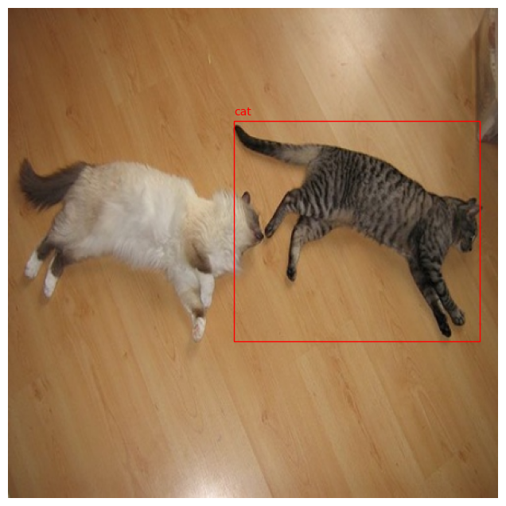

``` python
def shape_bb(bb, **kwargs): return [[[boxes[0]] + boxes[2:] for boxes in cellboxes_to_boxes(bb, **kwargs)[0]]][0]
```

``` python
show_image_with_boxes(x0, shape_bb(y0), figsize=(8,8));
```

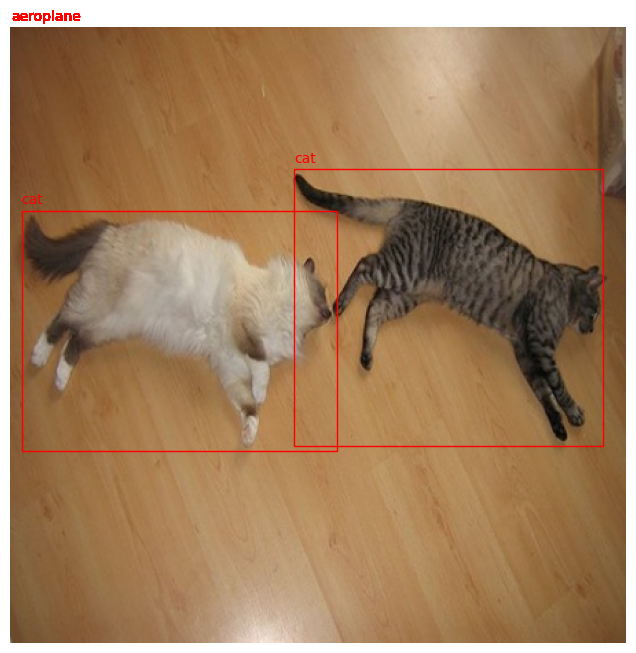

### Notes to myself

``` python
test_preds = y0
```

``` python
S = 7
preds = test_preds.reshape(-1, S, S, 30)
bs = preds.shape[0]
preds.shape
```

    torch.Size([1, 7, 7, 30])

``` python
bboxes1, bboxes2 = preds[..., 21:25], preds[..., 26:30]
bboxes1.shape, bboxes2.shape
```

    (torch.Size([1, 7, 7, 4]), torch.Size([1, 7, 7, 4]))

``` python
preds[..., 20].shape, preds[..., 25].shape
```

    (torch.Size([1, 7, 7]), torch.Size([1, 7, 7]))

``` python
scores = torch.stack([preds[..., 20], preds[..., 25]])
scores.shape
```

    torch.Size([2, 1, 7, 7])

``` python
best_box = scores.argmax(0).bool()
best_box.shape
```

    torch.Size([1, 7, 7])

``` python
best_boxes = torch.where(best_box.unsqueeze(-1), bboxes2, bboxes1)  # (bs, S, S, 4)
best_boxes.shape
```

    torch.Size([1, 7, 7, 4])

``` python
i, j = torch.meshgrid(torch.arange(S), torch.arange(S), indexing='ij')
i
```

    tensor([[0, 0, 0, 0, 0, 0, 0],
            [1, 1, 1, 1, 1, 1, 1],
            [2, 2, 2, 2, 2, 2, 2],
            [3, 3, 3, 3, 3, 3, 3],
            [4, 4, 4, 4, 4, 4, 4],
            [5, 5, 5, 5, 5, 5, 5],
            [6, 6, 6, 6, 6, 6, 6]])

``` python
j
```

    tensor([[0, 1, 2, 3, 4, 5, 6],
            [0, 1, 2, 3, 4, 5, 6],
            [0, 1, 2, 3, 4, 5, 6],
            [0, 1, 2, 3, 4, 5, 6],
            [0, 1, 2, 3, 4, 5, 6],
            [0, 1, 2, 3, 4, 5, 6],
            [0, 1, 2, 3, 4, 5, 6]])

``` python
grid = torch.stack([j, i], dim=-1).unsqueeze(0).repeat(bs, 1, 1, 1).to(preds.device)
grid
```

    tensor([[[[0, 0],
              [1, 0],
              [2, 0],
              [3, 0],
              [4, 0],
              [5, 0],
              [6, 0]],

             [[0, 1],
              [1, 1],
              [2, 1],
              [3, 1],
              [4, 1],
              [5, 1],
              [6, 1]],

             [[0, 2],
              [1, 2],
              [2, 2],
              [3, 2],
              [4, 2],
              [5, 2],
              [6, 2]],

             [[0, 3],
              [1, 3],
              [2, 3],
              [3, 3],
              [4, 3],
              [5, 3],
              [6, 3]],

             [[0, 4],
              [1, 4],
              [2, 4],
              [3, 4],
              [4, 4],
              [5, 4],
              [6, 4]],

             [[0, 5],
              [1, 5],
              [2, 5],
              [3, 5],
              [4, 5],
              [5, 5],
              [6, 5]],

             [[0, 6],
              [1, 6],
              [2, 6],
              [3, 6],
              [4, 6],
              [5, 6],
              [6, 6]]]])

``` python
(best_boxes[..., :2] + grid) / S
```

    tensor([[[[0.0000, 0.0000],
              [0.1429, 0.0000],
              [0.2857, 0.0000],
              [0.4286, 0.0000],
              [0.5714, 0.0000],
              [0.7143, 0.0000],
              [0.8571, 0.0000]],

             [[0.0000, 0.1429],
              [0.1429, 0.1429],
              [0.2857, 0.1429],
              [0.4286, 0.1429],
              [0.5714, 0.1429],
              [0.7143, 0.1429],
              [0.8571, 0.1429]],

             [[0.0000, 0.2857],
              [0.1429, 0.2857],
              [0.2857, 0.2857],
              [0.4286, 0.2857],
              [0.5714, 0.2857],
              [0.7143, 0.2857],
              [0.8571, 0.2857]],

             [[0.0000, 0.4286],
              [0.2750, 0.4933],
              [0.2857, 0.4286],
              [0.4286, 0.4286],
              [0.7120, 0.4560],
              [0.7143, 0.4286],
              [0.8571, 0.4286]],

             [[0.0000, 0.5714],
              [0.1429, 0.5714],
              [0.2857, 0.5714],
              [0.4286, 0.5714],
              [0.5714, 0.5714],
              [0.7143, 0.5714],
              [0.8571, 0.5714]],

             [[0.0000, 0.7143],
              [0.1429, 0.7143],
              [0.2857, 0.7143],
              [0.4286, 0.7143],
              [0.5714, 0.7143],
              [0.7143, 0.7143],
              [0.8571, 0.7143]],

             [[0.0000, 0.8571],
              [0.1429, 0.8571],
              [0.2857, 0.8571],
              [0.4286, 0.8571],
              [0.5714, 0.8571],
              [0.7143, 0.8571],
              [0.8571, 0.8571]]]])

``` python
xy = (best_boxes[..., :2] + grid) / S
xy.shape
```

    torch.Size([1, 7, 7, 2])

``` python
xy
```

    tensor([[[[0.0000, 0.0000],
              [0.1429, 0.0000],
              [0.2857, 0.0000],
              [0.4286, 0.0000],
              [0.5714, 0.0000],
              [0.7143, 0.0000],
              [0.8571, 0.0000]],

             [[0.0000, 0.1429],
              [0.1429, 0.1429],
              [0.2857, 0.1429],
              [0.4286, 0.1429],
              [0.5714, 0.1429],
              [0.7143, 0.1429],
              [0.8571, 0.1429]],

             [[0.0000, 0.2857],
              [0.1429, 0.2857],
              [0.2857, 0.2857],
              [0.4286, 0.2857],
              [0.5714, 0.2857],
              [0.7143, 0.2857],
              [0.8571, 0.2857]],

             [[0.0000, 0.4286],
              [0.2750, 0.4933],
              [0.2857, 0.4286],
              [0.4286, 0.4286],
              [0.7120, 0.4560],
              [0.7143, 0.4286],
              [0.8571, 0.4286]],

             [[0.0000, 0.5714],
              [0.1429, 0.5714],
              [0.2857, 0.5714],
              [0.4286, 0.5714],
              [0.5714, 0.5714],
              [0.7143, 0.5714],
              [0.8571, 0.5714]],

             [[0.0000, 0.7143],
              [0.1429, 0.7143],
              [0.2857, 0.7143],
              [0.4286, 0.7143],
              [0.5714, 0.7143],
              [0.7143, 0.7143],
              [0.8571, 0.7143]],

             [[0.0000, 0.8571],
              [0.1429, 0.8571],
              [0.2857, 0.8571],
              [0.4286, 0.8571],
              [0.5714, 0.8571],
              [0.7143, 0.8571],
              [0.8571, 0.8571]]]])

``` python
w_h = best_boxes[..., 2:4] / S
w_h.shape
```

    torch.Size([1, 7, 7, 2])

``` python
w_h
```

    tensor([[[[0.0000, 0.0000],
              [0.0000, 0.0000],
              [0.0000, 0.0000],
              [0.0000, 0.0000],
              [0.0000, 0.0000],
              [0.0000, 0.0000],
              [0.0000, 0.0000]],

             [[0.0000, 0.0000],
              [0.0000, 0.0000],
              [0.0000, 0.0000],
              [0.0000, 0.0000],
              [0.0000, 0.0000],
              [0.0000, 0.0000],
              [0.0000, 0.0000]],

             [[0.0000, 0.0000],
              [0.0000, 0.0000],
              [0.0000, 0.0000],
              [0.0000, 0.0000],
              [0.0000, 0.0000],
              [0.0000, 0.0000],
              [0.0000, 0.0000]],

             [[0.0000, 0.0000],
              [0.5100, 0.3893],
              [0.0000, 0.0000],
              [0.0000, 0.0000],
              [0.5040, 0.4480],
              [0.0000, 0.0000],
              [0.0000, 0.0000]],

             [[0.0000, 0.0000],
              [0.0000, 0.0000],
              [0.0000, 0.0000],
              [0.0000, 0.0000],
              [0.0000, 0.0000],
              [0.0000, 0.0000],
              [0.0000, 0.0000]],

             [[0.0000, 0.0000],
              [0.0000, 0.0000],
              [0.0000, 0.0000],
              [0.0000, 0.0000],
              [0.0000, 0.0000],
              [0.0000, 0.0000],
              [0.0000, 0.0000]],

             [[0.0000, 0.0000],
              [0.0000, 0.0000],
              [0.0000, 0.0000],
              [0.0000, 0.0000],
              [0.0000, 0.0000],
              [0.0000, 0.0000],
              [0.0000, 0.0000]]]])

``` python
pred_class = preds[..., :20].argmax(-1).unsqueeze(-1)
pred_class
```

    tensor([[[[0],
              [0],
              [0],
              [0],
              [0],
              [0],
              [0]],

             [[0],
              [0],
              [0],
              [0],
              [0],
              [0],
              [0]],

             [[0],
              [0],
              [0],
              [0],
              [0],
              [0],
              [0]],

             [[0],
              [7],
              [0],
              [0],
              [7],
              [0],
              [0]],

             [[0],
              [0],
              [0],
              [0],
              [0],
              [0],
              [0]],

             [[0],
              [0],
              [0],
              [0],
              [0],
              [0],
              [0]],

             [[0],
              [0],
              [0],
              [0],
              [0],
              [0],
              [0]]]])

``` python
best_confidence = torch.max(preds[..., 20], preds[..., 25]).unsqueeze(-1)
best_confidence.shape
```

    torch.Size([1, 7, 7, 1])

``` python
torch.cat([pred_class, best_confidence, xy, w_h], dim=-1).shape
```

    torch.Size([1, 7, 7, 6])

### other utils

``` python
def non_max_suppression(bboxes, iou_threshold, threshold, box_format="corners"):
    assert type(bboxes) == list
    bboxes = sorted([box for box in bboxes if box[1] > threshold], key=lambda x: x[1], reverse=True)
    bboxes_after_nms = []

    while bboxes:
        chosen_box = bboxes.pop(0)
        bboxes = [box for box in bboxes if box[0] != chosen_box[0] or 
                 intersection_over_union(torch.tensor(chosen_box[2:]), torch.tensor(box[2:]), box_format=box_format) < iou_threshold]
        bboxes_after_nms.append(chosen_box)

    return bboxes_after_nms
```

``` python
def intersection_over_union(boxes_preds, boxes_labels, box_format="midpoint"):
    if box_format == "midpoint":
        box1_x1, box1_y1 = boxes_preds[..., 0:1] - boxes_preds[..., 2:3] / 2, boxes_preds[..., 1:2] - boxes_preds[..., 3:4] / 2
        box1_x2, box1_y2 = boxes_preds[..., 0:1] + boxes_preds[..., 2:3] / 2, boxes_preds[..., 1:2] + boxes_preds[..., 3:4] / 2
        box2_x1, box2_y1 = boxes_labels[..., 0:1] - boxes_labels[..., 2:3] / 2, boxes_labels[..., 1:2] - boxes_labels[..., 3:4] / 2
        box2_x2, box2_y2 = boxes_labels[..., 0:1] + boxes_labels[..., 2:3] / 2, boxes_labels[..., 1:2] + boxes_labels[..., 3:4] / 2
    else:
        box1_x1, box1_y1, box1_x2, box1_y2 = boxes_preds[..., 0:1], boxes_preds[..., 1:2], boxes_preds[..., 2:3], boxes_preds[..., 3:4]
        box2_x1, box2_y1, box2_x2, box2_y2 = boxes_labels[..., 0:1], boxes_labels[..., 1:2], boxes_labels[..., 2:3], boxes_labels[..., 3:4]

    x1, y1 = torch.max(box1_x1, box2_x1), torch.max(box1_y1, box2_y1)
    x2, y2 = torch.min(box1_x2, box2_x2), torch.min(box1_y2, box2_y2)
    intersection = (x2 - x1).clamp(0) * (y2 - y1).clamp(0)
    box1_area, box2_area = abs((box1_x2 - box1_x1) * (box1_y2 - box1_y1)), abs((box2_x2 - box2_x1) * (box2_y2 - box2_y1))
    return intersection / (box1_area + box2_area - intersection + 1e-6)
```

## Model Architecture

------------------------------------------------------------------------

<a
href="https://github.com/galopyz/pilus_project/blob/main/pilus_project/yolov1.py#L480"
target="_blank" style="float:right; font-size:smaller">source</a>

### CNNBlock

>  CNNBlock (in_channels, out_channels, **kwargs)

\*Base class for all neural network modules.

Your models should also subclass this class.

Modules can also contain other Modules, allowing them to be nested in a
tree structure. You can assign the submodules as regular attributes::

    import torch.nn as nn
    import torch.nn.functional as F

    class Model(nn.Module):
        def __init__(self) -> None:
            super().__init__()
            self.conv1 = nn.Conv2d(1, 20, 5)
            self.conv2 = nn.Conv2d(20, 20, 5)

        def forward(self, x):
            x = F.relu(self.conv1(x))
            return F.relu(self.conv2(x))

Submodules assigned in this way will be registered, and will also have
their parameters converted when you call :meth:`to`, etc.

.. note:: As per the example above, an `__init__()` call to the parent
class must be made before assignment on the child.

:ivar training: Boolean represents whether this module is in training or
evaluation mode. :vartype training: bool\*

``` python
CNNBlock(1, 32, kernel_size=1, stride=1, padding=0)
```

    CNNBlock(
      (conv): Conv2d(1, 32, kernel_size=(1, 1), stride=(1, 1), bias=False)
      (batchnorm): BatchNorm2d(32, eps=1e-05, momentum=0.1, affine=True, track_running_stats=True)
      (leakyrelu): LeakyReLU(negative_slope=0.1)
    )

------------------------------------------------------------------------

<a
href="https://github.com/galopyz/pilus_project/blob/main/pilus_project/yolov1.py#L491"
target="_blank" style="float:right; font-size:smaller">source</a>

### Yolov1

>  Yolov1 (in_channels=3, **kwargs)

\*Base class for all neural network modules.

Your models should also subclass this class.

Modules can also contain other Modules, allowing them to be nested in a
tree structure. You can assign the submodules as regular attributes::

    import torch.nn as nn
    import torch.nn.functional as F

    class Model(nn.Module):
        def __init__(self) -> None:
            super().__init__()
            self.conv1 = nn.Conv2d(1, 20, 5)
            self.conv2 = nn.Conv2d(20, 20, 5)

        def forward(self, x):
            x = F.relu(self.conv1(x))
            return F.relu(self.conv2(x))

Submodules assigned in this way will be registered, and will also have
their parameters converted when you call :meth:`to`, etc.

.. note:: As per the example above, an `__init__()` call to the parent
class must be made before assignment on the child.

:ivar training: Boolean represents whether this module is in training or
evaluation mode. :vartype training: bool\*

``` python
model = Yolov1(split_size=7, num_boxes=2, num_classes=20)
model
```

    Yolov1(
      (darknet): Sequential(
        (0): CNNBlock(
          (conv): Conv2d(3, 64, kernel_size=(7, 7), stride=(2, 2), padding=(3, 3), bias=False)
          (batchnorm): BatchNorm2d(64, eps=1e-05, momentum=0.1, affine=True, track_running_stats=True)
          (leakyrelu): LeakyReLU(negative_slope=0.1)
        )
        (1): MaxPool2d(kernel_size=(2, 2), stride=(2, 2), padding=0, dilation=1, ceil_mode=False)
        (2): CNNBlock(
          (conv): Conv2d(64, 192, kernel_size=(3, 3), stride=(1, 1), padding=(1, 1), bias=False)
          (batchnorm): BatchNorm2d(192, eps=1e-05, momentum=0.1, affine=True, track_running_stats=True)
          (leakyrelu): LeakyReLU(negative_slope=0.1)
        )
        (3): MaxPool2d(kernel_size=(2, 2), stride=(2, 2), padding=0, dilation=1, ceil_mode=False)
        (4): CNNBlock(
          (conv): Conv2d(192, 128, kernel_size=(1, 1), stride=(1, 1), bias=False)
          (batchnorm): BatchNorm2d(128, eps=1e-05, momentum=0.1, affine=True, track_running_stats=True)
          (leakyrelu): LeakyReLU(negative_slope=0.1)
        )
        (5): CNNBlock(
          (conv): Conv2d(128, 256, kernel_size=(3, 3), stride=(1, 1), padding=(1, 1), bias=False)
          (batchnorm): BatchNorm2d(256, eps=1e-05, momentum=0.1, affine=True, track_running_stats=True)
          (leakyrelu): LeakyReLU(negative_slope=0.1)
        )
        (6): CNNBlock(
          (conv): Conv2d(256, 256, kernel_size=(1, 1), stride=(1, 1), bias=False)
          (batchnorm): BatchNorm2d(256, eps=1e-05, momentum=0.1, affine=True, track_running_stats=True)
          (leakyrelu): LeakyReLU(negative_slope=0.1)
        )
        (7): CNNBlock(
          (conv): Conv2d(256, 512, kernel_size=(3, 3), stride=(1, 1), padding=(1, 1), bias=False)
          (batchnorm): BatchNorm2d(512, eps=1e-05, momentum=0.1, affine=True, track_running_stats=True)
          (leakyrelu): LeakyReLU(negative_slope=0.1)
        )
        (8): MaxPool2d(kernel_size=(2, 2), stride=(2, 2), padding=0, dilation=1, ceil_mode=False)
        (9): CNNBlock(
          (conv): Conv2d(512, 256, kernel_size=(1, 1), stride=(1, 1), bias=False)
          (batchnorm): BatchNorm2d(256, eps=1e-05, momentum=0.1, affine=True, track_running_stats=True)
          (leakyrelu): LeakyReLU(negative_slope=0.1)
        )
        (10): CNNBlock(
          (conv): Conv2d(256, 512, kernel_size=(3, 3), stride=(1, 1), padding=(1, 1), bias=False)
          (batchnorm): BatchNorm2d(512, eps=1e-05, momentum=0.1, affine=True, track_running_stats=True)
          (leakyrelu): LeakyReLU(negative_slope=0.1)
        )
        (11): CNNBlock(
          (conv): Conv2d(512, 256, kernel_size=(1, 1), stride=(1, 1), bias=False)
          (batchnorm): BatchNorm2d(256, eps=1e-05, momentum=0.1, affine=True, track_running_stats=True)
          (leakyrelu): LeakyReLU(negative_slope=0.1)
        )
        (12): CNNBlock(
          (conv): Conv2d(256, 512, kernel_size=(3, 3), stride=(1, 1), padding=(1, 1), bias=False)
          (batchnorm): BatchNorm2d(512, eps=1e-05, momentum=0.1, affine=True, track_running_stats=True)
          (leakyrelu): LeakyReLU(negative_slope=0.1)
        )
        (13): CNNBlock(
          (conv): Conv2d(512, 256, kernel_size=(1, 1), stride=(1, 1), bias=False)
          (batchnorm): BatchNorm2d(256, eps=1e-05, momentum=0.1, affine=True, track_running_stats=True)
          (leakyrelu): LeakyReLU(negative_slope=0.1)
        )
        (14): CNNBlock(
          (conv): Conv2d(256, 512, kernel_size=(3, 3), stride=(1, 1), padding=(1, 1), bias=False)
          (batchnorm): BatchNorm2d(512, eps=1e-05, momentum=0.1, affine=True, track_running_stats=True)
          (leakyrelu): LeakyReLU(negative_slope=0.1)
        )
        (15): CNNBlock(
          (conv): Conv2d(512, 256, kernel_size=(1, 1), stride=(1, 1), bias=False)
          (batchnorm): BatchNorm2d(256, eps=1e-05, momentum=0.1, affine=True, track_running_stats=True)
          (leakyrelu): LeakyReLU(negative_slope=0.1)
        )
        (16): CNNBlock(
          (conv): Conv2d(256, 512, kernel_size=(3, 3), stride=(1, 1), padding=(1, 1), bias=False)
          (batchnorm): BatchNorm2d(512, eps=1e-05, momentum=0.1, affine=True, track_running_stats=True)
          (leakyrelu): LeakyReLU(negative_slope=0.1)
        )
        (17): CNNBlock(
          (conv): Conv2d(512, 512, kernel_size=(1, 1), stride=(1, 1), bias=False)
          (batchnorm): BatchNorm2d(512, eps=1e-05, momentum=0.1, affine=True, track_running_stats=True)
          (leakyrelu): LeakyReLU(negative_slope=0.1)
        )
        (18): CNNBlock(
          (conv): Conv2d(512, 1024, kernel_size=(3, 3), stride=(1, 1), padding=(1, 1), bias=False)
          (batchnorm): BatchNorm2d(1024, eps=1e-05, momentum=0.1, affine=True, track_running_stats=True)
          (leakyrelu): LeakyReLU(negative_slope=0.1)
        )
        (19): MaxPool2d(kernel_size=(2, 2), stride=(2, 2), padding=0, dilation=1, ceil_mode=False)
        (20): CNNBlock(
          (conv): Conv2d(1024, 512, kernel_size=(1, 1), stride=(1, 1), bias=False)
          (batchnorm): BatchNorm2d(512, eps=1e-05, momentum=0.1, affine=True, track_running_stats=True)
          (leakyrelu): LeakyReLU(negative_slope=0.1)
        )
        (21): CNNBlock(
          (conv): Conv2d(512, 1024, kernel_size=(3, 3), stride=(1, 1), padding=(1, 1), bias=False)
          (batchnorm): BatchNorm2d(1024, eps=1e-05, momentum=0.1, affine=True, track_running_stats=True)
          (leakyrelu): LeakyReLU(negative_slope=0.1)
        )
        (22): CNNBlock(
          (conv): Conv2d(1024, 512, kernel_size=(1, 1), stride=(1, 1), bias=False)
          (batchnorm): BatchNorm2d(512, eps=1e-05, momentum=0.1, affine=True, track_running_stats=True)
          (leakyrelu): LeakyReLU(negative_slope=0.1)
        )
        (23): CNNBlock(
          (conv): Conv2d(512, 1024, kernel_size=(3, 3), stride=(1, 1), padding=(1, 1), bias=False)
          (batchnorm): BatchNorm2d(1024, eps=1e-05, momentum=0.1, affine=True, track_running_stats=True)
          (leakyrelu): LeakyReLU(negative_slope=0.1)
        )
        (24): CNNBlock(
          (conv): Conv2d(1024, 1024, kernel_size=(3, 3), stride=(1, 1), padding=(1, 1), bias=False)
          (batchnorm): BatchNorm2d(1024, eps=1e-05, momentum=0.1, affine=True, track_running_stats=True)
          (leakyrelu): LeakyReLU(negative_slope=0.1)
        )
        (25): CNNBlock(
          (conv): Conv2d(1024, 1024, kernel_size=(3, 3), stride=(2, 2), padding=(1, 1), bias=False)
          (batchnorm): BatchNorm2d(1024, eps=1e-05, momentum=0.1, affine=True, track_running_stats=True)
          (leakyrelu): LeakyReLU(negative_slope=0.1)
        )
        (26): CNNBlock(
          (conv): Conv2d(1024, 1024, kernel_size=(3, 3), stride=(1, 1), padding=(1, 1), bias=False)
          (batchnorm): BatchNorm2d(1024, eps=1e-05, momentum=0.1, affine=True, track_running_stats=True)
          (leakyrelu): LeakyReLU(negative_slope=0.1)
        )
        (27): CNNBlock(
          (conv): Conv2d(1024, 1024, kernel_size=(3, 3), stride=(1, 1), padding=(1, 1), bias=False)
          (batchnorm): BatchNorm2d(1024, eps=1e-05, momentum=0.1, affine=True, track_running_stats=True)
          (leakyrelu): LeakyReLU(negative_slope=0.1)
        )
      )
      (fcs): Sequential(
        (0): Flatten(start_dim=1, end_dim=-1)
        (1): Linear(in_features=50176, out_features=496, bias=True)
        (2): Dropout(p=0.0, inplace=False)
        (3): LeakyReLU(negative_slope=0.1)
        (4): Linear(in_features=496, out_features=1470, bias=True)
      )
    )

## Loss function

------------------------------------------------------------------------

<a
href="https://github.com/galopyz/pilus_project/blob/main/pilus_project/yolov1.py#L564"
target="_blank" style="float:right; font-size:smaller">source</a>

### YoloLoss

>  YoloLoss (S=7, B=2, C=20)

*Calculate the loss for yolo (v1) model*

``` python
S=7; B=2; C=20
lambda_noobj = 0.5
lambda_coord = 5
predictions = torch.randn(1, 7, 7, 30)
target = torch.randn(1, 7, 7, 25)

predictions = predictions.reshape(-1, S, S, C + B * 5)  # (bs, S, S, 30)
predictions.shape
```

    torch.Size([1, 7, 7, 30])

## DataSet and DataLoader

``` python
bs = 2
```

``` python
trn_ds = VOCDataset("../8examples.csv", 
                    transform=transform,
                    img_dir=IMG_DIR,
                    label_dir=LABEL_DIR)
x0, y0 = trn_ds[0]
show_image_with_boxes(x0, shape_bb(y0, conf_threshold=0.4));
```

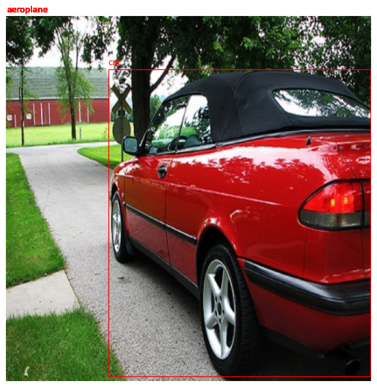

``` python
val_ds = VOCDataset('../8examples_val.csv', transform=transform, img_dir=IMG_DIR, label_dir=LABEL_DIR)
x0, y0 = val_ds[0]
show_image_with_boxes(x0, shape_bb(y0, conf_threshold=0.4));
```

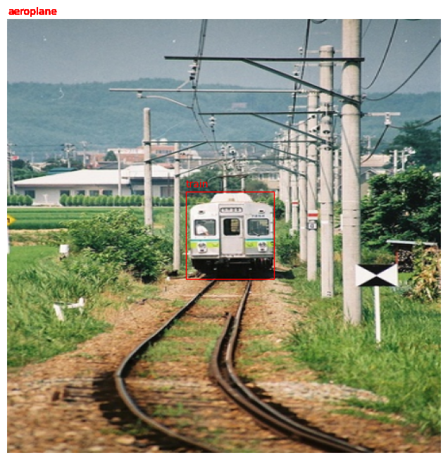

``` python
trn_dl, val_dl = get_dls(trn_ds, val_ds, bs)
xb, yb = next(iter(trn_dl))
xb.shape, yb.shape
```

    (torch.Size([2, 3, 448, 448]), torch.Size([2, 7, 7, 30]))

``` python
dls = DataLoaders(trn_dl, val_dl)
```

## Learner

``` python
class MeanAP:
    def __init__(self, num_classes=1, epsilon=1e-6, threshold=0.4, iou_threshold=0.5, box_format='midpoint'):
        self.num_classes = num_classes
        self.epsilon = epsilon
        self.threshold = threshold
        self.iou_threshold = iou_threshold
        self.box_format = box_format
        self.average_precisions = []
    
    def reset(self):
        self.average_precisions = []
    
    def compute(self):
        return sum(self.average_precisions) / len(self.average_precisions)
    
    def update(self, pred, label):
        # `get_bboxes` part
        all_pred_boxes = []
        all_true_boxes = []
        train_idx = 0
        batch_size = pred.shape[0]
        pred_boxes = cellboxes_to_boxes(pred)
        true_boxes = cellboxes_to_boxes(label)
        
        for idx in range(batch_size):
            nms_boxes = non_max_suppression(
                pred_boxes[idx],
                iou_threshold=self.iou_threshold,
                threshold=self.threshold,
                box_format=self.box_format,
            )

            for nms_box in nms_boxes:
                all_pred_boxes.append([train_idx] + nms_box)

            for box in true_boxes[idx]:
                # many will get converted to 0 pred
                if box[1] > self.threshold:
                    all_true_boxes.append([train_idx] + box)
        
        pred_boxes = all_pred_boxes
        true_boxes = all_true_boxes
        
        for c in range(self.num_classes):
            detections = []
            ground_truths = []

            # Go through all predictions and targets,
            # and only add the ones that belong to the
            # current class c
            for detection in pred_boxes:
                if detection[1] == c:
                    detections.append(detection)

            for true_box in true_boxes:
                if true_box[1] == c:
                    ground_truths.append(true_box)

            # find the amount of bboxes for each training example
            # Counter here finds how many ground truth bboxes we get
            # for each training example, so let's say img 0 has 3,
            # img 1 has 5 then we will obtain a dictionary with:
            # amount_bboxes = {0:3, 1:5}
            amount_bboxes = Counter([gt[0] for gt in ground_truths])

            # We then go through each key, val in this dictionary
            # and convert to the following (w.r.t same example):
            # ammount_bboxes = {0:torch.tensor[0,0,0], 1:torch.tensor[0,0,0,0,0]}
            for key, val in amount_bboxes.items():
                amount_bboxes[key] = torch.zeros(val)

            # sort by box probabilities which is index 2
            detections.sort(key=lambda x: x[2], reverse=True)
            TP = torch.zeros((len(detections)))
            FP = torch.zeros((len(detections)))
            total_true_bboxes = len(ground_truths)

            # If none exists for this class then we can safely skip
            if total_true_bboxes == 0:
                continue

            for detection_idx, detection in enumerate(detections):
                # Only take out the ground_truths that have the same
                # training idx as detection
                ground_truth_img = [
                    bbox for bbox in ground_truths if bbox[0] == detection[0]
                ]

                num_gts = len(ground_truth_img)
                best_iou = 0

                for idx, gt in enumerate(ground_truth_img):
                    iou = intersection_over_union(
                        torch.tensor(detection[3:]),
                        torch.tensor(gt[3:]),
                        box_format=self.box_format,
                    )

                    if iou > best_iou:
                        best_iou = iou
                        best_gt_idx = idx

                if best_iou > self.iou_threshold:
                    # only detect ground truth detection once
                    if amount_bboxes[detection[0]][best_gt_idx] == 0:
                        # true positive and add this bounding box to seen
                        TP[detection_idx] = 1
                        amount_bboxes[detection[0]][best_gt_idx] = 1
                    else:
                        FP[detection_idx] = 1

                # if IOU is lower then the detection is a false positive
                else:
                    FP[detection_idx] = 1

            TP_cumsum = torch.cumsum(TP, dim=0)
            FP_cumsum = torch.cumsum(FP, dim=0)
            recalls = TP_cumsum / (total_true_bboxes + self.epsilon)
            precisions = torch.divide(TP_cumsum, (TP_cumsum + FP_cumsum + self.epsilon))
            precisions = torch.cat((torch.tensor([1]), precisions))
            recalls = torch.cat((torch.tensor([0]), recalls))
            # torch.trapz for numerical integration
            self.average_precisions.append(torch.trapz(precisions, recalls))
```

``` python
cbs = [
    TrainCB(),
    DeviceCB(),
    MetricsCB(MeanAP(num_classes=20)),
]
opt = partial(torch.optim.AdamW, betas=(0.9,0.95), eps=1e-5)
```

``` python
model = Yolov1(split_size=7, num_boxes=2, num_classes=20)

lr, epochs = 1e-4, 20
tmax = epochs * len(dls.train)
sched = partial(lr_scheduler.OneCycleLR, max_lr=lr, total_steps=tmax)
xtra = [BatchSchedCB(sched)]

learn = Learner(model, dls, YoloLoss(), lr=lr, cbs=cbs+xtra, opt_func=torch.optim.AdamW)
```

``` python
learn.show_image_batch(max_n=1)
```

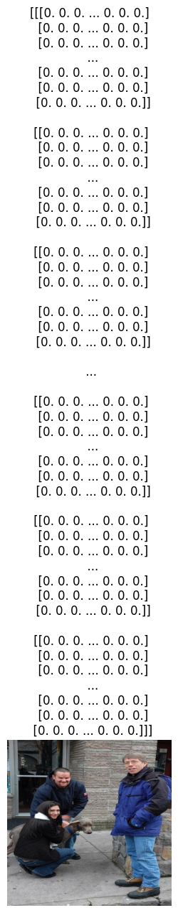

``` python
learn.fit(epochs, cbs=[ProgressCB(plot=True)])
```

<style>
    /* Turns off some styling */
    progress {
        /* gets rid of default border in Firefox and Opera. */
        border: none;
        /* Needs to be in here for Safari polyfill so background images work as expected. */
        background-size: auto;
    }
    progress:not([value]), progress:not([value])::-webkit-progress-bar {
        background: repeating-linear-gradient(45deg, #7e7e7e, #7e7e7e 10px, #5c5c5c 10px, #5c5c5c 20px);
    }
    .progress-bar-interrupted, .progress-bar-interrupted::-webkit-progress-bar {
        background: #F44336;
    }
</style>

<table class="dataframe" data-quarto-postprocess="true" data-border="1">
<thead>
<tr style="text-align: left;">
<th data-quarto-table-cell-role="th">MeanAP</th>
<th data-quarto-table-cell-role="th">loss</th>
<th data-quarto-table-cell-role="th">epoch</th>
<th data-quarto-table-cell-role="th">train</th>
<th data-quarto-table-cell-role="th">time</th>
</tr>
</thead>
<tbody>
<tr>
<td>0.000</td>
<td>164.220</td>
<td>0</td>
<td>train</td>
<td>00:04</td>
</tr>
<tr>
<td>0.000</td>
<td>211.467</td>
<td>0</td>
<td>eval</td>
<td>00:01</td>
</tr>
<tr>
<td>0.000</td>
<td>103.889</td>
<td>1</td>
<td>train</td>
<td>00:05</td>
</tr>
<tr>
<td>0.000</td>
<td>200.495</td>
<td>1</td>
<td>eval</td>
<td>00:01</td>
</tr>
<tr>
<td>0.000</td>
<td>64.096</td>
<td>2</td>
<td>train</td>
<td>00:07</td>
</tr>
<tr>
<td>0.000</td>
<td>182.836</td>
<td>2</td>
<td>eval</td>
<td>00:01</td>
</tr>
<tr>
<td>0.000</td>
<td>60.757</td>
<td>3</td>
<td>train</td>
<td>00:07</td>
</tr>
<tr>
<td>0.000</td>
<td>172.836</td>
<td>3</td>
<td>eval</td>
<td>00:01</td>
</tr>
<tr>
<td>0.050</td>
<td>58.652</td>
<td>4</td>
<td>train</td>
<td>00:05</td>
</tr>
<tr>
<td>0.000</td>
<td>169.163</td>
<td>4</td>
<td>eval</td>
<td>00:01</td>
</tr>
<tr>
<td>0.011</td>
<td>37.878</td>
<td>5</td>
<td>train</td>
<td>00:06</td>
</tr>
<tr>
<td>0.000</td>
<td>167.833</td>
<td>5</td>
<td>eval</td>
<td>00:01</td>
</tr>
<tr>
<td>0.129</td>
<td>87.072</td>
<td>6</td>
<td>train</td>
<td>00:07</td>
</tr>
<tr>
<td>0.000</td>
<td>192.208</td>
<td>6</td>
<td>eval</td>
<td>00:01</td>
</tr>
<tr>
<td>0.008</td>
<td>54.140</td>
<td>7</td>
<td>train</td>
<td>00:07</td>
</tr>
<tr>
<td>0.009</td>
<td>224.684</td>
<td>7</td>
<td>eval</td>
<td>00:01</td>
</tr>
<tr>
<td>0.050</td>
<td>46.042</td>
<td>8</td>
<td>train</td>
<td>00:07</td>
</tr>
<tr>
<td>0.000</td>
<td>275.958</td>
<td>8</td>
<td>eval</td>
<td>00:01</td>
</tr>
<tr>
<td>0.045</td>
<td>32.179</td>
<td>9</td>
<td>train</td>
<td>00:06</td>
</tr>
<tr>
<td>0.000</td>
<td>286.695</td>
<td>9</td>
<td>eval</td>
<td>00:01</td>
</tr>
<tr>
<td>0.098</td>
<td>35.831</td>
<td>10</td>
<td>train</td>
<td>00:06</td>
</tr>
<tr>
<td>0.009</td>
<td>300.782</td>
<td>10</td>
<td>eval</td>
<td>00:01</td>
</tr>
<tr>
<td>0.142</td>
<td>26.238</td>
<td>11</td>
<td>train</td>
<td>00:06</td>
</tr>
<tr>
<td>0.000</td>
<td>311.709</td>
<td>11</td>
<td>eval</td>
<td>00:01</td>
</tr>
<tr>
<td>0.245</td>
<td>28.274</td>
<td>12</td>
<td>train</td>
<td>00:06</td>
</tr>
<tr>
<td>0.000</td>
<td>323.532</td>
<td>12</td>
<td>eval</td>
<td>00:01</td>
</tr>
<tr>
<td>0.157</td>
<td>26.449</td>
<td>13</td>
<td>train</td>
<td>00:06</td>
</tr>
<tr>
<td>0.000</td>
<td>325.302</td>
<td>13</td>
<td>eval</td>
<td>00:01</td>
</tr>
<tr>
<td>0.183</td>
<td>19.315</td>
<td>14</td>
<td>train</td>
<td>00:06</td>
</tr>
<tr>
<td>0.023</td>
<td>301.128</td>
<td>14</td>
<td>eval</td>
<td>00:01</td>
</tr>
<tr>
<td>0.450</td>
<td>14.059</td>
<td>15</td>
<td>train</td>
<td>00:06</td>
</tr>
<tr>
<td>0.023</td>
<td>289.292</td>
<td>15</td>
<td>eval</td>
<td>00:01</td>
</tr>
<tr>
<td>0.394</td>
<td>15.945</td>
<td>16</td>
<td>train</td>
<td>00:07</td>
</tr>
<tr>
<td>0.091</td>
<td>272.089</td>
<td>16</td>
<td>eval</td>
<td>00:01</td>
</tr>
<tr>
<td>0.491</td>
<td>10.472</td>
<td>17</td>
<td>train</td>
<td>00:06</td>
</tr>
<tr>
<td>0.091</td>
<td>253.606</td>
<td>17</td>
<td>eval</td>
<td>00:01</td>
</tr>
<tr>
<td>0.450</td>
<td>19.727</td>
<td>18</td>
<td>train</td>
<td>00:06</td>
</tr>
<tr>
<td>0.091</td>
<td>250.489</td>
<td>18</td>
<td>eval</td>
<td>00:01</td>
</tr>
<tr>
<td>0.636</td>
<td>9.860</td>
<td>19</td>
<td>train</td>
<td>00:06</td>
</tr>
<tr>
<td>0.091</td>
<td>245.718</td>
<td>19</td>
<td>eval</td>
<td>00:01</td>
</tr>
</tbody>
</table>

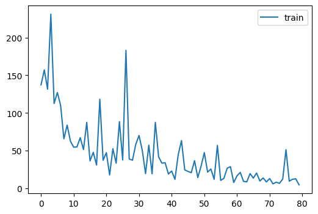

With a small dataset of 8, batch size is very important factor. When
batch size is 2, model gets updated frequently and results in different
bounding boxes. However, if it is 4 to 8, it takes more epochs to get
close bounding boxes.

The images shown are predi

``` python
learn.model.eval()
for i in range(8):
    x0, y0 = trn_ds[i]
#     bboxes = cellboxes_to_boxes(learn.model(x0.unsqueeze(0).to(DEVICE)))[0]
#     bboxes = non_max_suppression(bboxes[0], iou_threshold=0.5, threshold=0.4, box_format='midpoint')
#     bboxes = [[[boxes[0]] + boxes[2:] for boxes in bboxes]][0]
#     show_image_with_boxes(x0, bboxes, figsize=(8,8))
    pred = learn.model(x0.unsqueeze(0).to(DEVICE))
    show_image_with_boxes(x0, shape_bb(pred, conf_threshold=0.4), figsize=(8,8), title='Predictions')
    show_image_with_boxes(x0, shape_bb(y0, conf_threshold=0.4), figsize=(8,8), title='Targets')
```

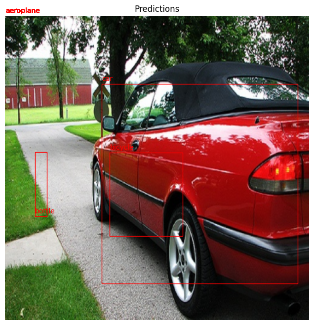

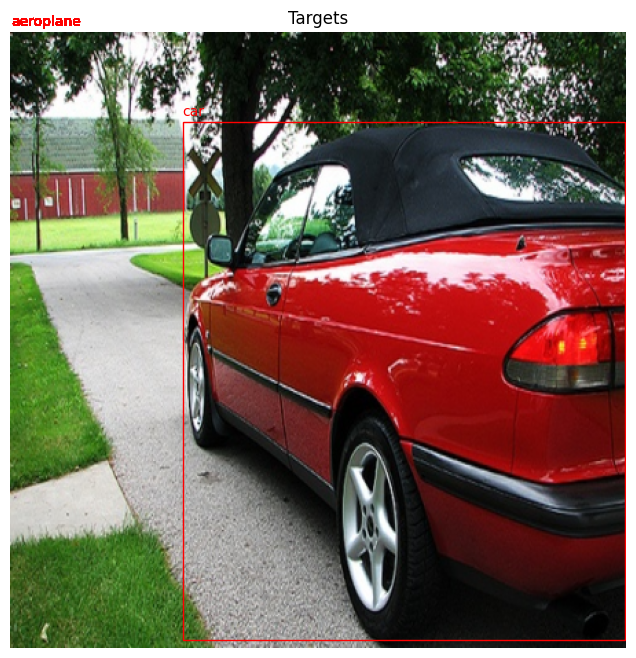


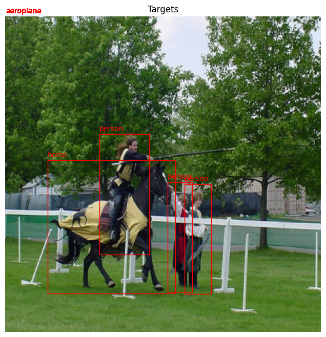

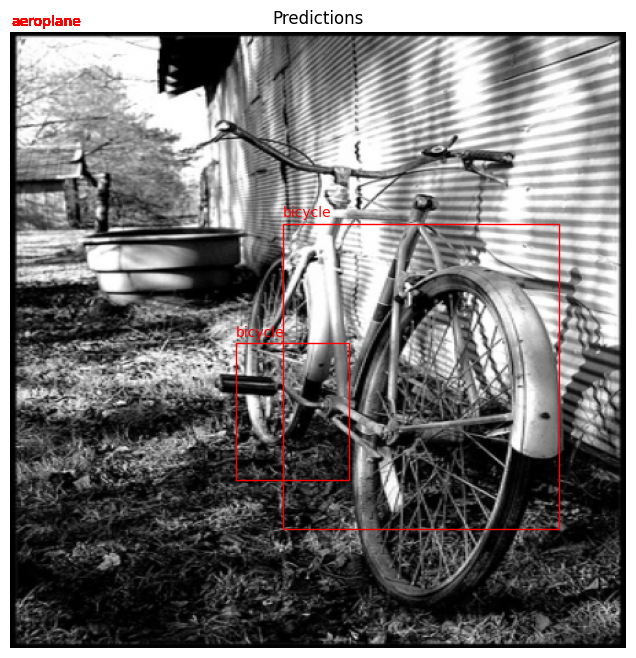

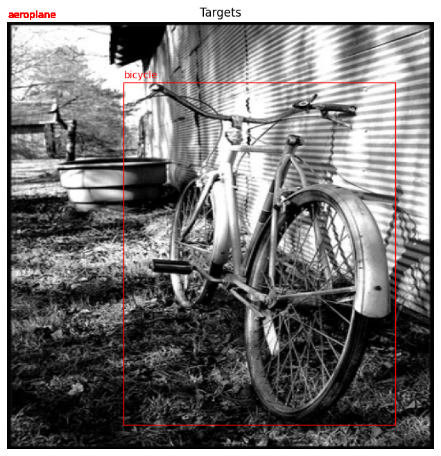

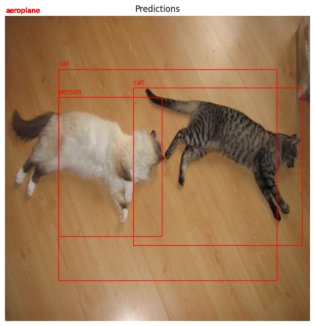

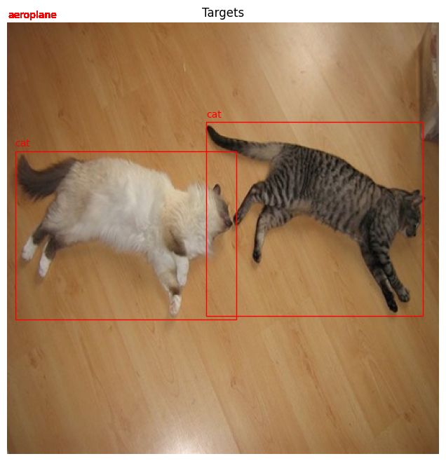

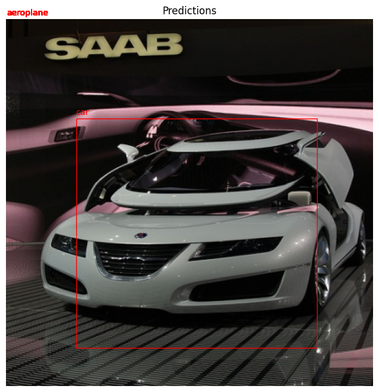


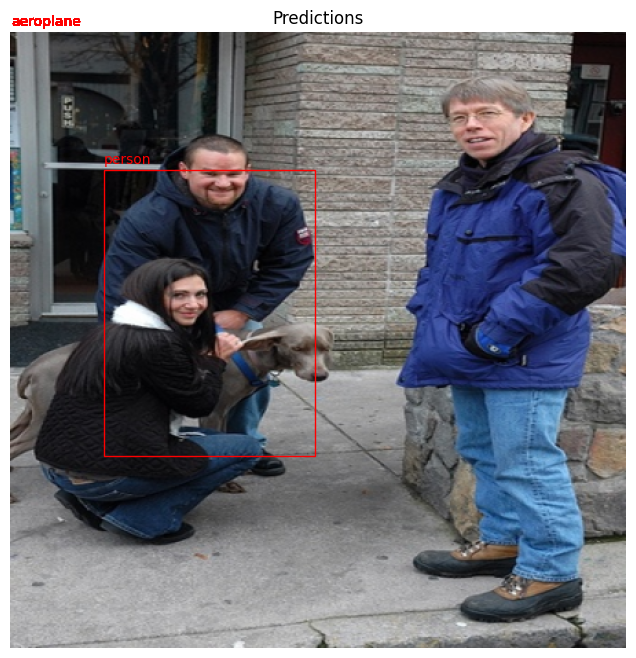

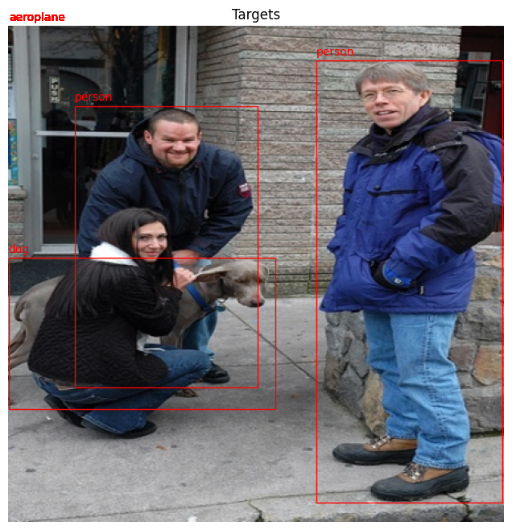

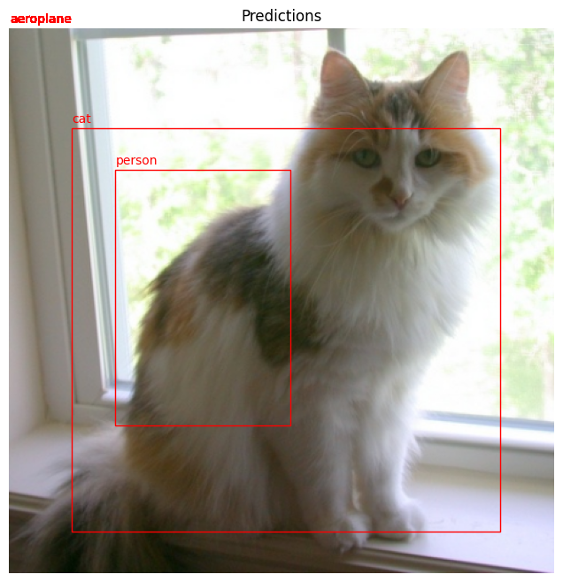

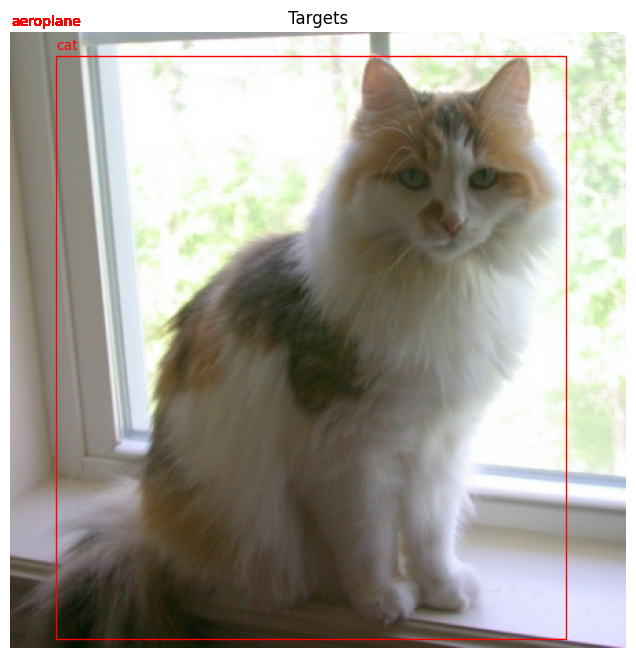

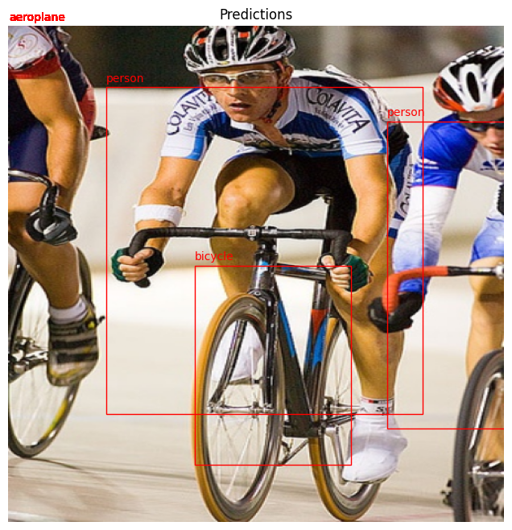

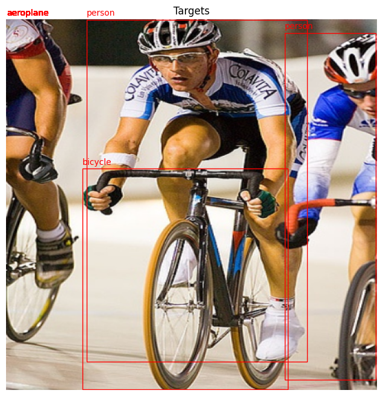

Not too bad. Let’s save the model.

``` python
def save_checkpoint(state, filename="my_checkpoint.pth.tar"):
    print("=> Saving checkpoint")
    torch.save(state, filename)
```

``` python
checkpoint = {'state_dict': learn.model.state_dict(), 'optimizer': learn.opt.state_dict()}
save_checkpoint(checkpoint, '8examples_1e-4_20.pth.tar')
```

    => Saving checkpoint

It’s almost 1 GB.

``` python
!ls -lh
```

    total 4.8G
    -rw-r--r-- 1 kappa kappa  17M May 29 20:52 00_core.ipynb
    -rw-r--r-- 1 kappa kappa 464K May 20 21:00 01_train.ipynb
    -rw-r--r-- 1 kappa kappa 400K Mar 25 00:30 50_darknet.ipynb
    -rw-r--r-- 1 kappa kappa 3.9M Mar 26 10:43 51_pascal.ipynb
    -rw-r--r-- 1 kappa kappa 1.6M May 10 18:24 52_detection.ipynb
    -rw-r--r-- 1 kappa kappa 1.5M May 27 16:24 53_yolov1.ipynb
    -rw-r--r-- 1 kappa kappa 6.6M May 20 22:46 54_yolov1_miniai.ipynb
    -rw-r--r-- 1 kappa kappa 7.1M May 14 11:10 55_yolov1_miniai_bac.ipynb
    -rw-r--r-- 1 kappa kappa 982M May 29 20:51 8examples_1e-4_20.pth.tar
    -rw-r--r-- 1 kappa kappa  330 Jan  2 08:13 _quarto.yml
    -rw-r--r-- 1 kappa kappa 2.7K May 23 23:34 fasttransform.ipynb
    -rw-r--r-- 1 kappa kappa 2.5K May 10 18:24 index.ipynb
    -rw-r--r-- 1 kappa kappa  260 Mar 26 10:45 nbdev.yml
    -rw-r--r-- 1 kappa kappa 709M May 20 22:33 overfit.pth.tar
    -rw-r--r-- 1 kappa kappa  175 Mar 26 10:45 sidebar.yml
    -rw-rw-r-- 1 kappa kappa  600 Sep  1  2024 styles.css
    -rw-r--r-- 1 kappa kappa 3.1G May 14 11:42 yolov1_1e-6_20.pth.tar

``` python
def load_checkpoint(weight_path, model, optimizer):
    print("=> Loading checkpoint")
    checkpoint = torch.load(weight_path, weights_only=True)
    model.load_state_dict(checkpoint["state_dict"])
    optimizer.load_state_dict(checkpoint["optimizer"])
```

``` python
load_checkpoint('8examples_1e-4_20.pth.tar', learn.model, learn.opt)
```

    => Loading checkpoint

## Bacteria images

Our model on VOC seems okay. Let’s finetune it on bacteria images.

``` python
path.ls()
```

    (#18) [Path('/home/kappa/data/pili/training_data/WT-A86C-LB-ice-002.png'),Path('/home/kappa/data/pili/training_data/200ms-0.4%-005.png'),Path('/home/kappa/data/pili/training_data/1hr01002.csv'),Path('/home/kappa/data/pili/training_data/dCpdA R1 FH 017.png'),Path('/home/kappa/data/pili/training_data/Chp B Replicate 2 200 MS060.png'),Path('/home/kappa/data/pili/training_data/4hrs incu004.csv'),Path('/home/kappa/data/pili/training_data/7.1- 003.png'),Path('/home/kappa/data/pili/training_data/4hrs incu004.png'),Path('/home/kappa/data/pili/training_data/200ms-0.4%-005.csv'),Path('/home/kappa/data/pili/training_data/WT-A86C-LB-ice-002.csv'),Path('/home/kappa/data/pili/training_data/0.1%.004.png'),Path('/home/kappa/data/pili/training_data/dCpdA R1 FH 017.csv'),Path('/home/kappa/data/pili/training_data/0N01002.csv'),Path('/home/kappa/data/pili/training_data/0N01002.png'),Path('/home/kappa/data/pili/training_data/Chp B Replicate 2 200 MS060.csv'),Path('/home/kappa/data/pili/training_data/7.1- 003.csv'),Path('/home/kappa/data/pili/training_data/1hr01002.png'),Path('/home/kappa/data/pili/training_data/0.1%.004.csv')]

``` python
img_path = path/'0N01002.png'
bac_im = np.array(Image.open(img_path))
```

``` python
yolo_bac_boxes = calc_yolo_boxes(path/'0N01002.csv')
yolo_bac_boxes[:5]
```

    tensor([[1.0000, 0.1250, 0.9701, 0.0279, 0.0272],
            [1.0000, 0.1804, 0.9871, 0.0306, 0.0237],
            [1.0000, 0.1521, 0.8542, 0.0264, 0.0271],
            [1.0000, 0.3414, 0.8812, 0.0201, 0.0277],
            [6.0000, 0.3072, 0.9942, 0.0144, 0.0109]], dtype=torch.float64)

``` python
yolo_bac_boxes.shape
```

    torch.Size([187, 5])

``` python
show_image_with_boxes(bac_im, yolo_bac_boxes, figsize=(8,8));
```


``` python
def create_bacteria_dataframe(path):
    files = list(path.glob('*'))
    png_files = [f for f in files if f.suffix == '.png']
    csv_files = [f for f in files if f.suffix == '.csv']
    
    pairs = []
    for png_file in png_files:
        stem = png_file.stem
        matching_csv = next((f for f in csv_files if f.stem == stem), None)
        if matching_csv: pairs.append([png_file.name, matching_csv.name])
    
    return pd.DataFrame(pairs, columns=['img', 'label'])
```

``` python
bac_df = create_bacteria_dataframe(path)
bac_df
```

<div>
<style scoped>
    .dataframe tbody tr th:only-of-type {
        vertical-align: middle;
    }
&#10;    .dataframe tbody tr th {
        vertical-align: top;
    }
&#10;    .dataframe thead th {
        text-align: right;
    }
</style>

<table class="dataframe" data-quarto-postprocess="true" data-border="1">
<thead>
<tr style="text-align: right;">
<th data-quarto-table-cell-role="th"></th>
<th data-quarto-table-cell-role="th">img</th>
<th data-quarto-table-cell-role="th">label</th>
</tr>
</thead>
<tbody>
<tr>
<td data-quarto-table-cell-role="th">0</td>
<td>WT-A86C-LB-ice-002.png</td>
<td>WT-A86C-LB-ice-002.csv</td>
</tr>
<tr>
<td data-quarto-table-cell-role="th">1</td>
<td>200ms-0.4%-005.png</td>
<td>200ms-0.4%-005.csv</td>
</tr>
<tr>
<td data-quarto-table-cell-role="th">2</td>
<td>dCpdA R1 FH 017.png</td>
<td>dCpdA R1 FH 017.csv</td>
</tr>
<tr>
<td data-quarto-table-cell-role="th">3</td>
<td>Chp B Replicate 2 200 MS060.png</td>
<td>Chp B Replicate 2 200 MS060.csv</td>
</tr>
<tr>
<td data-quarto-table-cell-role="th">4</td>
<td>7.1- 003.png</td>
<td>7.1- 003.csv</td>
</tr>
<tr>
<td data-quarto-table-cell-role="th">5</td>
<td>4hrs incu004.png</td>
<td>4hrs incu004.csv</td>
</tr>
<tr>
<td data-quarto-table-cell-role="th">6</td>
<td>0.1%.004.png</td>
<td>0.1%.004.csv</td>
</tr>
<tr>
<td data-quarto-table-cell-role="th">7</td>
<td>0N01002.png</td>
<td>0N01002.csv</td>
</tr>
<tr>
<td data-quarto-table-cell-role="th">8</td>
<td>1hr01002.png</td>
<td>1hr01002.csv</td>
</tr>
</tbody>
</table>

</div>

``` python
trn_bac_df, val_bac_df = bac_df.iloc[1:7], bac_df.iloc[7:]
trn_bac_df
```

<div>
<style scoped>
    .dataframe tbody tr th:only-of-type {
        vertical-align: middle;
    }
&#10;    .dataframe tbody tr th {
        vertical-align: top;
    }
&#10;    .dataframe thead th {
        text-align: right;
    }
</style>

<table class="dataframe" data-quarto-postprocess="true" data-border="1">
<thead>
<tr style="text-align: right;">
<th data-quarto-table-cell-role="th"></th>
<th data-quarto-table-cell-role="th">img</th>
<th data-quarto-table-cell-role="th">label</th>
</tr>
</thead>
<tbody>
<tr>
<td data-quarto-table-cell-role="th">1</td>
<td>200ms-0.4%-005.png</td>
<td>200ms-0.4%-005.csv</td>
</tr>
<tr>
<td data-quarto-table-cell-role="th">2</td>
<td>dCpdA R1 FH 017.png</td>
<td>dCpdA R1 FH 017.csv</td>
</tr>
<tr>
<td data-quarto-table-cell-role="th">3</td>
<td>Chp B Replicate 2 200 MS060.png</td>
<td>Chp B Replicate 2 200 MS060.csv</td>
</tr>
<tr>
<td data-quarto-table-cell-role="th">4</td>
<td>7.1- 003.png</td>
<td>7.1- 003.csv</td>
</tr>
<tr>
<td data-quarto-table-cell-role="th">5</td>
<td>4hrs incu004.png</td>
<td>4hrs incu004.csv</td>
</tr>
<tr>
<td data-quarto-table-cell-role="th">6</td>
<td>0.1%.004.png</td>
<td>0.1%.004.csv</td>
</tr>
</tbody>
</table>

</div>

``` python
path/trn_bac_df.iloc[0, 0]
```

    Path('/home/kappa/data/pili/training_data/200ms-0.4%-005.png')

``` python
trn_bac_df.to_csv("../bac_train.csv", index=False)
```

``` python
val_bac_df.to_csv('../bac_valid.csv', index=False)
```

``` python
class BacDataset(Dataset):
    def __init__(self, csv_file, img_dir, label_dir, S=7, B=2, C=20, transform=None):
        self.annotations, self.img_dir = pd.read_csv(csv_file), fc.Path(img_dir)
        self.label_dir, self.transform = fc.Path(label_dir), transform
        self.S, self.B, self.C = S, B, C

    def __len__(self): return len(self.annotations)

    def __getitem__(self, index):
        label_path = self.label_dir / self.annotations.iloc[index, 1]
        img_path = self.img_dir / self.annotations.iloc[index, 0]
        image = Image.open(img_path)
        boxes = calc_yolo_boxes(label_path)
        if self.transform: image, boxes = self.transform(image, boxes)

        label_matrix = torch.zeros((self.S, self.S, self.C + 5 * self.B))
        for box in boxes:
            class_label, x, y, width, height = box
            class_label = int(class_label)
            i, j = int(self.S * y), int(self.S * x)
            x_cell, y_cell = self.S * x - j, self.S * y - i
            width_cell, height_cell = width * self.S, height * self.S
            
            if 0 > i or i >= 7 or 0 > j or j >= 7: 
                print(i,j)

                continue
            if label_matrix[i, j, 20] == 0:
                label_matrix[i, j, 20] = 1
                label_matrix[i, j, 21:25] = torch.tensor([x_cell, y_cell, width_cell, height_cell])
                label_matrix[i, j, class_label] = 1

        return image, label_matrix
```

``` python
bac_trn_ds = BacDataset("../bac_train.csv", path, path, C=20, transform=transform)
# bac_trn_ds = BacDataset("../bac_train.csv", path, path, C=20)
x0, y0 = bac_trn_ds[5]
x0.shape, y0.shape
```

    (torch.Size([3, 448, 448]), torch.Size([7, 7, 30]))

Many boxes are missing because only one class can be predicted from each
cell.

``` python
show_image_with_boxes(x0, shape_bb(y0));
```

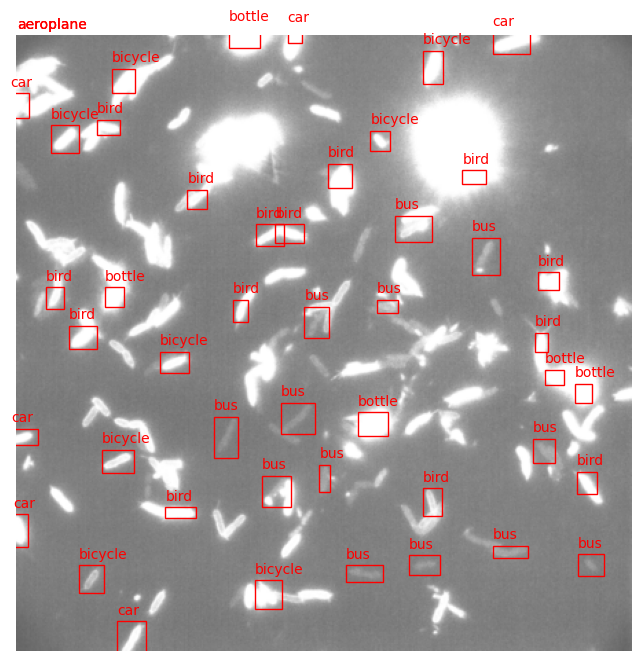

``` python
bac_val_ds = BacDataset('../bac_valid.csv', path, path, C=20, transform=transform)
x0, y0 = bac_val_ds[0]
x0.shape, y0.shape
```

    (torch.Size([3, 448, 448]), torch.Size([7, 7, 30]))

Hmm.

``` python
show_image_with_boxes(x0, shape_bb(y0));
```

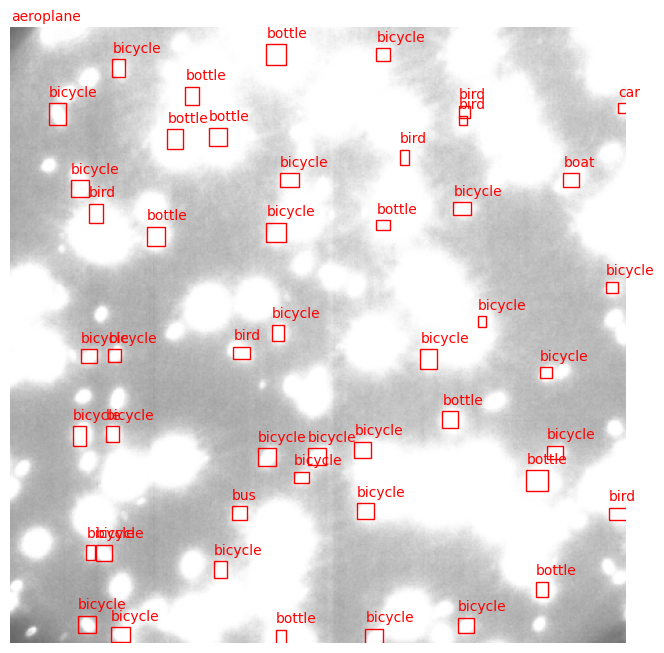

``` python
bac_trn_dl, bac_val_dl = get_dls(bac_trn_ds, bac_val_ds, bs)
xb, yb = next(iter(bac_trn_dl))
xb.shape, yb.shape
```

    (torch.Size([2, 3, 448, 448]), torch.Size([2, 7, 7, 30]))

``` python
bac_dls = DataLoaders(bac_trn_dl, bac_val_dl)
```

``` python
lr, epochs = 3e-3, 25
tmax = epochs * len(bac_dls.train)
sched = partial(lr_scheduler.OneCycleLR, max_lr=lr, total_steps=tmax)
xtra = [BatchSchedCB(sched)]

# learn = Learner(model, bac_dls, YoloLoss(), lr=lr, cbs=cbs+xtra, opt_func=torch.optim.AdamW)
learn.dls = bac_dls
```

``` python
learn.show_image_batch(max_n=4)
```

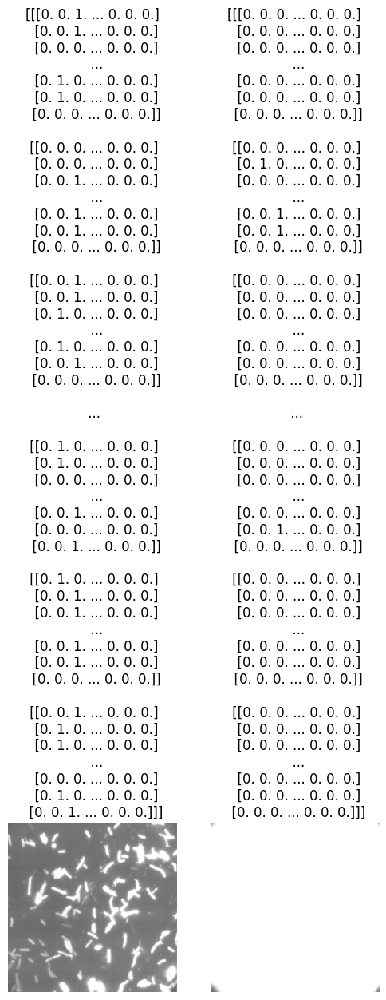

``` python
learn.fit(epochs, cbs=[ProgressCB(plot=True)])
```

<style>
    /* Turns off some styling */
    progress {
        /* gets rid of default border in Firefox and Opera. */
        border: none;
        /* Needs to be in here for Safari polyfill so background images work as expected. */
        background-size: auto;
    }
    progress:not([value]), progress:not([value])::-webkit-progress-bar {
        background: repeating-linear-gradient(45deg, #7e7e7e, #7e7e7e 10px, #5c5c5c 10px, #5c5c5c 20px);
    }
    .progress-bar-interrupted, .progress-bar-interrupted::-webkit-progress-bar {
        background: #F44336;
    }
</style>

<table class="dataframe" data-quarto-postprocess="true" data-border="1">
<thead>
<tr style="text-align: left;">
<th data-quarto-table-cell-role="th">MeanAP</th>
<th data-quarto-table-cell-role="th">loss</th>
<th data-quarto-table-cell-role="th">epoch</th>
<th data-quarto-table-cell-role="th">train</th>
<th data-quarto-table-cell-role="th">time</th>
</tr>
</thead>
<tbody>
<tr>
<td>0.000</td>
<td>2110.353</td>
<td>0</td>
<td>train</td>
<td>00:03</td>
</tr>
<tr>
<td>0.000</td>
<td>2019.032</td>
<td>0</td>
<td>eval</td>
<td>00:00</td>
</tr>
<tr>
<td>0.000</td>
<td>1616.481</td>
<td>1</td>
<td>train</td>
<td>00:03</td>
</tr>
<tr>
<td>0.000</td>
<td>1406.707</td>
<td>1</td>
<td>eval</td>
<td>00:00</td>
</tr>
<tr>
<td>0.000</td>
<td>1043.905</td>
<td>2</td>
<td>train</td>
<td>00:04</td>
</tr>
<tr>
<td>0.000</td>
<td>748.545</td>
<td>2</td>
<td>eval</td>
<td>00:00</td>
</tr>
<tr>
<td>0.000</td>
<td>711.525</td>
<td>3</td>
<td>train</td>
<td>00:04</td>
</tr>
<tr>
<td>0.000</td>
<td>580.770</td>
<td>3</td>
<td>eval</td>
<td>00:00</td>
</tr>
<tr>
<td>0.000</td>
<td>626.063</td>
<td>4</td>
<td>train</td>
<td>00:04</td>
</tr>
<tr>
<td>0.000</td>
<td>551.427</td>
<td>4</td>
<td>eval</td>
<td>00:00</td>
</tr>
<tr>
<td>0.000</td>
<td>529.337</td>
<td>5</td>
<td>train</td>
<td>00:05</td>
</tr>
<tr>
<td>0.000</td>
<td>572.216</td>
<td>5</td>
<td>eval</td>
<td>00:00</td>
</tr>
<tr>
<td>0.000</td>
<td>559.300</td>
<td>6</td>
<td>train</td>
<td>00:05</td>
</tr>
<tr>
<td>0.000</td>
<td>489.061</td>
<td>6</td>
<td>eval</td>
<td>00:00</td>
</tr>
<tr>
<td>0.000</td>
<td>622.305</td>
<td>7</td>
<td>train</td>
<td>00:04</td>
</tr>
<tr>
<td>0.000</td>
<td>460.538</td>
<td>7</td>
<td>eval</td>
<td>00:00</td>
</tr>
<tr>
<td>0.000</td>
<td>513.237</td>
<td>8</td>
<td>train</td>
<td>00:05</td>
</tr>
<tr>
<td>0.000</td>
<td>416.242</td>
<td>8</td>
<td>eval</td>
<td>00:00</td>
</tr>
<tr>
<td>0.000</td>
<td>434.381</td>
<td>9</td>
<td>train</td>
<td>00:05</td>
</tr>
<tr>
<td>0.000</td>
<td>395.815</td>
<td>9</td>
<td>eval</td>
<td>00:00</td>
</tr>
<tr>
<td>0.001</td>
<td>407.428</td>
<td>10</td>
<td>train</td>
<td>00:05</td>
</tr>
<tr>
<td>0.000</td>
<td>357.732</td>
<td>10</td>
<td>eval</td>
<td>00:00</td>
</tr>
<tr>
<td>0.000</td>
<td>317.297</td>
<td>11</td>
<td>train</td>
<td>00:05</td>
</tr>
<tr>
<td>0.000</td>
<td>333.096</td>
<td>11</td>
<td>eval</td>
<td>00:00</td>
</tr>
<tr>
<td>0.000</td>
<td>250.294</td>
<td>12</td>
<td>train</td>
<td>00:04</td>
</tr>
<tr>
<td>0.000</td>
<td>310.736</td>
<td>12</td>
<td>eval</td>
<td>00:00</td>
</tr>
<tr>
<td>0.000</td>
<td>224.237</td>
<td>13</td>
<td>train</td>
<td>00:05</td>
</tr>
<tr>
<td>0.000</td>
<td>283.839</td>
<td>13</td>
<td>eval</td>
<td>00:00</td>
</tr>
<tr>
<td>0.000</td>
<td>226.868</td>
<td>14</td>
<td>train</td>
<td>00:05</td>
</tr>
<tr>
<td>0.000</td>
<td>267.242</td>
<td>14</td>
<td>eval</td>
<td>00:00</td>
</tr>
<tr>
<td>0.001</td>
<td>193.923</td>
<td>15</td>
<td>train</td>
<td>00:05</td>
</tr>
<tr>
<td>0.000</td>
<td>259.993</td>
<td>15</td>
<td>eval</td>
<td>00:00</td>
</tr>
<tr>
<td>0.000</td>
<td>172.583</td>
<td>16</td>
<td>train</td>
<td>00:05</td>
</tr>
<tr>
<td>0.000</td>
<td>263.563</td>
<td>16</td>
<td>eval</td>
<td>00:00</td>
</tr>
<tr>
<td>0.004</td>
<td>183.626</td>
<td>17</td>
<td>train</td>
<td>00:04</td>
</tr>
<tr>
<td>0.000</td>
<td>259.507</td>
<td>17</td>
<td>eval</td>
<td>00:00</td>
</tr>
<tr>
<td>0.000</td>
<td>178.855</td>
<td>18</td>
<td>train</td>
<td>00:05</td>
</tr>
<tr>
<td>0.000</td>
<td>253.352</td>
<td>18</td>
<td>eval</td>
<td>00:00</td>
</tr>
<tr>
<td>0.006</td>
<td>151.948</td>
<td>19</td>
<td>train</td>
<td>00:05</td>
</tr>
<tr>
<td>0.000</td>
<td>250.560</td>
<td>19</td>
<td>eval</td>
<td>00:00</td>
</tr>
<tr>
<td>0.005</td>
<td>146.231</td>
<td>20</td>
<td>train</td>
<td>00:05</td>
</tr>
<tr>
<td>0.000</td>
<td>249.883</td>
<td>20</td>
<td>eval</td>
<td>00:00</td>
</tr>
<tr>
<td>0.004</td>
<td>153.878</td>
<td>21</td>
<td>train</td>
<td>00:05</td>
</tr>
<tr>
<td>0.000</td>
<td>247.891</td>
<td>21</td>
<td>eval</td>
<td>00:00</td>
</tr>
<tr>
<td>0.005</td>
<td>138.734</td>
<td>22</td>
<td>train</td>
<td>00:04</td>
</tr>
<tr>
<td>0.000</td>
<td>247.245</td>
<td>22</td>
<td>eval</td>
<td>00:00</td>
</tr>
<tr>
<td>0.004</td>
<td>147.657</td>
<td>23</td>
<td>train</td>
<td>00:05</td>
</tr>
<tr>
<td>0.000</td>
<td>245.872</td>
<td>23</td>
<td>eval</td>
<td>00:00</td>
</tr>
<tr>
<td>0.006</td>
<td>135.498</td>
<td>24</td>
<td>train</td>
<td>00:05</td>
</tr>
<tr>
<td>0.000</td>
<td>245.713</td>
<td>24</td>
<td>eval</td>
<td>00:00</td>
</tr>
</tbody>
</table>

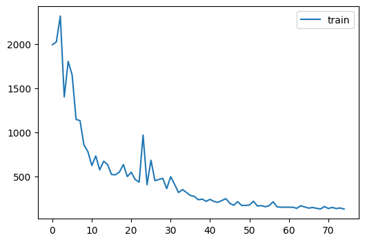

    7 0
    7 0
    7 0
    7 0
    7 0
    7 0
    7 0
    7 0
    7 0
    7 0
    7 0
    7 0
    7 0
    7 0
    7 0
    7 0
    7 0
    7 0
    7 0
    7 0
    7 0
    7 0
    7 0
    7 0
    7 0

``` python
learn.model.eval()
for i in range(1):
    x0, y0 = bac_trn_ds[i]
    pred = learn.model(x0.unsqueeze(0).to(DEVICE))
    show_image_with_boxes(x0, shape_bb(pred, conf_threshold=0.4), figsize=(8,8), title='Predictions')
    show_image_with_boxes(x0, shape_bb(y0, conf_threshold=0.4), figsize=(8,8), title='Targets')
```

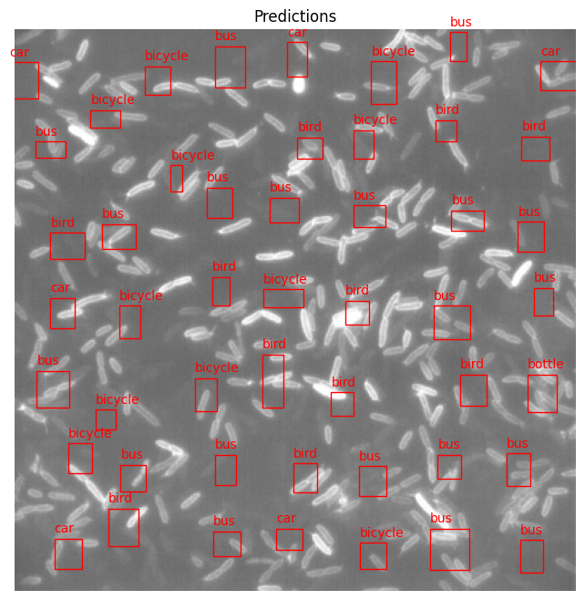

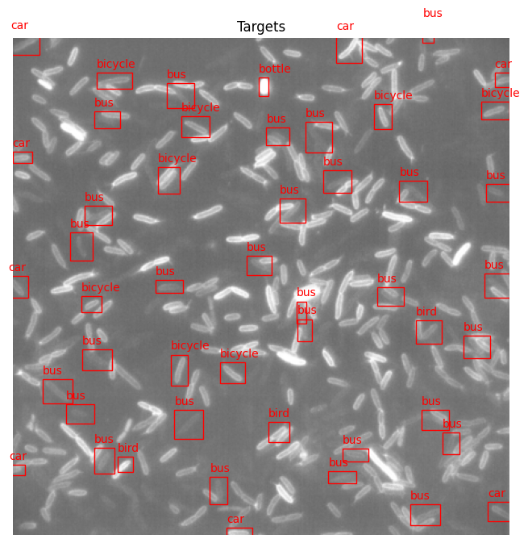

## Image transform

### CLAHE

Tackling low signal problem: Let’s take a look at an image with labels.

How CLAHE (Contrast Limited Adaptive Histogram Equalization) works:

1.  Basic Principle:

- Unlike regular histogram equalization which works on the entire image
  at once, CLAHE works on small regions (tiles) of the image
- This local approach helps maintain local details and contrast

2.  Step-by-Step Process:
    - The image is divided into small tiles (defined by tile_grid_size)
    - For each tile:
      - A local histogram is computed
      - The histogram is clipped at a predetermined value (clip_limit)
        to prevent noise amplification
      - Histogram equalization is applied to that tile
    - Bilinear interpolation is used to eliminate artificial boundaries
      between tiles
3.  Key Advantages:
    - Better handling of local contrast
    - Prevents over-amplification of noise (through clipping)
    - Preserves edges and local details
    - Works well with varying brightness levels in different image
      regions
4.  Parameters Impact:
    - clip_limit: Higher values allow more contrast enhancement but may
      increase noise
    - tile_grid_size: Smaller tiles give more local enhancement but
      might make the image look “patchy”

``` python
im.shape
```

    (1952, 1952)

TODO: Why are we using `uint16`? Maybe should change it to float32 or
bfloat16?

``` python
im.dtype
```

    dtype('uint16')

------------------------------------------------------------------------

<a
href="https://github.com/galopyz/pilus_project/blob/main/pilus_project/core.py#L95"
target="_blank" style="float:right; font-size:smaller">source</a>

### apply_clahe

>  apply_clahe (image, clip_limit=2.0, tile_grid_size=(8, 8))

------------------------------------------------------------------------

<a
href="https://github.com/galopyz/pilus_project/blob/main/pilus_project/core.py#L103"
target="_blank" style="float:right; font-size:smaller">source</a>

### compare_ims

>  compare_ims (img1, img2, im1_title='img1', im2_title='img2', cmap='gray')

------------------------------------------------------------------------

<a
href="https://github.com/galopyz/pilus_project/blob/main/pilus_project/core.py#L118"
target="_blank" style="float:right; font-size:smaller">source</a>

### compare_ims_with_boxes

>  compare_ims_with_boxes (img1, img2, boxes1=None, boxes2=None,
>                              im1_title='img1', im2_title='img2', legend=None,
>                              legend_loc='best', bformat=None, **kwargs)

``` python
enh = apply_clahe(im, clip_limit=10.1, tile_grid_size=(8,8))
compare_ims_with_boxes(im, enh);
```

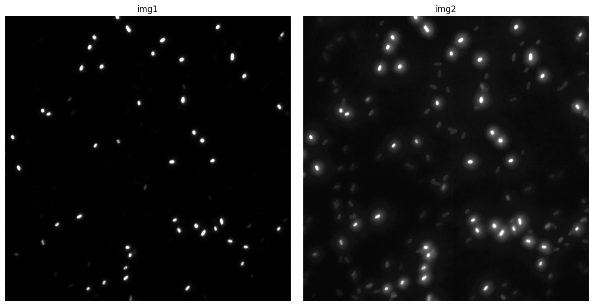

Here’s what it looks like with labels:

``` python
compare_ims_with_boxes(im, enh, boxes2=y);
```

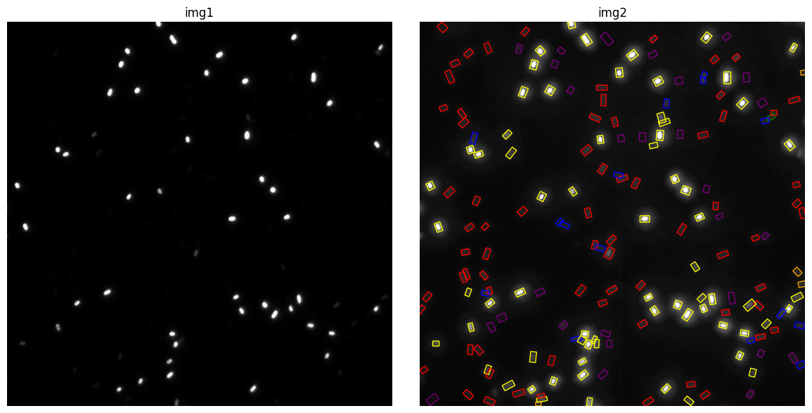
