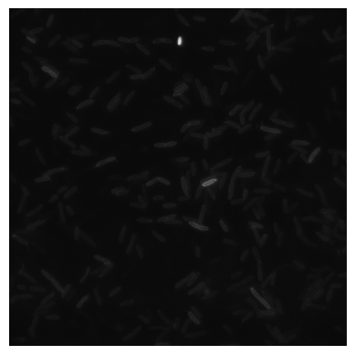
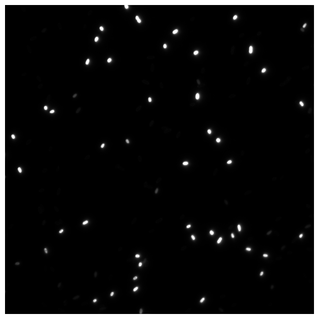
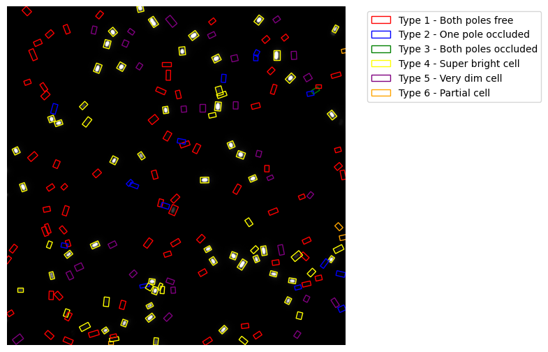
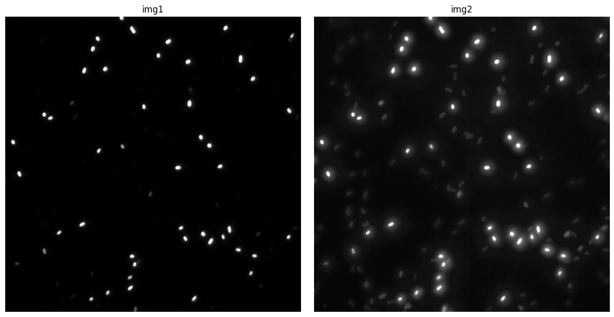
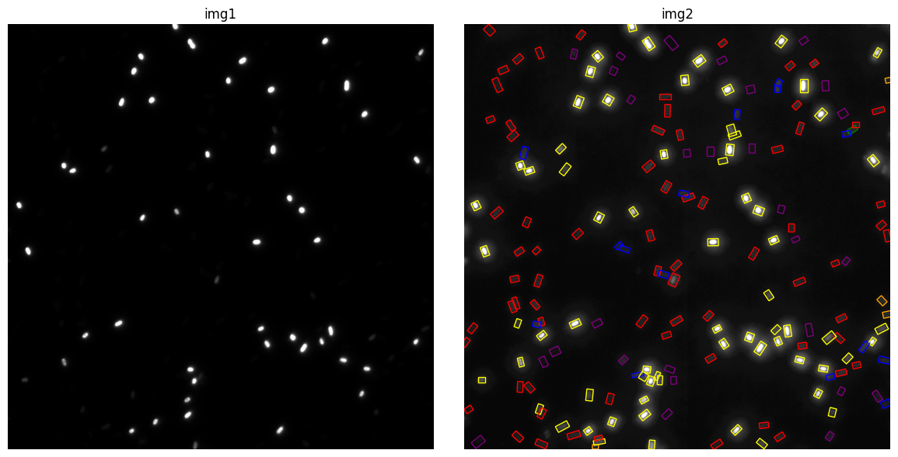

# core


<!-- WARNING: THIS FILE WAS AUTOGENERATED! DO NOT EDIT! -->

``` python
from minai import *
```

## Image processing

There’s no point working with videos, so let’s save them as images.
Something was wrong with `20mins021.nd2` file, so we won’t use them.

``` python
video_path = Path.home()/'data/pili/training_videos'
video_path.ls()
```

    (#9) [Path('/home/kappa/data/pili/training_videos/200ms-0.4%-005.nd2'),Path('/home/kappa/data/pili/training_videos/0N01002.nd2'),Path('/home/kappa/data/pili/training_videos/7.1- 003.nd2'),Path('/home/kappa/data/pili/training_videos/0.1%.004.nd2'),Path('/home/kappa/data/pili/training_videos/1hr01002.nd2'),Path('/home/kappa/data/pili/training_videos/dCpdA R1 FH 017.nd2'),Path('/home/kappa/data/pili/training_videos/4hrs incu004.nd2'),Path('/home/kappa/data/pili/training_videos/WT-A86C-LB-ice-002.nd2'),Path('/home/kappa/data/pili/training_videos/Chp B Replicate 2 200 MS060.nd2')]

Let’s take a look at the first video.

``` python
vp = video_path.ls()[0]
vp
```

    Path('/home/kappa/data/pili/training_videos/200ms-0.4%-005.nd2')

For each video, we want to only use the first frame for now. This is
what it looks like:

``` python
with nd2.ND2File(vp) as nd2_file:
    first_frame = nd2_file.read_frame(0)
    plt.imshow(first_frame)
    plt.axis('off')
```



Now we turn the video into an image.

``` python
def save_first_frame(input_path, output_path, extension = '.png') -> None:
    """
    Save the first frame of an ND2 file as an image, using the same name as input file.
    """
    filename = input_path.name.removesuffix('.nd2')  # Some names have . in the filename
    output_path = (output_path/f'{filename}{extension}')
    Image.fromarray(nd2.imread(input_path)[0]).save(output_path)
```

``` python
# Save videos as images
# for p in video_path.ls(): 
#     if p.suffix == '.nd2': save_first_frame(p, path)
```

``` python
path = Path.home()/'data/pili/training_data'
path.ls()
```

    (#18) [Path('/home/kappa/data/pili/training_data/WT-A86C-LB-ice-002.png'),Path('/home/kappa/data/pili/training_data/200ms-0.4%-005.png'),Path('/home/kappa/data/pili/training_data/1hr01002.csv'),Path('/home/kappa/data/pili/training_data/dCpdA R1 FH 017.png'),Path('/home/kappa/data/pili/training_data/Chp B Replicate 2 200 MS060.png'),Path('/home/kappa/data/pili/training_data/4hrs incu004.csv'),Path('/home/kappa/data/pili/training_data/7.1- 003.png'),Path('/home/kappa/data/pili/training_data/4hrs incu004.png'),Path('/home/kappa/data/pili/training_data/200ms-0.4%-005.csv'),Path('/home/kappa/data/pili/training_data/WT-A86C-LB-ice-002.csv'),Path('/home/kappa/data/pili/training_data/0.1%.004.png'),Path('/home/kappa/data/pili/training_data/dCpdA R1 FH 017.csv'),Path('/home/kappa/data/pili/training_data/0N01002.csv'),Path('/home/kappa/data/pili/training_data/0N01002.png'),Path('/home/kappa/data/pili/training_data/Chp B Replicate 2 200 MS060.csv'),Path('/home/kappa/data/pili/training_data/7.1- 003.csv'),Path('/home/kappa/data/pili/training_data/1hr01002.png'),Path('/home/kappa/data/pili/training_data/0.1%.004.csv')]

    /opt/hostedtoolcache/Python/3.10.17/x64/lib/python3.10/site-packages/fastcore/docscrape.py:230: UserWarning: Unknown section Other Parameters
      else: warn(msg)
    /opt/hostedtoolcache/Python/3.10.17/x64/lib/python3.10/site-packages/fastcore/docscrape.py:230: UserWarning: Unknown section See Also
      else: warn(msg)

------------------------------------------------------------------------

<a
href="https://github.com/galopyz/pilus_project/blob/main/pilus_project/core.py#L23"
target="_blank" style="float:right; font-size:smaller">source</a>

### show_im

>  show_im (path, figsize=(10, 8), cmap=None, norm=None, aspect=None,
>               interpolation=None, alpha=None, vmin=None, vmax=None,
>               colorizer=None, origin=None, extent=None,
>               interpolation_stage=None, filternorm=True, filterrad=4.0,
>               resample=None, url=None, data=None)

*Show an image from the path.*

<table>
<colgroup>
<col style="width: 6%" />
<col style="width: 25%" />
<col style="width: 34%" />
<col style="width: 34%" />
</colgroup>
<thead>
<tr>
<th></th>
<th><strong>Type</strong></th>
<th><strong>Default</strong></th>
<th><strong>Details</strong></th>
</tr>
</thead>
<tbody>
<tr>
<td>path</td>
<td></td>
<td></td>
<td></td>
</tr>
<tr>
<td>figsize</td>
<td>tuple</td>
<td>(10, 8)</td>
<td></td>
</tr>
<tr>
<td>cmap</td>
<td>NoneType</td>
<td>None</td>
<td>The Colormap instance or registered colormap name used to map scalar
data<br>to colors.<br><br>This parameter is ignored if <em>X</em> is
RGB(A).</td>
</tr>
<tr>
<td>norm</td>
<td>NoneType</td>
<td>None</td>
<td>The normalization method used to scale scalar data to the [0, 1]
range<br>before mapping to colors using <em>cmap</em>. By default, a
linear scaling is<br>used, mapping the lowest value to 0 and the highest
to 1.<br><br>If given, this can be one of the following:<br><br>- An
instance of <code>.Normalize</code> or one of its subclasses<br> (see
:ref:<code>colormapnorms</code>).<br>- A scale name, i.e. one of
“linear”, “log”, “symlog”, “logit”, etc. For a<br> list of available
scales, call <code>matplotlib.scale.get_scale_names()</code>.<br> In
that case, a suitable <code>.Normalize</code> subclass is dynamically
generated<br> and instantiated.<br><br>This parameter is ignored if
<em>X</em> is RGB(A).</td>
</tr>
<tr>
<td>aspect</td>
<td>NoneType</td>
<td>None</td>
<td>The aspect ratio of the Axes. This parameter is
particularly<br>relevant for images since it determines whether data
pixels are<br>square.<br><br>This parameter is a shortcut for explicitly
calling<br><code>.Axes.set_aspect</code>. See there for further
details.<br><br>- ‘equal’: Ensures an aspect ratio of 1. Pixels will be
square<br> (unless pixel sizes are explicitly made non-square in
data<br> coordinates using <em>extent</em>).<br>- ‘auto’: The Axes is
kept fixed and the aspect is adjusted so<br> that the data fit in the
Axes. In general, this will result in<br> non-square
pixels.<br><br>Normally, None (the default) means to use
:rc:<code>image.aspect</code>. However, if<br>the image uses a transform
that does not contain the axes data transform,<br>then None means to not
modify the axes aspect at all (in that case, directly<br>call
<code>.Axes.set_aspect</code> if desired).</td>
</tr>
<tr>
<td>interpolation</td>
<td>NoneType</td>
<td>None</td>
<td>The interpolation method used.<br><br>Supported values are ‘none’,
‘auto’, ‘nearest’, ‘bilinear’,<br>‘bicubic’, ‘spline16’, ‘spline36’,
‘hanning’, ‘hamming’, ‘hermite’,<br>‘kaiser’, ‘quadric’, ‘catrom’,
‘gaussian’, ‘bessel’, ‘mitchell’,<br>‘sinc’, ‘lanczos’,
‘blackman’.<br><br>The data <em>X</em> is resampled to the pixel size of
the image on the<br>figure canvas, using the interpolation method to
either up- or<br>downsample the data.<br><br>If <em>interpolation</em>
is ‘none’, then for the ps, pdf, and svg<br>backends no down- or
upsampling occurs, and the image data is<br>passed to the backend as a
native image. Note that different ps,<br>pdf, and svg viewers may
display these raw pixels differently. On<br>other backends, ‘none’ is
the same as ‘nearest’.<br><br>If <em>interpolation</em> is the default
‘auto’, then ‘nearest’<br>interpolation is used if the image is
upsampled by more than a<br>factor of three (i.e. the number of display
pixels is at least<br>three times the size of the data array). If the
upsampling rate is<br>smaller than 3, or the image is downsampled, then
‘hanning’<br>interpolation is used to act as an anti-aliasing filter,
unless the<br>image happens to be upsampled by exactly a factor of two
or
one.<br><br>See<br>:doc:<code>/gallery/images_contours_and_fields/interpolation_methods</code><br>for
an overview of the supported interpolation methods,
and<br>:doc:<code>/gallery/images_contours_and_fields/image_antialiasing</code>
for<br>a discussion of image antialiasing.<br><br>Some interpolation
methods require an additional radius parameter,<br>which can be set by
<em>filterrad</em>. Additionally, the antigrain image<br>resize filter
is controlled by the parameter <em>filternorm</em>.</td>
</tr>
<tr>
<td>alpha</td>
<td>NoneType</td>
<td>None</td>
<td>The alpha blending value, between 0 (transparent) and 1
(opaque).<br>If <em>alpha</em> is an array, the alpha blending values
are applied pixel<br>by pixel, and <em>alpha</em> must have the same
shape as <em>X</em>.</td>
</tr>
<tr>
<td>vmin</td>
<td>NoneType</td>
<td>None</td>
<td></td>
</tr>
<tr>
<td>vmax</td>
<td>NoneType</td>
<td>None</td>
<td></td>
</tr>
<tr>
<td>colorizer</td>
<td>NoneType</td>
<td>None</td>
<td>The Colorizer object used to map color to data. If None, a
Colorizer<br>object is created from a <em>norm</em> and
<em>cmap</em>.<br><br>This parameter is ignored if <em>X</em> is
RGB(A).</td>
</tr>
<tr>
<td>origin</td>
<td>NoneType</td>
<td>None</td>
<td>Place the [0, 0] index of the array in the upper left or
lower<br>left corner of the Axes. The convention (the default) ‘upper’
is<br>typically used for matrices and images.<br><br>Note that the
vertical axis points upward for ‘lower’<br>but downward for
‘upper’.<br><br>See the :ref:<code>imshow_extent</code> tutorial
for<br>examples and a more detailed description.</td>
</tr>
<tr>
<td>extent</td>
<td>NoneType</td>
<td>None</td>
<td>The bounding box in data coordinates that the image will
fill.<br>These values may be unitful and match the units of the
Axes.<br>The image is stretched individually along x and y to fill the
box.<br><br>The default extent is determined by the following
conditions.<br>Pixels have unit size in data coordinates. Their centers
are on<br>integer coordinates, and their center coordinates range from 0
to<br>columns-1 horizontally and from 0 to rows-1
vertically.<br><br>Note that the direction of the vertical axis and thus
the default<br>values for top and bottom depend on
<em>origin</em>:<br><br>- For <code>origin == 'upper'</code> the default
is<br> <code>(-0.5, numcols-0.5, numrows-0.5, -0.5)</code>.<br>- For
<code>origin == 'lower'</code> the default is<br>
<code>(-0.5, numcols-0.5, -0.5, numrows-0.5)</code>.<br><br>See the
:ref:<code>imshow_extent</code> tutorial for<br>examples and a more
detailed description.</td>
</tr>
<tr>
<td>interpolation_stage</td>
<td>NoneType</td>
<td>None</td>
<td>Supported values:<br><br>- ‘data’: Interpolation is carried out on
the data provided by the user<br> This is useful if interpolating
between pixels during upsampling.<br>- ‘rgba’: The interpolation is
carried out in RGBA-space after the<br> color-mapping has been applied.
This is useful if downsampling and<br> combining pixels visually.<br>-
‘auto’: Select a suitable interpolation stage automatically. This
uses<br> ‘rgba’ when downsampling, or upsampling at a rate less than 3,
and<br> ‘data’ when upsampling at a higher rate.<br><br>See
:doc:<code>/gallery/images_contours_and_fields/image_antialiasing</code>
for<br>a discussion of image antialiasing.</td>
</tr>
<tr>
<td>filternorm</td>
<td>bool</td>
<td>True</td>
<td>A parameter for the antigrain image resize filter (see
the<br>antigrain documentation). If <em>filternorm</em> is set, the
filter<br>normalizes integer values and corrects the rounding errors.
It<br>doesn’t do anything with the source floating point values,
it<br>corrects only integers according to the rule of 1.0 which
means<br>that any sum of pixel weights must be equal to 1.0. So,
the<br>filter function must produce a graph of the proper shape.</td>
</tr>
<tr>
<td>filterrad</td>
<td>float</td>
<td>4.0</td>
<td>The filter radius for filters that have a radius parameter,
i.e.<br>when interpolation is one of: ‘sinc’, ‘lanczos’ or
‘blackman’.</td>
</tr>
<tr>
<td>resample</td>
<td>NoneType</td>
<td>None</td>
<td>When <em>True</em>, use a full resampling method. When
<em>False</em>, only<br>resample when the output image is larger than
the input image.</td>
</tr>
<tr>
<td>url</td>
<td>NoneType</td>
<td>None</td>
<td>Set the url of the created <code>.AxesImage</code>. See
<code>.Artist.set_url</code>.</td>
</tr>
<tr>
<td>data</td>
<td>NoneType</td>
<td>None</td>
<td></td>
</tr>
</tbody>
</table>

We can now use
[`show_im`](https://galopyz.github.io/pilus_project/core.html#show_im)
to display images.

``` python
img_path = path/'0N01002.png'
im = np.array(Image.open(img_path))
show_image(im, figsize=(8,8));
```



Now, we want to take care of bounding boxes. We first turn them into
YOLO format because they are in angle format.

YOLO format:

    'class_index', 'x1', 'y1', 'x2', 'y2', 'x3', 'y3', 'x4', 'y4'

where `x1`, …, `y4` are edge points for each box.

csv files have information about the box. `Length`, `Width`,
`Position X` and `Position Y` are in nanometer(?).

``` python
df = pd.read_csv(path/'0N01002.csv')
df.head()
```

<div>
<style scoped>
    .dataframe tbody tr th:only-of-type {
        vertical-align: middle;
    }
&#10;    .dataframe tbody tr th {
        vertical-align: top;
    }
&#10;    .dataframe thead th {
        text-align: right;
    }
</style>

<table class="dataframe" data-quarto-postprocess="true" data-border="1">
<thead>
<tr style="text-align: right;">
<th data-quarto-table-cell-role="th"></th>
<th data-quarto-table-cell-role="th">Name</th>
<th data-quarto-table-cell-role="th">Length</th>
<th data-quarto-table-cell-role="th">Width</th>
<th data-quarto-table-cell-role="th">Angle</th>
<th data-quarto-table-cell-role="th">Position X</th>
<th data-quarto-table-cell-role="th">Position Y</th>
<th data-quarto-table-cell-role="th">Color R</th>
<th data-quarto-table-cell-role="th">Color G</th>
<th data-quarto-table-cell-role="th">Color B</th>
<th data-quarto-table-cell-role="th">Type</th>
</tr>
</thead>
<tbody>
<tr>
<td data-quarto-table-cell-role="th">0</td>
<td>Box 1</td>
<td>2.100000e-06</td>
<td>0.000001</td>
<td>0.733038</td>
<td>0.000011</td>
<td>0.000082</td>
<td>0.509804</td>
<td>0.901961</td>
<td>0.509804</td>
<td>1</td>
</tr>
<tr>
<td data-quarto-table-cell-role="th">1</td>
<td>Box 2</td>
<td>2.300000e-06</td>
<td>0.000001</td>
<td>0.401426</td>
<td>0.000015</td>
<td>0.000083</td>
<td>0.509804</td>
<td>0.901961</td>
<td>0.509804</td>
<td>1</td>
</tr>
<tr>
<td data-quarto-table-cell-role="th">2</td>
<td>Box 3</td>
<td>2.000000e-06</td>
<td>0.000001</td>
<td>0.837758</td>
<td>0.000013</td>
<td>0.000072</td>
<td>0.509804</td>
<td>0.901961</td>
<td>0.509804</td>
<td>1</td>
</tr>
<tr>
<td data-quarto-table-cell-role="th">3</td>
<td>Box 4</td>
<td>2.100000e-06</td>
<td>0.000001</td>
<td>1.832596</td>
<td>0.000029</td>
<td>0.000075</td>
<td>0.509804</td>
<td>0.901961</td>
<td>0.509804</td>
<td>1</td>
</tr>
<tr>
<td data-quarto-table-cell-role="th">4</td>
<td>Box 5</td>
<td>9.000000e-07</td>
<td>0.000001</td>
<td>-1.553343</td>
<td>0.000026</td>
<td>0.000084</td>
<td>1.000000</td>
<td>0.000000</td>
<td>0.549020</td>
<td>6</td>
</tr>
</tbody>
</table>

</div>

TODO: make `class_index` 0-based.

------------------------------------------------------------------------

<a
href="https://github.com/galopyz/pilus_project/blob/main/pilus_project/core.py#L30"
target="_blank" style="float:right; font-size:smaller">source</a>

### calc_corners

>  calc_corners (csv, max_pos=8.458666666666666e-05)

``` python
y = calc_corners(path/'0N01002.csv')
y[:5]
```

    tensor([[1.0000, 0.1295, 0.9836, 0.1110, 0.9670, 0.1205, 0.9565, 0.1390, 0.9731],
            [1.0000, 0.1901, 0.9989, 0.1651, 0.9883, 0.1706, 0.9752, 0.1957, 0.9859],
            [1.0000, 0.1547, 0.8677, 0.1389, 0.8501, 0.1494, 0.8406, 0.1652, 0.8582],
            [1.0000, 0.3313, 0.8914, 0.3377, 0.8674, 0.3514, 0.8710, 0.3450, 0.8950],
            [6.0000, 0.3144, 0.9890, 0.3142, 0.9996, 0.3000, 0.9994, 0.3002, 0.9887]],
           dtype=torch.float64)

We want to take a look at images with bounding boxes.

------------------------------------------------------------------------

<a
href="https://github.com/galopyz/pilus_project/blob/main/pilus_project/core.py#L56"
target="_blank" style="float:right; font-size:smaller">source</a>

### imshow_with_boxes

>  imshow_with_boxes (im, boxes, figsize=(8, 8), ax=None, legend=None,
>                         legend_loc='upper left', cmap=None, norm=None,
>                         aspect=None, interpolation=None, alpha=None,
>                         vmin=None, vmax=None, colorizer=None, origin=None,
>                         extent=None, interpolation_stage=None,
>                         filternorm=True, filterrad=4.0, resample=None,
>                         url=None, data=None)

*Display image with bounding boxes for different cell types, returns fig
and ax for further customization*

<table>
<colgroup>
<col style="width: 6%" />
<col style="width: 25%" />
<col style="width: 34%" />
<col style="width: 34%" />
</colgroup>
<thead>
<tr>
<th></th>
<th><strong>Type</strong></th>
<th><strong>Default</strong></th>
<th><strong>Details</strong></th>
</tr>
</thead>
<tbody>
<tr>
<td>im</td>
<td></td>
<td></td>
<td></td>
</tr>
<tr>
<td>boxes</td>
<td></td>
<td></td>
<td></td>
</tr>
<tr>
<td>figsize</td>
<td>tuple</td>
<td>(8, 8)</td>
<td></td>
</tr>
<tr>
<td>ax</td>
<td>NoneType</td>
<td>None</td>
<td></td>
</tr>
<tr>
<td>legend</td>
<td>NoneType</td>
<td>None</td>
<td></td>
</tr>
<tr>
<td>legend_loc</td>
<td>str</td>
<td>upper left</td>
<td></td>
</tr>
<tr>
<td>cmap</td>
<td>NoneType</td>
<td>None</td>
<td>The Colormap instance or registered colormap name used to map scalar
data<br>to colors.<br><br>This parameter is ignored if <em>X</em> is
RGB(A).</td>
</tr>
<tr>
<td>norm</td>
<td>NoneType</td>
<td>None</td>
<td>The normalization method used to scale scalar data to the [0, 1]
range<br>before mapping to colors using <em>cmap</em>. By default, a
linear scaling is<br>used, mapping the lowest value to 0 and the highest
to 1.<br><br>If given, this can be one of the following:<br><br>- An
instance of <code>.Normalize</code> or one of its subclasses<br> (see
:ref:<code>colormapnorms</code>).<br>- A scale name, i.e. one of
“linear”, “log”, “symlog”, “logit”, etc. For a<br> list of available
scales, call <code>matplotlib.scale.get_scale_names()</code>.<br> In
that case, a suitable <code>.Normalize</code> subclass is dynamically
generated<br> and instantiated.<br><br>This parameter is ignored if
<em>X</em> is RGB(A).</td>
</tr>
<tr>
<td>aspect</td>
<td>NoneType</td>
<td>None</td>
<td>The aspect ratio of the Axes. This parameter is
particularly<br>relevant for images since it determines whether data
pixels are<br>square.<br><br>This parameter is a shortcut for explicitly
calling<br><code>.Axes.set_aspect</code>. See there for further
details.<br><br>- ‘equal’: Ensures an aspect ratio of 1. Pixels will be
square<br> (unless pixel sizes are explicitly made non-square in
data<br> coordinates using <em>extent</em>).<br>- ‘auto’: The Axes is
kept fixed and the aspect is adjusted so<br> that the data fit in the
Axes. In general, this will result in<br> non-square
pixels.<br><br>Normally, None (the default) means to use
:rc:<code>image.aspect</code>. However, if<br>the image uses a transform
that does not contain the axes data transform,<br>then None means to not
modify the axes aspect at all (in that case, directly<br>call
<code>.Axes.set_aspect</code> if desired).</td>
</tr>
<tr>
<td>interpolation</td>
<td>NoneType</td>
<td>None</td>
<td>The interpolation method used.<br><br>Supported values are ‘none’,
‘auto’, ‘nearest’, ‘bilinear’,<br>‘bicubic’, ‘spline16’, ‘spline36’,
‘hanning’, ‘hamming’, ‘hermite’,<br>‘kaiser’, ‘quadric’, ‘catrom’,
‘gaussian’, ‘bessel’, ‘mitchell’,<br>‘sinc’, ‘lanczos’,
‘blackman’.<br><br>The data <em>X</em> is resampled to the pixel size of
the image on the<br>figure canvas, using the interpolation method to
either up- or<br>downsample the data.<br><br>If <em>interpolation</em>
is ‘none’, then for the ps, pdf, and svg<br>backends no down- or
upsampling occurs, and the image data is<br>passed to the backend as a
native image. Note that different ps,<br>pdf, and svg viewers may
display these raw pixels differently. On<br>other backends, ‘none’ is
the same as ‘nearest’.<br><br>If <em>interpolation</em> is the default
‘auto’, then ‘nearest’<br>interpolation is used if the image is
upsampled by more than a<br>factor of three (i.e. the number of display
pixels is at least<br>three times the size of the data array). If the
upsampling rate is<br>smaller than 3, or the image is downsampled, then
‘hanning’<br>interpolation is used to act as an anti-aliasing filter,
unless the<br>image happens to be upsampled by exactly a factor of two
or
one.<br><br>See<br>:doc:<code>/gallery/images_contours_and_fields/interpolation_methods</code><br>for
an overview of the supported interpolation methods,
and<br>:doc:<code>/gallery/images_contours_and_fields/image_antialiasing</code>
for<br>a discussion of image antialiasing.<br><br>Some interpolation
methods require an additional radius parameter,<br>which can be set by
<em>filterrad</em>. Additionally, the antigrain image<br>resize filter
is controlled by the parameter <em>filternorm</em>.</td>
</tr>
<tr>
<td>alpha</td>
<td>NoneType</td>
<td>None</td>
<td>The alpha blending value, between 0 (transparent) and 1
(opaque).<br>If <em>alpha</em> is an array, the alpha blending values
are applied pixel<br>by pixel, and <em>alpha</em> must have the same
shape as <em>X</em>.</td>
</tr>
<tr>
<td>vmin</td>
<td>NoneType</td>
<td>None</td>
<td></td>
</tr>
<tr>
<td>vmax</td>
<td>NoneType</td>
<td>None</td>
<td></td>
</tr>
<tr>
<td>colorizer</td>
<td>NoneType</td>
<td>None</td>
<td>The Colorizer object used to map color to data. If None, a
Colorizer<br>object is created from a <em>norm</em> and
<em>cmap</em>.<br><br>This parameter is ignored if <em>X</em> is
RGB(A).</td>
</tr>
<tr>
<td>origin</td>
<td>NoneType</td>
<td>None</td>
<td>Place the [0, 0] index of the array in the upper left or
lower<br>left corner of the Axes. The convention (the default) ‘upper’
is<br>typically used for matrices and images.<br><br>Note that the
vertical axis points upward for ‘lower’<br>but downward for
‘upper’.<br><br>See the :ref:<code>imshow_extent</code> tutorial
for<br>examples and a more detailed description.</td>
</tr>
<tr>
<td>extent</td>
<td>NoneType</td>
<td>None</td>
<td>The bounding box in data coordinates that the image will
fill.<br>These values may be unitful and match the units of the
Axes.<br>The image is stretched individually along x and y to fill the
box.<br><br>The default extent is determined by the following
conditions.<br>Pixels have unit size in data coordinates. Their centers
are on<br>integer coordinates, and their center coordinates range from 0
to<br>columns-1 horizontally and from 0 to rows-1
vertically.<br><br>Note that the direction of the vertical axis and thus
the default<br>values for top and bottom depend on
<em>origin</em>:<br><br>- For <code>origin == 'upper'</code> the default
is<br> <code>(-0.5, numcols-0.5, numrows-0.5, -0.5)</code>.<br>- For
<code>origin == 'lower'</code> the default is<br>
<code>(-0.5, numcols-0.5, -0.5, numrows-0.5)</code>.<br><br>See the
:ref:<code>imshow_extent</code> tutorial for<br>examples and a more
detailed description.</td>
</tr>
<tr>
<td>interpolation_stage</td>
<td>NoneType</td>
<td>None</td>
<td>Supported values:<br><br>- ‘data’: Interpolation is carried out on
the data provided by the user<br> This is useful if interpolating
between pixels during upsampling.<br>- ‘rgba’: The interpolation is
carried out in RGBA-space after the<br> color-mapping has been applied.
This is useful if downsampling and<br> combining pixels visually.<br>-
‘auto’: Select a suitable interpolation stage automatically. This
uses<br> ‘rgba’ when downsampling, or upsampling at a rate less than 3,
and<br> ‘data’ when upsampling at a higher rate.<br><br>See
:doc:<code>/gallery/images_contours_and_fields/image_antialiasing</code>
for<br>a discussion of image antialiasing.</td>
</tr>
<tr>
<td>filternorm</td>
<td>bool</td>
<td>True</td>
<td>A parameter for the antigrain image resize filter (see
the<br>antigrain documentation). If <em>filternorm</em> is set, the
filter<br>normalizes integer values and corrects the rounding errors.
It<br>doesn’t do anything with the source floating point values,
it<br>corrects only integers according to the rule of 1.0 which
means<br>that any sum of pixel weights must be equal to 1.0. So,
the<br>filter function must produce a graph of the proper shape.</td>
</tr>
<tr>
<td>filterrad</td>
<td>float</td>
<td>4.0</td>
<td>The filter radius for filters that have a radius parameter,
i.e.<br>when interpolation is one of: ‘sinc’, ‘lanczos’ or
‘blackman’.</td>
</tr>
<tr>
<td>resample</td>
<td>NoneType</td>
<td>None</td>
<td>When <em>True</em>, use a full resampling method. When
<em>False</em>, only<br>resample when the output image is larger than
the input image.</td>
</tr>
<tr>
<td>url</td>
<td>NoneType</td>
<td>None</td>
<td>Set the url of the created <code>.AxesImage</code>. See
<code>.Artist.set_url</code>.</td>
</tr>
<tr>
<td>data</td>
<td>NoneType</td>
<td>None</td>
<td></td>
</tr>
</tbody>
</table>

``` python
imshow_with_boxes(im, y, legend=True, legend_loc='best');
```

    <Figure size 800x800 with 0 Axes>



## CLAHE

Tackling low signal problem: Let’s take a look at an image with labels.

How CLAHE (Contrast Limited Adaptive Histogram Equalization) works:

1.  Basic Principle:

- Unlike regular histogram equalization which works on the entire image
  at once, CLAHE works on small regions (tiles) of the image
- This local approach helps maintain local details and contrast

2.  Step-by-Step Process:
    - The image is divided into small tiles (defined by tile_grid_size)
    - For each tile:
      - A local histogram is computed
      - The histogram is clipped at a predetermined value (clip_limit)
        to prevent noise amplification
      - Histogram equalization is applied to that tile
    - Bilinear interpolation is used to eliminate artificial boundaries
      between tiles
3.  Key Advantages:
    - Better handling of local contrast
    - Prevents over-amplification of noise (through clipping)
    - Preserves edges and local details
    - Works well with varying brightness levels in different image
      regions
4.  Parameters Impact:
    - clip_limit: Higher values allow more contrast enhancement but may
      increase noise
    - tile_grid_size: Smaller tiles give more local enhancement but
      might make the image look “patchy”

``` python
im.shape
```

    (1952, 1952)

TODO: Why are we using `uint16`? Maybe should change it to float32 or
bfloat16?

``` python
im.dtype
```

    dtype('uint16')

------------------------------------------------------------------------

<a
href="https://github.com/galopyz/pilus_project/blob/main/pilus_project/core.py#L94"
target="_blank" style="float:right; font-size:smaller">source</a>

### apply_clahe

>  apply_clahe (image, clip_limit=2.0, tile_grid_size=(8, 8))

------------------------------------------------------------------------

<a
href="https://github.com/galopyz/pilus_project/blob/main/pilus_project/core.py#L102"
target="_blank" style="float:right; font-size:smaller">source</a>

### compare_ims

>  compare_ims (img1, img2, im1_title='img1', im2_title='img2', cmap='gray')

------------------------------------------------------------------------

<a
href="https://github.com/galopyz/pilus_project/blob/main/pilus_project/core.py#L117"
target="_blank" style="float:right; font-size:smaller">source</a>

### compare_ims_with_boxes

>  compare_ims_with_boxes (img1, img2, boxes1=None, boxes2=None,
>                              im1_title='img1', im2_title='img2', legend=None,
>                              legend_loc='best')

``` python
enh = apply_clahe(im, clip_limit=10.1, tile_grid_size=(8,8))
compare_ims_with_boxes(im, enh);
```



Here’s what it looks like with labels:

``` python
compare_ims_with_boxes(im, enh, boxes2=y);
```



``` python
y.shape
```

    torch.Size([187, 9])
