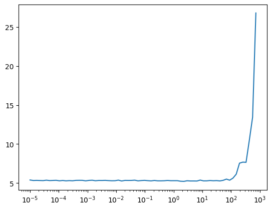
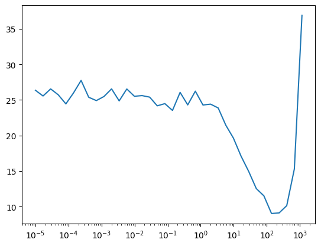
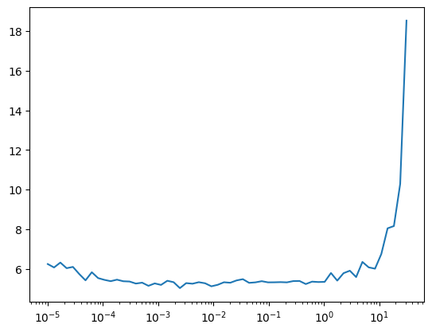

# Darknet


<!-- WARNING: THIS FILE WAS AUTOGENERATED! DO NOT EDIT! -->

Darknet19 is very simple backbone for image detection model,
[yolov2](https://arxiv.org/pdf/1612.08242v1). To learn how image
detections work with bounding boxes, this seems like a good place to
start.

``` python
from datasets import load_dataset, load_dataset_builder
from torcheval.metrics import  MulticlassAccuracy
import torchvision.transforms.v2.functional as TF

import fastcore.all as fc, numpy as np, matplotlib as mpl, matplotlib.pyplot as plt

import httpx
from minai import *
```

``` python
set_seed(42)
```

## Data

We use imagenet tiny to test our darknet before moving on to the actual
imagenet with 1000 classes. We will grab images from huggingface
datasets.

``` python
ds_name = 'zh-plus/tiny-imagenet'
dsd = load_dataset(ds_name)
dsd
```

    DatasetDict({
        train: Dataset({
            features: ['image', 'label'],
            num_rows: 100000
        })
        valid: Dataset({
            features: ['image', 'label'],
            num_rows: 10000
        })
    })

Unfortunately, some images are gray images (1 channel) instead of colors
(3 channels). We repeat channels to make it 3 channels. We also make the
images to be scaled to between 0 and 1.

``` python
def transforms(b):
    def process_image(img):
        tensor = TF.to_dtype(TF.to_image(img), dtype=torch.float32, scale=True)
        if tensor.shape[0] == 1: tensor = tensor.repeat(3, 1, 1) 
        return tensor
    
    b['image'] = [process_image(o) for o in b['image']]
    return b
```

``` python
ds = dsd.with_transform(transforms)
dls = DataLoaders.from_dd(ds,batch_size=64)
xb, yb = next(iter(dls.train))
xb.shape, yb.shape, yb[:5]
```

    (torch.Size([64, 3, 64, 64]),
     torch.Size([64]),
     tensor([ 82,  83, 124, 184, 169]))

``` python
yb[:5]
```

    tensor([ 82,  83, 124, 184, 169])

``` python
lbls = np.array(ds['train'].features['label'].names)
lbls[:5]
```

    array(['n01443537', 'n01629819', 'n01641577', 'n01644900', 'n01698640'],
          dtype='<U9')

So, the labels are not very distinguishable. Let’s get the actual
labels.

``` python
import ast
```

``` python
res = httpx.get('https://huggingface.co/datasets/zh-plus/tiny-imagenet/raw/main/classes.py')
cls = ast.literal_eval(res.text.split('=')[1])
dict(list(cls.items())[:5])
```

    {'n00001740': 'entity',
     'n00001930': 'physical entity',
     'n00002137': 'abstraction, abstract entity',
     'n00002452': 'thing',
     'n00002684': 'object, physical object'}

``` python
def get_lbls(yb): return [cls[o].split(',')[0] for o in lbls[yb]]
```

``` python
get_lbls(yb[:5])
```

    ['Christmas stocking', 'cliff dwelling', 'poncho', 'bee', 'ice lolly']

``` python
show_images(xb[:5], ncols=5, titles=get_lbls(yb[:5]))
```


That looks about right.

## Basic model

Before using the darknet, I would like to use a simple model to get the
training going.

------------------------------------------------------------------------

<a
href="https://github.com/galopyz/pilus_project/blob/main/pilus_project/darknet.py#L13"
target="_blank" style="float:right; font-size:smaller">source</a>

### get_simple_model

>  get_simple_model ()

``` python
model = get_simple_model()
```

``` python
cbs = [
    TrainCB(), # Handles the core steps in the training loop. Can be left out if using TrainLearner
    DeviceCB(), # Handles making sure data and model are on the right device
    MetricsCB(accuracy=MulticlassAccuracy()), # Keep track of any relevant metrics
    ProgressCB(), # Displays metrics and loss during training, optionally plot=True for a pretty graph
]
```

``` python
loss_fn = nn.CrossEntropyLoss()
learn = Learner(model, dls, loss_fn, lr=8, cbs=cbs)
learn.show_image_batch()
```

<style>
    /* Turns off some styling */
    progress {
        /* gets rid of default border in Firefox and Opera. */
        border: none;
        /* Needs to be in here for Safari polyfill so background images work as expected. */
        background-size: auto;
    }
    progress:not([value]), progress:not([value])::-webkit-progress-bar {
        background: repeating-linear-gradient(45deg, #7e7e7e, #7e7e7e 10px, #5c5c5c 10px, #5c5c5c 20px);
    }
    .progress-bar-interrupted, .progress-bar-interrupted::-webkit-progress-bar {
        background: #F44336;
    }
</style>

    <div>
      <progress value='0' class='' max='1' style='width:300px; height:20px; vertical-align: middle;'></progress>
      0.00% [0/1 00:00&lt;?]
    </div>
    &#10;
&#10;    <div>
      <progress value='0' class='' max='1563' style='width:300px; height:20px; vertical-align: middle;'></progress>
      0.00% [0/1563 00:00&lt;?]
    </div>
    &#10;



``` python
learn.summary()
```

<style>
    /* Turns off some styling */
    progress {
        /* gets rid of default border in Firefox and Opera. */
        border: none;
        /* Needs to be in here for Safari polyfill so background images work as expected. */
        background-size: auto;
    }
    progress:not([value]), progress:not([value])::-webkit-progress-bar {
        background: repeating-linear-gradient(45deg, #7e7e7e, #7e7e7e 10px, #5c5c5c 10px, #5c5c5c 20px);
    }
    .progress-bar-interrupted, .progress-bar-interrupted::-webkit-progress-bar {
        background: #F44336;
    }
</style>

    <div>
      <progress value='0' class='' max='1' style='width:300px; height:20px; vertical-align: middle;'></progress>
      0.00% [0/1 00:00&lt;?]
    </div>
    &#10;
&#10;    <div>
      <progress value='0' class='' max='1563' style='width:300px; height:20px; vertical-align: middle;'></progress>
      0.00% [0/1563 00:00&lt;?]
    </div>
    &#10;

    Tot params: 15600; MFLOPS: 14.4

<table>
<thead>
<tr>
<th>Module</th>
<th>Input</th>
<th>Output</th>
<th>Num params</th>
<th>MFLOPS</th>
</tr>
</thead>
<tbody>
<tr>
<td>Conv2d</td>
<td>(64, 3, 64, 64)</td>
<td>(64, 200, 31, 31)</td>
<td>15200</td>
<td>14.4</td>
</tr>
<tr>
<td>BatchNorm2d</td>
<td>(64, 200, 31, 31)</td>
<td>(64, 200, 31, 31)</td>
<td>400</td>
<td>0.0</td>
</tr>
<tr>
<td>ReLU</td>
<td>(64, 200, 31, 31)</td>
<td>(64, 200, 31, 31)</td>
<td>0</td>
<td>0.0</td>
</tr>
<tr>
<td>AdaptiveAvgPool2d</td>
<td>(64, 200, 31, 31)</td>
<td>(64, 200, 1, 1)</td>
<td>0</td>
<td>0.0</td>
</tr>
<tr>
<td>Flatten</td>
<td>(64, 200, 1, 1)</td>
<td>(64, 200)</td>
<td>0</td>
<td>0.0</td>
</tr>
</tbody>
</table>

``` python
learn.lr_find(gamma=1.7)
```

<style>
    /* Turns off some styling */
    progress {
        /* gets rid of default border in Firefox and Opera. */
        border: none;
        /* Needs to be in here for Safari polyfill so background images work as expected. */
        background-size: auto;
    }
    progress:not([value]), progress:not([value])::-webkit-progress-bar {
        background: repeating-linear-gradient(45deg, #7e7e7e, #7e7e7e 10px, #5c5c5c 10px, #5c5c5c 20px);
    }
    .progress-bar-interrupted, .progress-bar-interrupted::-webkit-progress-bar {
        background: #F44336;
    }
</style>

    <div>
      <progress value='0' class='' max='10' style='width:300px; height:20px; vertical-align: middle;'></progress>
      0.00% [0/10 00:00&lt;?]
    </div>
    &#10;
&#10;    <div>
      <progress value='35' class='' max='1563' style='width:300px; height:20px; vertical-align: middle;'></progress>
      2.24% [35/1563 00:01&lt;01:22 15.285]
    </div>
    &#10;



``` python
learn.fit(3)
```

<style>
    /* Turns off some styling */
    progress {
        /* gets rid of default border in Firefox and Opera. */
        border: none;
        /* Needs to be in here for Safari polyfill so background images work as expected. */
        background-size: auto;
    }
    progress:not([value]), progress:not([value])::-webkit-progress-bar {
        background: repeating-linear-gradient(45deg, #7e7e7e, #7e7e7e 10px, #5c5c5c 10px, #5c5c5c 20px);
    }
    .progress-bar-interrupted, .progress-bar-interrupted::-webkit-progress-bar {
        background: #F44336;
    }
</style>

<table class="dataframe" data-quarto-postprocess="true" data-border="1">
<thead>
<tr style="text-align: left;">
<th data-quarto-table-cell-role="th">accuracy</th>
<th data-quarto-table-cell-role="th">loss</th>
<th data-quarto-table-cell-role="th">epoch</th>
<th data-quarto-table-cell-role="th">train</th>
<th data-quarto-table-cell-role="th">time</th>
</tr>
</thead>
<tbody>
<tr>
<td>0.011</td>
<td>5.293</td>
<td>0</td>
<td>train</td>
<td>01:04</td>
</tr>
<tr>
<td>0.013</td>
<td>5.283</td>
<td>0</td>
<td>eval</td>
<td>00:03</td>
</tr>
<tr>
<td>0.015</td>
<td>5.280</td>
<td>1</td>
<td>train</td>
<td>01:05</td>
</tr>
<tr>
<td>0.014</td>
<td>5.274</td>
<td>1</td>
<td>eval</td>
<td>00:03</td>
</tr>
<tr>
<td>0.017</td>
<td>5.272</td>
<td>2</td>
<td>train</td>
<td>01:07</td>
</tr>
<tr>
<td>0.017</td>
<td>5.266</td>
<td>2</td>
<td>eval</td>
<td>00:03</td>
</tr>
</tbody>
</table>

Good. It trains. So, the dataloader is set properly. Let’s move on to
darknet.

## Darknet

Let’s try darknet with a simple classification head.

------------------------------------------------------------------------

<a
href="https://github.com/galopyz/pilus_project/blob/main/pilus_project/darknet.py#L34"
target="_blank" style="float:right; font-size:smaller">source</a>

### ConvBlock

>  ConvBlock (in_ch, out_ch, ks=3, use_norm=True, use_act=True,
>                 act=LeakyReLU(negative_slope=0.1))

\*Base class for all neural network modules.

Your models should also subclass this class.

Modules can also contain other Modules, allowing them to be nested in a
tree structure. You can assign the submodules as regular attributes::

    import torch.nn as nn
    import torch.nn.functional as F

    class Model(nn.Module):
        def __init__(self) -> None:
            super().__init__()
            self.conv1 = nn.Conv2d(1, 20, 5)
            self.conv2 = nn.Conv2d(20, 20, 5)

        def forward(self, x):
            x = F.relu(self.conv1(x))
            return F.relu(self.conv2(x))

Submodules assigned in this way will be registered, and will also have
their parameters converted when you call :meth:`to`, etc.

.. note:: As per the example above, an `__init__()` call to the parent
class must be made before assignment on the child.

:ivar training: Boolean represents whether this module is in training or
evaluation mode. :vartype training: bool\*

------------------------------------------------------------------------

<a
href="https://github.com/galopyz/pilus_project/blob/main/pilus_project/darknet.py#L46"
target="_blank" style="float:right; font-size:smaller">source</a>

### get_darknet19

>  get_darknet19 (conv=<class '__main__.ConvBlock'>,
>                     pool=MaxPool2d(kernel_size=2, stride=2, padding=0,
>                     dilation=1, ceil_mode=False))

``` python
head = nn.Sequential(
    ConvBlock(1024, 200, ks=1),
    nn.AdaptiveAvgPool2d(1),
    nn.Flatten()
)
head
```

    Sequential(
      (0): ConvBlock(
        (conv): Conv2d(1024, 200, kernel_size=(1, 1), stride=(1, 1))
        (norm): BatchNorm2d(200, eps=1e-05, momentum=0.1, affine=True, track_running_stats=True)
        (act): LeakyReLU(negative_slope=0.1)
      )
      (1): AdaptiveAvgPool2d(output_size=1)
      (2): Flatten(start_dim=1, end_dim=-1)
    )

``` python
get_darknet19()+head
```

    Sequential(
      (0): ConvBlock(
        (conv): Conv2d(3, 32, kernel_size=(3, 3), stride=(1, 1), padding=(1, 1))
        (norm): BatchNorm2d(32, eps=1e-05, momentum=0.1, affine=True, track_running_stats=True)
        (act): LeakyReLU(negative_slope=0.1)
      )
      (1): MaxPool2d(kernel_size=2, stride=2, padding=0, dilation=1, ceil_mode=False)
      (2): ConvBlock(
        (conv): Conv2d(32, 64, kernel_size=(3, 3), stride=(1, 1), padding=(1, 1))
        (norm): BatchNorm2d(64, eps=1e-05, momentum=0.1, affine=True, track_running_stats=True)
        (act): LeakyReLU(negative_slope=0.1)
      )
      (3): MaxPool2d(kernel_size=2, stride=2, padding=0, dilation=1, ceil_mode=False)
      (4): ConvBlock(
        (conv): Conv2d(64, 128, kernel_size=(3, 3), stride=(1, 1), padding=(1, 1))
        (norm): BatchNorm2d(128, eps=1e-05, momentum=0.1, affine=True, track_running_stats=True)
        (act): LeakyReLU(negative_slope=0.1)
      )
      (5): ConvBlock(
        (conv): Conv2d(128, 64, kernel_size=(1, 1), stride=(1, 1))
        (norm): BatchNorm2d(64, eps=1e-05, momentum=0.1, affine=True, track_running_stats=True)
        (act): LeakyReLU(negative_slope=0.1)
      )
      (6): ConvBlock(
        (conv): Conv2d(64, 128, kernel_size=(3, 3), stride=(1, 1), padding=(1, 1))
        (norm): BatchNorm2d(128, eps=1e-05, momentum=0.1, affine=True, track_running_stats=True)
        (act): LeakyReLU(negative_slope=0.1)
      )
      (7): MaxPool2d(kernel_size=2, stride=2, padding=0, dilation=1, ceil_mode=False)
      (8): ConvBlock(
        (conv): Conv2d(128, 256, kernel_size=(3, 3), stride=(1, 1), padding=(1, 1))
        (norm): BatchNorm2d(256, eps=1e-05, momentum=0.1, affine=True, track_running_stats=True)
        (act): LeakyReLU(negative_slope=0.1)
      )
      (9): ConvBlock(
        (conv): Conv2d(256, 128, kernel_size=(1, 1), stride=(1, 1))
        (norm): BatchNorm2d(128, eps=1e-05, momentum=0.1, affine=True, track_running_stats=True)
        (act): LeakyReLU(negative_slope=0.1)
      )
      (10): ConvBlock(
        (conv): Conv2d(128, 256, kernel_size=(3, 3), stride=(1, 1), padding=(1, 1))
        (norm): BatchNorm2d(256, eps=1e-05, momentum=0.1, affine=True, track_running_stats=True)
        (act): LeakyReLU(negative_slope=0.1)
      )
      (11): MaxPool2d(kernel_size=2, stride=2, padding=0, dilation=1, ceil_mode=False)
      (12): ConvBlock(
        (conv): Conv2d(256, 512, kernel_size=(3, 3), stride=(1, 1), padding=(1, 1))
        (norm): BatchNorm2d(512, eps=1e-05, momentum=0.1, affine=True, track_running_stats=True)
        (act): LeakyReLU(negative_slope=0.1)
      )
      (13): ConvBlock(
        (conv): Conv2d(512, 256, kernel_size=(1, 1), stride=(1, 1))
        (norm): BatchNorm2d(256, eps=1e-05, momentum=0.1, affine=True, track_running_stats=True)
        (act): LeakyReLU(negative_slope=0.1)
      )
      (14): ConvBlock(
        (conv): Conv2d(256, 512, kernel_size=(3, 3), stride=(1, 1), padding=(1, 1))
        (norm): BatchNorm2d(512, eps=1e-05, momentum=0.1, affine=True, track_running_stats=True)
        (act): LeakyReLU(negative_slope=0.1)
      )
      (15): ConvBlock(
        (conv): Conv2d(512, 256, kernel_size=(1, 1), stride=(1, 1))
        (norm): BatchNorm2d(256, eps=1e-05, momentum=0.1, affine=True, track_running_stats=True)
        (act): LeakyReLU(negative_slope=0.1)
      )
      (16): ConvBlock(
        (conv): Conv2d(256, 512, kernel_size=(3, 3), stride=(1, 1), padding=(1, 1))
        (norm): BatchNorm2d(512, eps=1e-05, momentum=0.1, affine=True, track_running_stats=True)
        (act): LeakyReLU(negative_slope=0.1)
      )
      (17): MaxPool2d(kernel_size=2, stride=2, padding=0, dilation=1, ceil_mode=False)
      (18): ConvBlock(
        (conv): Conv2d(512, 1024, kernel_size=(3, 3), stride=(1, 1), padding=(1, 1))
        (norm): BatchNorm2d(1024, eps=1e-05, momentum=0.1, affine=True, track_running_stats=True)
        (act): LeakyReLU(negative_slope=0.1)
      )
      (19): ConvBlock(
        (conv): Conv2d(1024, 512, kernel_size=(1, 1), stride=(1, 1))
        (norm): BatchNorm2d(512, eps=1e-05, momentum=0.1, affine=True, track_running_stats=True)
        (act): LeakyReLU(negative_slope=0.1)
      )
      (20): ConvBlock(
        (conv): Conv2d(512, 1024, kernel_size=(3, 3), stride=(1, 1), padding=(1, 1))
        (norm): BatchNorm2d(1024, eps=1e-05, momentum=0.1, affine=True, track_running_stats=True)
        (act): LeakyReLU(negative_slope=0.1)
      )
      (21): ConvBlock(
        (conv): Conv2d(1024, 512, kernel_size=(1, 1), stride=(1, 1))
        (norm): BatchNorm2d(512, eps=1e-05, momentum=0.1, affine=True, track_running_stats=True)
        (act): LeakyReLU(negative_slope=0.1)
      )
      (22): ConvBlock(
        (conv): Conv2d(512, 1024, kernel_size=(3, 3), stride=(1, 1), padding=(1, 1))
        (norm): BatchNorm2d(1024, eps=1e-05, momentum=0.1, affine=True, track_running_stats=True)
        (act): LeakyReLU(negative_slope=0.1)
      )
      (23): ConvBlock(
        (conv): Conv2d(1024, 200, kernel_size=(1, 1), stride=(1, 1))
        (norm): BatchNorm2d(200, eps=1e-05, momentum=0.1, affine=True, track_running_stats=True)
        (act): LeakyReLU(negative_slope=0.1)
      )
      (24): AdaptiveAvgPool2d(output_size=1)
      (25): Flatten(start_dim=1, end_dim=-1)
    )

``` python
learn = Learner(get_darknet19()+head, dls, loss_fn, lr=0.3, cbs=cbs)
learn.summary()
```

<style>
    /* Turns off some styling */
    progress {
        /* gets rid of default border in Firefox and Opera. */
        border: none;
        /* Needs to be in here for Safari polyfill so background images work as expected. */
        background-size: auto;
    }
    progress:not([value]), progress:not([value])::-webkit-progress-bar {
        background: repeating-linear-gradient(45deg, #7e7e7e, #7e7e7e 10px, #5c5c5c 10px, #5c5c5c 20px);
    }
    .progress-bar-interrupted, .progress-bar-interrupted::-webkit-progress-bar {
        background: #F44336;
    }
</style>

    <div>
      <progress value='0' class='' max='1' style='width:300px; height:20px; vertical-align: middle;'></progress>
      0.00% [0/1 00:00&lt;?]
    </div>
    &#10;
&#10;    <div>
      <progress value='0' class='' max='1563' style='width:300px; height:20px; vertical-align: middle;'></progress>
      0.00% [0/1563 00:00&lt;?]
    </div>
    &#10;

    Tot params: 20029976; MFLOPS: 224.6

<table>
<thead>
<tr>
<th>Module</th>
<th>Input</th>
<th>Output</th>
<th>Num params</th>
<th>MFLOPS</th>
</tr>
</thead>
<tbody>
<tr>
<td>ConvBlock</td>
<td>(64, 3, 64, 64)</td>
<td>(64, 32, 64, 64)</td>
<td>960</td>
<td>3.5</td>
</tr>
<tr>
<td>MaxPool2d</td>
<td>(64, 32, 64, 64)</td>
<td>(64, 32, 32, 32)</td>
<td>0</td>
<td>0.0</td>
</tr>
<tr>
<td>MaxPool2d</td>
<td>(64, 32, 64, 64)</td>
<td>(64, 32, 32, 32)</td>
<td>0</td>
<td>0.0</td>
</tr>
<tr>
<td>MaxPool2d</td>
<td>(64, 32, 64, 64)</td>
<td>(64, 32, 32, 32)</td>
<td>0</td>
<td>0.0</td>
</tr>
<tr>
<td>MaxPool2d</td>
<td>(64, 32, 64, 64)</td>
<td>(64, 32, 32, 32)</td>
<td>0</td>
<td>0.0</td>
</tr>
<tr>
<td>MaxPool2d</td>
<td>(64, 32, 64, 64)</td>
<td>(64, 32, 32, 32)</td>
<td>0</td>
<td>0.0</td>
</tr>
<tr>
<td>ConvBlock</td>
<td>(64, 32, 32, 32)</td>
<td>(64, 64, 32, 32)</td>
<td>18624</td>
<td>18.9</td>
</tr>
<tr>
<td>MaxPool2d</td>
<td>(64, 64, 32, 32)</td>
<td>(64, 64, 16, 16)</td>
<td>0</td>
<td>0.0</td>
</tr>
<tr>
<td>MaxPool2d</td>
<td>(64, 64, 32, 32)</td>
<td>(64, 64, 16, 16)</td>
<td>0</td>
<td>0.0</td>
</tr>
<tr>
<td>MaxPool2d</td>
<td>(64, 64, 32, 32)</td>
<td>(64, 64, 16, 16)</td>
<td>0</td>
<td>0.0</td>
</tr>
<tr>
<td>MaxPool2d</td>
<td>(64, 64, 32, 32)</td>
<td>(64, 64, 16, 16)</td>
<td>0</td>
<td>0.0</td>
</tr>
<tr>
<td>MaxPool2d</td>
<td>(64, 64, 32, 32)</td>
<td>(64, 64, 16, 16)</td>
<td>0</td>
<td>0.0</td>
</tr>
<tr>
<td>ConvBlock</td>
<td>(64, 64, 16, 16)</td>
<td>(64, 128, 16, 16)</td>
<td>74112</td>
<td>18.9</td>
</tr>
<tr>
<td>ConvBlock</td>
<td>(64, 128, 16, 16)</td>
<td>(64, 64, 16, 16)</td>
<td>8384</td>
<td>2.1</td>
</tr>
<tr>
<td>ConvBlock</td>
<td>(64, 64, 16, 16)</td>
<td>(64, 128, 16, 16)</td>
<td>74112</td>
<td>18.9</td>
</tr>
<tr>
<td>MaxPool2d</td>
<td>(64, 128, 16, 16)</td>
<td>(64, 128, 8, 8)</td>
<td>0</td>
<td>0.0</td>
</tr>
<tr>
<td>MaxPool2d</td>
<td>(64, 128, 16, 16)</td>
<td>(64, 128, 8, 8)</td>
<td>0</td>
<td>0.0</td>
</tr>
<tr>
<td>MaxPool2d</td>
<td>(64, 128, 16, 16)</td>
<td>(64, 128, 8, 8)</td>
<td>0</td>
<td>0.0</td>
</tr>
<tr>
<td>MaxPool2d</td>
<td>(64, 128, 16, 16)</td>
<td>(64, 128, 8, 8)</td>
<td>0</td>
<td>0.0</td>
</tr>
<tr>
<td>MaxPool2d</td>
<td>(64, 128, 16, 16)</td>
<td>(64, 128, 8, 8)</td>
<td>0</td>
<td>0.0</td>
</tr>
<tr>
<td>ConvBlock</td>
<td>(64, 128, 8, 8)</td>
<td>(64, 256, 8, 8)</td>
<td>295680</td>
<td>18.9</td>
</tr>
<tr>
<td>ConvBlock</td>
<td>(64, 256, 8, 8)</td>
<td>(64, 128, 8, 8)</td>
<td>33152</td>
<td>2.1</td>
</tr>
<tr>
<td>ConvBlock</td>
<td>(64, 128, 8, 8)</td>
<td>(64, 256, 8, 8)</td>
<td>295680</td>
<td>18.9</td>
</tr>
<tr>
<td>MaxPool2d</td>
<td>(64, 256, 8, 8)</td>
<td>(64, 256, 4, 4)</td>
<td>0</td>
<td>0.0</td>
</tr>
<tr>
<td>MaxPool2d</td>
<td>(64, 256, 8, 8)</td>
<td>(64, 256, 4, 4)</td>
<td>0</td>
<td>0.0</td>
</tr>
<tr>
<td>MaxPool2d</td>
<td>(64, 256, 8, 8)</td>
<td>(64, 256, 4, 4)</td>
<td>0</td>
<td>0.0</td>
</tr>
<tr>
<td>MaxPool2d</td>
<td>(64, 256, 8, 8)</td>
<td>(64, 256, 4, 4)</td>
<td>0</td>
<td>0.0</td>
</tr>
<tr>
<td>MaxPool2d</td>
<td>(64, 256, 8, 8)</td>
<td>(64, 256, 4, 4)</td>
<td>0</td>
<td>0.0</td>
</tr>
<tr>
<td>ConvBlock</td>
<td>(64, 256, 4, 4)</td>
<td>(64, 512, 4, 4)</td>
<td>1181184</td>
<td>18.9</td>
</tr>
<tr>
<td>ConvBlock</td>
<td>(64, 512, 4, 4)</td>
<td>(64, 256, 4, 4)</td>
<td>131840</td>
<td>2.1</td>
</tr>
<tr>
<td>ConvBlock</td>
<td>(64, 256, 4, 4)</td>
<td>(64, 512, 4, 4)</td>
<td>1181184</td>
<td>18.9</td>
</tr>
<tr>
<td>ConvBlock</td>
<td>(64, 512, 4, 4)</td>
<td>(64, 256, 4, 4)</td>
<td>131840</td>
<td>2.1</td>
</tr>
<tr>
<td>ConvBlock</td>
<td>(64, 256, 4, 4)</td>
<td>(64, 512, 4, 4)</td>
<td>1181184</td>
<td>18.9</td>
</tr>
<tr>
<td>MaxPool2d</td>
<td>(64, 512, 4, 4)</td>
<td>(64, 512, 2, 2)</td>
<td>0</td>
<td>0.0</td>
</tr>
<tr>
<td>MaxPool2d</td>
<td>(64, 512, 4, 4)</td>
<td>(64, 512, 2, 2)</td>
<td>0</td>
<td>0.0</td>
</tr>
<tr>
<td>MaxPool2d</td>
<td>(64, 512, 4, 4)</td>
<td>(64, 512, 2, 2)</td>
<td>0</td>
<td>0.0</td>
</tr>
<tr>
<td>MaxPool2d</td>
<td>(64, 512, 4, 4)</td>
<td>(64, 512, 2, 2)</td>
<td>0</td>
<td>0.0</td>
</tr>
<tr>
<td>MaxPool2d</td>
<td>(64, 512, 4, 4)</td>
<td>(64, 512, 2, 2)</td>
<td>0</td>
<td>0.0</td>
</tr>
<tr>
<td>ConvBlock</td>
<td>(64, 512, 2, 2)</td>
<td>(64, 1024, 2, 2)</td>
<td>4721664</td>
<td>18.9</td>
</tr>
<tr>
<td>ConvBlock</td>
<td>(64, 1024, 2, 2)</td>
<td>(64, 512, 2, 2)</td>
<td>525824</td>
<td>2.1</td>
</tr>
<tr>
<td>ConvBlock</td>
<td>(64, 512, 2, 2)</td>
<td>(64, 1024, 2, 2)</td>
<td>4721664</td>
<td>18.9</td>
</tr>
<tr>
<td>ConvBlock</td>
<td>(64, 1024, 2, 2)</td>
<td>(64, 512, 2, 2)</td>
<td>525824</td>
<td>2.1</td>
</tr>
<tr>
<td>ConvBlock</td>
<td>(64, 512, 2, 2)</td>
<td>(64, 1024, 2, 2)</td>
<td>4721664</td>
<td>18.9</td>
</tr>
<tr>
<td>ConvBlock</td>
<td>(64, 1024, 2, 2)</td>
<td>(64, 200, 2, 2)</td>
<td>205400</td>
<td>0.8</td>
</tr>
<tr>
<td>AdaptiveAvgPool2d</td>
<td>(64, 200, 2, 2)</td>
<td>(64, 200, 1, 1)</td>
<td>0</td>
<td>0.0</td>
</tr>
<tr>
<td>Flatten</td>
<td>(64, 200, 1, 1)</td>
<td>(64, 200)</td>
<td>0</td>
<td>0.0</td>
</tr>
</tbody>
</table>

``` python
# lr = 1
learn.fit(10)
```

<style>
    /* Turns off some styling */
    progress {
        /* gets rid of default border in Firefox and Opera. */
        border: none;
        /* Needs to be in here for Safari polyfill so background images work as expected. */
        background-size: auto;
    }
    progress:not([value]), progress:not([value])::-webkit-progress-bar {
        background: repeating-linear-gradient(45deg, #7e7e7e, #7e7e7e 10px, #5c5c5c 10px, #5c5c5c 20px);
    }
    .progress-bar-interrupted, .progress-bar-interrupted::-webkit-progress-bar {
        background: #F44336;
    }
</style>

<table class="dataframe" data-quarto-postprocess="true" data-border="1">
<thead>
<tr style="text-align: left;">
<th data-quarto-table-cell-role="th">accuracy</th>
<th data-quarto-table-cell-role="th">loss</th>
<th data-quarto-table-cell-role="th">epoch</th>
<th data-quarto-table-cell-role="th">train</th>
<th data-quarto-table-cell-role="th">time</th>
</tr>
</thead>
<tbody>
<tr>
<td>0.024</td>
<td>4.961</td>
<td>0</td>
<td>train</td>
<td>00:30</td>
</tr>
<tr>
<td>0.037</td>
<td>4.760</td>
<td>0</td>
<td>eval</td>
<td>00:02</td>
</tr>
<tr>
<td>0.061</td>
<td>4.454</td>
<td>1</td>
<td>train</td>
<td>00:30</td>
</tr>
<tr>
<td>0.044</td>
<td>4.779</td>
<td>1</td>
<td>eval</td>
<td>00:01</td>
</tr>
<tr>
<td>0.082</td>
<td>4.209</td>
<td>2</td>
<td>train</td>
<td>00:30</td>
</tr>
<tr>
<td>0.070</td>
<td>4.322</td>
<td>2</td>
<td>eval</td>
<td>00:01</td>
</tr>
<tr>
<td>0.103</td>
<td>4.035</td>
<td>3</td>
<td>train</td>
<td>00:30</td>
</tr>
<tr>
<td>0.102</td>
<td>4.119</td>
<td>3</td>
<td>eval</td>
<td>00:01</td>
</tr>
<tr>
<td>0.131</td>
<td>3.830</td>
<td>4</td>
<td>train</td>
<td>00:30</td>
</tr>
<tr>
<td>0.131</td>
<td>3.840</td>
<td>4</td>
<td>eval</td>
<td>00:01</td>
</tr>
<tr>
<td>0.159</td>
<td>3.650</td>
<td>5</td>
<td>train</td>
<td>00:30</td>
</tr>
<tr>
<td>0.136</td>
<td>3.868</td>
<td>5</td>
<td>eval</td>
<td>00:01</td>
</tr>
<tr>
<td>0.185</td>
<td>3.499</td>
<td>6</td>
<td>train</td>
<td>00:30</td>
</tr>
<tr>
<td>0.137</td>
<td>3.937</td>
<td>6</td>
<td>eval</td>
<td>00:01</td>
</tr>
<tr>
<td>0.206</td>
<td>3.379</td>
<td>7</td>
<td>train</td>
<td>00:31</td>
</tr>
<tr>
<td>0.171</td>
<td>3.708</td>
<td>7</td>
<td>eval</td>
<td>00:01</td>
</tr>
<tr>
<td>0.227</td>
<td>3.256</td>
<td>8</td>
<td>train</td>
<td>00:31</td>
</tr>
<tr>
<td>0.092</td>
<td>4.795</td>
<td>8</td>
<td>eval</td>
<td>00:01</td>
</tr>
<tr>
<td>0.249</td>
<td>3.146</td>
<td>9</td>
<td>train</td>
<td>00:31</td>
</tr>
<tr>
<td>0.231</td>
<td>3.292</td>
<td>9</td>
<td>eval</td>
<td>00:01</td>
</tr>
</tbody>
</table>

``` python
# lr = 0.1
learn.fit(10)
```

<style>
    /* Turns off some styling */
    progress {
        /* gets rid of default border in Firefox and Opera. */
        border: none;
        /* Needs to be in here for Safari polyfill so background images work as expected. */
        background-size: auto;
    }
    progress:not([value]), progress:not([value])::-webkit-progress-bar {
        background: repeating-linear-gradient(45deg, #7e7e7e, #7e7e7e 10px, #5c5c5c 10px, #5c5c5c 20px);
    }
    .progress-bar-interrupted, .progress-bar-interrupted::-webkit-progress-bar {
        background: #F44336;
    }
</style>

<table class="dataframe" data-quarto-postprocess="true" data-border="1">
<thead>
<tr style="text-align: left;">
<th data-quarto-table-cell-role="th">accuracy</th>
<th data-quarto-table-cell-role="th">loss</th>
<th data-quarto-table-cell-role="th">epoch</th>
<th data-quarto-table-cell-role="th">train</th>
<th data-quarto-table-cell-role="th">time</th>
</tr>
</thead>
<tbody>
<tr>
<td>0.039</td>
<td>4.780</td>
<td>0</td>
<td>train</td>
<td>00:30</td>
</tr>
<tr>
<td>0.057</td>
<td>4.529</td>
<td>0</td>
<td>eval</td>
<td>00:01</td>
</tr>
<tr>
<td>0.092</td>
<td>4.218</td>
<td>1</td>
<td>train</td>
<td>00:30</td>
</tr>
<tr>
<td>0.044</td>
<td>5.159</td>
<td>1</td>
<td>eval</td>
<td>00:01</td>
</tr>
<tr>
<td>0.137</td>
<td>3.904</td>
<td>2</td>
<td>train</td>
<td>00:31</td>
</tr>
<tr>
<td>0.135</td>
<td>3.906</td>
<td>2</td>
<td>eval</td>
<td>00:01</td>
</tr>
<tr>
<td>0.163</td>
<td>3.705</td>
<td>3</td>
<td>train</td>
<td>00:31</td>
</tr>
<tr>
<td>0.113</td>
<td>4.146</td>
<td>3</td>
<td>eval</td>
<td>00:01</td>
</tr>
<tr>
<td>0.185</td>
<td>3.565</td>
<td>4</td>
<td>train</td>
<td>00:31</td>
</tr>
<tr>
<td>0.166</td>
<td>3.697</td>
<td>4</td>
<td>eval</td>
<td>00:01</td>
</tr>
<tr>
<td>0.206</td>
<td>3.444</td>
<td>5</td>
<td>train</td>
<td>00:31</td>
</tr>
<tr>
<td>0.122</td>
<td>4.253</td>
<td>5</td>
<td>eval</td>
<td>00:01</td>
</tr>
<tr>
<td>0.224</td>
<td>3.347</td>
<td>6</td>
<td>train</td>
<td>00:30</td>
</tr>
<tr>
<td>0.208</td>
<td>3.458</td>
<td>6</td>
<td>eval</td>
<td>00:01</td>
</tr>
<tr>
<td>0.239</td>
<td>3.251</td>
<td>7</td>
<td>train</td>
<td>00:30</td>
</tr>
<tr>
<td>0.196</td>
<td>3.567</td>
<td>7</td>
<td>eval</td>
<td>00:01</td>
</tr>
<tr>
<td>0.257</td>
<td>3.167</td>
<td>8</td>
<td>train</td>
<td>00:30</td>
</tr>
<tr>
<td>0.168</td>
<td>3.895</td>
<td>8</td>
<td>eval</td>
<td>00:01</td>
</tr>
<tr>
<td>0.273</td>
<td>3.078</td>
<td>9</td>
<td>train</td>
<td>00:30</td>
</tr>
<tr>
<td>0.178</td>
<td>3.765</td>
<td>9</td>
<td>eval</td>
<td>00:01</td>
</tr>
</tbody>
</table>

### optimization

Let’s try to use different optimizers, such as `AdamW`.

``` python
from functools import partial
from torch import optim
```

``` python
# optim.AdamW?
```

``` python
opt_func = partial(optim.AdamW, eps=1e-5)
model = get_darknet19()+head
learn = Learner(model, dls, loss_fn, lr=0.1, cbs=cbs, opt_func=opt_func)
learn.lr_find()
```

<style>
    /* Turns off some styling */
    progress {
        /* gets rid of default border in Firefox and Opera. */
        border: none;
        /* Needs to be in here for Safari polyfill so background images work as expected. */
        background-size: auto;
    }
    progress:not([value]), progress:not([value])::-webkit-progress-bar {
        background: repeating-linear-gradient(45deg, #7e7e7e, #7e7e7e 10px, #5c5c5c 10px, #5c5c5c 20px);
    }
    .progress-bar-interrupted, .progress-bar-interrupted::-webkit-progress-bar {
        background: #F44336;
    }
</style>

    <div>
      <progress value='0' class='' max='10' style='width:300px; height:20px; vertical-align: middle;'></progress>
      0.00% [0/10 00:00&lt;?]
    </div>
    &#10;
&#10;    <div>
      <progress value='56' class='' max='1563' style='width:300px; height:20px; vertical-align: middle;'></progress>
      3.58% [56/1563 00:01&lt;00:32 8.154]
    </div>
    &#10;



``` python
model = get_darknet19()+head
learn = Learner(model, dls, loss_fn, lr=0.1, cbs=cbs, opt_func=opt_func)
```

``` python
learn.fit(10)
```

<style>
    /* Turns off some styling */
    progress {
        /* gets rid of default border in Firefox and Opera. */
        border: none;
        /* Needs to be in here for Safari polyfill so background images work as expected. */
        background-size: auto;
    }
    progress:not([value]), progress:not([value])::-webkit-progress-bar {
        background: repeating-linear-gradient(45deg, #7e7e7e, #7e7e7e 10px, #5c5c5c 10px, #5c5c5c 20px);
    }
    .progress-bar-interrupted, .progress-bar-interrupted::-webkit-progress-bar {
        background: #F44336;
    }
</style>

<table class="dataframe" data-quarto-postprocess="true" data-border="1">
<thead>
<tr style="text-align: left;">
<th data-quarto-table-cell-role="th">accuracy</th>
<th data-quarto-table-cell-role="th">loss</th>
<th data-quarto-table-cell-role="th">epoch</th>
<th data-quarto-table-cell-role="th">train</th>
<th data-quarto-table-cell-role="th">time</th>
</tr>
</thead>
<tbody>
<tr>
<td>0.012</td>
<td>5.155</td>
<td>0</td>
<td>train</td>
<td>00:33</td>
</tr>
<tr>
<td>0.011</td>
<td>5.270</td>
<td>0</td>
<td>eval</td>
<td>00:01</td>
</tr>
<tr>
<td>0.015</td>
<td>5.071</td>
<td>1</td>
<td>train</td>
<td>00:33</td>
</tr>
<tr>
<td>0.012</td>
<td>5.314</td>
<td>1</td>
<td>eval</td>
<td>00:01</td>
</tr>
<tr>
<td>0.015</td>
<td>5.047</td>
<td>2</td>
<td>train</td>
<td>00:33</td>
</tr>
<tr>
<td>0.012</td>
<td>5.279</td>
<td>2</td>
<td>eval</td>
<td>00:01</td>
</tr>
<tr>
<td>0.020</td>
<td>4.963</td>
<td>3</td>
<td>train</td>
<td>00:33</td>
</tr>
<tr>
<td>0.008</td>
<td>6.116</td>
<td>3</td>
<td>eval</td>
<td>00:02</td>
</tr>
<tr>
<td>0.026</td>
<td>4.854</td>
<td>4</td>
<td>train</td>
<td>00:33</td>
</tr>
<tr>
<td>0.023</td>
<td>5.260</td>
<td>4</td>
<td>eval</td>
<td>00:01</td>
</tr>
<tr>
<td>0.028</td>
<td>4.826</td>
<td>5</td>
<td>train</td>
<td>00:33</td>
</tr>
<tr>
<td>0.012</td>
<td>5.225</td>
<td>5</td>
<td>eval</td>
<td>00:01</td>
</tr>
<tr>
<td>0.028</td>
<td>4.821</td>
<td>6</td>
<td>train</td>
<td>00:33</td>
</tr>
<tr>
<td>0.009</td>
<td>5.513</td>
<td>6</td>
<td>eval</td>
<td>00:01</td>
</tr>
<tr>
<td>0.028</td>
<td>4.819</td>
<td>7</td>
<td>train</td>
<td>00:33</td>
</tr>
<tr>
<td>0.018</td>
<td>5.326</td>
<td>7</td>
<td>eval</td>
<td>00:01</td>
</tr>
<tr>
<td>0.028</td>
<td>4.813</td>
<td>8</td>
<td>train</td>
<td>00:33</td>
</tr>
<tr>
<td>0.014</td>
<td>5.297</td>
<td>8</td>
<td>eval</td>
<td>00:01</td>
</tr>
<tr>
<td>0.028</td>
<td>4.815</td>
<td>9</td>
<td>train</td>
<td>00:34</td>
</tr>
<tr>
<td>0.020</td>
<td>4.995</td>
<td>9</td>
<td>eval</td>
<td>00:01</td>
</tr>
</tbody>
</table>
