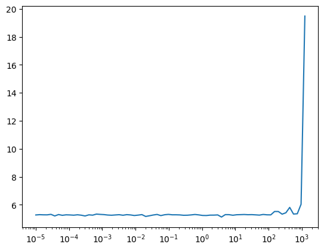
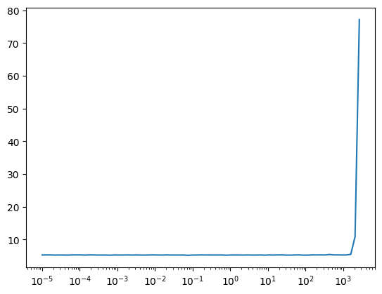
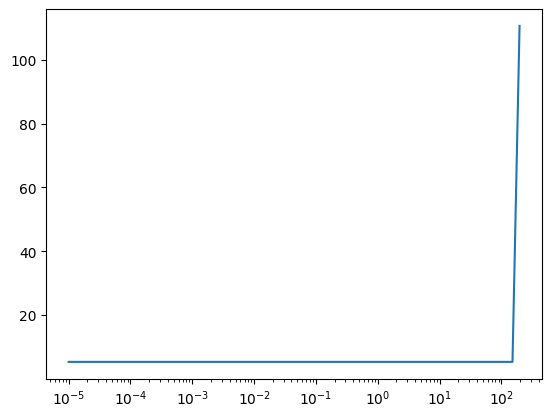

# Darknet


<!-- WARNING: THIS FILE WAS AUTOGENERATED! DO NOT EDIT! -->

Darknet19 is very simple backbone for image detection model,
[yolov2](https://arxiv.org/pdf/1612.08242v1). To learn how image
detections work with bounding boxes, this seems like a good place to
start.

``` python
from minai import *

import torch
import torch.nn as nn
from datasets import load_dataset, load_dataset_builder
from torcheval.metrics import  MulticlassAccuracy
import torchvision.transforms.v2.functional as TF
```

``` python
import fastcore.all as fc, numpy as np, matplotlib as mpl, matplotlib.pyplot as plt

import httpx
```

``` python
set_seed(42)
```

## Data

We use imagenet tiny to test our darknet before moving on to the actual
imagenet with 1000 classes. We will grab images from huggingface
datasets.

``` python
ds_name = 'zh-plus/tiny-imagenet'
dsd = load_dataset(ds_name)
dsd
```

    DatasetDict({
        train: Dataset({
            features: ['image', 'label'],
            num_rows: 100000
        })
        valid: Dataset({
            features: ['image', 'label'],
            num_rows: 10000
        })
    })

Unfortunately, some images are gray images (1 channel) instead of colors
(3 channels). We repeat channels to make it 3 channels. We also make the
images to be scaled to between 0 and 1.

``` python
def transforms(b):
    def process_image(img):
        tensor = TF.to_dtype(TF.to_image(img), dtype=torch.float32, scale=True)
        if tensor.shape[0] == 1: tensor = tensor.repeat(3, 1, 1) 
        return tensor
    
    b['image'] = [process_image(o) for o in b['image']]
    return b
```

``` python
ds = dsd.with_transform(transforms)
dls = DataLoaders.from_dd(ds,batch_size=64)
xb, yb = next(iter(dls.train))
xb.shape, yb.shape, yb[:5]
```

    (torch.Size([64, 3, 64, 64]),
     torch.Size([64]),
     tensor([ 82,  83, 124, 184, 169]))

``` python
yb[:5]
```

    tensor([ 82,  83, 124, 184, 169])

``` python
lbls = np.array(ds['train'].features['label'].names)
lbls[:5]
```

    array(['n01443537', 'n01629819', 'n01641577', 'n01644900', 'n01698640'],
          dtype='<U9')

So, the labels are not very distinguishable. Let’s get the actual
labels.

``` python
import ast

res = httpx.get('https://huggingface.co/datasets/zh-plus/tiny-imagenet/raw/main/classes.py')
cls = ast.literal_eval(res.text.split('=')[1])
dict(list(cls.items())[:5])
```

    {'n00001740': 'entity',
     'n00001930': 'physical entity',
     'n00002137': 'abstraction, abstract entity',
     'n00002452': 'thing',
     'n00002684': 'object, physical object'}

``` python
def get_lbls(yb): return [cls[o].split(',')[0] for o in lbls[yb]]
```

``` python
get_lbls(yb[:5])
```

    ['Christmas stocking', 'cliff dwelling', 'poncho', 'bee', 'ice lolly']

``` python
show_images(xb[:5], ncols=5, titles=get_lbls(yb[:5]))
```


That looks about right.

## Basic model

Before using the darknet, I would like to use a simple model to get the
training going.

``` python
model = nn.Sequential(
    nn.Conv2d(3, 16, kernel_size=3, stride=2, padding=1),
    nn.BatchNorm2d(16),
    nn.ReLU(),
    nn.Conv2d(16, 16, kernel_size=3, stride=2, padding=1),
    nn.BatchNorm2d(16),
    nn.ReLU(),
    nn.Conv2d(16, 200, kernel_size=3, stride=2, padding=1),
    nn.BatchNorm2d(200),
    nn.ReLU(),
    nn.AdaptiveAvgPool2d(1),
    nn.Flatten()
)
```

``` python
cbs = [
    TrainCB(), # Handles the core steps in the training loop. Can be left out if using TrainLearner
    DeviceCB(), # Handles making sure data and model are on the right device
    MetricsCB(accuracy=MulticlassAccuracy()), # Keep track of any relevant metrics
    ProgressCB(), # Displays metrics and loss during training, optionally plot=True for a pretty graph
]
```

``` python
loss_fn = nn.CrossEntropyLoss()
learn = Learner(model, dls, loss_fn, lr=1, cbs=cbs)
# learn.show_image_batch()
```

``` python
# learn.summary()
```

``` python
learn.lr_find()
```

<style>
    /* Turns off some styling */
    progress {
        /* gets rid of default border in Firefox and Opera. */
        border: none;
        /* Needs to be in here for Safari polyfill so background images work as expected. */
        background-size: auto;
    }
    progress:not([value]), progress:not([value])::-webkit-progress-bar {
        background: repeating-linear-gradient(45deg, #7e7e7e, #7e7e7e 10px, #5c5c5c 10px, #5c5c5c 20px);
    }
    .progress-bar-interrupted, .progress-bar-interrupted::-webkit-progress-bar {
        background: #F44336;
    }
</style>

    <div>
      <progress value='0' class='' max='10' style='width:300px; height:20px; vertical-align: middle;'></progress>
      0.00% [0/10 00:00&lt;?]
    </div>
    &#10;
&#10;    <div>
      <progress value='69' class='' max='1563' style='width:300px; height:20px; vertical-align: middle;'></progress>
      4.41% [69/1563 00:04&lt;01:28 13.435]
    </div>
    &#10;


``` python
learn.fit(3)
```

<style>
    /* Turns off some styling */
    progress {
        /* gets rid of default border in Firefox and Opera. */
        border: none;
        /* Needs to be in here for Safari polyfill so background images work as expected. */
        background-size: auto;
    }
    progress:not([value]), progress:not([value])::-webkit-progress-bar {
        background: repeating-linear-gradient(45deg, #7e7e7e, #7e7e7e 10px, #5c5c5c 10px, #5c5c5c 20px);
    }
    .progress-bar-interrupted, .progress-bar-interrupted::-webkit-progress-bar {
        background: #F44336;
    }
</style>

<table class="dataframe" data-quarto-postprocess="true" data-border="1">
<thead>
<tr style="text-align: left;">
<th data-quarto-table-cell-role="th">accuracy</th>
<th data-quarto-table-cell-role="th">loss</th>
<th data-quarto-table-cell-role="th">epoch</th>
<th data-quarto-table-cell-role="th">train</th>
<th data-quarto-table-cell-role="th">time</th>
</tr>
</thead>
<tbody>
<tr>
<td>0.009</td>
<td>6.655</td>
<td>0</td>
<td>train</td>
<td>00:17</td>
</tr>
<tr>
<td>0.016</td>
<td>5.308</td>
<td>0</td>
<td>eval</td>
<td>00:01</td>
</tr>
<tr>
<td>0.018</td>
<td>5.262</td>
<td>1</td>
<td>train</td>
<td>00:17</td>
</tr>
<tr>
<td>0.022</td>
<td>5.227</td>
<td>1</td>
<td>eval</td>
<td>00:01</td>
</tr>
<tr>
<td>0.023</td>
<td>5.217</td>
<td>2</td>
<td>train</td>
<td>00:17</td>
</tr>
<tr>
<td>0.022</td>
<td>5.199</td>
<td>2</td>
<td>eval</td>
<td>00:01</td>
</tr>
</tbody>
</table>

Good. It trains. So, the dataloader is set properly. Let’s move on to
darknet.

## Darknet

Let’s try darknet with a simple classification head.

``` python
class ConvBlock(nn.Module):
    def __init__(self, in_ch, out_ch, ks=3, use_norm=True, use_act=True, act=nn.LeakyReLU(0.1)):
        super().__init__()
        pad = 1 if ks == 3 else 0
        self.conv = nn.Conv2d(in_ch, out_ch, ks, padding=pad)
        self.norm = nn.BatchNorm2d(out_ch) if use_norm else nn.Identity()
        self.act = act if use_act else nn.Identity()

    def forward(self, x): 
        return self.act(self.norm(self.conv(x)))
```

``` python
def get_darknet19(conv=ConvBlock, pool=nn.MaxPool2d(2)):
    return nn.Sequential(
            # Initial layers
            conv(3, 32),
            pool,
            conv(32, 64),
            pool,
            
            # First block
            conv(64, 128),
            conv(128, 64, ks=1),
            conv(64, 128),
            pool,
            
            # Second block
            conv(128, 256),
            conv(256, 128, ks=1),
            conv(128, 256),
            pool,
            
            # Third block
            conv(256, 512),
            conv(512, 256, ks=1),
            conv(256, 512),
            conv(512, 256, ks=1),
            conv(256, 512),
            pool,
            
            # Fourth block
            conv(512, 1024),
            conv(1024, 512, ks=1),
            conv(512, 1024),
            conv(1024, 512, ks=1),
            conv(512, 1024)
    )
```

``` python
head = nn.Sequential(
    ConvBlock(1024, 200, ks=1),
    nn.AdaptiveAvgPool2d(1),
    nn.Flatten()
)
head
```

    Sequential(
      (0): ConvBlock(
        (conv): Conv2d(1024, 200, kernel_size=(1, 1), stride=(1, 1))
        (norm): BatchNorm2d(200, eps=1e-05, momentum=0.1, affine=True, track_running_stats=True)
        (act): LeakyReLU(negative_slope=0.1)
      )
      (1): AdaptiveAvgPool2d(output_size=1)
      (2): Flatten(start_dim=1, end_dim=-1)
    )

``` python
learn = Learner(get_darknet19()+head, dls, loss_fn, lr=1, cbs=cbs)
learn.summary()
```

<style>
    /* Turns off some styling */
    progress {
        /* gets rid of default border in Firefox and Opera. */
        border: none;
        /* Needs to be in here for Safari polyfill so background images work as expected. */
        background-size: auto;
    }
    progress:not([value]), progress:not([value])::-webkit-progress-bar {
        background: repeating-linear-gradient(45deg, #7e7e7e, #7e7e7e 10px, #5c5c5c 10px, #5c5c5c 20px);
    }
    .progress-bar-interrupted, .progress-bar-interrupted::-webkit-progress-bar {
        background: #F44336;
    }
</style>

    <div>
      <progress value='0' class='' max='1' style='width:300px; height:20px; vertical-align: middle;'></progress>
      0.00% [0/1 00:00&lt;?]
    </div>
    &#10;
&#10;    <div>
      <progress value='0' class='' max='1563' style='width:300px; height:20px; vertical-align: middle;'></progress>
      0.00% [0/1563 00:00&lt;?]
    </div>
    &#10;

    Tot params: 20029976; MFLOPS: 224.6

<table>
<thead>
<tr>
<th>Module</th>
<th>Input</th>
<th>Output</th>
<th>Num params</th>
<th>MFLOPS</th>
</tr>
</thead>
<tbody>
<tr>
<td>ConvBlock</td>
<td>(64, 3, 64, 64)</td>
<td>(64, 32, 64, 64)</td>
<td>960</td>
<td>3.5</td>
</tr>
<tr>
<td>MaxPool2d</td>
<td>(64, 32, 64, 64)</td>
<td>(64, 32, 32, 32)</td>
<td>0</td>
<td>0.0</td>
</tr>
<tr>
<td>MaxPool2d</td>
<td>(64, 32, 64, 64)</td>
<td>(64, 32, 32, 32)</td>
<td>0</td>
<td>0.0</td>
</tr>
<tr>
<td>MaxPool2d</td>
<td>(64, 32, 64, 64)</td>
<td>(64, 32, 32, 32)</td>
<td>0</td>
<td>0.0</td>
</tr>
<tr>
<td>MaxPool2d</td>
<td>(64, 32, 64, 64)</td>
<td>(64, 32, 32, 32)</td>
<td>0</td>
<td>0.0</td>
</tr>
<tr>
<td>MaxPool2d</td>
<td>(64, 32, 64, 64)</td>
<td>(64, 32, 32, 32)</td>
<td>0</td>
<td>0.0</td>
</tr>
<tr>
<td>ConvBlock</td>
<td>(64, 32, 32, 32)</td>
<td>(64, 64, 32, 32)</td>
<td>18624</td>
<td>18.9</td>
</tr>
<tr>
<td>MaxPool2d</td>
<td>(64, 64, 32, 32)</td>
<td>(64, 64, 16, 16)</td>
<td>0</td>
<td>0.0</td>
</tr>
<tr>
<td>MaxPool2d</td>
<td>(64, 64, 32, 32)</td>
<td>(64, 64, 16, 16)</td>
<td>0</td>
<td>0.0</td>
</tr>
<tr>
<td>MaxPool2d</td>
<td>(64, 64, 32, 32)</td>
<td>(64, 64, 16, 16)</td>
<td>0</td>
<td>0.0</td>
</tr>
<tr>
<td>MaxPool2d</td>
<td>(64, 64, 32, 32)</td>
<td>(64, 64, 16, 16)</td>
<td>0</td>
<td>0.0</td>
</tr>
<tr>
<td>MaxPool2d</td>
<td>(64, 64, 32, 32)</td>
<td>(64, 64, 16, 16)</td>
<td>0</td>
<td>0.0</td>
</tr>
<tr>
<td>ConvBlock</td>
<td>(64, 64, 16, 16)</td>
<td>(64, 128, 16, 16)</td>
<td>74112</td>
<td>18.9</td>
</tr>
<tr>
<td>ConvBlock</td>
<td>(64, 128, 16, 16)</td>
<td>(64, 64, 16, 16)</td>
<td>8384</td>
<td>2.1</td>
</tr>
<tr>
<td>ConvBlock</td>
<td>(64, 64, 16, 16)</td>
<td>(64, 128, 16, 16)</td>
<td>74112</td>
<td>18.9</td>
</tr>
<tr>
<td>MaxPool2d</td>
<td>(64, 128, 16, 16)</td>
<td>(64, 128, 8, 8)</td>
<td>0</td>
<td>0.0</td>
</tr>
<tr>
<td>MaxPool2d</td>
<td>(64, 128, 16, 16)</td>
<td>(64, 128, 8, 8)</td>
<td>0</td>
<td>0.0</td>
</tr>
<tr>
<td>MaxPool2d</td>
<td>(64, 128, 16, 16)</td>
<td>(64, 128, 8, 8)</td>
<td>0</td>
<td>0.0</td>
</tr>
<tr>
<td>MaxPool2d</td>
<td>(64, 128, 16, 16)</td>
<td>(64, 128, 8, 8)</td>
<td>0</td>
<td>0.0</td>
</tr>
<tr>
<td>MaxPool2d</td>
<td>(64, 128, 16, 16)</td>
<td>(64, 128, 8, 8)</td>
<td>0</td>
<td>0.0</td>
</tr>
<tr>
<td>ConvBlock</td>
<td>(64, 128, 8, 8)</td>
<td>(64, 256, 8, 8)</td>
<td>295680</td>
<td>18.9</td>
</tr>
<tr>
<td>ConvBlock</td>
<td>(64, 256, 8, 8)</td>
<td>(64, 128, 8, 8)</td>
<td>33152</td>
<td>2.1</td>
</tr>
<tr>
<td>ConvBlock</td>
<td>(64, 128, 8, 8)</td>
<td>(64, 256, 8, 8)</td>
<td>295680</td>
<td>18.9</td>
</tr>
<tr>
<td>MaxPool2d</td>
<td>(64, 256, 8, 8)</td>
<td>(64, 256, 4, 4)</td>
<td>0</td>
<td>0.0</td>
</tr>
<tr>
<td>MaxPool2d</td>
<td>(64, 256, 8, 8)</td>
<td>(64, 256, 4, 4)</td>
<td>0</td>
<td>0.0</td>
</tr>
<tr>
<td>MaxPool2d</td>
<td>(64, 256, 8, 8)</td>
<td>(64, 256, 4, 4)</td>
<td>0</td>
<td>0.0</td>
</tr>
<tr>
<td>MaxPool2d</td>
<td>(64, 256, 8, 8)</td>
<td>(64, 256, 4, 4)</td>
<td>0</td>
<td>0.0</td>
</tr>
<tr>
<td>MaxPool2d</td>
<td>(64, 256, 8, 8)</td>
<td>(64, 256, 4, 4)</td>
<td>0</td>
<td>0.0</td>
</tr>
<tr>
<td>ConvBlock</td>
<td>(64, 256, 4, 4)</td>
<td>(64, 512, 4, 4)</td>
<td>1181184</td>
<td>18.9</td>
</tr>
<tr>
<td>ConvBlock</td>
<td>(64, 512, 4, 4)</td>
<td>(64, 256, 4, 4)</td>
<td>131840</td>
<td>2.1</td>
</tr>
<tr>
<td>ConvBlock</td>
<td>(64, 256, 4, 4)</td>
<td>(64, 512, 4, 4)</td>
<td>1181184</td>
<td>18.9</td>
</tr>
<tr>
<td>ConvBlock</td>
<td>(64, 512, 4, 4)</td>
<td>(64, 256, 4, 4)</td>
<td>131840</td>
<td>2.1</td>
</tr>
<tr>
<td>ConvBlock</td>
<td>(64, 256, 4, 4)</td>
<td>(64, 512, 4, 4)</td>
<td>1181184</td>
<td>18.9</td>
</tr>
<tr>
<td>MaxPool2d</td>
<td>(64, 512, 4, 4)</td>
<td>(64, 512, 2, 2)</td>
<td>0</td>
<td>0.0</td>
</tr>
<tr>
<td>MaxPool2d</td>
<td>(64, 512, 4, 4)</td>
<td>(64, 512, 2, 2)</td>
<td>0</td>
<td>0.0</td>
</tr>
<tr>
<td>MaxPool2d</td>
<td>(64, 512, 4, 4)</td>
<td>(64, 512, 2, 2)</td>
<td>0</td>
<td>0.0</td>
</tr>
<tr>
<td>MaxPool2d</td>
<td>(64, 512, 4, 4)</td>
<td>(64, 512, 2, 2)</td>
<td>0</td>
<td>0.0</td>
</tr>
<tr>
<td>MaxPool2d</td>
<td>(64, 512, 4, 4)</td>
<td>(64, 512, 2, 2)</td>
<td>0</td>
<td>0.0</td>
</tr>
<tr>
<td>ConvBlock</td>
<td>(64, 512, 2, 2)</td>
<td>(64, 1024, 2, 2)</td>
<td>4721664</td>
<td>18.9</td>
</tr>
<tr>
<td>ConvBlock</td>
<td>(64, 1024, 2, 2)</td>
<td>(64, 512, 2, 2)</td>
<td>525824</td>
<td>2.1</td>
</tr>
<tr>
<td>ConvBlock</td>
<td>(64, 512, 2, 2)</td>
<td>(64, 1024, 2, 2)</td>
<td>4721664</td>
<td>18.9</td>
</tr>
<tr>
<td>ConvBlock</td>
<td>(64, 1024, 2, 2)</td>
<td>(64, 512, 2, 2)</td>
<td>525824</td>
<td>2.1</td>
</tr>
<tr>
<td>ConvBlock</td>
<td>(64, 512, 2, 2)</td>
<td>(64, 1024, 2, 2)</td>
<td>4721664</td>
<td>18.9</td>
</tr>
<tr>
<td>ConvBlock</td>
<td>(64, 1024, 2, 2)</td>
<td>(64, 200, 2, 2)</td>
<td>205400</td>
<td>0.8</td>
</tr>
<tr>
<td>AdaptiveAvgPool2d</td>
<td>(64, 200, 2, 2)</td>
<td>(64, 200, 1, 1)</td>
<td>0</td>
<td>0.0</td>
</tr>
<tr>
<td>Flatten</td>
<td>(64, 200, 1, 1)</td>
<td>(64, 200)</td>
<td>0</td>
<td>0.0</td>
</tr>
</tbody>
</table>

``` python
learn.fit(10)
```

<style>
    /* Turns off some styling */
    progress {
        /* gets rid of default border in Firefox and Opera. */
        border: none;
        /* Needs to be in here for Safari polyfill so background images work as expected. */
        background-size: auto;
    }
    progress:not([value]), progress:not([value])::-webkit-progress-bar {
        background: repeating-linear-gradient(45deg, #7e7e7e, #7e7e7e 10px, #5c5c5c 10px, #5c5c5c 20px);
    }
    .progress-bar-interrupted, .progress-bar-interrupted::-webkit-progress-bar {
        background: #F44336;
    }
</style>

<table class="dataframe" data-quarto-postprocess="true" data-border="1">
<thead>
<tr style="text-align: left;">
<th data-quarto-table-cell-role="th">accuracy</th>
<th data-quarto-table-cell-role="th">loss</th>
<th data-quarto-table-cell-role="th">epoch</th>
<th data-quarto-table-cell-role="th">train</th>
<th data-quarto-table-cell-role="th">time</th>
</tr>
</thead>
<tbody>
<tr>
<td>0.025</td>
<td>4.934</td>
<td>0</td>
<td>train</td>
<td>00:30</td>
</tr>
<tr>
<td>0.021</td>
<td>5.332</td>
<td>0</td>
<td>eval</td>
<td>00:02</td>
</tr>
<tr>
<td>0.061</td>
<td>4.440</td>
<td>1</td>
<td>train</td>
<td>00:30</td>
</tr>
<tr>
<td>0.028</td>
<td>5.304</td>
<td>1</td>
<td>eval</td>
<td>00:01</td>
</tr>
<tr>
<td>0.091</td>
<td>4.136</td>
<td>2</td>
<td>train</td>
<td>00:30</td>
</tr>
<tr>
<td>0.073</td>
<td>4.333</td>
<td>2</td>
<td>eval</td>
<td>00:02</td>
</tr>
<tr>
<td>0.115</td>
<td>3.949</td>
<td>3</td>
<td>train</td>
<td>00:30</td>
</tr>
<tr>
<td>0.089</td>
<td>4.264</td>
<td>3</td>
<td>eval</td>
<td>00:01</td>
</tr>
<tr>
<td>0.132</td>
<td>3.827</td>
<td>4</td>
<td>train</td>
<td>00:30</td>
</tr>
<tr>
<td>0.087</td>
<td>4.402</td>
<td>4</td>
<td>eval</td>
<td>00:02</td>
</tr>
<tr>
<td>0.157</td>
<td>3.664</td>
<td>5</td>
<td>train</td>
<td>00:30</td>
</tr>
<tr>
<td>0.142</td>
<td>3.840</td>
<td>5</td>
<td>eval</td>
<td>00:01</td>
</tr>
<tr>
<td>0.185</td>
<td>3.497</td>
<td>6</td>
<td>train</td>
<td>00:30</td>
</tr>
<tr>
<td>0.161</td>
<td>3.745</td>
<td>6</td>
<td>eval</td>
<td>00:02</td>
</tr>
<tr>
<td>0.205</td>
<td>3.378</td>
<td>7</td>
<td>train</td>
<td>00:30</td>
</tr>
<tr>
<td>0.123</td>
<td>4.046</td>
<td>7</td>
<td>eval</td>
<td>00:01</td>
</tr>
<tr>
<td>0.224</td>
<td>3.271</td>
<td>8</td>
<td>train</td>
<td>00:30</td>
</tr>
<tr>
<td>0.192</td>
<td>3.549</td>
<td>8</td>
<td>eval</td>
<td>00:01</td>
</tr>
<tr>
<td>0.245</td>
<td>3.154</td>
<td>9</td>
<td>train</td>
<td>00:30</td>
</tr>
<tr>
<td>0.215</td>
<td>3.382</td>
<td>9</td>
<td>eval</td>
<td>00:01</td>
</tr>
</tbody>
</table>

### Batchnorm + Relu Head

Let’s improve the head with batchnorm and relu

``` python
head = nn.Sequential(
    ConvBlock(1024, 200, kernel_size=1),
    nn.AdaptiveAvgPool2d(1),
    nn.Flatten()
)
head
```

    Sequential(
      (0): ConvBlock(
        (conv): Conv2d(1024, 200, kernel_size=(1, 1), stride=(1, 1))
        (bn): BatchNorm2d(200, eps=1e-05, momentum=0.1, affine=True, track_running_stats=True)
        (leaky): LeakyReLU(negative_slope=0.1)
      )
      (1): AdaptiveAvgPool2d(output_size=1)
      (2): Flatten(start_dim=1, end_dim=-1)
    )

``` python
learn = Learner(get_darknet19()+head, dls, loss_fn, lr=1, cbs=cbs)
learn.summary()
```

<style>
    /* Turns off some styling */
    progress {
        /* gets rid of default border in Firefox and Opera. */
        border: none;
        /* Needs to be in here for Safari polyfill so background images work as expected. */
        background-size: auto;
    }
    progress:not([value]), progress:not([value])::-webkit-progress-bar {
        background: repeating-linear-gradient(45deg, #7e7e7e, #7e7e7e 10px, #5c5c5c 10px, #5c5c5c 20px);
    }
    .progress-bar-interrupted, .progress-bar-interrupted::-webkit-progress-bar {
        background: #F44336;
    }
</style>

    <div>
      <progress value='0' class='' max='1' style='width:300px; height:20px; vertical-align: middle;'></progress>
      0.00% [0/1 00:00&lt;?]
    </div>
    &#10;
&#10;    <div>
      <progress value='0' class='' max='1563' style='width:300px; height:20px; vertical-align: middle;'></progress>
      0.00% [0/1563 00:00&lt;?]
    </div>
    &#10;

    Tot params: 32232; MFLOPS: 2.9

<table>
<thead>
<tr>
<th>Module</th>
<th>Input</th>
<th>Output</th>
<th>Num params</th>
<th>MFLOPS</th>
</tr>
</thead>
<tbody>
<tr>
<td>Conv2d</td>
<td>(64, 3, 64, 64)</td>
<td>(64, 16, 32, 32)</td>
<td>448</td>
<td>0.4</td>
</tr>
<tr>
<td>BatchNorm2d</td>
<td>(64, 16, 32, 32)</td>
<td>(64, 16, 32, 32)</td>
<td>32</td>
<td>0.0</td>
</tr>
<tr>
<td>ReLU</td>
<td>(64, 16, 32, 32)</td>
<td>(64, 16, 32, 32)</td>
<td>0</td>
<td>0.0</td>
</tr>
<tr>
<td>Conv2d</td>
<td>(64, 16, 32, 32)</td>
<td>(64, 16, 16, 16)</td>
<td>2320</td>
<td>0.6</td>
</tr>
<tr>
<td>BatchNorm2d</td>
<td>(64, 16, 16, 16)</td>
<td>(64, 16, 16, 16)</td>
<td>32</td>
<td>0.0</td>
</tr>
<tr>
<td>ReLU</td>
<td>(64, 16, 16, 16)</td>
<td>(64, 16, 16, 16)</td>
<td>0</td>
<td>0.0</td>
</tr>
<tr>
<td>Conv2d</td>
<td>(64, 16, 16, 16)</td>
<td>(64, 200, 8, 8)</td>
<td>29000</td>
<td>1.8</td>
</tr>
<tr>
<td>BatchNorm2d</td>
<td>(64, 200, 8, 8)</td>
<td>(64, 200, 8, 8)</td>
<td>400</td>
<td>0.0</td>
</tr>
<tr>
<td>ReLU</td>
<td>(64, 200, 8, 8)</td>
<td>(64, 200, 8, 8)</td>
<td>0</td>
<td>0.0</td>
</tr>
<tr>
<td>AdaptiveAvgPool2d</td>
<td>(64, 200, 8, 8)</td>
<td>(64, 200, 1, 1)</td>
<td>0</td>
<td>0.0</td>
</tr>
<tr>
<td>Flatten</td>
<td>(64, 200, 1, 1)</td>
<td>(64, 200)</td>
<td>0</td>
<td>0.0</td>
</tr>
</tbody>
</table>

``` python
learn.lr_find()
```

<style>
    /* Turns off some styling */
    progress {
        /* gets rid of default border in Firefox and Opera. */
        border: none;
        /* Needs to be in here for Safari polyfill so background images work as expected. */
        background-size: auto;
    }
    progress:not([value]), progress:not([value])::-webkit-progress-bar {
        background: repeating-linear-gradient(45deg, #7e7e7e, #7e7e7e 10px, #5c5c5c 10px, #5c5c5c 20px);
    }
    .progress-bar-interrupted, .progress-bar-interrupted::-webkit-progress-bar {
        background: #F44336;
    }
</style>

    <div>
      <progress value='0' class='' max='10' style='width:300px; height:20px; vertical-align: middle;'></progress>
      0.00% [0/10 00:00&lt;?]
    </div>
    &#10;
&#10;    <div>
      <progress value='69' class='' max='1563' style='width:300px; height:20px; vertical-align: middle;'></progress>
      4.41% [69/1563 00:00&lt;00:19 5.343]
    </div>
    &#10;



``` python
learn.fit(10)
```

<style>
    /* Turns off some styling */
    progress {
        /* gets rid of default border in Firefox and Opera. */
        border: none;
        /* Needs to be in here for Safari polyfill so background images work as expected. */
        background-size: auto;
    }
    progress:not([value]), progress:not([value])::-webkit-progress-bar {
        background: repeating-linear-gradient(45deg, #7e7e7e, #7e7e7e 10px, #5c5c5c 10px, #5c5c5c 20px);
    }
    .progress-bar-interrupted, .progress-bar-interrupted::-webkit-progress-bar {
        background: #F44336;
    }
</style>

<table class="dataframe" data-quarto-postprocess="true" data-border="1">
<thead>
<tr style="text-align: left;">
<th data-quarto-table-cell-role="th">accuracy</th>
<th data-quarto-table-cell-role="th">loss</th>
<th data-quarto-table-cell-role="th">epoch</th>
<th data-quarto-table-cell-role="th">train</th>
<th data-quarto-table-cell-role="th">time</th>
</tr>
</thead>
<tbody>
<tr>
<td>0.006</td>
<td>5.403</td>
<td>0</td>
<td>train</td>
<td>00:17</td>
</tr>
<tr>
<td>0.005</td>
<td>5.308</td>
<td>0</td>
<td>eval</td>
<td>00:01</td>
</tr>
<tr>
<td>0.007</td>
<td>5.301</td>
<td>1</td>
<td>train</td>
<td>00:17</td>
</tr>
<tr>
<td>0.008</td>
<td>5.296</td>
<td>1</td>
<td>eval</td>
<td>00:01</td>
</tr>
<tr>
<td>0.008</td>
<td>5.297</td>
<td>2</td>
<td>train</td>
<td>00:17</td>
</tr>
<tr>
<td>0.009</td>
<td>5.296</td>
<td>2</td>
<td>eval</td>
<td>00:01</td>
</tr>
<tr>
<td>0.010</td>
<td>5.296</td>
<td>3</td>
<td>train</td>
<td>00:17</td>
</tr>
<tr>
<td>0.011</td>
<td>5.294</td>
<td>3</td>
<td>eval</td>
<td>00:01</td>
</tr>
<tr>
<td>0.010</td>
<td>5.295</td>
<td>4</td>
<td>train</td>
<td>00:17</td>
</tr>
<tr>
<td>0.012</td>
<td>5.293</td>
<td>4</td>
<td>eval</td>
<td>00:01</td>
</tr>
<tr>
<td>0.011</td>
<td>5.294</td>
<td>5</td>
<td>train</td>
<td>00:17</td>
</tr>
<tr>
<td>0.013</td>
<td>5.292</td>
<td>5</td>
<td>eval</td>
<td>00:01</td>
</tr>
<tr>
<td>0.011</td>
<td>5.292</td>
<td>6</td>
<td>train</td>
<td>00:17</td>
</tr>
<tr>
<td>0.014</td>
<td>5.289</td>
<td>6</td>
<td>eval</td>
<td>00:01</td>
</tr>
<tr>
<td>0.013</td>
<td>5.290</td>
<td>7</td>
<td>train</td>
<td>00:17</td>
</tr>
<tr>
<td>0.013</td>
<td>5.288</td>
<td>7</td>
<td>eval</td>
<td>00:01</td>
</tr>
<tr>
<td>0.012</td>
<td>5.289</td>
<td>8</td>
<td>train</td>
<td>00:17</td>
</tr>
<tr>
<td>0.015</td>
<td>5.286</td>
<td>8</td>
<td>eval</td>
<td>00:01</td>
</tr>
<tr>
<td>0.013</td>
<td>5.288</td>
<td>9</td>
<td>train</td>
<td>00:17</td>
</tr>
<tr>
<td>0.013</td>
<td>5.285</td>
<td>9</td>
<td>eval</td>
<td>00:01</td>
</tr>
</tbody>
</table>

### Batchnorm Head

Only batchnorm and no activation.

``` python
darknet19 = nn.Sequential(
            # Initial layers
            ConvBlock(3, 32),
            nn.MaxPool2d(2),
            ConvBlock(32, 64),
            nn.MaxPool2d(2),
            
            # First block
            ConvBlock(64, 128),
            ConvBlock(128, 64, kernel_size=1),
            ConvBlock(64, 128),
            nn.MaxPool2d(2),
            
            # Second block
            ConvBlock(128, 256),
            ConvBlock(256, 128, kernel_size=1),
            ConvBlock(128, 256),
            nn.MaxPool2d(2),
            
            # Third block
            ConvBlock(256, 512),
            ConvBlock(512, 256, kernel_size=1),
            ConvBlock(256, 512),
            ConvBlock(512, 256, kernel_size=1),
            ConvBlock(256, 512),
            nn.MaxPool2d(2),
            
            # Fourth block
            ConvBlock(512, 1024),
            ConvBlock(1024, 512, kernel_size=1),
            ConvBlock(512, 1024),
            ConvBlock(1024, 512, kernel_size=1),
            ConvBlock(512, 1024),
    
            # Head
            ConvBlock(1024, 200, kernel_size=1),
            nn.BatchNorm2d(200),
            nn.AdaptiveAvgPool2d(1),
            nn.Flatten()
        )
```

``` python
learn = Learner(darknet19, dls, loss_fn, lr=1, cbs=cbs)
learn.lr_find()
```

<style>
    /* Turns off some styling */
    progress {
        /* gets rid of default border in Firefox and Opera. */
        border: none;
        /* Needs to be in here for Safari polyfill so background images work as expected. */
        background-size: auto;
    }
    progress:not([value]), progress:not([value])::-webkit-progress-bar {
        background: repeating-linear-gradient(45deg, #7e7e7e, #7e7e7e 10px, #5c5c5c 10px, #5c5c5c 20px);
    }
    .progress-bar-interrupted, .progress-bar-interrupted::-webkit-progress-bar {
        background: #F44336;
    }
</style>

    <div>
      <progress value='0' class='' max='10' style='width:300px; height:20px; vertical-align: middle;'></progress>
      0.00% [0/10 00:00&lt;?]
    </div>
    &#10;
&#10;    <div>
      <progress value='60' class='' max='1563' style='width:300px; height:20px; vertical-align: middle;'></progress>
      3.84% [60/1563 00:00&lt;00:17 5.308]
    </div>
    &#10;



``` python
learn.fit(10)
```

<style>
    /* Turns off some styling */
    progress {
        /* gets rid of default border in Firefox and Opera. */
        border: none;
        /* Needs to be in here for Safari polyfill so background images work as expected. */
        background-size: auto;
    }
    progress:not([value]), progress:not([value])::-webkit-progress-bar {
        background: repeating-linear-gradient(45deg, #7e7e7e, #7e7e7e 10px, #5c5c5c 10px, #5c5c5c 20px);
    }
    .progress-bar-interrupted, .progress-bar-interrupted::-webkit-progress-bar {
        background: #F44336;
    }
</style>

<table class="dataframe" data-quarto-postprocess="true" data-border="1">
<thead>
<tr style="text-align: left;">
<th data-quarto-table-cell-role="th">accuracy</th>
<th data-quarto-table-cell-role="th">loss</th>
<th data-quarto-table-cell-role="th">epoch</th>
<th data-quarto-table-cell-role="th">train</th>
<th data-quarto-table-cell-role="th">time</th>
</tr>
</thead>
<tbody>
<tr>
<td>0.006</td>
<td>11.140</td>
<td>0</td>
<td>train</td>
<td>00:17</td>
</tr>
<tr>
<td>0.008</td>
<td>5.827</td>
<td>0</td>
<td>eval</td>
<td>00:01</td>
</tr>
<tr>
<td>0.009</td>
<td>5.518</td>
<td>1</td>
<td>train</td>
<td>00:17</td>
</tr>
<tr>
<td>0.009</td>
<td>5.400</td>
<td>1</td>
<td>eval</td>
<td>00:01</td>
</tr>
<tr>
<td>0.010</td>
<td>5.367</td>
<td>2</td>
<td>train</td>
<td>00:17</td>
</tr>
<tr>
<td>0.011</td>
<td>5.346</td>
<td>2</td>
<td>eval</td>
<td>00:01</td>
</tr>
<tr>
<td>0.012</td>
<td>5.327</td>
<td>3</td>
<td>train</td>
<td>00:17</td>
</tr>
<tr>
<td>0.012</td>
<td>5.305</td>
<td>3</td>
<td>eval</td>
<td>00:01</td>
</tr>
<tr>
<td>0.013</td>
<td>5.312</td>
<td>4</td>
<td>train</td>
<td>00:17</td>
</tr>
<tr>
<td>0.015</td>
<td>5.294</td>
<td>4</td>
<td>eval</td>
<td>00:01</td>
</tr>
<tr>
<td>0.014</td>
<td>5.303</td>
<td>5</td>
<td>train</td>
<td>00:17</td>
</tr>
<tr>
<td>0.014</td>
<td>5.291</td>
<td>5</td>
<td>eval</td>
<td>00:01</td>
</tr>
<tr>
<td>0.014</td>
<td>5.299</td>
<td>6</td>
<td>train</td>
<td>00:17</td>
</tr>
<tr>
<td>0.014</td>
<td>5.288</td>
<td>6</td>
<td>eval</td>
<td>00:01</td>
</tr>
<tr>
<td>0.014</td>
<td>5.298</td>
<td>7</td>
<td>train</td>
<td>00:17</td>
</tr>
<tr>
<td>0.014</td>
<td>5.287</td>
<td>7</td>
<td>eval</td>
<td>00:01</td>
</tr>
<tr>
<td>0.015</td>
<td>5.294</td>
<td>8</td>
<td>train</td>
<td>00:17</td>
</tr>
<tr>
<td>0.015</td>
<td>5.287</td>
<td>8</td>
<td>eval</td>
<td>00:01</td>
</tr>
<tr>
<td>0.015</td>
<td>5.292</td>
<td>9</td>
<td>train</td>
<td>00:17</td>
</tr>
<tr>
<td>0.015</td>
<td>5.286</td>
<td>9</td>
<td>eval</td>
<td>00:01</td>
</tr>
</tbody>
</table>

### optimization

Let’s try to use different optimizers, such as `AdamW`.

``` python
from functools import partial
from torch import optim
```

``` python
# optim.AdamW?
```

``` python
opt_func = partial(optim.AdamW, eps=1e-5)
learn = Learner(model, dls, loss_fn, lr=0.1, cbs=cbs, opt_func=opt_func)
learn.lr_find()
```

<style>
    /* Turns off some styling */
    progress {
        /* gets rid of default border in Firefox and Opera. */
        border: none;
        /* Needs to be in here for Safari polyfill so background images work as expected. */
        background-size: auto;
    }
    progress:not([value]), progress:not([value])::-webkit-progress-bar {
        background: repeating-linear-gradient(45deg, #7e7e7e, #7e7e7e 10px, #5c5c5c 10px, #5c5c5c 20px);
    }
    .progress-bar-interrupted, .progress-bar-interrupted::-webkit-progress-bar {
        background: #F44336;
    }
</style>

    <div>
      <progress value='0' class='' max='10' style='width:300px; height:20px; vertical-align: middle;'></progress>
      0.00% [0/10 00:00&lt;?]
    </div>
    &#10;
&#10;    <div>
      <progress value='49' class='' max='1563' style='width:300px; height:20px; vertical-align: middle;'></progress>
      3.13% [49/1563 00:00&lt;00:17 5.298]
    </div>
    &#10;



``` python
learn.fit(10)
```

<style>
    /* Turns off some styling */
    progress {
        /* gets rid of default border in Firefox and Opera. */
        border: none;
        /* Needs to be in here for Safari polyfill so background images work as expected. */
        background-size: auto;
    }
    progress:not([value]), progress:not([value])::-webkit-progress-bar {
        background: repeating-linear-gradient(45deg, #7e7e7e, #7e7e7e 10px, #5c5c5c 10px, #5c5c5c 20px);
    }
    .progress-bar-interrupted, .progress-bar-interrupted::-webkit-progress-bar {
        background: #F44336;
    }
</style>

    <div>
      <progress value='5' class='' max='10' style='width:300px; height:20px; vertical-align: middle;'></progress>
      50.00% [5/10 01:34&lt;01:34]
    </div>
    &#10;

<table class="dataframe" data-quarto-postprocess="true" data-border="1">
<thead>
<tr style="text-align: left;">
<th data-quarto-table-cell-role="th">accuracy</th>
<th data-quarto-table-cell-role="th">loss</th>
<th data-quarto-table-cell-role="th">epoch</th>
<th data-quarto-table-cell-role="th">train</th>
<th data-quarto-table-cell-role="th">time</th>
</tr>
</thead>
<tbody>
<tr>
<td>0.005</td>
<td>5.298</td>
<td>0</td>
<td>train</td>
<td>00:17</td>
</tr>
<tr>
<td>0.005</td>
<td>5.298</td>
<td>0</td>
<td>eval</td>
<td>00:01</td>
</tr>
<tr>
<td>0.005</td>
<td>5.298</td>
<td>1</td>
<td>train</td>
<td>00:17</td>
</tr>
<tr>
<td>0.005</td>
<td>5.298</td>
<td>1</td>
<td>eval</td>
<td>00:01</td>
</tr>
<tr>
<td>0.005</td>
<td>5.298</td>
<td>2</td>
<td>train</td>
<td>00:17</td>
</tr>
<tr>
<td>0.005</td>
<td>5.298</td>
<td>2</td>
<td>eval</td>
<td>00:01</td>
</tr>
<tr>
<td>0.005</td>
<td>5.298</td>
<td>3</td>
<td>train</td>
<td>00:17</td>
</tr>
<tr>
<td>0.005</td>
<td>5.298</td>
<td>3</td>
<td>eval</td>
<td>00:01</td>
</tr>
<tr>
<td>0.005</td>
<td>5.298</td>
<td>4</td>
<td>train</td>
<td>00:17</td>
</tr>
<tr>
<td>0.005</td>
<td>5.298</td>
<td>4</td>
<td>eval</td>
<td>00:01</td>
</tr>
</tbody>
</table>

<p>
&#10;    <div>
      <progress value='427' class='' max='1563' style='width:300px; height:20px; vertical-align: middle;'></progress>
      27.32% [427/1563 00:04&lt;00:12 5.298]
    </div>
    &#10;

    KeyboardInterrupt: 
    ---------------------------------------------------------------------------
    KeyboardInterrupt                         Traceback (most recent call last)
    Cell In[60], line 1
    ----> 1 learn.fit(10)

    File ~/git/minai/minai/core.py:260, in Learner.fit(self, n_epochs, train, valid, cbs, lr)
        258     if lr is None: lr = self.lr
        259     if self.opt_func: self.opt = self.opt_func(self.model.parameters(), lr)
    --> 260     self._fit(train, valid)
        261 finally:
        262     for cb in cbs: self.cbs.remove(cb)

    File ~/git/minai/minai/core.py:194, in with_cbs.__call__.<locals>._f(o, *args, **kwargs)
        192 try:
        193     o.callback(f'before_{self.nm}')
    --> 194     f(o, *args, **kwargs)
        195     o.callback(f'after_{self.nm}')
        196 except globals()[f'Cancel{self.nm.title()}Exception']: pass

    File ~/git/minai/minai/core.py:248, in Learner._fit(self, train, valid)
        246 if self.epoch_sz is not None: self.train_dl = CycleDL(self.train_dl, self.epoch_sz)
        247 for self.epoch in self.epochs:
    --> 248     if train: self.one_epoch(True)
        249     if valid:
        250         with torch.inference_mode(): self.one_epoch(False)

    File ~/git/minai/minai/core.py:241, in Learner.one_epoch(self, training)
        239 self.model.train(training)
        240 self.dl = self.train_dl if training else self.dls.valid
    --> 241 self._one_epoch()

    File ~/git/minai/minai/core.py:194, in with_cbs.__call__.<locals>._f(o, *args, **kwargs)
        192 try:
        193     o.callback(f'before_{self.nm}')
    --> 194     f(o, *args, **kwargs)
        195     o.callback(f'after_{self.nm}')
        196 except globals()[f'Cancel{self.nm.title()}Exception']: pass

    File ~/git/minai/minai/core.py:236, in Learner._one_epoch(self)
        234 @with_cbs('epoch')
        235 def _one_epoch(self):
    --> 236     for self.iter,self.batch in enumerate(self.dl): self._one_batch()

    File ~/miniforge3/lib/python3.10/site-packages/fastprogress/fastprogress.py:41, in ProgressBar.__iter__(self)
         39 if self.total != 0: self.update(0)
         40 try:
    ---> 41     for i,o in enumerate(self.gen):
         42         if self.total and i >= self.total: break
         43         yield o

    File ~/miniforge3/lib/python3.10/site-packages/torch/utils/data/dataloader.py:701, in _BaseDataLoaderIter.__next__(self)
        698 if self._sampler_iter is None:
        699     # TODO(https://github.com/pytorch/pytorch/issues/76750)
        700     self._reset()  # type: ignore[call-arg]
    --> 701 data = self._next_data()
        702 self._num_yielded += 1
        703 if (
        704     self._dataset_kind == _DatasetKind.Iterable
        705     and self._IterableDataset_len_called is not None
        706     and self._num_yielded > self._IterableDataset_len_called
        707 ):

    File ~/miniforge3/lib/python3.10/site-packages/torch/utils/data/dataloader.py:757, in _SingleProcessDataLoaderIter._next_data(self)
        755 def _next_data(self):
        756     index = self._next_index()  # may raise StopIteration
    --> 757     data = self._dataset_fetcher.fetch(index)  # may raise StopIteration
        758     if self._pin_memory:
        759         data = _utils.pin_memory.pin_memory(data, self._pin_memory_device)

    File ~/miniforge3/lib/python3.10/site-packages/torch/utils/data/_utils/fetch.py:50, in _MapDatasetFetcher.fetch(self, possibly_batched_index)
         48 if self.auto_collation:
         49     if hasattr(self.dataset, "__getitems__") and self.dataset.__getitems__:
    ---> 50         data = self.dataset.__getitems__(possibly_batched_index)
         51     else:
         52         data = [self.dataset[idx] for idx in possibly_batched_index]

    File ~/miniforge3/lib/python3.10/site-packages/datasets/arrow_dataset.py:2784, in Dataset.__getitems__(self, keys)
       2782 def __getitems__(self, keys: List) -> List:
       2783     """Can be used to get a batch using a list of integers indices."""
    -> 2784     batch = self.__getitem__(keys)
       2785     n_examples = len(batch[next(iter(batch))])
       2786     return [{col: array[i] for col, array in batch.items()} for i in range(n_examples)]

    File ~/miniforge3/lib/python3.10/site-packages/datasets/arrow_dataset.py:2780, in Dataset.__getitem__(self, key)
       2778 def __getitem__(self, key):  # noqa: F811
       2779     """Can be used to index columns (by string names) or rows (by integer index or iterable of indices or bools)."""
    -> 2780     return self._getitem(key)

    File ~/miniforge3/lib/python3.10/site-packages/datasets/arrow_dataset.py:2765, in Dataset._getitem(self, key, **kwargs)
       2763 formatter = get_formatter(format_type, features=self._info.features, **format_kwargs)
       2764 pa_subtable = query_table(self._data, key, indices=self._indices)
    -> 2765 formatted_output = format_table(
       2766     pa_subtable, key, formatter=formatter, format_columns=format_columns, output_all_columns=output_all_columns
       2767 )
       2768 return formatted_output

    File ~/miniforge3/lib/python3.10/site-packages/datasets/formatting/formatting.py:639, in format_table(table, key, formatter, format_columns, output_all_columns)
        637 python_formatter = PythonFormatter(features=formatter.features)
        638 if format_columns is None:
    --> 639     return formatter(pa_table, query_type=query_type)
        640 elif query_type == "column":
        641     if key in format_columns:

    File ~/miniforge3/lib/python3.10/site-packages/datasets/formatting/formatting.py:407, in Formatter.__call__(self, pa_table, query_type)
        405     return self.format_column(pa_table)
        406 elif query_type == "batch":
    --> 407     return self.format_batch(pa_table)

    File ~/miniforge3/lib/python3.10/site-packages/datasets/formatting/formatting.py:521, in CustomFormatter.format_batch(self, pa_table)
        519 def format_batch(self, pa_table: pa.Table) -> dict:
        520     batch = self.python_arrow_extractor().extract_batch(pa_table)
    --> 521     batch = self.python_features_decoder.decode_batch(batch)
        522     return self.transform(batch)

    File ~/miniforge3/lib/python3.10/site-packages/datasets/formatting/formatting.py:228, in PythonFeaturesDecoder.decode_batch(self, batch)
        227 def decode_batch(self, batch: dict) -> dict:
    --> 228     return self.features.decode_batch(batch) if self.features else batch

    File ~/miniforge3/lib/python3.10/site-packages/datasets/features/features.py:2088, in Features.decode_batch(self, batch, token_per_repo_id)
       2085 decoded_batch = {}
       2086 for column_name, column in batch.items():
       2087     decoded_batch[column_name] = (
    -> 2088         [
       2089             decode_nested_example(self[column_name], value, token_per_repo_id=token_per_repo_id)
       2090             if value is not None
       2091             else None
       2092             for value in column
       2093         ]
       2094         if self._column_requires_decoding[column_name]
       2095         else column
       2096     )
       2097 return decoded_batch

    File ~/miniforge3/lib/python3.10/site-packages/datasets/features/features.py:2089, in <listcomp>(.0)
       2085 decoded_batch = {}
       2086 for column_name, column in batch.items():
       2087     decoded_batch[column_name] = (
       2088         [
    -> 2089             decode_nested_example(self[column_name], value, token_per_repo_id=token_per_repo_id)
       2090             if value is not None
       2091             else None
       2092             for value in column
       2093         ]
       2094         if self._column_requires_decoding[column_name]
       2095         else column
       2096     )
       2097 return decoded_batch

    File ~/miniforge3/lib/python3.10/site-packages/datasets/features/features.py:1404, in decode_nested_example(schema, obj, token_per_repo_id)
       1401 # Object with special decoding:
       1402 elif hasattr(schema, "decode_example") and getattr(schema, "decode", True):
       1403     # we pass the token to read and decode files from private repositories in streaming mode
    -> 1404     return schema.decode_example(obj, token_per_repo_id=token_per_repo_id) if obj is not None else None
       1405 return obj

    File ~/miniforge3/lib/python3.10/site-packages/datasets/features/image.py:188, in Image.decode_example(self, value, token_per_repo_id)
        186 else:
        187     image = PIL.Image.open(BytesIO(bytes_))
    --> 188 image.load()  # to avoid "Too many open files" errors
        189 if image.getexif().get(PIL.Image.ExifTags.Base.Orientation) is not None:
        190     image = PIL.ImageOps.exif_transpose(image)

    File ~/miniforge3/lib/python3.10/site-packages/PIL/ImageFile.py:269, in ImageFile.load(self)
        266         raise OSError(msg)
        268 b = b + s
    --> 269 n, err_code = decoder.decode(b)
        270 if n < 0:
        271     break

    KeyboardInterrupt: 
