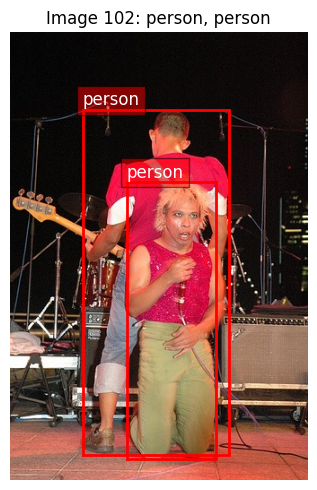
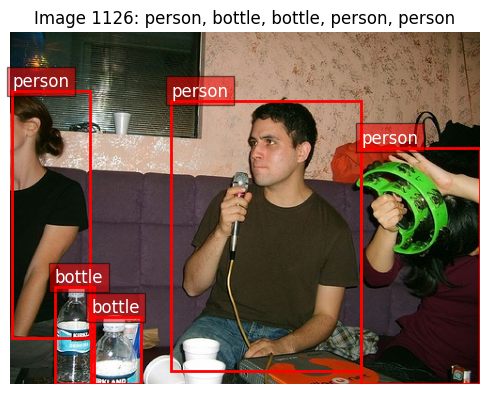
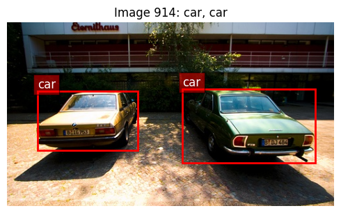
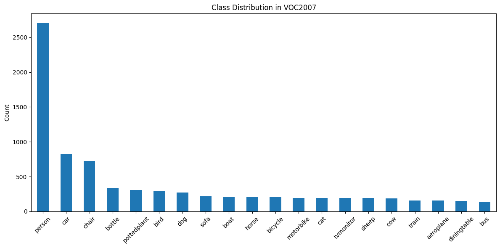
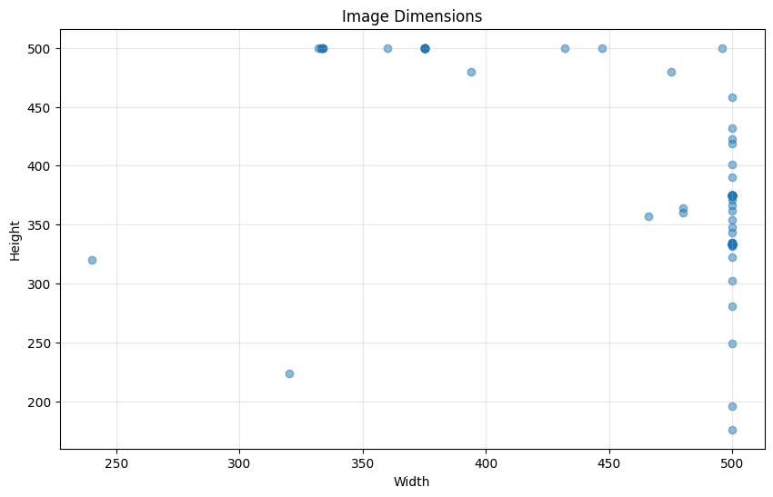
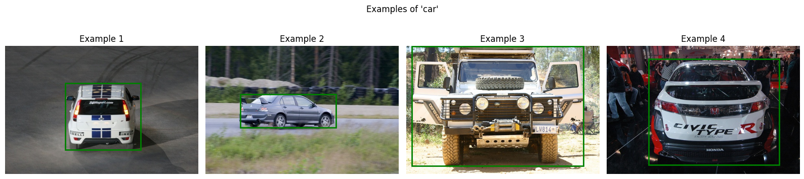
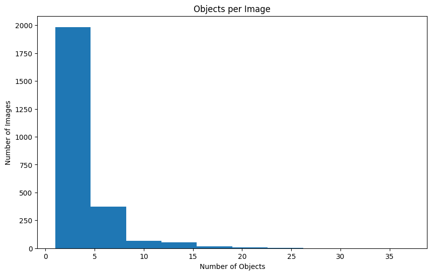
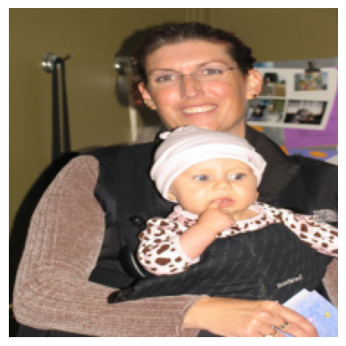
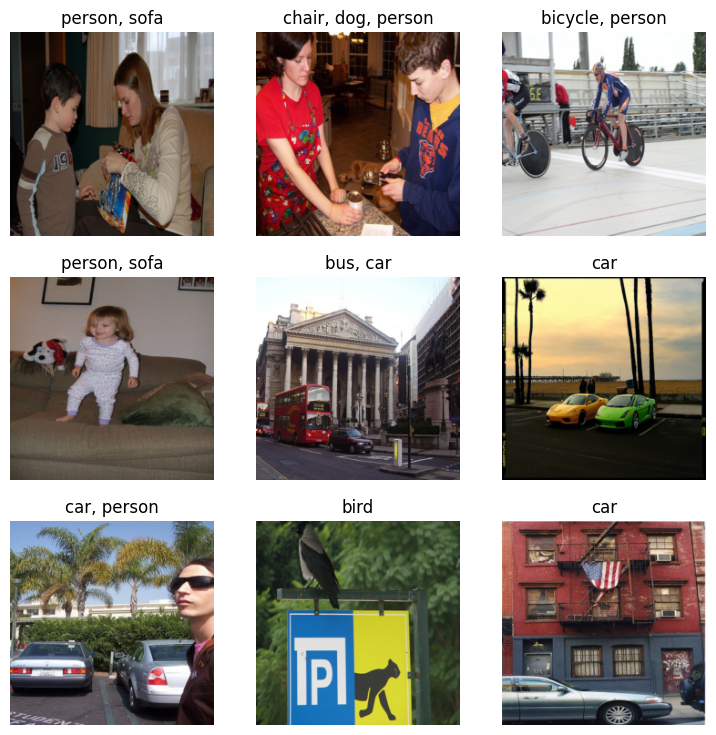
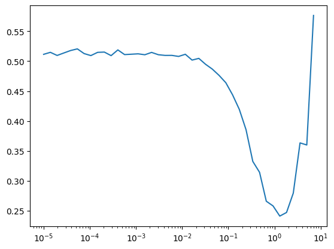

# Darknet Detection


<!-- WARNING: THIS FILE WAS AUTOGENERATED! DO NOT EDIT! -->

``` python
from minai import *

import torch
import torch.nn as nn
from datasets import load_dataset, load_dataset_builder
from torcheval.metrics import MulticlassAccuracy
import torchvision.transforms.v2.functional as TF
import torchvision.transforms as transforms
import torchvision.datasets as datasets
from torch.utils.data import DataLoader
from torchvision.transforms import v2

import fastcore.all as fc
import numpy as np
import matplotlib as mpl
import matplotlib.pyplot as plt
import pandas as pd
from fastcore.utils import L

from IPython.display import display, Image

from pilus_project.core import *
from pilus_project.darknet import *
```

## Data

### Data loading

``` python
set_seed(42)
```

Let’s take a look at VOC2007.

``` python
VOC_CLASSES = L(['aeroplane', 'bicycle', 'bird', 'boat', 'bottle', 'bus', 'car', 'cat', 
               'chair', 'cow', 'diningtable', 'dog', 'horse', 'motorbike', 'person',
               'pottedplant', 'sheep', 'sofa', 'train', 'tvmonitor'])
```

``` python
data_path = fc.Path.home()/'data/'
data_path.ls()
```

    (#4) [Path('/home/galopy/data/VOCdevkit'),Path('/home/galopy/data/tiny-imagenet-200.zip'),Path('/home/galopy/data/VOCtrainval_06-Nov-2007.tar'),Path('/home/galopy/data/tiny-imagenet-200')]

``` python
ds = datasets.VOCDetection(root=data_path, year='2007', image_set='train', download=False)
ds
```

    Dataset VOCDetection
        Number of datapoints: 2501
        Root location: /home/galopy/data

### Checking out data

What’s in the data?

``` python
ds[0]
```

    (<PIL.Image.Image image mode=RGB size=500x333>,
     {'annotation': {'folder': 'VOC2007',
       'filename': '000012.jpg',
       'source': {'database': 'The VOC2007 Database',
        'annotation': 'PASCAL VOC2007',
        'image': 'flickr',
        'flickrid': '207539885'},
       'owner': {'flickrid': 'KevBow', 'name': '?'},
       'size': {'width': '500', 'height': '333', 'depth': '3'},
       'segmented': '0',
       'object': [{'name': 'car',
         'pose': 'Rear',
         'truncated': '0',
         'difficult': '0',
         'bndbox': {'xmin': '156', 'ymin': '97', 'xmax': '351', 'ymax': '270'}}]}})

``` python
def show_voc_sample(ds, idx, figsize=(12,10)):
    img, target = ds[idx]
    objects = target['annotation']['object']
    img_array = np.array(img)
    fig, ax = plt.subplots(figsize=figsize)
    ax.imshow(img_array)
    width = int(target['annotation']['size']['width'])
    height = int(target['annotation']['size']['height'])
    for obj in objects:
        bbox = obj['bndbox']
        xmin = int(bbox['xmin'])
        ymin = int(bbox['ymin'])
        xmax = int(bbox['xmax'])
        ymax = int(bbox['ymax'])
        rect = plt.Rectangle((xmin, ymin), xmax-xmin, ymax-ymin, 
                            fill=False, edgecolor='red', linewidth=2)
        ax.add_patch(rect)
        ax.text(xmin, ymin-5, obj['name'], 
                bbox=dict(facecolor='red', alpha=0.5), fontsize=12, color='white')
    ax.set_title(f"Image {idx}: {', '.join([obj['name'] for obj in objects])}")
    ax.axis('off')
    plt.tight_layout()
    plt.show()
    print(f"Image size: {width}x{height}")
    print(f"Number of objects: {len(objects)}")
    for i, obj in enumerate(objects):
        print(f"Object {i+1}: {obj['name']}, Difficult: {obj['difficult']}, Truncated: {obj['truncated']}")
```

``` python
set_seed(42)
import random
random_indices = random.sample(range(len(ds)), 5)
for idx in random_indices:
    show_voc_sample(ds, idx, figsize=(5,5))
```


    Image size: 500x333
    Number of objects: 1
    Object 1: aeroplane, Difficult: 0, Truncated: 0



    Image size: 332x500
    Number of objects: 2
    Object 1: person, Difficult: 0, Truncated: 0
    Object 2: person, Difficult: 0, Truncated: 0



    Image size: 500x375
    Number of objects: 5
    Object 1: person, Difficult: 0, Truncated: 1
    Object 2: bottle, Difficult: 0, Truncated: 1
    Object 3: bottle, Difficult: 0, Truncated: 1
    Object 4: person, Difficult: 0, Truncated: 1
    Object 5: person, Difficult: 0, Truncated: 1


    Image size: 500x333
    Number of objects: 1
    Object 1: tvmonitor, Difficult: 0, Truncated: 0



    Image size: 500x281
    Number of objects: 2
    Object 1: car, Difficult: 0, Truncated: 0
    Object 2: car, Difficult: 0, Truncated: 0

``` python
def get_class_distribution(ds):
    "Get distribution of classes in the dataset"
    counts = {}
    for i in range(len(ds)):
        img, target = ds[i]
        for obj in target['annotation']['object']:
            cls = obj['name']
            counts[cls] = counts.get(cls, 0) + 1
    return pd.Series(counts).sort_values(ascending=False)
```

``` python
class_dist = get_class_distribution(ds)
plt.figure(figsize=(12, 6))
class_dist.plot(kind='bar')
plt.title('Class Distribution in VOC2007')
plt.ylabel('Count')
plt.xticks(rotation=45)
plt.tight_layout()
```



``` python
def get_image_sizes(ds, n=100):
    "Get distribution of image sizes in the dataset"
    sizes = []
    for i in range(min(n, len(ds))):
        img, _ = ds[i]
        sizes.append(img.size)
    return pd.DataFrame(sizes, columns=['width', 'height'])
```

``` python
sizes = get_image_sizes(ds)
plt.figure(figsize=(10, 6))
plt.scatter(sizes['width'], sizes['height'], alpha=0.5)
plt.title('Image Dimensions')
plt.xlabel('Width')
plt.ylabel('Height')
plt.grid(True, alpha=0.3)
```



``` python
def show_class_examples(ds, class_name, n=4):
    "Show examples of a specific class"
    examples = []
    for i in range(len(ds)):
        img, target = ds[i]
        if any(obj['name'] == class_name for obj in target['annotation']['object']):
            examples.append((img, target))
            if len(examples) >= n: break
    
    fig, axes = subplots(1, n, figsize=(n*4, 4))
    for i, (img, target) in enumerate(examples):
        axes[i].imshow(img)
        axes[i].set_title(f"Example {i+1}")
        axes[i].axis('off')
        
        for obj in target['annotation']['object']:
            if obj['name'] == class_name:
                bbox = obj['bndbox']
                x1, y1 = int(bbox['xmin']), int(bbox['ymin'])
                x2, y2 = int(bbox['xmax']), int(bbox['ymax'])
                rect = plt.Rectangle((x1, y1), x2-x1, y2-y1, 
                                   fill=False, edgecolor='green', linewidth=2)
                axes[i].add_patch(rect)
    
    plt.suptitle(f"Examples of '{class_name}'")
    plt.tight_layout()
    return fig
```

``` python
show_class_examples(ds, 'car');
```



``` python
objects_per_image = [len(ds[i][1]['annotation']['object']) for i in range(len(ds))]
plt.figure(figsize=(10, 6))
plt.hist(objects_per_image, bins=10)
plt.title('Objects per Image')
plt.xlabel('Number of Objects')
plt.ylabel('Number of Images')
```

    Text(0, 0.5, 'Number of Images')



``` python
def calculate_dataset_stats(dataloader, max_images=None):
    """Calculate mean and std of a dataset using a dataloader.
    
    Args:
        dataloader: DataLoader instance
        max_images: Maximum number of images to use (None = use all)
    
    Returns:
        mean and std per channel
    """
    # Create running sums
    channel_sum = torch.zeros(3)
    channel_sum_squared = torch.zeros(3)
    num_pixels = 0
    
    # Use tqdm for progress bar
    from tqdm.auto import tqdm
    
    for i, (images, _) in enumerate(tqdm(dataloader)):
        if max_images is not None and i*dataloader.batch_size >= max_images:
            break
        
        # Make sure images are in the right format
        if not isinstance(images, torch.Tensor):
            continue
            
        # Reshape: [B, C, H, W] -> [B, C, H*W]
        b, c, h, w = images.shape
        images = images.reshape(b, c, -1)
        
        # Update sums
        channel_sum += images.sum(dim=[0, 2])
        channel_sum_squared += (images**2).sum(dim=[0, 2])
        num_pixels += b * h * w
    
    # Calculate mean and std
    mean = channel_sum / num_pixels
    std = torch.sqrt((channel_sum_squared / num_pixels) - (mean**2))
    
    return mean, std

# Create a simple dataloader without normalization for calculation
def get_stats_dataloader(data_path, bs=32, year='2007'):
    """Create a dataloader for calculating dataset statistics"""
    # Basic transforms without normalization
    basic_tfms = v2.Compose([
        v2.Resize(256),
        v2.CenterCrop(224),
        v2.ToImage(),
        v2.ToDtype(torch.float32, scale=True)  # Scales to [0, 1]
    ])
    
    # Create dataset with basic transforms
    ds = datasets.VOCDetection(
        root=data_path, 
        year=year, 
        image_set='train', 
        download=False,
        transform=basic_tfms
    )
    
    # Create a dataloader with a simple collate function that only returns images
    def simple_collate(batch): return torch.stack([item[0] for item in batch]), None
    
    return DataLoader(ds, batch_size=bs, shuffle=False, 
                     collate_fn=simple_collate, num_workers=4)
```

``` python
stats_dl = get_stats_dataloader(data_path, bs=32)

mean, std = calculate_dataset_stats(stats_dl, max_images=2500)

print(f"Dataset mean: {mean.tolist()}")
print(f"Dataset std: {std.tolist()}")
```

      0%|          | 0/79 [00:00<?, ?it/s]

    Dataset mean: [0.45178133249282837, 0.4230543076992035, 0.39004892110824585]
    Dataset std: [0.26676368713378906, 0.261764258146286, 0.2731017470359802]

### Dataset

We create pytorch dataset.

``` python
from torch.utils.data import default_collate
from operator import attrgetter, itemgetter
```

Pytorch has options to add transforms to its dataset, so this is like
`minai`’s `TfmDataset`.

``` python
def create_voc_datasets(data_path, train_tfms=None, valid_tfms=None, year='2007'):
    "Create training and validation datasets for VOC"
    if train_tfms is None:
        train_tfms = v2.Compose([
            v2.RandomResizedCrop(224),
            v2.RandomHorizontalFlip(),
            v2.ToImage(),
            v2.ToDtype(torch.float32, scale=True),
            v2.Normalize(mean=[0.485, 0.456, 0.406], std=[0.229, 0.224, 0.225])
        ])
    if valid_tfms is None:
        valid_tfms = v2.Compose([
            v2.Resize(256),
            v2.CenterCrop(224),
            v2.ToImage(),
            v2.ToDtype(torch.float32, scale=True),
            v2.Normalize(mean=[0.485, 0.456, 0.406], std=[0.229, 0.224, 0.225])
        ])
    train_ds = datasets.VOCDetection(root=data_path, year=year, image_set='train', download=False,
                                    transform=train_tfms)
    valid_ds = datasets.VOCDetection(root=data_path, year=year, image_set='val', download=False,
                                   transform=valid_tfms)
    return train_ds, valid_ds
```

``` python
trn_ds, val_ds = create_voc_datasets(data_path)
trn_ds
```

    Dataset VOCDetection
        Number of datapoints: 2501
        Root location: /home/galopy/data
        StandardTransform
    Transform: Compose(
                     RandomResizedCrop(size=(224, 224), scale=(0.08, 1.0), ratio=(0.75, 1.3333333333333333), interpolation=InterpolationMode.BILINEAR, antialias=True)
                     RandomHorizontalFlip(p=0.5)
                     ToImage()
                     ToDtype(scale=True)
                     Normalize(mean=[0.485, 0.456, 0.406], std=[0.229, 0.224, 0.225], inplace=False)
               )

The target has many more information than we need. We only need
`annotation.object`’s names for classification purposes.

``` python
trn_ds[0]
```

    (Image([[[-0.9192, -0.9534, -0.9020,  ..., -1.0048, -0.9705, -1.0048],
             [-0.9192, -0.9363, -0.8849,  ..., -1.0048, -0.9877, -0.9705],
             [-0.9192, -0.9192, -0.9192,  ..., -0.9020, -0.9363, -0.9192],
             ...,
             [-0.8849, -0.8164, -0.8335,  ..., -0.6623, -0.6794, -0.6794],
             [-0.9020, -0.7993, -0.8335,  ..., -0.6794, -0.7137, -0.6452],
             [-0.8507, -0.8507, -0.8164,  ..., -0.6452, -0.6623, -0.6109]],
     
            [[-0.8102, -0.8452, -0.7927,  ..., -0.8803, -0.8452, -0.8803],
             [-0.8102, -0.8277, -0.7752,  ..., -0.8803, -0.8627, -0.8452],
             [-0.8102, -0.8102, -0.8102,  ..., -0.7752, -0.8102, -0.7927],
             ...,
             [-0.7402, -0.6702, -0.6877,  ..., -0.5476, -0.5651, -0.5651],
             [-0.7577, -0.6527, -0.6877,  ..., -0.5651, -0.6001, -0.5301],
             [-0.7052, -0.7052, -0.6702,  ..., -0.5301, -0.5476, -0.4951]],
     
            [[-0.5495, -0.5844, -0.5321,  ..., -0.6193, -0.5844, -0.6193],
             [-0.5495, -0.5670, -0.5147,  ..., -0.6193, -0.6018, -0.5844],
             [-0.5495, -0.5495, -0.5495,  ..., -0.5147, -0.5495, -0.5321],
             ...,
             [-0.5321, -0.4624, -0.4798,  ..., -0.3230, -0.3404, -0.3404],
             [-0.5495, -0.4450, -0.4798,  ..., -0.3404, -0.3753, -0.3055],
             [-0.4973, -0.4973, -0.4624,  ..., -0.3055, -0.3230, -0.2707]]], ),
     {'annotation': {'folder': 'VOC2007',
       'filename': '000012.jpg',
       'source': {'database': 'The VOC2007 Database',
        'annotation': 'PASCAL VOC2007',
        'image': 'flickr',
        'flickrid': '207539885'},
       'owner': {'flickrid': 'KevBow', 'name': '?'},
       'size': {'width': '500', 'height': '333', 'depth': '3'},
       'segmented': '0',
       'object': [{'name': 'car',
         'pose': 'Rear',
         'truncated': '0',
         'difficult': '0',
         'bndbox': {'xmin': '156', 'ymin': '97', 'xmax': '351', 'ymax': '270'}}]}})

With `voc_extract`, we can get any field we want from the target.

``` python
def voc_extract(field='name'):
    """Create a function that extracts a specific field from VOC annotations"""
    def _extract(targ):
        return L(fc.nested_attr(targ, 'annotation.object')).itemgot(field)
    return _extract
```

Object name:

``` python
ds = datasets.VOCDetection(
    root=data_path, year="2007", image_set='train', download=False, 
    target_transform=voc_extract())
ds[0]
```

    (<PIL.Image.Image image mode=RGB size=500x333>, (#1) ['car'])

Bound box:

``` python
ds = datasets.VOCDetection(
    root=data_path, year="2007", image_set='train', download=False, 
    target_transform=voc_extract(field='bndbox'))
ds[0]
```

    (<PIL.Image.Image image mode=RGB size=500x333>,
     (#1) [{'xmin': '156', 'ymin': '97', 'xmax': '351', 'ymax': '270'}])

For training, we actually need one-hot encoded vector because the
targets are multi-labels.

``` python
VOC_CLASSES
```

    (#20) ['aeroplane','bicycle','bird','boat','bottle','bus','car','cat','chair','cow','diningtable','dog','horse','motorbike','person','pottedplant','sheep','sofa','train','tvmonitor']

``` python
names = ['car', 'dog']
names
```

    ['car', 'dog']

``` python
lbls = torch.zeros(len(VOC_CLASSES))
lbls
```

    tensor([0., 0., 0., 0., 0., 0., 0., 0., 0., 0., 0., 0., 0., 0., 0., 0., 0., 0., 0., 0.])

`torch.scatter` is a good way to do this:

``` python
onehot = lbls.scatter(0, torch.tensor([1,3,5]), 1)
onehot
```

    tensor([0., 1., 0., 1., 0., 1., 0., 0., 0., 0., 0., 0., 0., 0., 0., 0., 0., 0.,
            0., 0.])

``` python
from torch import tensor
```

``` python
def onehot_tfm(targ, clss=VOC_CLASSES):
    get = voc_extract(field='name')
    names = get(targ)
    one_hot = torch.zeros(len(clss))
    idxs = tensor([clss.index(n) for n in names])
    one_hot.scatter_(0, idxs, 1)
    return one_hot
```

``` python
ds = datasets.VOCDetection(
    root=data_path, year="2007", image_set='train', download=False, 
    target_transform=onehot_tfm)
ds[0]
```

    (<PIL.Image.Image image mode=RGB size=500x333>,
     tensor([0., 0., 0., 0., 0., 0., 1., 0., 0., 0., 0., 0., 0., 0., 0., 0., 0., 0.,
             0., 0.]))

How about going back to label from one hot encoding? We use `np.where`.
Why use numpy instead of pytorch? Because `rvs_onehot_tfm` is used for
displaying images. We will never use this during training.

``` python
onehot
```

    tensor([0., 1., 0., 1., 0., 1., 0., 0., 0., 0., 0., 0., 0., 0., 0., 0., 0., 0.,
            0., 0.])

``` python
np.where(onehot == 1)[0]
```

    array([1, 3, 5])

``` python
VOC_CLASSES[np.where(onehot == 1)[0]]
```

    (#3) ['bicycle','boat','bus']

``` python
def _rvs_onehot_tfm(onehot): return VOC_CLASSES[np.where(onehot == 1)[0]]
```

``` python
_rvs_onehot_tfm(onehot)
```

    (#3) ['bicycle','boat','bus']

### DataLoader

We got the dataset, so we are ready to create a dataloader. There are
couple transformations we want to apply to images. We have images so
far, but we need pytorch tensors with the same image sizes. We also
normalize images.

``` python
to_tensor = v2.Compose([
    v2.Resize((224, 224)),
    v2.ToImage(),
    v2.ToDtype(torch.float32, scale=True),
    v2.Normalize(mean=[0.485, 0.456, 0.406], std=[0.229, 0.224, 0.225])
])
```

``` python
trn_ds = datasets.VOCDetection(
    root=data_path, year="2007", image_set='train', download=False, 
    transform=to_tensor, target_transform=onehot_tfm)
val_ds = datasets.VOCDetection(
    root=data_path, year="2007", image_set='val', download=False, 
    transform=to_tensor, target_transform=onehot_tfm)
```

``` python
bs = 64
trn_dl, val_dl = get_dls(trn_ds, val_ds, bs=bs)
```

``` python
xb,yb = next(iter(trn_dl))
xb.shape,yb[:10]
```

    (torch.Size([64, 3, 224, 224]),
     tensor([[0., 0., 0., 0., 0., 0., 0., 0., 0., 0., 0., 0., 0., 0., 1., 0., 0., 0.,
              0., 0.],
             [0., 0., 0., 0., 0., 0., 0., 0., 1., 0., 0., 0., 0., 0., 1., 0., 0., 0.,
              0., 0.],
             [0., 0., 1., 0., 0., 0., 0., 0., 0., 0., 0., 0., 0., 0., 0., 0., 0., 0.,
              0., 0.],
             [0., 0., 0., 0., 0., 0., 0., 0., 0., 0., 0., 1., 0., 0., 1., 0., 0., 1.,
              0., 0.],
             [0., 0., 0., 0., 0., 0., 0., 0., 1., 0., 1., 0., 0., 0., 0., 0., 0., 0.,
              0., 0.],
             [0., 0., 0., 0., 0., 0., 1., 0., 0., 0., 0., 0., 0., 0., 1., 0., 0., 0.,
              0., 0.],
             [0., 0., 0., 0., 0., 0., 0., 0., 0., 0., 0., 0., 0., 0., 0., 0., 0., 0.,
              1., 0.],
             [0., 0., 0., 0., 1., 0., 0., 0., 0., 0., 0., 0., 0., 0., 1., 0., 0., 0.,
              0., 0.],
             [0., 0., 0., 0., 0., 0., 0., 0., 0., 0., 0., 0., 0., 0., 0., 0., 1., 0.,
              0., 0.],
             [0., 0., 0., 0., 0., 0., 0., 1., 0., 0., 0., 0., 0., 0., 0., 0., 0., 0.,
              0., 1.]]))

Denormalize image before display

``` python
from torch import tensor

xmean,xstd = (tensor([0.485, 0.456, 0.406]), tensor([0.229, 0.224, 0.225]))
```

``` python
def denorm(x): return (x*xstd[:,None,None]+xmean[:,None,None]).clip(0,1)
```

``` python
show_image(denorm(xb[0]));
```



``` python
def get_classification_model(num_classes=len(VOC_CLASSES)):
    "Create a multi-label classification model based on darknet19"
    backbone = get_darknet19()
    model = nn.Sequential(
        backbone,
        nn.AdaptiveAvgPool2d(1),
        nn.Flatten(),
        nn.Linear(1024, 512),
        nn.ReLU(inplace=True),
        nn.Dropout(0.5),
        nn.Linear(512, num_classes)
    )
    return model
```

``` python
nn.BCEWithLogitsLoss?
```

``` python
model = get_classification_model()
dls = DataLoaders(trn_dl, val_dl)
learn = TrainLearner(model, dls, nn.BCEWithLogitsLoss(), lr=1e-3, 
                   cbs=[TrainCB(), DeviceCB(), ProgressCB(), MetricsCB()])
learn.summary()
```

<style>
    /* Turns off some styling */
    progress {
        /* gets rid of default border in Firefox and Opera. */
        border: none;
        /* Needs to be in here for Safari polyfill so background images work as expected. */
        background-size: auto;
    }
    progress:not([value]), progress:not([value])::-webkit-progress-bar {
        background: repeating-linear-gradient(45deg, #7e7e7e, #7e7e7e 10px, #5c5c5c 10px, #5c5c5c 20px);
    }
    .progress-bar-interrupted, .progress-bar-interrupted::-webkit-progress-bar {
        background: #F44336;
    }
</style>

    <div>
      <progress value='0' class='' max='1' style='width:300px; height:20px; vertical-align: middle;'></progress>
      0.00% [0/1 00:00&lt;?]
    </div>
    &#10;
&#10;    <div>
      <progress value='0' class='' max='40' style='width:300px; height:20px; vertical-align: middle;'></progress>
      0.00% [0/40 00:00&lt;?]
    </div>
    &#10;

    Tot params: 20359636; MFLOPS: 970.9

<table>
<thead>
<tr>
<th>Module</th>
<th>Input</th>
<th>Output</th>
<th>Num params</th>
<th>MFLOPS</th>
</tr>
</thead>
<tbody>
<tr>
<td>Sequential</td>
<td>(64, 3, 224, 224)</td>
<td>(64, 1024, 7, 7)</td>
<td>19824576</td>
<td>970.4</td>
</tr>
<tr>
<td>AdaptiveAvgPool2d</td>
<td>(64, 1024, 7, 7)</td>
<td>(64, 1024, 1, 1)</td>
<td>0</td>
<td>0.0</td>
</tr>
<tr>
<td>Flatten</td>
<td>(64, 1024, 1, 1)</td>
<td>(64, 1024)</td>
<td>0</td>
<td>0.0</td>
</tr>
<tr>
<td>Linear</td>
<td>(64, 1024)</td>
<td>(64, 512)</td>
<td>524800</td>
<td>0.5</td>
</tr>
<tr>
<td>ReLU</td>
<td>(64, 512)</td>
<td>(64, 512)</td>
<td>0</td>
<td>0.0</td>
</tr>
<tr>
<td>Dropout</td>
<td>(64, 512)</td>
<td>(64, 512)</td>
<td>0</td>
<td>0.0</td>
</tr>
<tr>
<td>Linear</td>
<td>(64, 512)</td>
<td>(64, 20)</td>
<td>10260</td>
<td>0.0</td>
</tr>
</tbody>
</table>

``` python
@fc.patch
@fc.delegates(show_images)
def show_image_batch(self:Learner, max_n=9, cbs=None, tfm_x=None, tfm_y=None, **kwargs):
    self.fit(1, cbs=[SingleBatchCB()]+fc.L(cbs))
    xb,yb = to_cpu(self.batch)
    feat = fc.nested_attr(self.dls, 'train.dataset.features')
    if feat is None: titles = np.array(to_cpu(yb))     # when fitting, yb is in GPU
    else:
        names = feat['label'].names
        titles = [names[i] for i in yb]
    xb = tfm_x(xb[:max_n]) if tfm_x else xb[:max_n]
    titles = tfm_y(titles[:max_n]) if tfm_y else titles[:max_n]
    show_images(xb, titles=titles, **kwargs)
```

We also have to reverse the transform for the targets. It is in onehot
encoding, but we want class names.

``` python
yb
```

    tensor([[0., 0., 0.,  ..., 0., 0., 0.],
            [0., 0., 0.,  ..., 0., 0., 0.],
            [0., 0., 1.,  ..., 0., 0., 0.],
            ...,
            [0., 0., 1.,  ..., 0., 0., 0.],
            [0., 0., 0.,  ..., 1., 0., 0.],
            [0., 0., 0.,  ..., 0., 0., 0.]])

``` python
[', '.join(_rvs_onehot_tfm(y)) for y in np.array(yb)][:4]
```

    ['person', 'chair, person', 'bird', 'dog, person, sofa']

``` python
def rvs_onehot_tfm(yb): return [', '.join(_rvs_onehot_tfm(y)) for y in np.array(yb)]
```

``` python
learn.show_image_batch(tfm_x=denorm, tfm_y=rvs_onehot_tfm)
```

<style>
    /* Turns off some styling */
    progress {
        /* gets rid of default border in Firefox and Opera. */
        border: none;
        /* Needs to be in here for Safari polyfill so background images work as expected. */
        background-size: auto;
    }
    progress:not([value]), progress:not([value])::-webkit-progress-bar {
        background: repeating-linear-gradient(45deg, #7e7e7e, #7e7e7e 10px, #5c5c5c 10px, #5c5c5c 20px);
    }
    .progress-bar-interrupted, .progress-bar-interrupted::-webkit-progress-bar {
        background: #F44336;
    }
</style>

    <div>
      <progress value='0' class='' max='1' style='width:300px; height:20px; vertical-align: middle;'></progress>
      0.00% [0/1 00:00&lt;?]
    </div>
    &#10;
&#10;    <div>
      <progress value='0' class='' max='40' style='width:300px; height:20px; vertical-align: middle;'></progress>
      0.00% [0/40 00:00&lt;?]
    </div>
    &#10;



``` python
learn.lr_find(gamma=1.4, max_mult=2)
```

<style>
    /* Turns off some styling */
    progress {
        /* gets rid of default border in Firefox and Opera. */
        border: none;
        /* Needs to be in here for Safari polyfill so background images work as expected. */
        background-size: auto;
    }
    progress:not([value]), progress:not([value])::-webkit-progress-bar {
        background: repeating-linear-gradient(45deg, #7e7e7e, #7e7e7e 10px, #5c5c5c 10px, #5c5c5c 20px);
    }
    .progress-bar-interrupted, .progress-bar-interrupted::-webkit-progress-bar {
        background: #F44336;
    }
</style>

    <div>
      <progress value='1' class='' max='10' style='width:300px; height:20px; vertical-align: middle;'></progress>
      10.00% [1/10 00:13&lt;02:04]
    </div>
    &#10;

<table class="dataframe" data-quarto-postprocess="true" data-border="1">
<thead>
<tr style="text-align: left;">
<th data-quarto-table-cell-role="th">loss</th>
<th data-quarto-table-cell-role="th">epoch</th>
<th data-quarto-table-cell-role="th">train</th>
<th data-quarto-table-cell-role="th">time</th>
</tr>
</thead>
<tbody>
<tr>
<td>0.455</td>
<td>0</td>
<td>train</td>
<td>00:13</td>
</tr>
</tbody>
</table>

<p>
&#10;    <div>
      <progress value='0' class='' max='40' style='width:300px; height:20px; vertical-align: middle;'></progress>
      0.00% [0/40 00:00&lt;?]
    </div>
    &#10;



## Training Classification

``` python
import torch.nn.functional as F
```

``` python
model = get_classification_model()
learn = TrainLearner(model, dls, multi_label_loss, lr=1e-1, 
                   cbs=[TrainCB(), DeviceCB(), ProgressCB(), MetricsCB()])
```

``` python
learn.summary()
```

<style>
    /* Turns off some styling */
    progress {
        /* gets rid of default border in Firefox and Opera. */
        border: none;
        /* Needs to be in here for Safari polyfill so background images work as expected. */
        background-size: auto;
    }
    progress:not([value]), progress:not([value])::-webkit-progress-bar {
        background: repeating-linear-gradient(45deg, #7e7e7e, #7e7e7e 10px, #5c5c5c 10px, #5c5c5c 20px);
    }
    .progress-bar-interrupted, .progress-bar-interrupted::-webkit-progress-bar {
        background: #F44336;
    }
</style>

    <div>
      <progress value='0' class='' max='1' style='width:300px; height:20px; vertical-align: middle;'></progress>
      0.00% [0/1 00:00&lt;?]
    </div>
    &#10;
&#10;    <div>
      <progress value='0' class='' max='40' style='width:300px; height:20px; vertical-align: middle;'></progress>
      0.00% [0/40 00:00&lt;?]
    </div>
    &#10;

    Tot params: 20359636; MFLOPS: 970.9

<table>
<thead>
<tr>
<th>Module</th>
<th>Input</th>
<th>Output</th>
<th>Num params</th>
<th>MFLOPS</th>
</tr>
</thead>
<tbody>
<tr>
<td>Sequential</td>
<td>(64, 3, 224, 224)</td>
<td>(64, 1024, 7, 7)</td>
<td>19824576</td>
<td>970.4</td>
</tr>
<tr>
<td>AdaptiveAvgPool2d</td>
<td>(64, 1024, 7, 7)</td>
<td>(64, 1024, 1, 1)</td>
<td>0</td>
<td>0.0</td>
</tr>
<tr>
<td>Flatten</td>
<td>(64, 1024, 1, 1)</td>
<td>(64, 1024)</td>
<td>0</td>
<td>0.0</td>
</tr>
<tr>
<td>Linear</td>
<td>(64, 1024)</td>
<td>(64, 512)</td>
<td>524800</td>
<td>0.5</td>
</tr>
<tr>
<td>ReLU</td>
<td>(64, 512)</td>
<td>(64, 512)</td>
<td>0</td>
<td>0.0</td>
</tr>
<tr>
<td>Dropout</td>
<td>(64, 512)</td>
<td>(64, 512)</td>
<td>0</td>
<td>0.0</td>
</tr>
<tr>
<td>Linear</td>
<td>(64, 512)</td>
<td>(64, 20)</td>
<td>10260</td>
<td>0.0</td>
</tr>
</tbody>
</table>

``` python
model = get_classification_model()
learn = TrainLearner(model, dls, multi_label_loss, lr=1e-1, 
                   cbs=[DeviceCB(), ProgressCB(), MetricsCB()])
learn.fit(3)
```

<style>
    /* Turns off some styling */
    progress {
        /* gets rid of default border in Firefox and Opera. */
        border: none;
        /* Needs to be in here for Safari polyfill so background images work as expected. */
        background-size: auto;
    }
    progress:not([value]), progress:not([value])::-webkit-progress-bar {
        background: repeating-linear-gradient(45deg, #7e7e7e, #7e7e7e 10px, #5c5c5c 10px, #5c5c5c 20px);
    }
    .progress-bar-interrupted, .progress-bar-interrupted::-webkit-progress-bar {
        background: #F44336;
    }
</style>

<table class="dataframe" data-quarto-postprocess="true" data-border="1">
<thead>
<tr style="text-align: left;">
<th data-quarto-table-cell-role="th">loss</th>
<th data-quarto-table-cell-role="th">epoch</th>
<th data-quarto-table-cell-role="th">train</th>
<th data-quarto-table-cell-role="th">time</th>
</tr>
</thead>
<tbody>
<tr>
<td>0.371</td>
<td>0</td>
<td>train</td>
<td>00:13</td>
</tr>
<tr>
<td>0.261</td>
<td>0</td>
<td>eval</td>
<td>00:54</td>
</tr>
<tr>
<td>0.248</td>
<td>1</td>
<td>train</td>
<td>00:13</td>
</tr>
<tr>
<td>0.237</td>
<td>1</td>
<td>eval</td>
<td>00:11</td>
</tr>
<tr>
<td>0.241</td>
<td>2</td>
<td>train</td>
<td>00:13</td>
</tr>
<tr>
<td>0.237</td>
<td>2</td>
<td>eval</td>
<td>00:11</td>
</tr>
</tbody>
</table>

``` python
class TopKAccuracy(Callback):
    def __init__(self, k_values=[1, 5], class_names=VOC_CLASSES):
        """
        Implements Top-K accuracy for multi-label classification
        
        Args:
            k_values: List of k values to compute (e.g., [1, 5] for top-1 and top-5)
            class_names: List of class names
        """
        self.k_values = sorted(k_values)
        self.max_k = max(k_values)
        self.class_names = class_names
        
    def before_fit(self, learn):
        self.learn = learn
        
    def before_epoch(self, learn):
        # Initialize counters for each k
        self.correct = {k: 0 for k in self.k_values}
        self.total = 0
        
    def after_batch(self, learn):
        # Get predictions and targets
        logits = to_cpu(learn.preds)
        targets = to_cpu(learn.batch[1])
        batch_size = targets.size(0)
        
        # For each image in the batch
        for i in range(batch_size):
            # Get ground truth classes for this image
            true_classes = torch.where(targets[i] == 1)[0]
            if len(true_classes) == 0:
                continue  # Skip images with no labels
                
            # Get top-k predicted classes
            _, top_indices = torch.topk(logits[i], min(self.max_k, len(self.class_names)))
            
            # Check if any true class is in top-k predictions
            for k in self.k_values:
                top_k_indices = top_indices[:k]
                # For multi-label: if any true class is in top-k predictions, count as correct
                if any(cls in top_k_indices for cls in true_classes):
                    self.correct[k] += 1
            
            self.total += 1
        
    def after_epoch(self, learn):
        phase = 'train' if learn.training else 'valid'
        for k in self.k_values:
            accuracy = self.correct[k] / self.total if self.total > 0 else 0
            print(f"{phase} top-{k} accuracy: {accuracy:.4f}")
```

``` python
# Alternative implementation that considers a prediction correct only if 
# all true classes are in the top-k predictions
class StrictTopKAccuracy(Callback):
    def __init__(self, k_values=[1, 5], class_names=VOC_CLASSES):
        self.k_values = sorted(k_values)
        self.max_k = max(k_values)
        self.class_names = class_names
        
    def before_fit(self, learn):
        self.learn = learn
        
    def before_epoch(self, learn):
        self.correct = {k: 0 for k in self.k_values}
        self.total = 0
        
    def after_batch(self, learn):
        logits = to_cpu(learn.preds)
        targets = to_cpu(learn.batch[1])
        batch_size = targets.size(0)
        
        for i in range(batch_size):
            true_classes = torch.where(targets[i] == 1)[0]
            if len(true_classes) == 0:
                continue
                
            _, top_indices = torch.topk(logits[i], min(self.max_k, len(self.class_names)))
            
            for k in self.k_values:
                if k < len(true_classes):
                    continue  # Can't fit all true classes in top-k if k < number of true classes
                    
                top_k_indices = set(top_indices[:k].tolist())
                true_classes_set = set(true_classes.tolist())
                
                # Strict version: all true classes must be in top-k predictions
                if true_classes_set.issubset(top_k_indices):
                    self.correct[k] += 1
            
            self.total += 1
        
    def after_epoch(self, learn):
        phase = 'train' if learn.training else 'valid'
        for k in self.k_values:
            accuracy = self.correct[k] / self.total if self.total > 0 else 0
            print(f"{phase} strict top-{k} accuracy: {accuracy:.4f}")
```

``` python
from torcheval.metrics import TopKMultilabelAccuracy
from torcheval.metrics import MultilabelAccuracy
```

``` python
model = get_classification_model()
learn = TrainLearner(model, dls, multi_label_loss, lr=1e-1, 
                   cbs=[DeviceCB(), ProgressCB(), MetricsCB(top5=TopKMultilabelAccuracy(k=5)), 
                        TopKAccuracy(k_values=[1, 5])])
```

``` python
learn.fit(3)
```

<style>
    /* Turns off some styling */
    progress {
        /* gets rid of default border in Firefox and Opera. */
        border: none;
        /* Needs to be in here for Safari polyfill so background images work as expected. */
        background-size: auto;
    }
    progress:not([value]), progress:not([value])::-webkit-progress-bar {
        background: repeating-linear-gradient(45deg, #7e7e7e, #7e7e7e 10px, #5c5c5c 10px, #5c5c5c 20px);
    }
    .progress-bar-interrupted, .progress-bar-interrupted::-webkit-progress-bar {
        background: #F44336;
    }
</style>

    <div>
      <progress value='2' class='' max='3' style='width:300px; height:20px; vertical-align: middle;'></progress>
      66.67% [2/3 00:49&lt;00:24]
    </div>
    &#10;

<table class="dataframe" data-quarto-postprocess="true" data-border="1">
<thead>
<tr style="text-align: left;">
<th data-quarto-table-cell-role="th">top5</th>
<th data-quarto-table-cell-role="th">loss</th>
<th data-quarto-table-cell-role="th">epoch</th>
<th data-quarto-table-cell-role="th">train</th>
<th data-quarto-table-cell-role="th">time</th>
</tr>
</thead>
<tbody>
<tr>
<td>0.000</td>
<td>0.374</td>
<td>0</td>
<td>train</td>
<td>00:13</td>
</tr>
<tr>
<td>0.000</td>
<td>0.265</td>
<td>0</td>
<td>eval</td>
<td>00:11</td>
</tr>
<tr>
<td>0.000</td>
<td>0.247</td>
<td>1</td>
<td>train</td>
<td>00:13</td>
</tr>
<tr>
<td>0.000</td>
<td>0.238</td>
<td>1</td>
<td>eval</td>
<td>00:11</td>
</tr>
<tr>
<td>0.000</td>
<td>0.240</td>
<td>2</td>
<td>train</td>
<td>00:13</td>
</tr>
</tbody>
</table>

<p>
&#10;    <div>
      <progress value='10' class='' max='20' style='width:300px; height:20px; vertical-align: middle;'></progress>
      50.00% [10/20 00:05&lt;00:05 0.240]
    </div>
    &#10;

    train top-1 accuracy: 0.3631
    train top-5 accuracy: 0.6234
    valid top-1 accuracy: 0.4084
    valid top-5 accuracy: 0.6657
    train top-1 accuracy: 0.4266
    train top-5 accuracy: 0.6745
    valid top-1 accuracy: 0.4084
    valid top-5 accuracy: 0.7032
    train top-1 accuracy: 0.4314
    train top-5 accuracy: 0.7245

    KeyboardInterrupt: 
    ---------------------------------------------------------------------------
    KeyboardInterrupt                         Traceback (most recent call last)
    Cell In[75], line 1
    ----> 1 learn.fit(3)

    File ~/git/minai/minai/core.py:260, in Learner.fit(self, n_epochs, train, valid, cbs, lr)
        258     if lr is None: lr = self.lr
        259     if self.opt_func: self.opt = self.opt_func(self.model.parameters(), lr)
    --> 260     self._fit(train, valid)
        261 finally:
        262     for cb in cbs: self.cbs.remove(cb)

    File ~/git/minai/minai/core.py:194, in with_cbs.__call__.<locals>._f(o, *args, **kwargs)
        192 try:
        193     o.callback(f'before_{self.nm}')
    --> 194     f(o, *args, **kwargs)
        195     o.callback(f'after_{self.nm}')
        196 except globals()[f'Cancel{self.nm.title()}Exception']: pass

    File ~/git/minai/minai/core.py:250, in Learner._fit(self, train, valid)
        248 if train: self.one_epoch(True)
        249 if valid:
    --> 250     with torch.inference_mode(): self.one_epoch(False)

    File ~/git/minai/minai/core.py:241, in Learner.one_epoch(self, training)
        239 self.model.train(training)
        240 self.dl = self.train_dl if training else self.dls.valid
    --> 241 self._one_epoch()

    File ~/git/minai/minai/core.py:194, in with_cbs.__call__.<locals>._f(o, *args, **kwargs)
        192 try:
        193     o.callback(f'before_{self.nm}')
    --> 194     f(o, *args, **kwargs)
        195     o.callback(f'after_{self.nm}')
        196 except globals()[f'Cancel{self.nm.title()}Exception']: pass

    File ~/git/minai/minai/core.py:236, in Learner._one_epoch(self)
        234 @with_cbs('epoch')
        235 def _one_epoch(self):
    --> 236     for self.iter,self.batch in enumerate(self.dl): self._one_batch()

    File ~/miniforge3/lib/python3.10/site-packages/fastprogress/fastprogress.py:41, in ProgressBar.__iter__(self)
         39 if self.total != 0: self.update(0)
         40 try:
    ---> 41     for i,o in enumerate(self.gen):
         42         if self.total and i >= self.total: break
         43         yield o

    File ~/miniforge3/lib/python3.10/site-packages/torch/utils/data/dataloader.py:701, in _BaseDataLoaderIter.__next__(self)
        698 if self._sampler_iter is None:
        699     # TODO(https://github.com/pytorch/pytorch/issues/76750)
        700     self._reset()  # type: ignore[call-arg]
    --> 701 data = self._next_data()
        702 self._num_yielded += 1
        703 if (
        704     self._dataset_kind == _DatasetKind.Iterable
        705     and self._IterableDataset_len_called is not None
        706     and self._num_yielded > self._IterableDataset_len_called
        707 ):

    File ~/miniforge3/lib/python3.10/site-packages/torch/utils/data/dataloader.py:757, in _SingleProcessDataLoaderIter._next_data(self)
        755 def _next_data(self):
        756     index = self._next_index()  # may raise StopIteration
    --> 757     data = self._dataset_fetcher.fetch(index)  # may raise StopIteration
        758     if self._pin_memory:
        759         data = _utils.pin_memory.pin_memory(data, self._pin_memory_device)

    File ~/miniforge3/lib/python3.10/site-packages/torch/utils/data/_utils/fetch.py:52, in _MapDatasetFetcher.fetch(self, possibly_batched_index)
         50         data = self.dataset.__getitems__(possibly_batched_index)
         51     else:
    ---> 52         data = [self.dataset[idx] for idx in possibly_batched_index]
         53 else:
         54     data = self.dataset[possibly_batched_index]

    File ~/miniforge3/lib/python3.10/site-packages/torch/utils/data/_utils/fetch.py:52, in <listcomp>(.0)
         50         data = self.dataset.__getitems__(possibly_batched_index)
         51     else:
    ---> 52         data = [self.dataset[idx] for idx in possibly_batched_index]
         53 else:
         54     data = self.dataset[possibly_batched_index]

    File ~/miniforge3/lib/python3.10/site-packages/torchvision/datasets/voc.py:201, in VOCDetection.__getitem__(self, index)
        193 """
        194 Args:
        195     index (int): Index
       (...)
        198     tuple: (image, target) where target is a dictionary of the XML tree.
        199 """
        200 img = Image.open(self.images[index]).convert("RGB")
    --> 201 target = self.parse_voc_xml(ET_parse(self.annotations[index]).getroot())
        203 if self.transforms is not None:
        204     img, target = self.transforms(img, target)

    File ~/miniforge3/lib/python3.10/site-packages/defusedxml/common.py:100, in _generate_etree_functions.<locals>.parse(source, parser, forbid_dtd, forbid_entities, forbid_external)
         93 if parser is None:
         94     parser = DefusedXMLParser(
         95         target=_TreeBuilder(),
         96         forbid_dtd=forbid_dtd,
         97         forbid_entities=forbid_entities,
         98         forbid_external=forbid_external,
         99     )
    --> 100 return _parse(source, parser)

    File ~/miniforge3/lib/python3.10/xml/etree/ElementTree.py:1222, in parse(source, parser)
       1213 """Parse XML document into element tree.
       1214 
       1215 *source* is a filename or file object containing XML data,
       (...)
       1219 
       1220 """
       1221 tree = ElementTree()
    -> 1222 tree.parse(source, parser)
       1223 return tree

    File ~/miniforge3/lib/python3.10/xml/etree/ElementTree.py:586, in ElementTree.parse(self, source, parser)
        584     if not data:
        585         break
    --> 586     parser.feed(data)
        587 self._root = parser.close()
        588 return self._root

    File ~/miniforge3/lib/python3.10/xml/etree/ElementTree.py:1713, in XMLParser.feed(self, data)
       1711 """Feed encoded data to parser."""
       1712 try:
    -> 1713     self.parser.Parse(data, False)
       1714 except self._error as v:
       1715     self._raiseerror(v)

    File /home/conda/feedstock_root/build_artifacts/python-split_1687559129017/work/Modules/pyexpat.c:416, in StartElement()

    File ~/miniforge3/lib/python3.10/xml/etree/ElementTree.py:1641, in XMLParser._start(self, tag, attr_list)
       1638 def _end_ns(self, prefix):
       1639     return self.target.end_ns(prefix or '')
    -> 1641 def _start(self, tag, attr_list):
       1642     # Handler for expat's StartElementHandler. Since ordered_attributes
       1643     # is set, the attributes are reported as a list of alternating
       1644     # attribute name,value.
       1645     fixname = self._fixname
       1646     tag = fixname(tag)

    KeyboardInterrupt: 

``` python
model = get_classification_model()
learn = TrainLearner(model, dls, multi_label_loss, lr=1e-1, 
                   cbs=[DeviceCB(), ProgressCB(), 
                        MetricsCB(hamming=MultilabelAccuracy(criteria='hamming'), overlap=MultilabelAccuracy(criteria='overlap'), contain=MultilabelAccuracy(criteria='contain'), belong=MultilabelAccuracy(criteria='belong'),top1=MultilabelAccuracy(criteria='exact_match'), top5=TopKMultilabelAccuracy(criteria='contain', k=5), ), 
                        TopKAccuracy(k_values=[1, 5]), 
                        StrictTopKAccuracy(k_values=[1, 5])])
```

``` python
learn.fit(5)
```

<style>
    /* Turns off some styling */
    progress {
        /* gets rid of default border in Firefox and Opera. */
        border: none;
        /* Needs to be in here for Safari polyfill so background images work as expected. */
        background-size: auto;
    }
    progress:not([value]), progress:not([value])::-webkit-progress-bar {
        background: repeating-linear-gradient(45deg, #7e7e7e, #7e7e7e 10px, #5c5c5c 10px, #5c5c5c 20px);
    }
    .progress-bar-interrupted, .progress-bar-interrupted::-webkit-progress-bar {
        background: #F44336;
    }
</style>

<table class="dataframe" data-quarto-postprocess="true" data-border="1">
<thead>
<tr style="text-align: left;">
<th data-quarto-table-cell-role="th">hamming</th>
<th data-quarto-table-cell-role="th">overlap</th>
<th data-quarto-table-cell-role="th">contain</th>
<th data-quarto-table-cell-role="th">belong</th>
<th data-quarto-table-cell-role="th">top1</th>
<th data-quarto-table-cell-role="th">top5</th>
<th data-quarto-table-cell-role="th">loss</th>
<th data-quarto-table-cell-role="th">epoch</th>
<th data-quarto-table-cell-role="th">train</th>
<th data-quarto-table-cell-role="th">time</th>
</tr>
</thead>
<tbody>
<tr>
<td>0.920</td>
<td>0.002</td>
<td>0.001</td>
<td>0.998</td>
<td>0.001</td>
<td>0.293</td>
<td>0.368</td>
<td>0</td>
<td>train</td>
<td>00:13</td>
</tr>
<tr>
<td>0.922</td>
<td>0.000</td>
<td>0.000</td>
<td>1.000</td>
<td>0.000</td>
<td>0.345</td>
<td>0.263</td>
<td>0</td>
<td>eval</td>
<td>00:11</td>
</tr>
<tr>
<td>0.920</td>
<td>0.013</td>
<td>0.004</td>
<td>0.986</td>
<td>0.004</td>
<td>0.354</td>
<td>0.248</td>
<td>1</td>
<td>train</td>
<td>00:13</td>
</tr>
<tr>
<td>0.924</td>
<td>0.130</td>
<td>0.027</td>
<td>0.910</td>
<td>0.027</td>
<td>0.385</td>
<td>0.238</td>
<td>1</td>
<td>eval</td>
<td>00:11</td>
</tr>
<tr>
<td>0.922</td>
<td>0.071</td>
<td>0.019</td>
<td>0.967</td>
<td>0.019</td>
<td>0.399</td>
<td>0.240</td>
<td>2</td>
<td>train</td>
<td>00:13</td>
</tr>
<tr>
<td>0.924</td>
<td>0.047</td>
<td>0.016</td>
<td>0.985</td>
<td>0.016</td>
<td>0.465</td>
<td>0.231</td>
<td>2</td>
<td>eval</td>
<td>00:11</td>
</tr>
<tr>
<td>0.922</td>
<td>0.083</td>
<td>0.023</td>
<td>0.968</td>
<td>0.023</td>
<td>0.452</td>
<td>0.234</td>
<td>3</td>
<td>train</td>
<td>00:13</td>
</tr>
<tr>
<td>0.926</td>
<td>0.140</td>
<td>0.032</td>
<td>0.924</td>
<td>0.032</td>
<td>0.509</td>
<td>0.226</td>
<td>3</td>
<td>eval</td>
<td>00:11</td>
</tr>
<tr>
<td>0.924</td>
<td>0.148</td>
<td>0.040</td>
<td>0.944</td>
<td>0.040</td>
<td>0.505</td>
<td>0.227</td>
<td>4</td>
<td>train</td>
<td>00:13</td>
</tr>
<tr>
<td>0.925</td>
<td>0.152</td>
<td>0.027</td>
<td>0.899</td>
<td>0.027</td>
<td>0.459</td>
<td>0.236</td>
<td>4</td>
<td>eval</td>
<td>00:11</td>
</tr>
</tbody>
</table>

    train top-1 accuracy: 0.3790
    train top-5 accuracy: 0.6062
    train strict top-1 accuracy: 0.0736
    train strict top-5 accuracy: 0.2931
    valid top-1 accuracy: 0.4084
    valid top-5 accuracy: 0.6876
    valid strict top-1 accuracy: 0.0797
    valid strict top-5 accuracy: 0.3450
    train top-1 accuracy: 0.4290
    train top-5 accuracy: 0.6833
    train strict top-1 accuracy: 0.0840
    train strict top-5 accuracy: 0.3543
    valid top-1 accuracy: 0.4084
    valid top-5 accuracy: 0.7016
    valid strict top-1 accuracy: 0.0797
    valid strict top-5 accuracy: 0.3849
    train top-1 accuracy: 0.4306
    train top-5 accuracy: 0.7169
    train strict top-1 accuracy: 0.0868
    train strict top-5 accuracy: 0.3986
    valid top-1 accuracy: 0.4143
    valid top-5 accuracy: 0.7622
    valid strict top-1 accuracy: 0.0900
    valid strict top-5 accuracy: 0.4649
    train top-1 accuracy: 0.4350
    train top-5 accuracy: 0.7533
    train strict top-1 accuracy: 0.0996
    train strict top-5 accuracy: 0.4518
    valid top-1 accuracy: 0.4159
    valid top-5 accuracy: 0.7837
    valid strict top-1 accuracy: 0.0896
    valid strict top-5 accuracy: 0.5092
    train top-1 accuracy: 0.4514
    train top-5 accuracy: 0.7841
    train strict top-1 accuracy: 0.1132
    train strict top-5 accuracy: 0.5050
    valid top-1 accuracy: 0.4231
    valid top-5 accuracy: 0.7490
    valid strict top-1 accuracy: 0.1060
    valid strict top-5 accuracy: 0.4594
