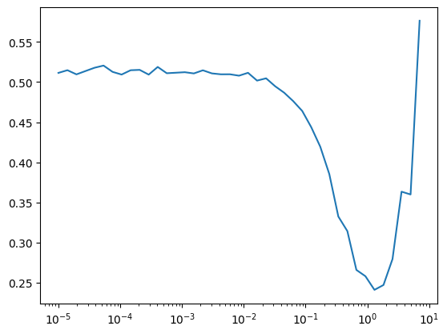

# Pascal Darknet Classification


<!-- WARNING: THIS FILE WAS AUTOGENERATED! DO NOT EDIT! -->

``` python
```

    The autoreload extension is already loaded. To reload it, use:
      %reload_ext autoreload

## Data

### Data loading

``` python
set_seed(42)
```

Let’s take a look at VOC2007.

``` python
data_path = fc.Path.home()/'data/'
data_path.ls()
```

    (#3) [Path('/home/kappa/data/VOCtrainval_06-Nov-2007.tar'),Path('/home/kappa/data/VOCdevkit'),Path('/home/kappa/data/pili')]

``` python
ds = datasets.VOCDetection(root=data_path, year='2007', image_set='train', download=False)
ds
```

    Dataset VOCDetection
        Number of datapoints: 2501
        Root location: /home/kappa/data

### Checking out data

What’s in the data?

``` python
ds[0]
```

    (<PIL.Image.Image image mode=RGB size=500x333>,
     {'annotation': {'folder': 'VOC2007',
       'filename': '000012.jpg',
       'source': {'database': 'The VOC2007 Database',
        'annotation': 'PASCAL VOC2007',
        'image': 'flickr',
        'flickrid': '207539885'},
       'owner': {'flickrid': 'KevBow', 'name': '?'},
       'size': {'width': '500', 'height': '333', 'depth': '3'},
       'segmented': '0',
       'object': [{'name': 'car',
         'pose': 'Rear',
         'truncated': '0',
         'difficult': '0',
         'bndbox': {'xmin': '156', 'ymin': '97', 'xmax': '351', 'ymax': '270'}}]}})

------------------------------------------------------------------------

<a
href="https://github.com/galopyz/pilus_project/blob/main/pilus_project/pascal.py#L46"
target="_blank" style="float:right; font-size:smaller">source</a>

### show_voc_sample

>  show_voc_sample (ds, idx, figsize=(12, 10))

``` python
# set_seed(42)
# import random
# random_indices = random.sample(range(len(ds)), 5)
# for idx in random_indices:
#     show_voc_sample(ds, idx, figsize=(5,5))
```


    Image size: 500x333
    Number of objects: 1
    Object 1: aeroplane, Difficult: 0, Truncated: 0


    Image size: 332x500
    Number of objects: 2
    Object 1: person, Difficult: 0, Truncated: 0
    Object 2: person, Difficult: 0, Truncated: 0


    Image size: 500x375
    Number of objects: 5
    Object 1: person, Difficult: 0, Truncated: 1
    Object 2: bottle, Difficult: 0, Truncated: 1
    Object 3: bottle, Difficult: 0, Truncated: 1
    Object 4: person, Difficult: 0, Truncated: 1
    Object 5: person, Difficult: 0, Truncated: 1


    Image size: 500x333
    Number of objects: 1
    Object 1: tvmonitor, Difficult: 0, Truncated: 0


    Image size: 500x281
    Number of objects: 2
    Object 1: car, Difficult: 0, Truncated: 0
    Object 2: car, Difficult: 0, Truncated: 0

------------------------------------------------------------------------

<a
href="https://github.com/galopyz/pilus_project/blob/main/pilus_project/pascal.py#L75"
target="_blank" style="float:right; font-size:smaller">source</a>

### get_class_distribution

>  get_class_distribution (ds)

*Get distribution of classes in the dataset*

``` python
class_dist = get_class_distribution(ds)
plt.figure(figsize=(12, 6))
class_dist.plot(kind='bar')
plt.title('Class Distribution in VOC2007')
plt.ylabel('Count')
plt.xticks(rotation=45)
plt.tight_layout()
```


------------------------------------------------------------------------

<a
href="https://github.com/galopyz/pilus_project/blob/main/pilus_project/pascal.py#L86"
target="_blank" style="float:right; font-size:smaller">source</a>

### get_image_sizes

>  get_image_sizes (ds, n=100)

*Get distribution of image sizes in the dataset*

``` python
sizes = get_image_sizes(ds)
plt.figure(figsize=(10, 6))
plt.scatter(sizes['width'], sizes['height'], alpha=0.5)
plt.title('Image Dimensions')
plt.xlabel('Width')
plt.ylabel('Height')
plt.grid(True, alpha=0.3)
```


------------------------------------------------------------------------

<a
href="https://github.com/galopyz/pilus_project/blob/main/pilus_project/pascal.py#L95"
target="_blank" style="float:right; font-size:smaller">source</a>

### show_class_examples

>  show_class_examples (ds, class_name, n=4)

*Show examples of a specific class*

``` python
show_class_examples(ds, 'cat');
```


``` python
objects_per_image = [len(ds[i][1]['annotation']['object']) for i in range(len(ds))]
plt.figure(figsize=(10, 6))
plt.hist(objects_per_image, bins=10)
plt.title('Objects per Image')
plt.xlabel('Number of Objects')
plt.ylabel('Number of Images')
```

    Text(0, 0.5, 'Number of Images')


------------------------------------------------------------------------

<a
href="https://github.com/galopyz/pilus_project/blob/main/pilus_project/pascal.py#L124"
target="_blank" style="float:right; font-size:smaller">source</a>

### calculate_dataset_stats

>  calculate_dataset_stats (dataloader, max_images=None)

\*Calculate mean and std of a dataset using a dataloader.

Args: dataloader: DataLoader instance max_images: Maximum number of
images to use (None = use all)

Returns: mean and std per channel\*

------------------------------------------------------------------------

<a
href="https://github.com/galopyz/pilus_project/blob/main/pilus_project/pascal.py#L166"
target="_blank" style="float:right; font-size:smaller">source</a>

### get_stats_dataloader

>  get_stats_dataloader (data_path, bs=32, year='2007')

*Create a dataloader for calculating dataset statistics*

``` python
stats_dl = get_stats_dataloader(data_path, bs=32)

mean, std = calculate_dataset_stats(stats_dl, max_images=2500)

print(f"Dataset mean: {mean.tolist()}")
print(f"Dataset std: {std.tolist()}")
```

      0%|          | 0/79 [00:00<?, ?it/s]

    Dataset mean: [0.45178133249282837, 0.4230543076992035, 0.39004892110824585]
    Dataset std: [0.26676368713378906, 0.261764258146286, 0.2731017470359802]

### Dataset

We create pytorch dataset.

Pytorch has options to add transforms to its dataset, so this is like
`minai`’s `TfmDataset`.

------------------------------------------------------------------------

<a
href="https://github.com/galopyz/pilus_project/blob/main/pilus_project/pascal.py#L196"
target="_blank" style="float:right; font-size:smaller">source</a>

### create_voc_datasets

>  create_voc_datasets (data_path, train_tfms=None, valid_tfms=None,
>                           year='2007')

*Create training and validation datasets for VOC*

``` python
trn_ds, val_ds = create_voc_datasets(data_path)
trn_ds
```

    Dataset VOCDetection
        Number of datapoints: 2501
        Root location: /home/kappa/data
        StandardTransform
    Transform: Compose(
                     RandomResizedCrop(size=(224, 224), scale=(0.08, 1.0), ratio=(0.75, 1.3333333333333333), interpolation=InterpolationMode.BILINEAR, antialias=True)
                     RandomHorizontalFlip(p=0.5)
                     ToImage()
                     ToDtype(scale=True)
                     Normalize(mean=[0.485, 0.456, 0.406], std=[0.229, 0.224, 0.225], inplace=False)
               )

The target has many more information than we need. We only need
`annotation.object`’s names for classification purposes.

``` python
trn_ds[0]
```

    (Image([[[-0.8678, -0.9020, -0.8678,  ..., -1.0390, -1.0733, -1.1418],
             [-0.9020, -0.8849, -0.8849,  ..., -1.1247, -1.1418, -1.1589],
             [-0.8849, -0.9192, -0.9020,  ..., -1.2103, -1.2103, -1.1418],
             ...,
             [-0.4739, -0.4911, -0.5253,  ..., -0.7650, -0.7308, -0.7479],
             [-0.5938, -0.5253, -0.5767,  ..., -0.7650, -0.7137, -0.7479],
             [-0.6452, -0.5938, -0.5596,  ..., -0.7993, -0.7822, -0.7822]],
     
            [[-0.7577, -0.7927, -0.7577,  ..., -0.9328, -0.9678, -1.0378],
             [-0.7927, -0.7752, -0.7752,  ..., -1.0203, -1.0378, -1.0553],
             [-0.7752, -0.8102, -0.7927,  ..., -1.1078, -1.1078, -1.0378],
             ...,
             [-0.3725, -0.3901, -0.4251,  ..., -0.6352, -0.6001, -0.6176],
             [-0.4951, -0.4251, -0.4776,  ..., -0.6352, -0.5826, -0.6176],
             [-0.5476, -0.4951, -0.4601,  ..., -0.6702, -0.6527, -0.6527]],
     
            [[-0.5321, -0.5670, -0.5321,  ..., -0.7413, -0.7761, -0.8458],
             [-0.5670, -0.5495, -0.5495,  ..., -0.8284, -0.8458, -0.8633],
             [-0.5495, -0.5844, -0.5670,  ..., -0.9156, -0.9156, -0.8458],
             ...,
             [-0.1835, -0.2010, -0.2358,  ..., -0.3753, -0.3404, -0.3578],
             [-0.3055, -0.2358, -0.2881,  ..., -0.3753, -0.3230, -0.3578],
             [-0.3578, -0.3055, -0.2707,  ..., -0.4101, -0.3927, -0.3927]]], ),
     {'annotation': {'folder': 'VOC2007',
       'filename': '000012.jpg',
       'source': {'database': 'The VOC2007 Database',
        'annotation': 'PASCAL VOC2007',
        'image': 'flickr',
        'flickrid': '207539885'},
       'owner': {'flickrid': 'KevBow', 'name': '?'},
       'size': {'width': '500', 'height': '333', 'depth': '3'},
       'segmented': '0',
       'object': [{'name': 'car',
         'pose': 'Rear',
         'truncated': '0',
         'difficult': '0',
         'bndbox': {'xmin': '156', 'ymin': '97', 'xmax': '351', 'ymax': '270'}}]}})

With
[`voc_extract`](https://galopyz.github.io/pilus_project/pascal.html#voc_extract),
we can get any field we want from the target.

------------------------------------------------------------------------

<a
href="https://github.com/galopyz/pilus_project/blob/main/pilus_project/pascal.py#L221"
target="_blank" style="float:right; font-size:smaller">source</a>

### voc_extract

>  voc_extract (field='name')

*Create a function that extracts a specific field from VOC annotations*

Object name:

``` python
ds = datasets.VOCDetection(
    root=data_path, year="2007", image_set='train', download=False, 
    target_transform=voc_extract())
ds[0]
```

    (<PIL.Image.Image image mode=RGB size=500x333>, (#1) ['car'])

Bound box:

``` python
ds = datasets.VOCDetection(
    root=data_path, year="2007", image_set='train', download=False, 
    target_transform=voc_extract(field='bndbox'))
ds[0]
```

    (<PIL.Image.Image image mode=RGB size=500x333>,
     (#1) [{'xmin': '156', 'ymin': '97', 'xmax': '351', 'ymax': '270'}])

For training, we actually need one-hot encoded vector because the
targets are multi-labels.

``` python
VOC_CLASSES
```

    (#20) ['aeroplane','bicycle','bird','boat','bottle','bus','car','cat','chair','cow','diningtable','dog','horse','motorbike','person','pottedplant','sheep','sofa','train','tvmonitor']

``` python
names = ['car', 'dog']
names
```

    ['car', 'dog']

``` python
lbls = torch.zeros(len(VOC_CLASSES))
lbls
```

    tensor([0., 0., 0., 0., 0., 0., 0., 0., 0., 0., 0., 0., 0., 0., 0., 0., 0., 0., 0., 0.])

`torch.scatter` is a good way to do this:

``` python
onehot = lbls.scatter(0, torch.tensor([1,3,5]), 1)
onehot
```

    tensor([0., 1., 0., 1., 0., 1., 0., 0., 0., 0., 0., 0., 0., 0., 0., 0., 0., 0.,
            0., 0.])

------------------------------------------------------------------------

<a
href="https://github.com/galopyz/pilus_project/blob/main/pilus_project/pascal.py#L228"
target="_blank" style="float:right; font-size:smaller">source</a>

### onehot_tfm

>  onehot_tfm (targ, clss=['aeroplane', 'bicycle', 'bird', 'boat', 'bottle',
>                  'bus', 'car', 'cat', 'chair', 'cow', 'diningtable', 'dog',
>                  'horse', 'motorbike', 'person', 'pottedplant', 'sheep',
>                  'sofa', 'train', 'tvmonitor'])

``` python
ds = datasets.VOCDetection(
    root=data_path, year="2007", image_set='train', download=False, 
    target_transform=onehot_tfm)
ds[0]
```

    (<PIL.Image.Image image mode=RGB size=500x333>,
     tensor([0., 0., 0., 0., 0., 0., 1., 0., 0., 0., 0., 0., 0., 0., 0., 0., 0., 0.,
             0., 0.]))

How about going back to label from one hot encoding? We use `np.where`.
Why use numpy instead of pytorch? Because `rvs_onehot_tfm` is used for
displaying images. We will never use this during training.

``` python
onehot
```

    tensor([0., 1., 0., 1., 0., 1., 0., 0., 0., 0., 0., 0., 0., 0., 0., 0., 0., 0.,
            0., 0.])

``` python
np.where(onehot == 1)[0]
```

    array([1, 3, 5])

``` python
VOC_CLASSES[np.where(onehot == 1)[0]]
```

    (#3) ['bicycle','boat','bus']

``` python
_rvs_onehot_tfm(onehot)
```

    (#3) ['bicycle','boat','bus']

### DataLoader

We got the dataset, so we are ready to create a dataloader. There are
couple transformations we want to apply to images. We have images so
far, but we need pytorch tensors with the same image sizes. We also
normalize images using imagenet statistics.

``` python
to_tensor = v2.Compose([
    v2.Resize((224, 224)),
    v2.ToImage(),
    v2.ToDtype(torch.float32, scale=True),
    v2.Normalize(mean=[0.485, 0.456, 0.406], std=[0.229, 0.224, 0.225])
])
```

``` python
trn_ds = datasets.VOCDetection(
    root=data_path, year="2007", image_set='train', download=False, 
    transform=to_tensor, target_transform=onehot_tfm)
val_ds = datasets.VOCDetection(
    root=data_path, year="2007", image_set='val', download=False, 
    transform=to_tensor, target_transform=onehot_tfm)
```

``` python
bs = 64
multi_label_loss = nn.BCEWithLogitsLoss()

trn_dl, val_dl = get_dls(trn_ds, val_ds, bs=bs)
```

``` python
xb,yb = next(iter(trn_dl))
xb.shape,yb[:10]
```

    (torch.Size([64, 3, 224, 224]),
     tensor([[0., 0., 0., 0., 0., 0., 0., 0., 0., 0., 0., 0., 0., 0., 1., 0., 1., 0.,
              0., 0.],
             [0., 0., 0., 0., 0., 0., 0., 0., 0., 0., 0., 0., 0., 1., 1., 0., 0., 0.,
              0., 0.],
             [0., 0., 0., 0., 0., 0., 0., 0., 0., 0., 0., 0., 1., 0., 1., 0., 0., 0.,
              0., 0.],
             [0., 0., 0., 0., 0., 0., 0., 0., 1., 0., 0., 0., 0., 0., 0., 0., 0., 0.,
              0., 0.],
             [0., 0., 0., 0., 0., 0., 0., 1., 0., 0., 0., 0., 0., 0., 0., 0., 0., 0.,
              0., 0.],
             [1., 0., 0., 0., 0., 0., 0., 0., 0., 0., 0., 0., 0., 0., 0., 0., 0., 0.,
              0., 0.],
             [0., 0., 0., 0., 0., 0., 1., 0., 0., 0., 0., 0., 0., 1., 1., 0., 0., 0.,
              0., 0.],
             [0., 1., 0., 0., 0., 0., 0., 0., 0., 0., 0., 0., 0., 0., 1., 0., 0., 0.,
              0., 0.],
             [0., 0., 0., 0., 0., 0., 0., 0., 0., 0., 0., 1., 0., 0., 1., 0., 0., 0.,
              0., 0.],
             [0., 0., 0., 0., 0., 0., 0., 0., 0., 0., 0., 0., 0., 0., 0., 0., 0., 0.,
              0., 1.]]))

Denormalize image before display.

------------------------------------------------------------------------

<a
href="https://github.com/galopyz/pilus_project/blob/main/pilus_project/pascal.py#L243"
target="_blank" style="float:right; font-size:smaller">source</a>

### denorm

>  denorm (x)

``` python
show_image(xb[0], tfm_x=denorm);
```


------------------------------------------------------------------------

<a
href="https://github.com/galopyz/pilus_project/blob/main/pilus_project/pascal.py#L246"
target="_blank" style="float:right; font-size:smaller">source</a>

### get_classification_model

>  get_classification_model (num_classes=20)

*Create a multi-label classification model based on darknet19*

``` python
model = get_classification_model()
dls = DataLoaders(trn_dl, val_dl)
learn = TrainLearner(model, dls, multi_label_loss, lr=1e-3, 
                   cbs=[TrainCB(), DeviceCB(), ProgressCB(), MetricsCB()])
learn.summary()
```

<style>
    /* Turns off some styling */
    progress {
        /* gets rid of default border in Firefox and Opera. */
        border: none;
        /* Needs to be in here for Safari polyfill so background images work as expected. */
        background-size: auto;
    }
    progress:not([value]), progress:not([value])::-webkit-progress-bar {
        background: repeating-linear-gradient(45deg, #7e7e7e, #7e7e7e 10px, #5c5c5c 10px, #5c5c5c 20px);
    }
    .progress-bar-interrupted, .progress-bar-interrupted::-webkit-progress-bar {
        background: #F44336;
    }
</style>

    <div>
      <progress value='0' class='' max='1' style='width:300px; height:20px; vertical-align: middle;'></progress>
      0.00% [0/1 00:00&lt;?]
    </div>
    &#10;
&#10;    <div>
      <progress value='0' class='' max='40' style='width:300px; height:20px; vertical-align: middle;'></progress>
      0.00% [0/40 00:00&lt;?]
    </div>
    &#10;

    Tot params: 20359636; MFLOPS: 970.9

<table>
<thead>
<tr>
<th>Module</th>
<th>Input</th>
<th>Output</th>
<th>Num params</th>
<th>MFLOPS</th>
</tr>
</thead>
<tbody>
<tr>
<td>Sequential</td>
<td>(64, 3, 224, 224)</td>
<td>(64, 1024, 7, 7)</td>
<td>19824576</td>
<td>970.4</td>
</tr>
<tr>
<td>AdaptiveAvgPool2d</td>
<td>(64, 1024, 7, 7)</td>
<td>(64, 1024, 1, 1)</td>
<td>0</td>
<td>0.0</td>
</tr>
<tr>
<td>Flatten</td>
<td>(64, 1024, 1, 1)</td>
<td>(64, 1024)</td>
<td>0</td>
<td>0.0</td>
</tr>
<tr>
<td>Linear</td>
<td>(64, 1024)</td>
<td>(64, 512)</td>
<td>524800</td>
<td>0.5</td>
</tr>
<tr>
<td>ReLU</td>
<td>(64, 512)</td>
<td>(64, 512)</td>
<td>0</td>
<td>0.0</td>
</tr>
<tr>
<td>Dropout</td>
<td>(64, 512)</td>
<td>(64, 512)</td>
<td>0</td>
<td>0.0</td>
</tr>
<tr>
<td>Linear</td>
<td>(64, 512)</td>
<td>(64, 20)</td>
<td>10260</td>
<td>0.0</td>
</tr>
</tbody>
</table>

We also have to reverse the transform for the targets. It is in onehot
encoding, but we want class names.

``` python
yb
```

    tensor([[0., 0., 0.,  ..., 0., 0., 0.],
            [0., 0., 0.,  ..., 0., 0., 0.],
            [0., 0., 1.,  ..., 0., 0., 0.],
            ...,
            [0., 0., 1.,  ..., 0., 0., 0.],
            [0., 0., 0.,  ..., 1., 0., 0.],
            [0., 0., 0.,  ..., 0., 0., 0.]])

``` python
[', '.join(_rvs_onehot_tfm(y)) for y in np.array(yb)][:4]
```

    ['person', 'chair, person', 'bird', 'dog, person, sofa']

``` python
def rvs_onehot_tfm(yb): return [', '.join(_rvs_onehot_tfm(y)) for y in np.array(yb)]
```

``` python
import sys, gc, traceback, math, typing, random, numpy as np
from itertools import zip_longest
```

We want to transform x and y.

``` python
learn.show_image_batch(tfm_x=denorm, tfm_y=_rvs_onehot_tfm)
```

<style>
    /* Turns off some styling */
    progress {
        /* gets rid of default border in Firefox and Opera. */
        border: none;
        /* Needs to be in here for Safari polyfill so background images work as expected. */
        background-size: auto;
    }
    progress:not([value]), progress:not([value])::-webkit-progress-bar {
        background: repeating-linear-gradient(45deg, #7e7e7e, #7e7e7e 10px, #5c5c5c 10px, #5c5c5c 20px);
    }
    .progress-bar-interrupted, .progress-bar-interrupted::-webkit-progress-bar {
        background: #F44336;
    }
</style>

    <div>
      <progress value='0' class='' max='1' style='width:300px; height:20px; vertical-align: middle;'></progress>
      0.00% [0/1 00:00&lt;?]
    </div>
    &#10;
&#10;    <div>
      <progress value='0' class='' max='40' style='width:300px; height:20px; vertical-align: middle;'></progress>
      0.00% [0/40 00:00&lt;?]
    </div>
    &#10;


``` python
learn.lr_find(gamma=1.4, max_mult=2)
```

<style>
    /* Turns off some styling */
    progress {
        /* gets rid of default border in Firefox and Opera. */
        border: none;
        /* Needs to be in here for Safari polyfill so background images work as expected. */
        background-size: auto;
    }
    progress:not([value]), progress:not([value])::-webkit-progress-bar {
        background: repeating-linear-gradient(45deg, #7e7e7e, #7e7e7e 10px, #5c5c5c 10px, #5c5c5c 20px);
    }
    .progress-bar-interrupted, .progress-bar-interrupted::-webkit-progress-bar {
        background: #F44336;
    }
</style>

<div>
      <progress value='1' class='' max='10' style='width:300px; height:20px; vertical-align: middle;'></progress>
      10.00% [1/10 00:13&lt;02:04]
    </div>
    &#10;

<table class="dataframe" data-quarto-postprocess="true" data-border="1">
<thead>
<tr style="text-align: left;">
<th data-quarto-table-cell-role="th">loss</th>
<th data-quarto-table-cell-role="th">epoch</th>
<th data-quarto-table-cell-role="th">train</th>
<th data-quarto-table-cell-role="th">time</th>
</tr>
</thead>
<tbody>
<tr>
<td>0.455</td>
<td>0</td>
<td>train</td>
<td>00:13</td>
</tr>
</tbody>
</table>

<p>
&#10;    <div>
      <progress value='0' class='' max='40' style='width:300px; height:20px; vertical-align: middle;'></progress>
      0.00% [0/40 00:00&lt;?]
    </div>



## Training Classification

``` python
model = get_classification_model()
learn = TrainLearner(model, dls, multi_label_loss, lr=1e-1, 
                   cbs=[TrainCB(), DeviceCB(), ProgressCB(), MetricsCB()])
```

``` python
learn.summary()
```

<style>
    /* Turns off some styling */
    progress {
        /* gets rid of default border in Firefox and Opera. */
        border: none;
        /* Needs to be in here for Safari polyfill so background images work as expected. */
        background-size: auto;
    }
    progress:not([value]), progress:not([value])::-webkit-progress-bar {
        background: repeating-linear-gradient(45deg, #7e7e7e, #7e7e7e 10px, #5c5c5c 10px, #5c5c5c 20px);
    }
    .progress-bar-interrupted, .progress-bar-interrupted::-webkit-progress-bar {
        background: #F44336;
    }
</style>

    <div>
      <progress value='0' class='' max='1' style='width:300px; height:20px; vertical-align: middle;'></progress>
      0.00% [0/1 00:00&lt;?]
    </div>
    &#10;
&#10;    <div>
      <progress value='0' class='' max='40' style='width:300px; height:20px; vertical-align: middle;'></progress>
      0.00% [0/40 00:00&lt;?]
    </div>
    &#10;

    Tot params: 20359636; MFLOPS: 970.9

<table>
<thead>
<tr>
<th>Module</th>
<th>Input</th>
<th>Output</th>
<th>Num params</th>
<th>MFLOPS</th>
</tr>
</thead>
<tbody>
<tr>
<td>Sequential</td>
<td>(64, 3, 224, 224)</td>
<td>(64, 1024, 7, 7)</td>
<td>19824576</td>
<td>970.4</td>
</tr>
<tr>
<td>AdaptiveAvgPool2d</td>
<td>(64, 1024, 7, 7)</td>
<td>(64, 1024, 1, 1)</td>
<td>0</td>
<td>0.0</td>
</tr>
<tr>
<td>Flatten</td>
<td>(64, 1024, 1, 1)</td>
<td>(64, 1024)</td>
<td>0</td>
<td>0.0</td>
</tr>
<tr>
<td>Linear</td>
<td>(64, 1024)</td>
<td>(64, 512)</td>
<td>524800</td>
<td>0.5</td>
</tr>
<tr>
<td>ReLU</td>
<td>(64, 512)</td>
<td>(64, 512)</td>
<td>0</td>
<td>0.0</td>
</tr>
<tr>
<td>Dropout</td>
<td>(64, 512)</td>
<td>(64, 512)</td>
<td>0</td>
<td>0.0</td>
</tr>
<tr>
<td>Linear</td>
<td>(64, 512)</td>
<td>(64, 20)</td>
<td>10260</td>
<td>0.0</td>
</tr>
</tbody>
</table>

``` python
model = get_classification_model()
learn = TrainLearner(model, dls, multi_label_loss, lr=1e-1, 
                   cbs=[DeviceCB(), ProgressCB(), MetricsCB()])
learn.fit(3)
```

<style>
    /* Turns off some styling */
    progress {
        /* gets rid of default border in Firefox and Opera. */
        border: none;
        /* Needs to be in here for Safari polyfill so background images work as expected. */
        background-size: auto;
    }
    progress:not([value]), progress:not([value])::-webkit-progress-bar {
        background: repeating-linear-gradient(45deg, #7e7e7e, #7e7e7e 10px, #5c5c5c 10px, #5c5c5c 20px);
    }
    .progress-bar-interrupted, .progress-bar-interrupted::-webkit-progress-bar {
        background: #F44336;
    }
</style>

<table class="dataframe" data-quarto-postprocess="true" data-border="1">
<thead>
<tr style="text-align: left;">
<th data-quarto-table-cell-role="th">loss</th>
<th data-quarto-table-cell-role="th">epoch</th>
<th data-quarto-table-cell-role="th">train</th>
<th data-quarto-table-cell-role="th">time</th>
</tr>
</thead>
<tbody>
<tr>
<td>0.371</td>
<td>0</td>
<td>train</td>
<td>00:13</td>
</tr>
<tr>
<td>0.261</td>
<td>0</td>
<td>eval</td>
<td>00:54</td>
</tr>
<tr>
<td>0.248</td>
<td>1</td>
<td>train</td>
<td>00:13</td>
</tr>
<tr>
<td>0.237</td>
<td>1</td>
<td>eval</td>
<td>00:11</td>
</tr>
<tr>
<td>0.241</td>
<td>2</td>
<td>train</td>
<td>00:13</td>
</tr>
<tr>
<td>0.237</td>
<td>2</td>
<td>eval</td>
<td>00:11</td>
</tr>
</tbody>
</table>

``` python
class TopKAccuracy(Callback):
    def __init__(self, k_values=[1, 5], class_names=VOC_CLASSES):
        """
        Implements Top-K accuracy for multi-label classification
        
        Args:
            k_values: List of k values to compute (e.g., [1, 5] for top-1 and top-5)
            class_names: List of class names
        """
        self.k_values = sorted(k_values)
        self.max_k = max(k_values)
        self.class_names = class_names
        
    def before_fit(self, learn):
        self.learn = learn
        
    def before_epoch(self, learn):
        # Initialize counters for each k
        self.correct = {k: 0 for k in self.k_values}
        self.total = 0
        
    def after_batch(self, learn):
        # Get predictions and targets
        logits = to_cpu(learn.preds)
        targets = to_cpu(learn.batch[1])
        batch_size = targets.size(0)
        
        # For each image in the batch
        for i in range(batch_size):
            # Get ground truth classes for this image
            true_classes = torch.where(targets[i] == 1)[0]
            if len(true_classes) == 0:
                continue  # Skip images with no labels
                
            # Get top-k predicted classes
            _, top_indices = torch.topk(logits[i], min(self.max_k, len(self.class_names)))
            
            # Check if any true class is in top-k predictions
            for k in self.k_values:
                top_k_indices = top_indices[:k]
                # For multi-label: if any true class is in top-k predictions, count as correct
                if any(cls in top_k_indices for cls in true_classes):
                    self.correct[k] += 1
            
            self.total += 1
        
    def after_epoch(self, learn):
        phase = 'train' if learn.training else 'valid'
        for k in self.k_values:
            accuracy = self.correct[k] / self.total if self.total > 0 else 0
            print(f"{phase} top-{k} accuracy: {accuracy:.4f}")
```

``` python
# Alternative implementation that considers a prediction correct only if 
# all true classes are in the top-k predictions
class StrictTopKAccuracy(Callback):
    def __init__(self, k_values=[1, 5], class_names=VOC_CLASSES):
        self.k_values = sorted(k_values)
        self.max_k = max(k_values)
        self.class_names = class_names
        
    def before_fit(self, learn):
        self.learn = learn
        
    def before_epoch(self, learn):
        self.correct = {k: 0 for k in self.k_values}
        self.total = 0
        
    def after_batch(self, learn):
        logits = to_cpu(learn.preds)
        targets = to_cpu(learn.batch[1])
        batch_size = targets.size(0)
        
        for i in range(batch_size):
            true_classes = torch.where(targets[i] == 1)[0]
            if len(true_classes) == 0:
                continue
                
            _, top_indices = torch.topk(logits[i], min(self.max_k, len(self.class_names)))
            
            for k in self.k_values:
                if k < len(true_classes):
                    continue  # Can't fit all true classes in top-k if k < number of true classes
                    
                top_k_indices = set(top_indices[:k].tolist())
                true_classes_set = set(true_classes.tolist())
                
                # Strict version: all true classes must be in top-k predictions
                if true_classes_set.issubset(top_k_indices):
                    self.correct[k] += 1
            
            self.total += 1
        
    def after_epoch(self, learn):
        phase = 'train' if learn.training else 'valid'
        for k in self.k_values:
            accuracy = self.correct[k] / self.total if self.total > 0 else 0
            print(f"{phase} strict top-{k} accuracy: {accuracy:.4f}")
```

``` python
model = get_classification_model()
learn = TrainLearner(model, dls, multi_label_loss, lr=1e-1, 
                   cbs=[DeviceCB(), ProgressCB(), MetricsCB(top5=TopKMultilabelAccuracy(k=5)), 
                        TopKAccuracy(k_values=[1, 5])])
```

``` python
learn.fit(3)
```

<style>
    /* Turns off some styling */
    progress {
        /* gets rid of default border in Firefox and Opera. */
        border: none;
        /* Needs to be in here for Safari polyfill so background images work as expected. */
        background-size: auto;
    }
    progress:not([value]), progress:not([value])::-webkit-progress-bar {
        background: repeating-linear-gradient(45deg, #7e7e7e, #7e7e7e 10px, #5c5c5c 10px, #5c5c5c 20px);
    }
    .progress-bar-interrupted, .progress-bar-interrupted::-webkit-progress-bar {
        background: #F44336;
    }
</style>

<div>
      <progress value='2' class='' max='3' style='width:300px; height:20px; vertical-align: middle;'></progress>
      66.67% [2/3 00:49&lt;00:24]
    </div>
    &#10;

<table class="dataframe" data-quarto-postprocess="true" data-border="1">
<thead>
<tr style="text-align: left;">
<th data-quarto-table-cell-role="th">top5</th>
<th data-quarto-table-cell-role="th">loss</th>
<th data-quarto-table-cell-role="th">epoch</th>
<th data-quarto-table-cell-role="th">train</th>
<th data-quarto-table-cell-role="th">time</th>
</tr>
</thead>
<tbody>
<tr>
<td>0.000</td>
<td>0.374</td>
<td>0</td>
<td>train</td>
<td>00:13</td>
</tr>
<tr>
<td>0.000</td>
<td>0.265</td>
<td>0</td>
<td>eval</td>
<td>00:11</td>
</tr>
<tr>
<td>0.000</td>
<td>0.247</td>
<td>1</td>
<td>train</td>
<td>00:13</td>
</tr>
<tr>
<td>0.000</td>
<td>0.238</td>
<td>1</td>
<td>eval</td>
<td>00:11</td>
</tr>
<tr>
<td>0.000</td>
<td>0.240</td>
<td>2</td>
<td>train</td>
<td>00:13</td>
</tr>
</tbody>
</table>

<p>
&#10;    <div>
      <progress value='10' class='' max='20' style='width:300px; height:20px; vertical-align: middle;'></progress>
      50.00% [10/20 00:05&lt;00:05 0.240]
    </div>

    train top-1 accuracy: 0.3631
    train top-5 accuracy: 0.6234
    valid top-1 accuracy: 0.4084
    valid top-5 accuracy: 0.6657
    train top-1 accuracy: 0.4266
    train top-5 accuracy: 0.6745
    valid top-1 accuracy: 0.4084
    valid top-5 accuracy: 0.7032
    train top-1 accuracy: 0.4314
    train top-5 accuracy: 0.7245

    KeyboardInterrupt: 
    ---------------------------------------------------------------------------
    KeyboardInterrupt                         Traceback (most recent call last)
    Cell In[75], line 1
    ----> 1 learn.fit(3)

    File ~/git/minai/minai/core.py:260, in Learner.fit(self, n_epochs, train, valid, cbs, lr)
        258     if lr is None: lr = self.lr
        259     if self.opt_func: self.opt = self.opt_func(self.model.parameters(), lr)
    --> 260     self._fit(train, valid)
        261 finally:
        262     for cb in cbs: self.cbs.remove(cb)

    File ~/git/minai/minai/core.py:194, in with_cbs.__call__.<locals>._f(o, *args, **kwargs)
        192 try:
        193     o.callback(f'before_{self.nm}')
    --> 194     f(o, *args, **kwargs)
        195     o.callback(f'after_{self.nm}')
        196 except globals()[f'Cancel{self.nm.title()}Exception']: pass

    File ~/git/minai/minai/core.py:250, in Learner._fit(self, train, valid)
        248 if train: self.one_epoch(True)
        249 if valid:
    --> 250     with torch.inference_mode(): self.one_epoch(False)

    File ~/git/minai/minai/core.py:241, in Learner.one_epoch(self, training)
        239 self.model.train(training)
        240 self.dl = self.train_dl if training else self.dls.valid
    --> 241 self._one_epoch()

    File ~/git/minai/minai/core.py:194, in with_cbs.__call__.<locals>._f(o, *args, **kwargs)
        192 try:
        193     o.callback(f'before_{self.nm}')
    --> 194     f(o, *args, **kwargs)
        195     o.callback(f'after_{self.nm}')
        196 except globals()[f'Cancel{self.nm.title()}Exception']: pass

    File ~/git/minai/minai/core.py:236, in Learner._one_epoch(self)
        234 @with_cbs('epoch')
        235 def _one_epoch(self):
    --> 236     for self.iter,self.batch in enumerate(self.dl): self._one_batch()

    File ~/miniforge3/lib/python3.10/site-packages/fastprogress/fastprogress.py:41, in ProgressBar.__iter__(self)
         39 if self.total != 0: self.update(0)
         40 try:
    ---> 41     for i,o in enumerate(self.gen):
         42         if self.total and i >= self.total: break
         43         yield o

    File ~/miniforge3/lib/python3.10/site-packages/torch/utils/data/dataloader.py:701, in _BaseDataLoaderIter.__next__(self)
        698 if self._sampler_iter is None:
        699     # TODO(https://github.com/pytorch/pytorch/issues/76750)
        700     self._reset()  # type: ignore[call-arg]
    --> 701 data = self._next_data()
        702 self._num_yielded += 1
        703 if (
        704     self._dataset_kind == _DatasetKind.Iterable
        705     and self._IterableDataset_len_called is not None
        706     and self._num_yielded > self._IterableDataset_len_called
        707 ):

    File ~/miniforge3/lib/python3.10/site-packages/torch/utils/data/dataloader.py:757, in _SingleProcessDataLoaderIter._next_data(self)
        755 def _next_data(self):
        756     index = self._next_index()  # may raise StopIteration
    --> 757     data = self._dataset_fetcher.fetch(index)  # may raise StopIteration
        758     if self._pin_memory:
        759         data = _utils.pin_memory.pin_memory(data, self._pin_memory_device)

    File ~/miniforge3/lib/python3.10/site-packages/torch/utils/data/_utils/fetch.py:52, in _MapDatasetFetcher.fetch(self, possibly_batched_index)
         50         data = self.dataset.__getitems__(possibly_batched_index)
         51     else:
    ---> 52         data = [self.dataset[idx] for idx in possibly_batched_index]
         53 else:
         54     data = self.dataset[possibly_batched_index]

    File ~/miniforge3/lib/python3.10/site-packages/torch/utils/data/_utils/fetch.py:52, in <listcomp>(.0)
         50         data = self.dataset.__getitems__(possibly_batched_index)
         51     else:
    ---> 52         data = [self.dataset[idx] for idx in possibly_batched_index]
         53 else:
         54     data = self.dataset[possibly_batched_index]

    File ~/miniforge3/lib/python3.10/site-packages/torchvision/datasets/voc.py:201, in VOCDetection.__getitem__(self, index)
        193 """
        194 Args:
        195     index (int): Index
       (...)
        198     tuple: (image, target) where target is a dictionary of the XML tree.
        199 """
        200 img = Image.open(self.images[index]).convert("RGB")
    --> 201 target = self.parse_voc_xml(ET_parse(self.annotations[index]).getroot())
        203 if self.transforms is not None:
        204     img, target = self.transforms(img, target)

    File ~/miniforge3/lib/python3.10/site-packages/defusedxml/common.py:100, in _generate_etree_functions.<locals>.parse(source, parser, forbid_dtd, forbid_entities, forbid_external)
         93 if parser is None:
         94     parser = DefusedXMLParser(
         95         target=_TreeBuilder(),
         96         forbid_dtd=forbid_dtd,
         97         forbid_entities=forbid_entities,
         98         forbid_external=forbid_external,
         99     )
    --> 100 return _parse(source, parser)

    File ~/miniforge3/lib/python3.10/xml/etree/ElementTree.py:1222, in parse(source, parser)
       1213 """Parse XML document into element tree.
       1214 
       1215 *source* is a filename or file object containing XML data,
       (...)
       1219 
       1220 """
       1221 tree = ElementTree()
    -> 1222 tree.parse(source, parser)
       1223 return tree

    File ~/miniforge3/lib/python3.10/xml/etree/ElementTree.py:586, in ElementTree.parse(self, source, parser)
        584     if not data:
        585         break
    --> 586     parser.feed(data)
        587 self._root = parser.close()
        588 return self._root

    File ~/miniforge3/lib/python3.10/xml/etree/ElementTree.py:1713, in XMLParser.feed(self, data)
       1711 """Feed encoded data to parser."""
       1712 try:
    -> 1713     self.parser.Parse(data, False)
       1714 except self._error as v:
       1715     self._raiseerror(v)

    File /home/conda/feedstock_root/build_artifacts/python-split_1687559129017/work/Modules/pyexpat.c:416, in StartElement()

    File ~/miniforge3/lib/python3.10/xml/etree/ElementTree.py:1641, in XMLParser._start(self, tag, attr_list)
       1638 def _end_ns(self, prefix):
       1639     return self.target.end_ns(prefix or '')
    -> 1641 def _start(self, tag, attr_list):
       1642     # Handler for expat's StartElementHandler. Since ordered_attributes
       1643     # is set, the attributes are reported as a list of alternating
       1644     # attribute name,value.
       1645     fixname = self._fixname
       1646     tag = fixname(tag)

    KeyboardInterrupt: 

``` python
model = get_classification_model()
learn = TrainLearner(model, dls, multi_label_loss, lr=1e-1, 
                   cbs=[DeviceCB(), ProgressCB(), 
                        MetricsCB(mAP=MultilabelAUPRC(num_labels=20), hamming=MultilabelAccuracy(criteria='hamming'), overlap=MultilabelAccuracy(criteria='overlap'), contain=MultilabelAccuracy(criteria='contain'), belong=MultilabelAccuracy(criteria='belong'),top1=MultilabelAccuracy(criteria='exact_match'), top5=TopKMultilabelAccuracy(criteria='contain', k=5), ), 
                        TopKAccuracy(k_values=[1, 5]), 
                        StrictTopKAccuracy(k_values=[1, 5])])
```

``` python
learn.fit(5)
```

<style>
    /* Turns off some styling */
    progress {
        /* gets rid of default border in Firefox and Opera. */
        border: none;
        /* Needs to be in here for Safari polyfill so background images work as expected. */
        background-size: auto;
    }
    progress:not([value]), progress:not([value])::-webkit-progress-bar {
        background: repeating-linear-gradient(45deg, #7e7e7e, #7e7e7e 10px, #5c5c5c 10px, #5c5c5c 20px);
    }
    .progress-bar-interrupted, .progress-bar-interrupted::-webkit-progress-bar {
        background: #F44336;
    }
</style>

<div>
      <progress value='2' class='' max='5' style='width:300px; height:20px; vertical-align: middle;'></progress>
      40.00% [2/5 09:29&lt;14:14]
    </div>
    &#10;

<table class="dataframe" data-quarto-postprocess="true" data-border="1">
<thead>
<tr style="text-align: left;">
<th data-quarto-table-cell-role="th">mAP</th>
<th data-quarto-table-cell-role="th">hamming</th>
<th data-quarto-table-cell-role="th">overlap</th>
<th data-quarto-table-cell-role="th">contain</th>
<th data-quarto-table-cell-role="th">belong</th>
<th data-quarto-table-cell-role="th">top1</th>
<th data-quarto-table-cell-role="th">top5</th>
<th data-quarto-table-cell-role="th">loss</th>
<th data-quarto-table-cell-role="th">epoch</th>
<th data-quarto-table-cell-role="th">train</th>
<th data-quarto-table-cell-role="th">time</th>
</tr>
</thead>
<tbody>
<tr>
<td>0.085</td>
<td>0.920</td>
<td>0.002</td>
<td>0.001</td>
<td>0.998</td>
<td>0.001</td>
<td>0.299</td>
<td>0.374</td>
<td>0</td>
<td>train</td>
<td>03:34</td>
</tr>
<tr>
<td>0.103</td>
<td>0.922</td>
<td>0.000</td>
<td>0.000</td>
<td>1.000</td>
<td>0.000</td>
<td>0.362</td>
<td>0.263</td>
<td>0</td>
<td>eval</td>
<td>01:20</td>
</tr>
<tr>
<td>0.099</td>
<td>0.920</td>
<td>0.006</td>
<td>0.001</td>
<td>0.995</td>
<td>0.001</td>
<td>0.355</td>
<td>0.249</td>
<td>1</td>
<td>train</td>
<td>03:20</td>
</tr>
<tr>
<td>0.149</td>
<td>0.922</td>
<td>0.000</td>
<td>0.000</td>
<td>1.000</td>
<td>0.000</td>
<td>0.423</td>
<td>0.238</td>
<td>1</td>
<td>eval</td>
<td>01:14</td>
</tr>
</tbody>
</table>

<p>
&#10;    <div>
      <progress value='6' class='' max='40' style='width:300px; height:20px; vertical-align: middle;'></progress>
      15.00% [6/40 00:31&lt;02:58 0.237]
    </div>

    train top-1 accuracy: 0.3894
    train top-5 accuracy: 0.6301
    train strict top-1 accuracy: 0.0768
    train strict top-5 accuracy: 0.2991
    valid top-1 accuracy: 0.4084
    valid top-5 accuracy: 0.7040
    valid strict top-1 accuracy: 0.0797
    valid strict top-5 accuracy: 0.3622
    train top-1 accuracy: 0.4278
    train top-5 accuracy: 0.6853
    train strict top-1 accuracy: 0.0832
    train strict top-5 accuracy: 0.3555
    valid top-1 accuracy: 0.4084
    valid top-5 accuracy: 0.7104
    valid strict top-1 accuracy: 0.0797
    valid strict top-5 accuracy: 0.4231

    KeyboardInterrupt: 
    ---------------------------------------------------------------------------
    KeyboardInterrupt                         Traceback (most recent call last)
    Cell In[117], line 1
    ----> 1 learn.fit(5)

    File ~/git/minai/minai/core.py:260, in Learner.fit(self, n_epochs, train, valid, cbs, lr)
        258     if lr is None: lr = self.lr
        259     if self.opt_func: self.opt = self.opt_func(self.model.parameters(), lr)
    --> 260     self._fit(train, valid)
        261 finally:
        262     for cb in cbs: self.cbs.remove(cb)

    File ~/git/minai/minai/core.py:194, in with_cbs.__call__.<locals>._f(o, *args, **kwargs)
        192 try:
        193     o.callback(f'before_{self.nm}')
    --> 194     f(o, *args, **kwargs)
        195     o.callback(f'after_{self.nm}')
        196 except globals()[f'Cancel{self.nm.title()}Exception']: pass

    File ~/git/minai/minai/core.py:248, in Learner._fit(self, train, valid)
        246 if self.epoch_sz is not None: self.train_dl = CycleDL(self.train_dl, self.epoch_sz)
        247 for self.epoch in self.epochs:
    --> 248     if train: self.one_epoch(True)
        249     if valid:
        250         with torch.inference_mode(): self.one_epoch(False)

    File ~/git/minai/minai/core.py:241, in Learner.one_epoch(self, training)
        239 self.model.train(training)
        240 self.dl = self.train_dl if training else self.dls.valid
    --> 241 self._one_epoch()

    File ~/git/minai/minai/core.py:194, in with_cbs.__call__.<locals>._f(o, *args, **kwargs)
        192 try:
        193     o.callback(f'before_{self.nm}')
    --> 194     f(o, *args, **kwargs)
        195     o.callback(f'after_{self.nm}')
        196 except globals()[f'Cancel{self.nm.title()}Exception']: pass

    File ~/git/minai/minai/core.py:236, in Learner._one_epoch(self)
        234 @with_cbs('epoch')
        235 def _one_epoch(self):
    --> 236     for self.iter,self.batch in enumerate(self.dl): self._one_batch()

    File ~/miniforge3/envs/torch_latest/lib/python3.11/site-packages/fastprogress/fastprogress.py:41, in ProgressBar.__iter__(self)
         39 if self.total != 0: self.update(0)
         40 try:
    ---> 41     for i,o in enumerate(self.gen):
         42         if self.total and i >= self.total: break
         43         yield o

    File ~/miniforge3/envs/torch_latest/lib/python3.11/site-packages/torch/utils/data/dataloader.py:701, in _BaseDataLoaderIter.__next__(self)
        698 if self._sampler_iter is None:
        699     # TODO(https://github.com/pytorch/pytorch/issues/76750)
        700     self._reset()  # type: ignore[call-arg]
    --> 701 data = self._next_data()
        702 self._num_yielded += 1
        703 if (
        704     self._dataset_kind == _DatasetKind.Iterable
        705     and self._IterableDataset_len_called is not None
        706     and self._num_yielded > self._IterableDataset_len_called
        707 ):

    File ~/miniforge3/envs/torch_latest/lib/python3.11/site-packages/torch/utils/data/dataloader.py:757, in _SingleProcessDataLoaderIter._next_data(self)
        755 def _next_data(self):
        756     index = self._next_index()  # may raise StopIteration
    --> 757     data = self._dataset_fetcher.fetch(index)  # may raise StopIteration
        758     if self._pin_memory:
        759         data = _utils.pin_memory.pin_memory(data, self._pin_memory_device)

    File ~/miniforge3/envs/torch_latest/lib/python3.11/site-packages/torch/utils/data/_utils/fetch.py:52, in _MapDatasetFetcher.fetch(self, possibly_batched_index)
         50         data = self.dataset.__getitems__(possibly_batched_index)
         51     else:
    ---> 52         data = [self.dataset[idx] for idx in possibly_batched_index]
         53 else:
         54     data = self.dataset[possibly_batched_index]

    File ~/miniforge3/envs/torch_latest/lib/python3.11/site-packages/torch/utils/data/_utils/fetch.py:52, in <listcomp>(.0)
         50         data = self.dataset.__getitems__(possibly_batched_index)
         51     else:
    ---> 52         data = [self.dataset[idx] for idx in possibly_batched_index]
         53 else:
         54     data = self.dataset[possibly_batched_index]

    File ~/miniforge3/envs/torch_latest/lib/python3.11/site-packages/torchvision/datasets/voc.py:204, in VOCDetection.__getitem__(self, index)
        201 target = self.parse_voc_xml(ET_parse(self.annotations[index]).getroot())
        203 if self.transforms is not None:
    --> 204     img, target = self.transforms(img, target)
        206 return img, target

    File ~/miniforge3/envs/torch_latest/lib/python3.11/site-packages/torchvision/datasets/vision.py:95, in StandardTransform.__call__(self, input, target)
         93 def __call__(self, input: Any, target: Any) -> Tuple[Any, Any]:
         94     if self.transform is not None:
    ---> 95         input = self.transform(input)
         96     if self.target_transform is not None:
         97         target = self.target_transform(target)

    File ~/miniforge3/envs/torch_latest/lib/python3.11/site-packages/torch/nn/modules/module.py:1736, in Module._wrapped_call_impl(self, *args, **kwargs)
       1734     return self._compiled_call_impl(*args, **kwargs)  # type: ignore[misc]
       1735 else:
    -> 1736     return self._call_impl(*args, **kwargs)

    File ~/miniforge3/envs/torch_latest/lib/python3.11/site-packages/torch/nn/modules/module.py:1747, in Module._call_impl(self, *args, **kwargs)
       1742 # If we don't have any hooks, we want to skip the rest of the logic in
       1743 # this function, and just call forward.
       1744 if not (self._backward_hooks or self._backward_pre_hooks or self._forward_hooks or self._forward_pre_hooks
       1745         or _global_backward_pre_hooks or _global_backward_hooks
       1746         or _global_forward_hooks or _global_forward_pre_hooks):
    -> 1747     return forward_call(*args, **kwargs)
       1749 result = None
       1750 called_always_called_hooks = set()

    File ~/miniforge3/envs/torch_latest/lib/python3.11/site-packages/torchvision/transforms/v2/_container.py:51, in Compose.forward(self, *inputs)
         49 needs_unpacking = len(inputs) > 1
         50 for transform in self.transforms:
    ---> 51     outputs = transform(*inputs)
         52     inputs = outputs if needs_unpacking else (outputs,)
         53 return outputs

    File ~/miniforge3/envs/torch_latest/lib/python3.11/site-packages/torch/nn/modules/module.py:1736, in Module._wrapped_call_impl(self, *args, **kwargs)
       1734     return self._compiled_call_impl(*args, **kwargs)  # type: ignore[misc]
       1735 else:
    -> 1736     return self._call_impl(*args, **kwargs)

    File ~/miniforge3/envs/torch_latest/lib/python3.11/site-packages/torch/nn/modules/module.py:1747, in Module._call_impl(self, *args, **kwargs)
       1742 # If we don't have any hooks, we want to skip the rest of the logic in
       1743 # this function, and just call forward.
       1744 if not (self._backward_hooks or self._backward_pre_hooks or self._forward_hooks or self._forward_pre_hooks
       1745         or _global_backward_pre_hooks or _global_backward_hooks
       1746         or _global_forward_hooks or _global_forward_pre_hooks):
    -> 1747     return forward_call(*args, **kwargs)
       1749 result = None
       1750 called_always_called_hooks = set()

    File ~/miniforge3/envs/torch_latest/lib/python3.11/site-packages/torchvision/transforms/v2/_transform.py:50, in Transform.forward(self, *inputs)
         45 needs_transform_list = self._needs_transform_list(flat_inputs)
         46 params = self._get_params(
         47     [inpt for (inpt, needs_transform) in zip(flat_inputs, needs_transform_list) if needs_transform]
         48 )
    ---> 50 flat_outputs = [
         51     self._transform(inpt, params) if needs_transform else inpt
         52     for (inpt, needs_transform) in zip(flat_inputs, needs_transform_list)
         53 ]
         55 return tree_unflatten(flat_outputs, spec)

    File ~/miniforge3/envs/torch_latest/lib/python3.11/site-packages/torchvision/transforms/v2/_transform.py:51, in <listcomp>(.0)
         45 needs_transform_list = self._needs_transform_list(flat_inputs)
         46 params = self._get_params(
         47     [inpt for (inpt, needs_transform) in zip(flat_inputs, needs_transform_list) if needs_transform]
         48 )
         50 flat_outputs = [
    ---> 51     self._transform(inpt, params) if needs_transform else inpt
         52     for (inpt, needs_transform) in zip(flat_inputs, needs_transform_list)
         53 ]
         55 return tree_unflatten(flat_outputs, spec)

    File ~/miniforge3/envs/torch_latest/lib/python3.11/site-packages/torchvision/transforms/v2/_geometry.py:160, in Resize._transform(self, inpt, params)
        159 def _transform(self, inpt: Any, params: Dict[str, Any]) -> Any:
    --> 160     return self._call_kernel(
        161         F.resize,
        162         inpt,
        163         self.size,
        164         interpolation=self.interpolation,
        165         max_size=self.max_size,
        166         antialias=self.antialias,
        167     )

    File ~/miniforge3/envs/torch_latest/lib/python3.11/site-packages/torchvision/transforms/v2/_transform.py:35, in Transform._call_kernel(self, functional, inpt, *args, **kwargs)
         33 def _call_kernel(self, functional: Callable, inpt: Any, *args: Any, **kwargs: Any) -> Any:
         34     kernel = _get_kernel(functional, type(inpt), allow_passthrough=True)
    ---> 35     return kernel(inpt, *args, **kwargs)

    File ~/miniforge3/envs/torch_latest/lib/python3.11/site-packages/torchvision/transforms/v2/functional/_geometry.py:310, in __resize_image_pil_dispatch(image, size, interpolation, max_size, antialias)
        308 if antialias is False:
        309     warnings.warn("Anti-alias option is always applied for PIL Image input. Argument antialias is ignored.")
    --> 310 return _resize_image_pil(image, size=size, interpolation=interpolation, max_size=max_size)

    File ~/miniforge3/envs/torch_latest/lib/python3.11/site-packages/torchvision/transforms/v2/functional/_geometry.py:297, in _resize_image_pil(image, size, interpolation, max_size)
        294 if (new_height, new_width) == (old_height, old_width):
        295     return image
    --> 297 return image.resize((new_width, new_height), resample=pil_modes_mapping[interpolation])

    File ~/miniforge3/envs/torch_latest/lib/python3.11/site-packages/PIL/Image.py:2328, in Image.resize(self, size, resample, box, reducing_gap)
       2316         self = (
       2317             self.reduce(factor, box=reduce_box)
       2318             if callable(self.reduce)
       2319             else Image.reduce(self, factor, box=reduce_box)
       2320         )
       2321         box = (
       2322             (box[0] - reduce_box[0]) / factor_x,
       2323             (box[1] - reduce_box[1]) / factor_y,
       2324             (box[2] - reduce_box[0]) / factor_x,
       2325             (box[3] - reduce_box[1]) / factor_y,
       2326         )
    -> 2328 return self._new(self.im.resize(size, resample, box))

    KeyboardInterrupt: 

``` python
# Code from https://github.com/pytorch/vision/blob/main/gallery/transforms/helpers.py

import matplotlib.pyplot as plt
import torch
from torchvision.utils import draw_bounding_boxes, draw_segmentation_masks
from torchvision import tv_tensors
from torchvision.transforms.v2 import functional as F

def plot(imgs, row_title=None, **imshow_kwargs):
    if not isinstance(imgs[0], list):
        # Make a 2d grid even if there's just 1 row
        imgs = [imgs]

    num_rows = len(imgs)
    num_cols = len(imgs[0])
    _, axs = plt.subplots(nrows=num_rows, ncols=num_cols, squeeze=False)
    for row_idx, row in enumerate(imgs):
        for col_idx, img in enumerate(row):
            boxes = None
            masks = None
            if isinstance(img, tuple):
                img, target = img
                if isinstance(target, dict):
                    boxes = target.get("boxes")
                    masks = target.get("masks")
                elif isinstance(target, tv_tensors.BoundingBoxes):
                    boxes = target
                else:
                    raise ValueError(f"Unexpected target type: {type(target)}")
            img = F.to_image(img)
            if img.dtype.is_floating_point and img.min() < 0:
                # Poor man's re-normalization for the colors to be OK-ish. This
                # is useful for images coming out of Normalize()
                img -= img.min()
                img /= img.max()

            img = F.to_dtype(img, torch.uint8, scale=True)
            if boxes is not None:
                img = draw_bounding_boxes(img, boxes, colors="yellow", width=3)
            if masks is not None:
                img = draw_segmentation_masks(img, masks.to(torch.bool), colors=["green"] * masks.shape[0], alpha=.65)

            ax = axs[row_idx, col_idx]
            ax.imshow(img.permute(1, 2, 0).numpy(), **imshow_kwargs)
            ax.set(xticklabels=[], yticklabels=[], xticks=[], yticks=[])

    if row_title is not None:
        for row_idx in range(num_rows):
            axs[row_idx, 0].set(ylabel=row_title[row_idx])

    plt.tight_layout()
```
