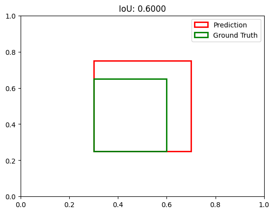
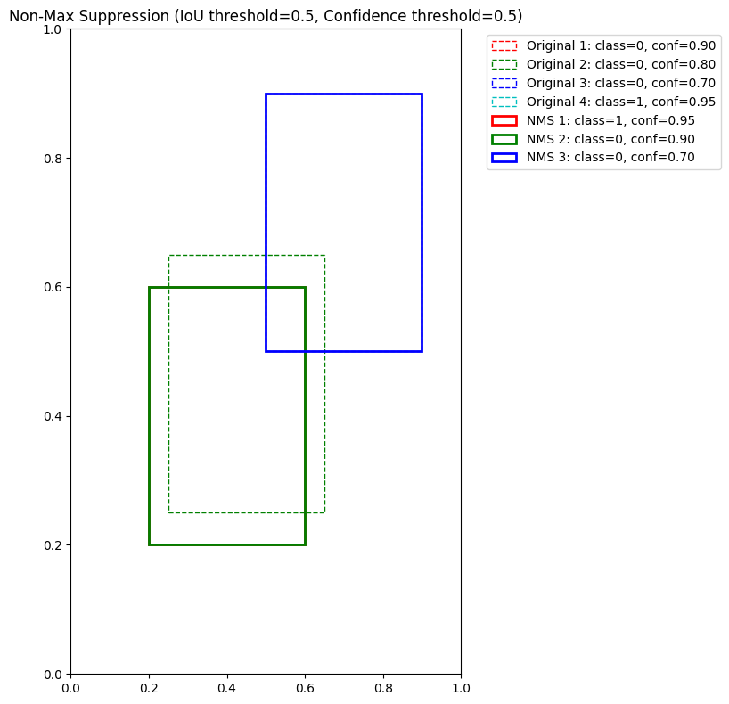
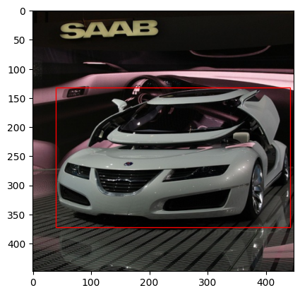
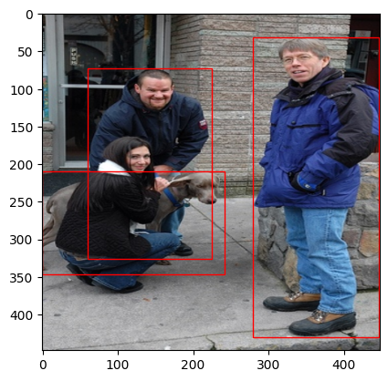

# Yolo v1


<!-- WARNING: THIS FILE WAS AUTOGENERATED! DO NOT EDIT! -->

Yolo v1 provides many fundamental and important concepts for oriented
bounding boxes. It is worth learning. Code adapted from
https://github.com/aladdinpersson/Machine-Learning-Collection.

``` python
import torchvision.transforms as transforms
import torch.optim as optim
import torchvision.transforms.functional as FT
from tqdm import tqdm
from torch.utils.data import DataLoader
```

``` python
data_path = fc.Path('../data')
data_path
```

    Path('../data')

## Utils

Some helpful utilities that can help us.

This
[`intersection_over_union`](https://galopyz.github.io/pilus_project/yolov1.html#intersection_over_union)
function calculates the IoU metric between predicted bounding boxes and
ground truth boxes. It’s essential for:

1.  Evaluating object detection accuracy - IoU measures how well your
    predicted boxes align with the actual object locations
2.  Non-max suppression - removing duplicate detections by comparing
    their overlap
3.  Training YOLO - the loss function uses IoU to penalize poor box
    predictions (not in yolo v1)

The function handles two box formats: - “midpoint”: (x,y,w,h) where x,y
is the center point - “corners”: (x1,y1,x2,y2) representing top-left and
bottom-right corners

It converts boxes to corner format, calculates intersection area
(overlap), calculates union area (total area), then returns
intersection/union. The 1e-6 term prevents division by zero.

------------------------------------------------------------------------

<a
href="https://github.com/galopyz/pilus_project/blob/main/pilus_project/yolov1.py#L26"
target="_blank" style="float:right; font-size:smaller">source</a>

### intersection_over_union

>  intersection_over_union (boxes_preds, boxes_labels,
>                               box_format='midpoint')

\*Calculates intersection over union

Parameters: boxes_preds (tensor): Predictions of Bounding Boxes
(BATCH_SIZE, 4) boxes_labels (tensor): Correct labels of Bounding Boxes
(BATCH_SIZE, 4) box_format (str): midpoint/corners, if boxes (x,y,w,h)
or (x1,y1,x2,y2)

Returns: tensor: Intersection over union for all examples\*

Here is an example:

``` python
# Create example boxes
# Format: [x, y, width, height] in midpoint format
box1 = torch.tensor([0.5, 0.5, 0.4, 0.5])  # Center at (0.5, 0.5) with width=0.4, height=0.5
box2 = torch.tensor([0.45, 0.45, 0.3, 0.4])  # Center at (0.45, 0.45) with width=0.3, height=0.4

# Add batch dimension
boxes_pred = box1.unsqueeze(0)  # Shape: [1, 4]
boxes_label = box2.unsqueeze(0)  # Shape: [1, 4]

# Calculate IoU
iou = intersection_over_union(boxes_pred, boxes_label, box_format="midpoint")
print(f"IoU: {iou.item():.4f}")

# Visualize the boxes
fig, ax = plt.subplots(1)
ax.set_xlim(0, 1)
ax.set_ylim(0, 1)

# Convert to corner format for plotting
def midpoint_to_corners(box):
    x, y, w, h = box
    x1 = x - w/2
    y1 = y - h/2
    return x1, y1, w, h

# Plot box1 (prediction)
x1, y1, w, h = midpoint_to_corners(box1)
rect1 = patches.Rectangle((x1, y1), w, h, linewidth=2, edgecolor='r', facecolor='none', label='Prediction')
ax.add_patch(rect1)

# Plot box2 (ground truth)
x1, y1, w, h = midpoint_to_corners(box2)
rect2 = patches.Rectangle((x1, y1), w, h, linewidth=2, edgecolor='g', facecolor='none', label='Ground Truth')
ax.add_patch(rect2)

ax.legend()
plt.title(f"IoU: {iou.item():.4f}")
plt.show()
```

    IoU: 0.6000



This
[`non_max_suppression`](https://galopyz.github.io/pilus_project/yolov1.html#non_max_suppression)
function solves a critical problem in object detection: eliminating
duplicate detections of the same object.

When a model detects objects, it often generates multiple overlapping
bounding boxes for the same object. Non-Max Suppression (NMS) cleans
this up by:

1.  Filtering out boxes with confidence below a threshold
2.  Sorting remaining boxes by confidence (highest first)
3.  Keeping the highest confidence box and removing others that overlap
    significantly with it (based on IoU)
4.  Repeating until no boxes remain

The function takes: - `bboxes`: List of detection boxes with format
\[class_pred, prob_score, x1, y1, x2, y2\] - `iou_threshold`: Maximum
allowed overlap between distinct objects - `threshold`: Minimum
confidence score for a detection to be considered - `box_format`:
Whether coordinates are in “midpoint” or “corners” format

This is essential for clean, usable object detection results - without
NMS, a single object might appear to be detected multiple times,
cluttering your output and making it difficult to count or track objects
accurately.

------------------------------------------------------------------------

<a
href="https://github.com/galopyz/pilus_project/blob/main/pilus_project/yolov1.py#L73"
target="_blank" style="float:right; font-size:smaller">source</a>

### non_max_suppression

>  non_max_suppression (bboxes, iou_threshold, threshold,
>                           box_format='corners')

\*Does Non Max Suppression given bboxes

Parameters: bboxes (list): list of lists containing all bboxes with each
bboxes specified as \[class_pred, prob_score, x1, y1, x2, y2\]
iou_threshold (float): threshold where predicted bboxes is correct
threshold (float): threshold to remove predicted bboxes (independent of
IoU) box_format (str): “midpoint” or “corners” used to specify bboxes

Returns: list: bboxes after performing NMS given a specific IoU
threshold\*

Here is an example:

``` python
bboxes = [
    [0, 0.9, 0.2, 0.2, 0.6, 0.6],  # High confidence box
    [0, 0.8, 0.25, 0.25, 0.65, 0.65],  # Overlapping box, same class
    [0, 0.7, 0.5, 0.5, 0.9, 0.9],  # Different location, same class
    [1, 0.95, 0.2, 0.2, 0.6, 0.6],  # Same location, different class
    [0, 0.3, 0.2, 0.2, 0.6, 0.6],  # Low confidence, will be filtered
]
threshold=0.5
bboxes = [box for box in bboxes if box[1] > threshold]
bboxes = sorted(bboxes, key=lambda x: x[1], reverse=True)
bboxes
```

    [[1, 0.95, 0.2, 0.2, 0.6, 0.6],
     [0, 0.9, 0.2, 0.2, 0.6, 0.6],
     [0, 0.8, 0.25, 0.25, 0.65, 0.65],
     [0, 0.7, 0.5, 0.5, 0.9, 0.9]]

``` python
box1 = torch.tensor([0.2, 0.2, 0.6, 0.6])
box2 = torch.tensor([0.2, 0.2, 0.6, 0.6])
intersection_over_union(box1, box2, box_format="corners")
```

    tensor([1.0000])

``` python
box_format='corners'
iou_threshold=0.5
chosen_box = bboxes[0]

for box in bboxes:
    if box[0] != chosen_box[0] or intersection_over_union(
        torch.tensor(chosen_box[2:]),
        torch.tensor(box[2:]),
        box_format=box_format,
    ) < iou_threshold:
        print(f'if true:{box}')
    else:
        print(f'else:{box}')
```

    else:[1, 0.95, 0.2, 0.2, 0.6, 0.6]
    if true:[0, 0.9, 0.2, 0.2, 0.6, 0.6]
    if true:[0, 0.8, 0.25, 0.25, 0.65, 0.65]
    if true:[0, 0.7, 0.5, 0.5, 0.9, 0.9]

``` python
# Create example bounding boxes
# Format: [class_pred, prob_score, x1, y1, x2, y2] in corners format
bboxes = [
    [0, 0.9, 0.2, 0.2, 0.6, 0.6],  # High confidence box
    [0, 0.8, 0.25, 0.25, 0.65, 0.65],  # Overlapping box, same class
    [0, 0.7, 0.5, 0.5, 0.9, 0.9],  # Different location, same class
    [1, 0.95, 0.2, 0.2, 0.6, 0.6],  # Same location, different class
    [0, 0.3, 0.2, 0.2, 0.6, 0.6],  # Low confidence, will be filtered
]

# Apply NMS
iou_threshold = 0.5
confidence_threshold = 0.5
nms_boxes = non_max_suppression(bboxes, iou_threshold, confidence_threshold, box_format="corners")

# Print results
print("Before NMS:", len(bboxes), "boxes")
print("After NMS:", len(nms_boxes), "boxes")
for i, box in enumerate(nms_boxes):
    print(f"Box {i+1}: class={int(box[0])}, confidence={box[1]:.2f}, coords={box[2:]}")

# Visualize the boxes
fig, ax = plt.subplots(1, figsize=(8, 8))
ax.set_xlim(0, 1)
ax.set_ylim(0, 1)

# Plot original boxes
colors = ['r', 'g', 'b', 'c', 'm']
for i, box in enumerate(bboxes):
    if box[1] > confidence_threshold:
        rect = patches.Rectangle(
            (box[2], box[3]), 
            box[4]-box[2], 
            box[5]-box[3], 
            linewidth=1, 
            edgecolor=colors[i % len(colors)], 
            facecolor='none', 
            linestyle='--',
            label=f"Original {i+1}: class={int(box[0])}, conf={box[1]:.2f}"
        )
        ax.add_patch(rect)

# Plot NMS boxes with solid lines
for i, box in enumerate(nms_boxes):
    rect = patches.Rectangle(
        (box[2], box[3]), 
        box[4]-box[2], 
        box[5]-box[3], 
        linewidth=2, 
        edgecolor=colors[i % len(colors)], 
        facecolor='none',
        label=f"NMS {i+1}: class={int(box[0])}, conf={box[1]:.2f}"
    )
    ax.add_patch(rect)

ax.legend(bbox_to_anchor=(1.05, 1), loc='upper left')
plt.title(f"Non-Max Suppression (IoU threshold={iou_threshold}, Confidence threshold={confidence_threshold})")
plt.tight_layout()
plt.show()
```

    Before NMS: 5 boxes
    After NMS: 3 boxes
    Box 1: class=1, confidence=0.95, coords=[0.2, 0.2, 0.6, 0.6]
    Box 2: class=0, confidence=0.90, coords=[0.2, 0.2, 0.6, 0.6]
    Box 3: class=0, confidence=0.70, coords=[0.5, 0.5, 0.9, 0.9]



The
[`mean_average_precision`](https://galopyz.github.io/pilus_project/yolov1.html#mean_average_precision)
function calculates the mAP (Mean Average Precision) metric, which is
the standard evaluation metric for object detection models.

Here’s what it does: 1. For each class, it separates predictions and
ground truths 2. It sorts predictions by confidence (highest first) 3.
For each prediction, it: - Finds the best matching ground truth box -
Marks it as a True Positive (TP) if IoU \> threshold and that ground
truth wasn’t matched before - Otherwise marks it as a False Positive
(FP) 4. Calculates precision and recall at each detection threshold 5.
Computes the area under the precision-recall curve (AP) for each class
6. Returns the mean of these APs across all classes

Why we need it: - It provides a single-number evaluation of detection
performance across all classes - It accounts for both localization
accuracy (via IoU) and classification accuracy - It handles the
trade-off between precision and recall - It penalizes models for: -
Missing objects (lower recall) - False detections (lower precision) -
Poor localization (lower IoU) - Confidence miscalibration (via
precision-recall curve)

This metric is essential for comparing different object detection models
and is used in benchmarks like COCO and PASCAL VOC.

------------------------------------------------------------------------

<a
href="https://github.com/galopyz/pilus_project/blob/main/pilus_project/yolov1.py#L114"
target="_blank" style="float:right; font-size:smaller">source</a>

### mean_average_precision

>  mean_average_precision (pred_boxes, true_boxes, iou_threshold=0.5,
>                              box_format='midpoint', num_classes=20)

\*Calculates mean average precision

Parameters: pred_boxes (list): list of lists containing all bboxes with
each bboxes specified as \[train_idx, class_prediction, prob_score, x1,
y1, x2, y2\] true_boxes (list): Similar as pred_boxes except all the
correct ones iou_threshold (float): threshold where predicted bboxes is
correct box_format (str): “midpoint” or “corners” used to specify bboxes
num_classes (int): number of classes

Returns: float: mAP value across all classes given a specific IoU
threshold\*

``` python
# Create sample predictions and ground truths
# Format: [image_idx, class_id, confidence, x1, y1, x2, y2]
pred_boxes = [
    [0, 1, 0.9, 0.2, 0.3, 0.7, 0.8],  # Image 0, class 1, high confidence
    [0, 0, 0.8, 0.1, 0.1, 0.3, 0.3],  # Image 0, class 0
    [1, 1, 0.7, 0.5, 0.4, 0.9, 0.7],  # Image 1, class 1
    [1, 0, 0.85, 0.3, 0.25, 0.6, 0.5], # Image 1, class 0
    [2, 0, 0.6, 0.2, 0.2, 0.5, 0.5],   # Image 2, class 0
]

true_boxes = [
    [0, 1, 1.0, 0.25, 0.35, 0.65, 0.75],  # Image 0, class 1
    [0, 0, 1.0, 0.1, 0.1, 0.3, 0.3],      # Image 0, class 0
    [1, 1, 1.0, 0.5, 0.45, 0.85, 0.75],   # Image 1, class 1
    [1, 0, 1.0, 0.3, 0.2, 0.6, 0.5],      # Image 1, class 0
    [2, 0, 1.0, 0.2, 0.2, 0.55, 0.55],    # Image 2, class 0
]

# Calculate mAP
mAP = mean_average_precision(
    pred_boxes=pred_boxes,
    true_boxes=true_boxes,
    iou_threshold=0.5,
    box_format="corners",
    num_classes=2
)

print(f"Mean Average Precision: {mAP:.4f}")
```

    Mean Average Precision: 1.0000

------------------------------------------------------------------------

<a
href="https://github.com/galopyz/pilus_project/blob/main/pilus_project/core.py#L141"
target="_blank" style="float:right; font-size:smaller">source</a>

### plot_image

>  plot_image (image, boxes)

*Plots predicted bounding boxes on the image*

------------------------------------------------------------------------

<a
href="https://github.com/galopyz/pilus_project/blob/main/pilus_project/yolov1.py#L254"
target="_blank" style="float:right; font-size:smaller">source</a>

### get_bboxes

>  get_bboxes (loader, model, iou_threshold, threshold, pred_format='cells',
>                  box_format='midpoint', device='cpu')

------------------------------------------------------------------------

<a
href="https://github.com/galopyz/pilus_project/blob/main/pilus_project/yolov1.py#L364"
target="_blank" style="float:right; font-size:smaller">source</a>

### load_checkpoint

>  load_checkpoint (checkpoint, model, optimizer)

------------------------------------------------------------------------

<a
href="https://github.com/galopyz/pilus_project/blob/main/pilus_project/yolov1.py#L359"
target="_blank" style="float:right; font-size:smaller">source</a>

### save_checkpoint

>  save_checkpoint (state, filename='my_checkpoint.pth.tar')

------------------------------------------------------------------------

<a
href="https://github.com/galopyz/pilus_project/blob/main/pilus_project/yolov1.py#L345"
target="_blank" style="float:right; font-size:smaller">source</a>

### cellboxes_to_boxes

>  cellboxes_to_boxes (out, S=7)

------------------------------------------------------------------------

<a
href="https://github.com/galopyz/pilus_project/blob/main/pilus_project/yolov1.py#L308"
target="_blank" style="float:right; font-size:smaller">source</a>

### convert_cellboxes

>  convert_cellboxes (predictions, S=7)

*Converts bounding boxes output from Yolo with an image split size of S
into entire image ratios rather than relative to cell ratios. Tried to
do this vectorized, but this resulted in quite difficult to read code…
Use as a black box? Or implement a more intuitive, using 2 for loops
iterating range(S) and convert them one by one, resulting in a slower
but more readable implementation.*

## Data Loader

``` python
train_csv = pd.read_csv(fc.Path('../train.csv'))
train_csv.head()
```

<div>
<style scoped>
    .dataframe tbody tr th:only-of-type {
        vertical-align: middle;
    }
&#10;    .dataframe tbody tr th {
        vertical-align: top;
    }
&#10;    .dataframe thead th {
        text-align: right;
    }
</style>

<table class="dataframe" data-quarto-postprocess="true" data-border="1">
<thead>
<tr style="text-align: right;">
<th data-quarto-table-cell-role="th"></th>
<th data-quarto-table-cell-role="th">000012.jpg</th>
<th data-quarto-table-cell-role="th">000012.txt</th>
</tr>
</thead>
<tbody>
<tr>
<td data-quarto-table-cell-role="th">0</td>
<td>000017.jpg</td>
<td>000017.txt</td>
</tr>
<tr>
<td data-quarto-table-cell-role="th">1</td>
<td>000023.jpg</td>
<td>000023.txt</td>
</tr>
<tr>
<td data-quarto-table-cell-role="th">2</td>
<td>000026.jpg</td>
<td>000026.txt</td>
</tr>
<tr>
<td data-quarto-table-cell-role="th">3</td>
<td>000032.jpg</td>
<td>000032.txt</td>
</tr>
<tr>
<td data-quarto-table-cell-role="th">4</td>
<td>000033.jpg</td>
<td>000033.txt</td>
</tr>
</tbody>
</table>

</div>

``` python
IMG_DIR = "../data/images"
LABEL_DIR = "../data/labels"

Image.open(fc.Path(IMG_DIR)/'000017.jpg')
```


------------------------------------------------------------------------

<a
href="https://github.com/galopyz/pilus_project/blob/main/pilus_project/yolov1.py#L370"
target="_blank" style="float:right; font-size:smaller">source</a>

### VOCDataset

>  VOCDataset (csv_file, img_dir, label_dir, S=7, B=2, C=20, transform=None)

\*An abstract class representing a :class:`Dataset`.

All datasets that represent a map from keys to data samples should
subclass it. All subclasses should overwrite :meth:`__getitem__`,
supporting fetching a data sample for a given key. Subclasses could also
optionally overwrite :meth:`__len__`, which is expected to return the
size of the dataset by many :class:`~torch.utils.data.Sampler`
implementations and the default options of
:class:`~torch.utils.data.DataLoader`. Subclasses could also optionally
implement :meth:`__getitems__`, for speedup batched samples loading.
This method accepts list of indices of samples of batch and returns list
of samples.

.. note:: :class:`~torch.utils.data.DataLoader` by default constructs an
index sampler that yields integral indices. To make it work with a
map-style dataset with non-integral indices/keys, a custom sampler must
be provided.\*

``` python
pd.read_csv("../8examples.csv")
```

<div>
<style scoped>
    .dataframe tbody tr th:only-of-type {
        vertical-align: middle;
    }
&#10;    .dataframe tbody tr th {
        vertical-align: top;
    }
&#10;    .dataframe thead th {
        text-align: right;
    }
</style>

<table class="dataframe" data-quarto-postprocess="true" data-border="1">
<thead>
<tr style="text-align: right;">
<th data-quarto-table-cell-role="th"></th>
<th data-quarto-table-cell-role="th">img</th>
<th data-quarto-table-cell-role="th">label</th>
</tr>
</thead>
<tbody>
<tr>
<td data-quarto-table-cell-role="th">0</td>
<td>000007.jpg</td>
<td>000007.txt</td>
</tr>
<tr>
<td data-quarto-table-cell-role="th">1</td>
<td>000009.jpg</td>
<td>000009.txt</td>
</tr>
<tr>
<td data-quarto-table-cell-role="th">2</td>
<td>000016.jpg</td>
<td>000016.txt</td>
</tr>
<tr>
<td data-quarto-table-cell-role="th">3</td>
<td>000019.jpg</td>
<td>000019.txt</td>
</tr>
<tr>
<td data-quarto-table-cell-role="th">4</td>
<td>000020.jpg</td>
<td>000020.txt</td>
</tr>
<tr>
<td data-quarto-table-cell-role="th">5</td>
<td>000021.jpg</td>
<td>000021.txt</td>
</tr>
<tr>
<td data-quarto-table-cell-role="th">6</td>
<td>000122.jpg</td>
<td>000122.txt</td>
</tr>
<tr>
<td data-quarto-table-cell-role="th">7</td>
<td>000129.jpg</td>
<td>000129.txt</td>
</tr>
</tbody>
</table>

</div>

``` python
class Compose(object):
    def __init__(self, transforms):
        self.transforms = transforms

    def __call__(self, img, bboxes):
        for t in self.transforms:
            img, bboxes = t(img), bboxes

        return img, bboxes

transform = Compose([transforms.Resize((448, 448)), transforms.ToTensor(),])

train_dataset = VOCDataset(
    "../8examples.csv",
    transform=transform,
    img_dir=IMG_DIR,
    label_dir=LABEL_DIR,
)
x0, y0 = train_dataset[0]
x0.shape, y0.shape
```

    (torch.Size([3, 448, 448]), torch.Size([7, 7, 30]))

``` python
@fc.delegates(plt.Axes.imshow)
def plot_boxes(im, boxes, figsize=(8,8), ax=None, legend=None, **kwargs):
    "Plot boxes on image with automatic format detection"
    if boxes.shape[-1] == 9 or (len(boxes.shape) > 1 and boxes.shape[1] == 9): 
        return imshow_with_boxes(im, boxes, figsize=figsize, ax=ax, legend=legend, **kwargs)
    return plot_image(im, boxes)
```

``` python
plot_boxes(x0, y0)
```


## Architecture

------------------------------------------------------------------------

<a
href="https://github.com/galopyz/pilus_project/blob/main/pilus_project/yolov1.py#L480"
target="_blank" style="float:right; font-size:smaller">source</a>

### CNNBlock

>  CNNBlock (in_channels, out_channels, **kwargs)

\*Base class for all neural network modules.

Your models should also subclass this class.

Modules can also contain other Modules, allowing them to be nested in a
tree structure. You can assign the submodules as regular attributes::

    import torch.nn as nn
    import torch.nn.functional as F

    class Model(nn.Module):
        def __init__(self) -> None:
            super().__init__()
            self.conv1 = nn.Conv2d(1, 20, 5)
            self.conv2 = nn.Conv2d(20, 20, 5)

        def forward(self, x):
            x = F.relu(self.conv1(x))
            return F.relu(self.conv2(x))

Submodules assigned in this way will be registered, and will also have
their parameters converted when you call :meth:`to`, etc.

.. note:: As per the example above, an `__init__()` call to the parent
class must be made before assignment on the child.

:ivar training: Boolean represents whether this module is in training or
evaluation mode. :vartype training: bool\*

``` python
CNNBlock(1, 32, kernel_size=1, stride=1, padding=0)
```

    CNNBlock(
      (conv): Conv2d(1, 32, kernel_size=(1, 1), stride=(1, 1), bias=False)
      (batchnorm): BatchNorm2d(32, eps=1e-05, momentum=0.1, affine=True, track_running_stats=True)
      (leakyrelu): LeakyReLU(negative_slope=0.1)
    )

------------------------------------------------------------------------

<a
href="https://github.com/galopyz/pilus_project/blob/main/pilus_project/yolov1.py#L491"
target="_blank" style="float:right; font-size:smaller">source</a>

### Yolov1

>  Yolov1 (in_channels=3, **kwargs)

\*Base class for all neural network modules.

Your models should also subclass this class.

Modules can also contain other Modules, allowing them to be nested in a
tree structure. You can assign the submodules as regular attributes::

    import torch.nn as nn
    import torch.nn.functional as F

    class Model(nn.Module):
        def __init__(self) -> None:
            super().__init__()
            self.conv1 = nn.Conv2d(1, 20, 5)
            self.conv2 = nn.Conv2d(20, 20, 5)

        def forward(self, x):
            x = F.relu(self.conv1(x))
            return F.relu(self.conv2(x))

Submodules assigned in this way will be registered, and will also have
their parameters converted when you call :meth:`to`, etc.

.. note:: As per the example above, an `__init__()` call to the parent
class must be made before assignment on the child.

:ivar training: Boolean represents whether this module is in training or
evaluation mode. :vartype training: bool\*

``` python
model = Yolov1(split_size=7, num_boxes=2, num_classes=20)
model
```

    Yolov1(
      (darknet): Sequential(
        (0): CNNBlock(
          (conv): Conv2d(3, 64, kernel_size=(7, 7), stride=(2, 2), padding=(3, 3), bias=False)
          (batchnorm): BatchNorm2d(64, eps=1e-05, momentum=0.1, affine=True, track_running_stats=True)
          (leakyrelu): LeakyReLU(negative_slope=0.1)
        )
        (1): MaxPool2d(kernel_size=(2, 2), stride=(2, 2), padding=0, dilation=1, ceil_mode=False)
        (2): CNNBlock(
          (conv): Conv2d(64, 192, kernel_size=(3, 3), stride=(1, 1), padding=(1, 1), bias=False)
          (batchnorm): BatchNorm2d(192, eps=1e-05, momentum=0.1, affine=True, track_running_stats=True)
          (leakyrelu): LeakyReLU(negative_slope=0.1)
        )
        (3): MaxPool2d(kernel_size=(2, 2), stride=(2, 2), padding=0, dilation=1, ceil_mode=False)
        (4): CNNBlock(
          (conv): Conv2d(192, 128, kernel_size=(1, 1), stride=(1, 1), bias=False)
          (batchnorm): BatchNorm2d(128, eps=1e-05, momentum=0.1, affine=True, track_running_stats=True)
          (leakyrelu): LeakyReLU(negative_slope=0.1)
        )
        (5): CNNBlock(
          (conv): Conv2d(128, 256, kernel_size=(3, 3), stride=(1, 1), padding=(1, 1), bias=False)
          (batchnorm): BatchNorm2d(256, eps=1e-05, momentum=0.1, affine=True, track_running_stats=True)
          (leakyrelu): LeakyReLU(negative_slope=0.1)
        )
        (6): CNNBlock(
          (conv): Conv2d(256, 256, kernel_size=(1, 1), stride=(1, 1), bias=False)
          (batchnorm): BatchNorm2d(256, eps=1e-05, momentum=0.1, affine=True, track_running_stats=True)
          (leakyrelu): LeakyReLU(negative_slope=0.1)
        )
        (7): CNNBlock(
          (conv): Conv2d(256, 512, kernel_size=(3, 3), stride=(1, 1), padding=(1, 1), bias=False)
          (batchnorm): BatchNorm2d(512, eps=1e-05, momentum=0.1, affine=True, track_running_stats=True)
          (leakyrelu): LeakyReLU(negative_slope=0.1)
        )
        (8): MaxPool2d(kernel_size=(2, 2), stride=(2, 2), padding=0, dilation=1, ceil_mode=False)
        (9): CNNBlock(
          (conv): Conv2d(512, 256, kernel_size=(1, 1), stride=(1, 1), bias=False)
          (batchnorm): BatchNorm2d(256, eps=1e-05, momentum=0.1, affine=True, track_running_stats=True)
          (leakyrelu): LeakyReLU(negative_slope=0.1)
        )
        (10): CNNBlock(
          (conv): Conv2d(256, 512, kernel_size=(3, 3), stride=(1, 1), padding=(1, 1), bias=False)
          (batchnorm): BatchNorm2d(512, eps=1e-05, momentum=0.1, affine=True, track_running_stats=True)
          (leakyrelu): LeakyReLU(negative_slope=0.1)
        )
        (11): CNNBlock(
          (conv): Conv2d(512, 256, kernel_size=(1, 1), stride=(1, 1), bias=False)
          (batchnorm): BatchNorm2d(256, eps=1e-05, momentum=0.1, affine=True, track_running_stats=True)
          (leakyrelu): LeakyReLU(negative_slope=0.1)
        )
        (12): CNNBlock(
          (conv): Conv2d(256, 512, kernel_size=(3, 3), stride=(1, 1), padding=(1, 1), bias=False)
          (batchnorm): BatchNorm2d(512, eps=1e-05, momentum=0.1, affine=True, track_running_stats=True)
          (leakyrelu): LeakyReLU(negative_slope=0.1)
        )
        (13): CNNBlock(
          (conv): Conv2d(512, 256, kernel_size=(1, 1), stride=(1, 1), bias=False)
          (batchnorm): BatchNorm2d(256, eps=1e-05, momentum=0.1, affine=True, track_running_stats=True)
          (leakyrelu): LeakyReLU(negative_slope=0.1)
        )
        (14): CNNBlock(
          (conv): Conv2d(256, 512, kernel_size=(3, 3), stride=(1, 1), padding=(1, 1), bias=False)
          (batchnorm): BatchNorm2d(512, eps=1e-05, momentum=0.1, affine=True, track_running_stats=True)
          (leakyrelu): LeakyReLU(negative_slope=0.1)
        )
        (15): CNNBlock(
          (conv): Conv2d(512, 256, kernel_size=(1, 1), stride=(1, 1), bias=False)
          (batchnorm): BatchNorm2d(256, eps=1e-05, momentum=0.1, affine=True, track_running_stats=True)
          (leakyrelu): LeakyReLU(negative_slope=0.1)
        )
        (16): CNNBlock(
          (conv): Conv2d(256, 512, kernel_size=(3, 3), stride=(1, 1), padding=(1, 1), bias=False)
          (batchnorm): BatchNorm2d(512, eps=1e-05, momentum=0.1, affine=True, track_running_stats=True)
          (leakyrelu): LeakyReLU(negative_slope=0.1)
        )
        (17): CNNBlock(
          (conv): Conv2d(512, 512, kernel_size=(1, 1), stride=(1, 1), bias=False)
          (batchnorm): BatchNorm2d(512, eps=1e-05, momentum=0.1, affine=True, track_running_stats=True)
          (leakyrelu): LeakyReLU(negative_slope=0.1)
        )
        (18): CNNBlock(
          (conv): Conv2d(512, 1024, kernel_size=(3, 3), stride=(1, 1), padding=(1, 1), bias=False)
          (batchnorm): BatchNorm2d(1024, eps=1e-05, momentum=0.1, affine=True, track_running_stats=True)
          (leakyrelu): LeakyReLU(negative_slope=0.1)
        )
        (19): MaxPool2d(kernel_size=(2, 2), stride=(2, 2), padding=0, dilation=1, ceil_mode=False)
        (20): CNNBlock(
          (conv): Conv2d(1024, 512, kernel_size=(1, 1), stride=(1, 1), bias=False)
          (batchnorm): BatchNorm2d(512, eps=1e-05, momentum=0.1, affine=True, track_running_stats=True)
          (leakyrelu): LeakyReLU(negative_slope=0.1)
        )
        (21): CNNBlock(
          (conv): Conv2d(512, 1024, kernel_size=(3, 3), stride=(1, 1), padding=(1, 1), bias=False)
          (batchnorm): BatchNorm2d(1024, eps=1e-05, momentum=0.1, affine=True, track_running_stats=True)
          (leakyrelu): LeakyReLU(negative_slope=0.1)
        )
        (22): CNNBlock(
          (conv): Conv2d(1024, 512, kernel_size=(1, 1), stride=(1, 1), bias=False)
          (batchnorm): BatchNorm2d(512, eps=1e-05, momentum=0.1, affine=True, track_running_stats=True)
          (leakyrelu): LeakyReLU(negative_slope=0.1)
        )
        (23): CNNBlock(
          (conv): Conv2d(512, 1024, kernel_size=(3, 3), stride=(1, 1), padding=(1, 1), bias=False)
          (batchnorm): BatchNorm2d(1024, eps=1e-05, momentum=0.1, affine=True, track_running_stats=True)
          (leakyrelu): LeakyReLU(negative_slope=0.1)
        )
        (24): CNNBlock(
          (conv): Conv2d(1024, 1024, kernel_size=(3, 3), stride=(1, 1), padding=(1, 1), bias=False)
          (batchnorm): BatchNorm2d(1024, eps=1e-05, momentum=0.1, affine=True, track_running_stats=True)
          (leakyrelu): LeakyReLU(negative_slope=0.1)
        )
        (25): CNNBlock(
          (conv): Conv2d(1024, 1024, kernel_size=(3, 3), stride=(2, 2), padding=(1, 1), bias=False)
          (batchnorm): BatchNorm2d(1024, eps=1e-05, momentum=0.1, affine=True, track_running_stats=True)
          (leakyrelu): LeakyReLU(negative_slope=0.1)
        )
        (26): CNNBlock(
          (conv): Conv2d(1024, 1024, kernel_size=(3, 3), stride=(1, 1), padding=(1, 1), bias=False)
          (batchnorm): BatchNorm2d(1024, eps=1e-05, momentum=0.1, affine=True, track_running_stats=True)
          (leakyrelu): LeakyReLU(negative_slope=0.1)
        )
        (27): CNNBlock(
          (conv): Conv2d(1024, 1024, kernel_size=(3, 3), stride=(1, 1), padding=(1, 1), bias=False)
          (batchnorm): BatchNorm2d(1024, eps=1e-05, momentum=0.1, affine=True, track_running_stats=True)
          (leakyrelu): LeakyReLU(negative_slope=0.1)
        )
      )
      (fcs): Sequential(
        (0): Flatten(start_dim=1, end_dim=-1)
        (1): Linear(in_features=50176, out_features=496, bias=True)
        (2): Dropout(p=0.0, inplace=False)
        (3): LeakyReLU(negative_slope=0.1)
        (4): Linear(in_features=496, out_features=1470, bias=True)
      )
    )

## Loss function

------------------------------------------------------------------------

<a
href="https://github.com/galopyz/pilus_project/blob/main/pilus_project/yolov1.py#L564"
target="_blank" style="float:right; font-size:smaller">source</a>

### YoloLoss

>  YoloLoss (S=7, B=2, C=20)

*Calculate the loss for yolo (v1) model*

``` python
S=7; B=2; C=20
lambda_noobj = 0.5
lambda_coord = 5
predictions = torch.randn(1, 7, 7, 30)
target = torch.randn(1, 7, 7, 25)

predictions = predictions.reshape(-1, S, S, C + B * 5)  # (bs, S, S, 30)
predictions.shape
```

    torch.Size([1, 7, 7, 30])

## Train

``` python
seed = 123
torch.manual_seed(seed)

LEARNING_RATE = 2e-5
DEVICE = "cuda" if torch.cuda.is_available() else "cpu"
BATCH_SIZE = 16 
WEIGHT_DECAY = 0
EPOCHS = 150
NUM_WORKERS = 4
PIN_MEMORY = True
LOAD_MODEL = True
LOAD_MODEL_FILE = "overfit.pth.tar"
IMG_DIR = "../data/images"
LABEL_DIR = "../data/labels"
```

``` python
IMG_DIR
```

    '../data/images'

------------------------------------------------------------------------

<a
href="https://github.com/galopyz/pilus_project/blob/main/pilus_project/yolov1.py#L684"
target="_blank" style="float:right; font-size:smaller">source</a>

### Compose

>  Compose (transforms)

*Initialize self. See help(type(self)) for accurate signature.*

``` python
transform = Compose([transforms.Resize((448, 448)), transforms.ToTensor(),])


def train_fn(train_loader, model, optimizer, loss_fn):
    loop = tqdm(train_loader, leave=True)
    mean_loss = []

    for batch_idx, (x, y) in enumerate(loop):
        x, y = x.to(DEVICE), y.to(DEVICE)
        out = model(x)
        loss = loss_fn(out, y)
        mean_loss.append(loss.item())
        optimizer.zero_grad()
        loss.backward()
        optimizer.step()

        # update progress bar
        loop.set_postfix(loss=loss.item())

    print(f"Mean loss was {sum(mean_loss)/len(mean_loss)}")
```

``` python
train_dataset = VOCDataset(
    "../8examples.csv",
    transform=transform,
    img_dir=IMG_DIR,
    label_dir=LABEL_DIR,
)
x0, y0 = train_dataset[0]
x0.shape, y0.shape
```

    (torch.Size([3, 448, 448]), torch.Size([7, 7, 30]))

``` python
cellboxes_to_boxes(y0.unsqueeze(0))
```

    [[[0.0, 0.0, 0.0, 0.0, 0.0, 0.0],
      [0.0, 0.0, 0.1428571492433548, 0.0, 0.0, 0.0],
      [0.0, 0.0, 0.2857142984867096, 0.0, 0.0, 0.0],
      [0.0, 0.0, 0.4285714626312256, 0.0, 0.0, 0.0],
      [0.0, 0.0, 0.5714285969734192, 0.0, 0.0, 0.0],
      [0.0, 0.0, 0.7142857313156128, 0.0, 0.0, 0.0],
      [0.0, 0.0, 0.8571429252624512, 0.0, 0.0, 0.0],
      [0.0, 0.0, 0.0, 0.1428571492433548, 0.0, 0.0],
      [0.0, 0.0, 0.1428571492433548, 0.1428571492433548, 0.0, 0.0],
      [0.0, 0.0, 0.2857142984867096, 0.1428571492433548, 0.0, 0.0],
      [0.0, 0.0, 0.4285714626312256, 0.1428571492433548, 0.0, 0.0],
      [0.0, 0.0, 0.5714285969734192, 0.1428571492433548, 0.0, 0.0],
      [0.0, 0.0, 0.7142857313156128, 0.1428571492433548, 0.0, 0.0],
      [0.0, 0.0, 0.8571429252624512, 0.1428571492433548, 0.0, 0.0],
      [0.0, 0.0, 0.0, 0.2857142984867096, 0.0, 0.0],
      [0.0, 0.0, 0.1428571492433548, 0.2857142984867096, 0.0, 0.0],
      [0.0, 0.0, 0.2857142984867096, 0.2857142984867096, 0.0, 0.0],
      [0.0, 0.0, 0.4285714626312256, 0.2857142984867096, 0.0, 0.0],
      [0.0, 0.0, 0.5714285969734192, 0.2857142984867096, 0.0, 0.0],
      [0.0, 0.0, 0.7142857313156128, 0.2857142984867096, 0.0, 0.0],
      [0.0, 0.0, 0.8571429252624512, 0.2857142984867096, 0.0, 0.0],
      [0.0, 0.0, 0.0, 0.4285714626312256, 0.0, 0.0],
      [0.0, 0.0, 0.1428571492433548, 0.4285714626312256, 0.0, 0.0],
      [0.0, 0.0, 0.2857142984867096, 0.4285714626312256, 0.0, 0.0],
      [0.0, 0.0, 0.4285714626312256, 0.4285714626312256, 0.0, 0.0],
      [6.0,
       1.0,
       0.6390000581741333,
       0.5675675868988037,
       0.718000054359436,
       0.8408408761024475],
      [0.0, 0.0, 0.7142857313156128, 0.4285714626312256, 0.0, 0.0],
      [0.0, 0.0, 0.8571429252624512, 0.4285714626312256, 0.0, 0.0],
      [0.0, 0.0, 0.0, 0.5714285969734192, 0.0, 0.0],
      [0.0, 0.0, 0.1428571492433548, 0.5714285969734192, 0.0, 0.0],
      [0.0, 0.0, 0.2857142984867096, 0.5714285969734192, 0.0, 0.0],
      [0.0, 0.0, 0.4285714626312256, 0.5714285969734192, 0.0, 0.0],
      [0.0, 0.0, 0.5714285969734192, 0.5714285969734192, 0.0, 0.0],
      [0.0, 0.0, 0.7142857313156128, 0.5714285969734192, 0.0, 0.0],
      [0.0, 0.0, 0.8571429252624512, 0.5714285969734192, 0.0, 0.0],
      [0.0, 0.0, 0.0, 0.7142857313156128, 0.0, 0.0],
      [0.0, 0.0, 0.1428571492433548, 0.7142857313156128, 0.0, 0.0],
      [0.0, 0.0, 0.2857142984867096, 0.7142857313156128, 0.0, 0.0],
      [0.0, 0.0, 0.4285714626312256, 0.7142857313156128, 0.0, 0.0],
      [0.0, 0.0, 0.5714285969734192, 0.7142857313156128, 0.0, 0.0],
      [0.0, 0.0, 0.7142857313156128, 0.7142857313156128, 0.0, 0.0],
      [0.0, 0.0, 0.8571429252624512, 0.7142857313156128, 0.0, 0.0],
      [0.0, 0.0, 0.0, 0.8571429252624512, 0.0, 0.0],
      [0.0, 0.0, 0.1428571492433548, 0.8571429252624512, 0.0, 0.0],
      [0.0, 0.0, 0.2857142984867096, 0.8571429252624512, 0.0, 0.0],
      [0.0, 0.0, 0.4285714626312256, 0.8571429252624512, 0.0, 0.0],
      [0.0, 0.0, 0.5714285969734192, 0.8571429252624512, 0.0, 0.0],
      [0.0, 0.0, 0.7142857313156128, 0.8571429252624512, 0.0, 0.0],
      [0.0, 0.0, 0.8571429252624512, 0.8571429252624512, 0.0, 0.0]]]

``` python
torch.tensor(cellboxes_to_boxes(y0.unsqueeze(0))).shape
```

    torch.Size([1, 49, 6])

``` python
plot_image(train_dataset[0][0], y0)
```


``` python
def main():
    model = Yolov1(split_size=7, num_boxes=2, num_classes=20).to(DEVICE)
    optimizer = optim.Adam(
        model.parameters(), lr=LEARNING_RATE, weight_decay=WEIGHT_DECAY
    )
    loss_fn = YoloLoss()

    if LOAD_MODEL:
        load_checkpoint(torch.load(LOAD_MODEL_FILE), model, optimizer)

    train_dataset = VOCDataset(
        "../8examples.csv",
        transform=transform,
        img_dir=IMG_DIR,
        label_dir=LABEL_DIR,
    )

    test_dataset = VOCDataset(
        "../test.csv", transform=transform, img_dir=IMG_DIR, label_dir=LABEL_DIR,
    )

    train_loader = DataLoader(
        dataset=train_dataset,
        batch_size=BATCH_SIZE,
        num_workers=NUM_WORKERS,
        pin_memory=PIN_MEMORY,
        shuffle=True,
        drop_last=False,
    )

    test_loader = DataLoader(
        dataset=test_dataset,
        batch_size=BATCH_SIZE,
        num_workers=NUM_WORKERS,
        pin_memory=PIN_MEMORY,
        shuffle=True,
        drop_last=False,
    )

    for epoch in range(EPOCHS):
#         for x, y in train_loader:
#             x = x.to(DEVICE)
#             for idx in range(8):
#                 bboxes = cellboxes_to_boxes(model(x))
#                 bboxes = non_max_suppression(bboxes[idx], iou_threshold=0.5, threshold=0.4, box_format="midpoint")
#                 plot_image(x[idx].permute(1,2,0).to("cpu"), bboxes)
            
#             import sys
#             sys.exit()

        pred_boxes, target_boxes = get_bboxes(
            train_loader, model, iou_threshold=0.02, threshold=0.01
        )

        mean_avg_prec = mean_average_precision(
            pred_boxes, target_boxes, iou_threshold=0.02, box_format="midpoint"
        )
        print(f"Train mAP: {mean_avg_prec}")

        if mean_avg_prec > 0.9:
            checkpoint = {
               "state_dict": model.state_dict(),
               "optimizer": optimizer.state_dict(),
            }
            save_checkpoint(checkpoint, filename=LOAD_MODEL_FILE)
            import time
            time.sleep(10)
            return
            

        train_fn(train_loader, model, optimizer, loss_fn)
```

``` python
main()
```

    => Loading checkpoint

    /tmp/ipykernel_9519/1525986096.py:3: DeprecationWarning: __array__ implementation doesn't accept a copy keyword, so passing copy=False failed. __array__ must implement 'dtype' and 'copy' keyword arguments.
      im = np.array(image)







    SystemExit: 
    An exception has occurred, use %tb to see the full traceback.

    SystemExit

    /home/galopy/miniforge3/envs/fromscratch/lib/python3.12/site-packages/IPython/core/interactiveshell.py:3554: UserWarning: To exit: use 'exit', 'quit', or Ctrl-D.
      warn("To exit: use 'exit', 'quit', or Ctrl-D.", stacklevel=1)

``` python
train_loader = DataLoader(
    dataset=train_dataset,
    batch_size=BATCH_SIZE,
    num_workers=NUM_WORKERS,
    pin_memory=PIN_MEMORY,
    shuffle=True,
    drop_last=False,
)
xb, yb = next(iter(train_loader))
xb.shape
```

    torch.Size([8, 3, 448, 448])

``` python
model = Yolov1(split_size=7, num_boxes=2, num_classes=20).to(DEVICE)
optimizer = optim.Adam(model.parameters(), lr=LEARNING_RATE, weight_decay=WEIGHT_DECAY)
loss_fn = YoloLoss()
```

Inside
[`get_bboxes`](https://galopyz.github.io/pilus_project/yolov1.html#get_bboxes).

``` python
all_pred_boxes = []
all_true_boxes = []
train_idx = 0
```

``` python
xb, yb = next(iter(train_loader))

with torch.no_grad(): 
    preds = model(xb)

bs = xb.shape[0]
bs
```

    8

``` python
yb.shape
```

    torch.Size([8, 7, 7, 30])

``` python
yb[0][0]
```

    tensor([[0., 0., 0., 0., 0., 0., 0., 0., 0., 0., 0., 0., 0., 0., 0., 0., 0., 0., 0., 0., 0., 0., 0., 0.,
             0., 0., 0., 0., 0., 0.],
            [0., 0., 0., 0., 0., 0., 0., 0., 0., 0., 0., 0., 0., 0., 0., 0., 0., 0., 0., 0., 0., 0., 0., 0.,
             0., 0., 0., 0., 0., 0.],
            [0., 0., 0., 0., 0., 0., 0., 0., 0., 0., 0., 0., 0., 0., 0., 0., 0., 0., 0., 0., 0., 0., 0., 0.,
             0., 0., 0., 0., 0., 0.],
            [0., 0., 0., 0., 0., 0., 0., 0., 0., 0., 0., 0., 0., 0., 0., 0., 0., 0., 0., 0., 0., 0., 0., 0.,
             0., 0., 0., 0., 0., 0.],
            [0., 0., 0., 0., 0., 0., 0., 0., 0., 0., 0., 0., 0., 0., 0., 0., 0., 0., 0., 0., 0., 0., 0., 0.,
             0., 0., 0., 0., 0., 0.],
            [0., 0., 0., 0., 0., 0., 0., 0., 0., 0., 0., 0., 0., 0., 0., 0., 0., 0., 0., 0., 0., 0., 0., 0.,
             0., 0., 0., 0., 0., 0.],
            [0., 0., 0., 0., 0., 0., 0., 0., 0., 0., 0., 0., 0., 0., 0., 0., 0., 0., 0., 0., 0., 0., 0., 0.,
             0., 0., 0., 0., 0., 0.]])

``` python
true_bboxes = cellboxes_to_boxes(yb)
torch.tensor(true_bboxes).shape, true_bboxes
```

    (torch.Size([8, 49, 6]),
     [[[0.0, 0.0, 0.0, 0.0, 0.0, 0.0],
       [0.0, 0.0, 0.1428571492433548, 0.0, 0.0, 0.0],
       [0.0, 0.0, 0.2857142984867096, 0.0, 0.0, 0.0],
       [0.0, 0.0, 0.4285714626312256, 0.0, 0.0, 0.0],
       [0.0, 0.0, 0.5714285969734192, 0.0, 0.0, 0.0],
       [0.0, 0.0, 0.7142857313156128, 0.0, 0.0, 0.0],
       [0.0, 0.0, 0.8571429252624512, 0.0, 0.0, 0.0],
       [0.0, 0.0, 0.0, 0.1428571492433548, 0.0, 0.0],
       [0.0, 0.0, 0.1428571492433548, 0.1428571492433548, 0.0, 0.0],
       [0.0, 0.0, 0.2857142984867096, 0.1428571492433548, 0.0, 0.0],
       [0.0, 0.0, 0.4285714626312256, 0.1428571492433548, 0.0, 0.0],
       [0.0, 0.0, 0.5714285969734192, 0.1428571492433548, 0.0, 0.0],
       [0.0, 0.0, 0.7142857313156128, 0.1428571492433548, 0.0, 0.0],
       [0.0, 0.0, 0.8571429252624512, 0.1428571492433548, 0.0, 0.0],
       [0.0, 0.0, 0.0, 0.2857142984867096, 0.0, 0.0],
       [0.0, 0.0, 0.1428571492433548, 0.2857142984867096, 0.0, 0.0],
       [0.0, 0.0, 0.2857142984867096, 0.2857142984867096, 0.0, 0.0],
       [0.0, 0.0, 0.4285714626312256, 0.2857142984867096, 0.0, 0.0],
       [0.0, 0.0, 0.5714285969734192, 0.2857142984867096, 0.0, 0.0],
       [0.0, 0.0, 0.7142857313156128, 0.2857142984867096, 0.0, 0.0],
       [0.0, 0.0, 0.8571429252624512, 0.2857142984867096, 0.0, 0.0],
       [0.0, 0.0, 0.0, 0.4285714626312256, 0.0, 0.0],
       [0.0, 0.0, 0.1428571492433548, 0.4285714626312256, 0.0, 0.0],
       [0.0, 0.0, 0.2857142984867096, 0.4285714626312256, 0.0, 0.0],
       [7.0,
        1.0,
        0.48842108249664307,
        0.512499988079071,
        0.8294737339019775,
        0.9458333849906921],
       [0.0, 0.0, 0.5714285969734192, 0.4285714626312256, 0.0, 0.0],
       [0.0, 0.0, 0.7142857313156128, 0.4285714626312256, 0.0, 0.0],
       [0.0, 0.0, 0.8571429252624512, 0.4285714626312256, 0.0, 0.0],
       [0.0, 0.0, 0.0, 0.5714285969734192, 0.0, 0.0],
       [0.0, 0.0, 0.1428571492433548, 0.5714285969734192, 0.0, 0.0],
       [0.0, 0.0, 0.2857142984867096, 0.5714285969734192, 0.0, 0.0],
       [0.0, 0.0, 0.4285714626312256, 0.5714285969734192, 0.0, 0.0],
       [0.0, 0.0, 0.5714285969734192, 0.5714285969734192, 0.0, 0.0],
       [0.0, 0.0, 0.7142857313156128, 0.5714285969734192, 0.0, 0.0],
       [0.0, 0.0, 0.8571429252624512, 0.5714285969734192, 0.0, 0.0],
       [0.0, 0.0, 0.0, 0.7142857313156128, 0.0, 0.0],
       [0.0, 0.0, 0.1428571492433548, 0.7142857313156128, 0.0, 0.0],
       [0.0, 0.0, 0.2857142984867096, 0.7142857313156128, 0.0, 0.0],
       [0.0, 0.0, 0.4285714626312256, 0.7142857313156128, 0.0, 0.0],
       [0.0, 0.0, 0.5714285969734192, 0.7142857313156128, 0.0, 0.0],
       [0.0, 0.0, 0.7142857313156128, 0.7142857313156128, 0.0, 0.0],
       [0.0, 0.0, 0.8571429252624512, 0.7142857313156128, 0.0, 0.0],
       [0.0, 0.0, 0.0, 0.8571429252624512, 0.0, 0.0],
       [0.0, 0.0, 0.1428571492433548, 0.8571429252624512, 0.0, 0.0],
       [0.0, 0.0, 0.2857142984867096, 0.8571429252624512, 0.0, 0.0],
       [0.0, 0.0, 0.4285714626312256, 0.8571429252624512, 0.0, 0.0],
       [0.0, 0.0, 0.5714285969734192, 0.8571429252624512, 0.0, 0.0],
       [0.0, 0.0, 0.7142857313156128, 0.8571429252624512, 0.0, 0.0],
       [0.0, 0.0, 0.8571429252624512, 0.8571429252624512, 0.0, 0.0]],
      [[0.0, 0.0, 0.0, 0.0, 0.0, 0.0],
       [0.0, 0.0, 0.1428571492433548, 0.0, 0.0, 0.0],
       [0.0, 0.0, 0.2857142984867096, 0.0, 0.0, 0.0],
       [0.0, 0.0, 0.4285714626312256, 0.0, 0.0, 0.0],
       [0.0, 0.0, 0.5714285969734192, 0.0, 0.0, 0.0],
       [0.0, 0.0, 0.7142857313156128, 0.0, 0.0, 0.0],
       [0.0, 0.0, 0.8571429252624512, 0.0, 0.0, 0.0],
       [0.0, 0.0, 0.0, 0.1428571492433548, 0.0, 0.0],
       [0.0, 0.0, 0.1428571492433548, 0.1428571492433548, 0.0, 0.0],
       [0.0, 0.0, 0.2857142984867096, 0.1428571492433548, 0.0, 0.0],
       [0.0, 0.0, 0.4285714626312256, 0.1428571492433548, 0.0, 0.0],
       [0.0, 0.0, 0.5714285969734192, 0.1428571492433548, 0.0, 0.0],
       [0.0, 0.0, 0.7142857313156128, 0.1428571492433548, 0.0, 0.0],
       [0.0, 0.0, 0.8571429252624512, 0.1428571492433548, 0.0, 0.0],
       [0.0, 0.0, 0.0, 0.2857142984867096, 0.0, 0.0],
       [0.0, 0.0, 0.1428571492433548, 0.2857142984867096, 0.0, 0.0],
       [0.0, 0.0, 0.2857142984867096, 0.2857142984867096, 0.0, 0.0],
       [0.0, 0.0, 0.4285714626312256, 0.2857142984867096, 0.0, 0.0],
       [0.0, 0.0, 0.5714285969734192, 0.2857142984867096, 0.0, 0.0],
       [0.0, 0.0, 0.7142857313156128, 0.2857142984867096, 0.0, 0.0],
       [0.0, 0.0, 0.8571429252624512, 0.2857142984867096, 0.0, 0.0],
       [0.0, 0.0, 0.0, 0.4285714626312256, 0.0, 0.0],
       [0.0, 0.0, 0.1428571492433548, 0.4285714626312256, 0.0, 0.0],
       [0.0, 0.0, 0.2857142984867096, 0.4285714626312256, 0.0, 0.0],
       [0.0, 0.0, 0.4285714626312256, 0.4285714626312256, 0.0, 0.0],
       [6.0,
        1.0,
        0.6390000581741333,
        0.5675675868988037,
        0.718000054359436,
        0.8408408761024475],
       [0.0, 0.0, 0.7142857313156128, 0.4285714626312256, 0.0, 0.0],
       [0.0, 0.0, 0.8571429252624512, 0.4285714626312256, 0.0, 0.0],
       [0.0, 0.0, 0.0, 0.5714285969734192, 0.0, 0.0],
       [0.0, 0.0, 0.1428571492433548, 0.5714285969734192, 0.0, 0.0],
       [0.0, 0.0, 0.2857142984867096, 0.5714285969734192, 0.0, 0.0],
       [0.0, 0.0, 0.4285714626312256, 0.5714285969734192, 0.0, 0.0],
       [0.0, 0.0, 0.5714285969734192, 0.5714285969734192, 0.0, 0.0],
       [0.0, 0.0, 0.7142857313156128, 0.5714285969734192, 0.0, 0.0],
       [0.0, 0.0, 0.8571429252624512, 0.5714285969734192, 0.0, 0.0],
       [0.0, 0.0, 0.0, 0.7142857313156128, 0.0, 0.0],
       [0.0, 0.0, 0.1428571492433548, 0.7142857313156128, 0.0, 0.0],
       [0.0, 0.0, 0.2857142984867096, 0.7142857313156128, 0.0, 0.0],
       [0.0, 0.0, 0.4285714626312256, 0.7142857313156128, 0.0, 0.0],
       [0.0, 0.0, 0.5714285969734192, 0.7142857313156128, 0.0, 0.0],
       [0.0, 0.0, 0.7142857313156128, 0.7142857313156128, 0.0, 0.0],
       [0.0, 0.0, 0.8571429252624512, 0.7142857313156128, 0.0, 0.0],
       [0.0, 0.0, 0.0, 0.8571429252624512, 0.0, 0.0],
       [0.0, 0.0, 0.1428571492433548, 0.8571429252624512, 0.0, 0.0],
       [0.0, 0.0, 0.2857142984867096, 0.8571429252624512, 0.0, 0.0],
       [0.0, 0.0, 0.4285714626312256, 0.8571429252624512, 0.0, 0.0],
       [0.0, 0.0, 0.5714285969734192, 0.8571429252624512, 0.0, 0.0],
       [0.0, 0.0, 0.7142857313156128, 0.8571429252624512, 0.0, 0.0],
       [0.0, 0.0, 0.8571429252624512, 0.8571429252624512, 0.0, 0.0]],
      [[0.0, 0.0, 0.0, 0.0, 0.0, 0.0],
       [0.0, 0.0, 0.1428571492433548, 0.0, 0.0, 0.0],
       [0.0, 0.0, 0.2857142984867096, 0.0, 0.0, 0.0],
       [0.0, 0.0, 0.4285714626312256, 0.0, 0.0, 0.0],
       [0.0, 0.0, 0.5714285969734192, 0.0, 0.0, 0.0],
       [0.0, 0.0, 0.7142857313156128, 0.0, 0.0, 0.0],
       [0.0, 0.0, 0.8571429252624512, 0.0, 0.0, 0.0],
       [0.0, 0.0, 0.0, 0.1428571492433548, 0.0, 0.0],
       [0.0, 0.0, 0.1428571492433548, 0.1428571492433548, 0.0, 0.0],
       [0.0, 0.0, 0.2857142984867096, 0.1428571492433548, 0.0, 0.0],
       [0.0, 0.0, 0.4285714626312256, 0.1428571492433548, 0.0, 0.0],
       [0.0, 0.0, 0.5714285969734192, 0.1428571492433548, 0.0, 0.0],
       [0.0, 0.0, 0.7142857313156128, 0.1428571492433548, 0.0, 0.0],
       [0.0, 0.0, 0.8571429252624512, 0.1428571492433548, 0.0, 0.0],
       [0.0, 0.0, 0.0, 0.2857142984867096, 0.0, 0.0],
       [0.0, 0.0, 0.1428571492433548, 0.2857142984867096, 0.0, 0.0],
       [0.0, 0.0, 0.2857142984867096, 0.2857142984867096, 0.0, 0.0],
       [0.0, 0.0, 0.4285714626312256, 0.2857142984867096, 0.0, 0.0],
       [0.0, 0.0, 0.5714285969734192, 0.2857142984867096, 0.0, 0.0],
       [0.0, 0.0, 0.7142857313156128, 0.2857142984867096, 0.0, 0.0],
       [0.0, 0.0, 0.8571429252624512, 0.2857142984867096, 0.0, 0.0],
       [0.0, 0.0, 0.0, 0.4285714626312256, 0.0, 0.0],
       [7.0,
        1.0,
        0.27500003576278687,
        0.4933333694934845,
        0.5099999904632568,
        0.3893333673477173],
       [0.0, 0.0, 0.2857142984867096, 0.4285714626312256, 0.0, 0.0],
       [0.0, 0.0, 0.4285714626312256, 0.4285714626312256, 0.0, 0.0],
       [7.0,
        1.0,
        0.7120000720024109,
        0.4560000002384186,
        0.5040000677108765,
        0.4480000436306],
       [0.0, 0.0, 0.7142857313156128, 0.4285714626312256, 0.0, 0.0],
       [0.0, 0.0, 0.8571429252624512, 0.4285714626312256, 0.0, 0.0],
       [0.0, 0.0, 0.0, 0.5714285969734192, 0.0, 0.0],
       [0.0, 0.0, 0.1428571492433548, 0.5714285969734192, 0.0, 0.0],
       [0.0, 0.0, 0.2857142984867096, 0.5714285969734192, 0.0, 0.0],
       [0.0, 0.0, 0.4285714626312256, 0.5714285969734192, 0.0, 0.0],
       [0.0, 0.0, 0.5714285969734192, 0.5714285969734192, 0.0, 0.0],
       [0.0, 0.0, 0.7142857313156128, 0.5714285969734192, 0.0, 0.0],
       [0.0, 0.0, 0.8571429252624512, 0.5714285969734192, 0.0, 0.0],
       [0.0, 0.0, 0.0, 0.7142857313156128, 0.0, 0.0],
       [0.0, 0.0, 0.1428571492433548, 0.7142857313156128, 0.0, 0.0],
       [0.0, 0.0, 0.2857142984867096, 0.7142857313156128, 0.0, 0.0],
       [0.0, 0.0, 0.4285714626312256, 0.7142857313156128, 0.0, 0.0],
       [0.0, 0.0, 0.5714285969734192, 0.7142857313156128, 0.0, 0.0],
       [0.0, 0.0, 0.7142857313156128, 0.7142857313156128, 0.0, 0.0],
       [0.0, 0.0, 0.8571429252624512, 0.7142857313156128, 0.0, 0.0],
       [0.0, 0.0, 0.0, 0.8571429252624512, 0.0, 0.0],
       [0.0, 0.0, 0.1428571492433548, 0.8571429252624512, 0.0, 0.0],
       [0.0, 0.0, 0.2857142984867096, 0.8571429252624512, 0.0, 0.0],
       [0.0, 0.0, 0.4285714626312256, 0.8571429252624512, 0.0, 0.0],
       [0.0, 0.0, 0.5714285969734192, 0.8571429252624512, 0.0, 0.0],
       [0.0, 0.0, 0.7142857313156128, 0.8571429252624512, 0.0, 0.0],
       [0.0, 0.0, 0.8571429252624512, 0.8571429252624512, 0.0, 0.0]],
      [[0.0, 0.0, 0.0, 0.0, 0.0, 0.0],
       [0.0, 0.0, 0.1428571492433548, 0.0, 0.0, 0.0],
       [0.0, 0.0, 0.2857142984867096, 0.0, 0.0, 0.0],
       [0.0, 0.0, 0.4285714626312256, 0.0, 0.0, 0.0],
       [0.0, 0.0, 0.5714285969734192, 0.0, 0.0, 0.0],
       [0.0, 0.0, 0.7142857313156128, 0.0, 0.0, 0.0],
       [0.0, 0.0, 0.8571429252624512, 0.0, 0.0, 0.0],
       [0.0, 0.0, 0.0, 0.1428571492433548, 0.0, 0.0],
       [0.0, 0.0, 0.1428571492433548, 0.1428571492433548, 0.0, 0.0],
       [0.0, 0.0, 0.2857142984867096, 0.1428571492433548, 0.0, 0.0],
       [0.0, 0.0, 0.4285714626312256, 0.1428571492433548, 0.0, 0.0],
       [0.0, 0.0, 0.5714285969734192, 0.1428571492433548, 0.0, 0.0],
       [0.0, 0.0, 0.7142857313156128, 0.1428571492433548, 0.0, 0.0],
       [0.0, 0.0, 0.8571429252624512, 0.1428571492433548, 0.0, 0.0],
       [0.0, 0.0, 0.0, 0.2857142984867096, 0.0, 0.0],
       [0.0, 0.0, 0.1428571492433548, 0.2857142984867096, 0.0, 0.0],
       [0.0, 0.0, 0.2857142984867096, 0.2857142984867096, 0.0, 0.0],
       [0.0, 0.0, 0.4285714626312256, 0.2857142984867096, 0.0, 0.0],
       [0.0, 0.0, 0.5714285969734192, 0.2857142984867096, 0.0, 0.0],
       [0.0, 0.0, 0.7142857313156128, 0.2857142984867096, 0.0, 0.0],
       [0.0, 0.0, 0.8571429252624512, 0.2857142984867096, 0.0, 0.0],
       [0.0, 0.0, 0.0, 0.4285714626312256, 0.0, 0.0],
       [0.0, 0.0, 0.1428571492433548, 0.4285714626312256, 0.0, 0.0],
       [14.0,
        1.0,
        0.37700000405311584,
        0.5640000104904175,
        0.15800002217292786,
        0.3813333213329315],
       [0.0, 0.0, 0.4285714626312256, 0.4285714626312256, 0.0, 0.0],
       [0.0, 0.0, 0.5714285969734192, 0.4285714626312256, 0.0, 0.0],
       [0.0, 0.0, 0.7142857313156128, 0.4285714626312256, 0.0, 0.0],
       [0.0, 0.0, 0.8571429252624512, 0.4285714626312256, 0.0, 0.0],
       [0.0, 0.0, 0.0, 0.5714285969734192, 0.0, 0.0],
       [0.0, 0.0, 0.1428571492433548, 0.5714285969734192, 0.0, 0.0],
       [12.0,
        1.0,
        0.3370000422000885,
        0.6666667461395264,
        0.4020000398159027,
        0.421333372592926],
       [14.0,
        1.0,
        0.5529999732971191,
        0.7000000476837158,
        0.07800000160932541,
        0.34933337569236755],
       [14.0,
        1.0,
        0.6100000143051147,
        0.7066667079925537,
        0.08400000631809235,
        0.34666669368743896],
       [0.0, 0.0, 0.7142857313156128, 0.5714285969734192, 0.0, 0.0],
       [0.0, 0.0, 0.8571429252624512, 0.5714285969734192, 0.0, 0.0],
       [0.0, 0.0, 0.0, 0.7142857313156128, 0.0, 0.0],
       [0.0, 0.0, 0.1428571492433548, 0.7142857313156128, 0.0, 0.0],
       [0.0, 0.0, 0.2857142984867096, 0.7142857313156128, 0.0, 0.0],
       [0.0, 0.0, 0.4285714626312256, 0.7142857313156128, 0.0, 0.0],
       [0.0, 0.0, 0.5714285969734192, 0.7142857313156128, 0.0, 0.0],
       [0.0, 0.0, 0.7142857313156128, 0.7142857313156128, 0.0, 0.0],
       [0.0, 0.0, 0.8571429252624512, 0.7142857313156128, 0.0, 0.0],
       [0.0, 0.0, 0.0, 0.8571429252624512, 0.0, 0.0],
       [0.0, 0.0, 0.1428571492433548, 0.8571429252624512, 0.0, 0.0],
       [0.0, 0.0, 0.2857142984867096, 0.8571429252624512, 0.0, 0.0],
       [0.0, 0.0, 0.4285714626312256, 0.8571429252624512, 0.0, 0.0],
       [0.0, 0.0, 0.5714285969734192, 0.8571429252624512, 0.0, 0.0],
       [0.0, 0.0, 0.7142857313156128, 0.8571429252624512, 0.0, 0.0],
       [0.0, 0.0, 0.8571429252624512, 0.8571429252624512, 0.0, 0.0]],
      [[0.0, 0.0, 0.0, 0.0, 0.0, 0.0],
       [0.0, 0.0, 0.1428571492433548, 0.0, 0.0, 0.0],
       [0.0, 0.0, 0.2857142984867096, 0.0, 0.0, 0.0],
       [0.0, 0.0, 0.4285714626312256, 0.0, 0.0, 0.0],
       [0.0, 0.0, 0.5714285969734192, 0.0, 0.0, 0.0],
       [0.0, 0.0, 0.7142857313156128, 0.0, 0.0, 0.0],
       [0.0, 0.0, 0.8571429252624512, 0.0, 0.0, 0.0],
       [0.0, 0.0, 0.0, 0.1428571492433548, 0.0, 0.0],
       [0.0, 0.0, 0.1428571492433548, 0.1428571492433548, 0.0, 0.0],
       [0.0, 0.0, 0.2857142984867096, 0.1428571492433548, 0.0, 0.0],
       [0.0, 0.0, 0.4285714626312256, 0.1428571492433548, 0.0, 0.0],
       [0.0, 0.0, 0.5714285969734192, 0.1428571492433548, 0.0, 0.0],
       [0.0, 0.0, 0.7142857313156128, 0.1428571492433548, 0.0, 0.0],
       [0.0, 0.0, 0.8571429252624512, 0.1428571492433548, 0.0, 0.0],
       [0.0, 0.0, 0.0, 0.2857142984867096, 0.0, 0.0],
       [0.0, 0.0, 0.1428571492433548, 0.2857142984867096, 0.0, 0.0],
       [0.0, 0.0, 0.2857142984867096, 0.2857142984867096, 0.0, 0.0],
       [0.0, 0.0, 0.4285714626312256, 0.2857142984867096, 0.0, 0.0],
       [0.0, 0.0, 0.5714285969734192, 0.2857142984867096, 0.0, 0.0],
       [0.0, 0.0, 0.7142857313156128, 0.2857142984867096, 0.0, 0.0],
       [0.0, 0.0, 0.8571429252624512, 0.2857142984867096, 0.0, 0.0],
       [0.0, 0.0, 0.0, 0.4285714626312256, 0.0, 0.0],
       [0.0, 0.0, 0.1428571492433548, 0.4285714626312256, 0.0, 0.0],
       [14.0,
        1.0,
        0.3184524178504944,
        0.445000022649765,
        0.369047611951828,
        0.5659999847412109],
       [0.0, 0.0, 0.4285714626312256, 0.4285714626312256, 0.0, 0.0],
       [0.0, 0.0, 0.5714285969734192, 0.4285714626312256, 0.0, 0.0],
       [14.0,
        1.0,
        0.80952388048172,
        0.515999972820282,
        0.3750000298023224,
        0.8920000195503235],
       [0.0, 0.0, 0.8571429252624512, 0.4285714626312256, 0.0, 0.0],
       [0.0, 0.0, 0.0, 0.5714285969734192, 0.0, 0.0],
       [11.0,
        1.0,
        0.269345223903656,
        0.6210000514984131,
        0.538690447807312,
        0.3059999942779541],
       [0.0, 0.0, 0.2857142984867096, 0.5714285969734192, 0.0, 0.0],
       [0.0, 0.0, 0.4285714626312256, 0.5714285969734192, 0.0, 0.0],
       [0.0, 0.0, 0.5714285969734192, 0.5714285969734192, 0.0, 0.0],
       [0.0, 0.0, 0.7142857313156128, 0.5714285969734192, 0.0, 0.0],
       [0.0, 0.0, 0.8571429252624512, 0.5714285969734192, 0.0, 0.0],
       [0.0, 0.0, 0.0, 0.7142857313156128, 0.0, 0.0],
       [0.0, 0.0, 0.1428571492433548, 0.7142857313156128, 0.0, 0.0],
       [0.0, 0.0, 0.2857142984867096, 0.7142857313156128, 0.0, 0.0],
       [0.0, 0.0, 0.4285714626312256, 0.7142857313156128, 0.0, 0.0],
       [0.0, 0.0, 0.5714285969734192, 0.7142857313156128, 0.0, 0.0],
       [0.0, 0.0, 0.7142857313156128, 0.7142857313156128, 0.0, 0.0],
       [0.0, 0.0, 0.8571429252624512, 0.7142857313156128, 0.0, 0.0],
       [0.0, 0.0, 0.0, 0.8571429252624512, 0.0, 0.0],
       [0.0, 0.0, 0.1428571492433548, 0.8571429252624512, 0.0, 0.0],
       [0.0, 0.0, 0.2857142984867096, 0.8571429252624512, 0.0, 0.0],
       [0.0, 0.0, 0.4285714626312256, 0.8571429252624512, 0.0, 0.0],
       [0.0, 0.0, 0.5714285969734192, 0.8571429252624512, 0.0, 0.0],
       [0.0, 0.0, 0.7142857313156128, 0.8571429252624512, 0.0, 0.0],
       [0.0, 0.0, 0.8571429252624512, 0.8571429252624512, 0.0, 0.0]],
      [[0.0, 0.0, 0.0, 0.0, 0.0, 0.0],
       [0.0, 0.0, 0.1428571492433548, 0.0, 0.0, 0.0],
       [0.0, 0.0, 0.2857142984867096, 0.0, 0.0, 0.0],
       [0.0, 0.0, 0.4285714626312256, 0.0, 0.0, 0.0],
       [0.0, 0.0, 0.5714285969734192, 0.0, 0.0, 0.0],
       [0.0, 0.0, 0.7142857313156128, 0.0, 0.0, 0.0],
       [0.0, 0.0, 0.8571429252624512, 0.0, 0.0, 0.0],
       [0.0, 0.0, 0.0, 0.1428571492433548, 0.0, 0.0],
       [0.0, 0.0, 0.1428571492433548, 0.1428571492433548, 0.0, 0.0],
       [0.0, 0.0, 0.2857142984867096, 0.1428571492433548, 0.0, 0.0],
       [0.0, 0.0, 0.4285714626312256, 0.1428571492433548, 0.0, 0.0],
       [0.0, 0.0, 0.5714285969734192, 0.1428571492433548, 0.0, 0.0],
       [0.0, 0.0, 0.7142857313156128, 0.1428571492433548, 0.0, 0.0],
       [0.0, 0.0, 0.8571429252624512, 0.1428571492433548, 0.0, 0.0],
       [0.0, 0.0, 0.0, 0.2857142984867096, 0.0, 0.0],
       [0.0, 0.0, 0.1428571492433548, 0.2857142984867096, 0.0, 0.0],
       [0.0, 0.0, 0.2857142984867096, 0.2857142984867096, 0.0, 0.0],
       [0.0, 0.0, 0.4285714626312256, 0.2857142984867096, 0.0, 0.0],
       [0.0, 0.0, 0.5714285969734192, 0.2857142984867096, 0.0, 0.0],
       [0.0, 0.0, 0.7142857313156128, 0.2857142984867096, 0.0, 0.0],
       [0.0, 0.0, 0.8571429252624512, 0.2857142984867096, 0.0, 0.0],
       [0.0, 0.0, 0.0, 0.4285714626312256, 0.0, 0.0],
       [0.0, 0.0, 0.1428571492433548, 0.4285714626312256, 0.0, 0.0],
       [0.0, 0.0, 0.2857142984867096, 0.4285714626312256, 0.0, 0.0],
       [6.0,
        1.0,
        0.5360000133514404,
        0.5619999766349792,
        0.9013333916664124,
        0.5360000133514404],
       [0.0, 0.0, 0.5714285969734192, 0.4285714626312256, 0.0, 0.0],
       [0.0, 0.0, 0.7142857313156128, 0.4285714626312256, 0.0, 0.0],
       [0.0, 0.0, 0.8571429252624512, 0.4285714626312256, 0.0, 0.0],
       [0.0, 0.0, 0.0, 0.5714285969734192, 0.0, 0.0],
       [0.0, 0.0, 0.1428571492433548, 0.5714285969734192, 0.0, 0.0],
       [0.0, 0.0, 0.2857142984867096, 0.5714285969734192, 0.0, 0.0],
       [0.0, 0.0, 0.4285714626312256, 0.5714285969734192, 0.0, 0.0],
       [0.0, 0.0, 0.5714285969734192, 0.5714285969734192, 0.0, 0.0],
       [0.0, 0.0, 0.7142857313156128, 0.5714285969734192, 0.0, 0.0],
       [0.0, 0.0, 0.8571429252624512, 0.5714285969734192, 0.0, 0.0],
       [0.0, 0.0, 0.0, 0.7142857313156128, 0.0, 0.0],
       [0.0, 0.0, 0.1428571492433548, 0.7142857313156128, 0.0, 0.0],
       [0.0, 0.0, 0.2857142984867096, 0.7142857313156128, 0.0, 0.0],
       [0.0, 0.0, 0.4285714626312256, 0.7142857313156128, 0.0, 0.0],
       [0.0, 0.0, 0.5714285969734192, 0.7142857313156128, 0.0, 0.0],
       [0.0, 0.0, 0.7142857313156128, 0.7142857313156128, 0.0, 0.0],
       [0.0, 0.0, 0.8571429252624512, 0.7142857313156128, 0.0, 0.0],
       [0.0, 0.0, 0.0, 0.8571429252624512, 0.0, 0.0],
       [0.0, 0.0, 0.1428571492433548, 0.8571429252624512, 0.0, 0.0],
       [0.0, 0.0, 0.2857142984867096, 0.8571429252624512, 0.0, 0.0],
       [0.0, 0.0, 0.4285714626312256, 0.8571429252624512, 0.0, 0.0],
       [0.0, 0.0, 0.5714285969734192, 0.8571429252624512, 0.0, 0.0],
       [0.0, 0.0, 0.7142857313156128, 0.8571429252624512, 0.0, 0.0],
       [0.0, 0.0, 0.8571429252624512, 0.8571429252624512, 0.0, 0.0]],
      [[0.0, 0.0, 0.0, 0.0, 0.0, 0.0],
       [0.0, 0.0, 0.1428571492433548, 0.0, 0.0, 0.0],
       [0.0, 0.0, 0.2857142984867096, 0.0, 0.0, 0.0],
       [0.0, 0.0, 0.4285714626312256, 0.0, 0.0, 0.0],
       [0.0, 0.0, 0.5714285969734192, 0.0, 0.0, 0.0],
       [0.0, 0.0, 0.7142857313156128, 0.0, 0.0, 0.0],
       [0.0, 0.0, 0.8571429252624512, 0.0, 0.0, 0.0],
       [0.0, 0.0, 0.0, 0.1428571492433548, 0.0, 0.0],
       [0.0, 0.0, 0.1428571492433548, 0.1428571492433548, 0.0, 0.0],
       [0.0, 0.0, 0.2857142984867096, 0.1428571492433548, 0.0, 0.0],
       [0.0, 0.0, 0.4285714626312256, 0.1428571492433548, 0.0, 0.0],
       [0.0, 0.0, 0.5714285969734192, 0.1428571492433548, 0.0, 0.0],
       [0.0, 0.0, 0.7142857313156128, 0.1428571492433548, 0.0, 0.0],
       [0.0, 0.0, 0.8571429252624512, 0.1428571492433548, 0.0, 0.0],
       [0.0, 0.0, 0.0, 0.2857142984867096, 0.0, 0.0],
       [0.0, 0.0, 0.1428571492433548, 0.2857142984867096, 0.0, 0.0],
       [0.0, 0.0, 0.2857142984867096, 0.2857142984867096, 0.0, 0.0],
       [0.0, 0.0, 0.4285714626312256, 0.2857142984867096, 0.0, 0.0],
       [0.0, 0.0, 0.5714285969734192, 0.2857142984867096, 0.0, 0.0],
       [0.0, 0.0, 0.7142857313156128, 0.2857142984867096, 0.0, 0.0],
       [0.0, 0.0, 0.8571429252624512, 0.2857142984867096, 0.0, 0.0],
       [0.0, 0.0, 0.0, 0.4285714626312256, 0.0, 0.0],
       [0.0, 0.0, 0.1428571492433548, 0.4285714626312256, 0.0, 0.0],
       [0.0, 0.0, 0.2857142984867096, 0.4285714626312256, 0.0, 0.0],
       [0.0, 0.0, 0.4285714626312256, 0.4285714626312256, 0.0, 0.0],
       [1.0,
        1.0,
        0.5913174152374268,
        0.5429999828338623,
        0.6377246379852295,
        0.8019999861717224],
       [0.0, 0.0, 0.7142857313156128, 0.4285714626312256, 0.0, 0.0],
       [0.0, 0.0, 0.8571429252624512, 0.4285714626312256, 0.0, 0.0],
       [0.0, 0.0, 0.0, 0.5714285969734192, 0.0, 0.0],
       [0.0, 0.0, 0.1428571492433548, 0.5714285969734192, 0.0, 0.0],
       [0.0, 0.0, 0.2857142984867096, 0.5714285969734192, 0.0, 0.0],
       [0.0, 0.0, 0.4285714626312256, 0.5714285969734192, 0.0, 0.0],
       [0.0, 0.0, 0.5714285969734192, 0.5714285969734192, 0.0, 0.0],
       [0.0, 0.0, 0.7142857313156128, 0.5714285969734192, 0.0, 0.0],
       [0.0, 0.0, 0.8571429252624512, 0.5714285969734192, 0.0, 0.0],
       [0.0, 0.0, 0.0, 0.7142857313156128, 0.0, 0.0],
       [0.0, 0.0, 0.1428571492433548, 0.7142857313156128, 0.0, 0.0],
       [0.0, 0.0, 0.2857142984867096, 0.7142857313156128, 0.0, 0.0],
       [0.0, 0.0, 0.4285714626312256, 0.7142857313156128, 0.0, 0.0],
       [0.0, 0.0, 0.5714285969734192, 0.7142857313156128, 0.0, 0.0],
       [0.0, 0.0, 0.7142857313156128, 0.7142857313156128, 0.0, 0.0],
       [0.0, 0.0, 0.8571429252624512, 0.7142857313156128, 0.0, 0.0],
       [0.0, 0.0, 0.0, 0.8571429252624512, 0.0, 0.0],
       [0.0, 0.0, 0.1428571492433548, 0.8571429252624512, 0.0, 0.0],
       [0.0, 0.0, 0.2857142984867096, 0.8571429252624512, 0.0, 0.0],
       [0.0, 0.0, 0.4285714626312256, 0.8571429252624512, 0.0, 0.0],
       [0.0, 0.0, 0.5714285969734192, 0.8571429252624512, 0.0, 0.0],
       [0.0, 0.0, 0.7142857313156128, 0.8571429252624512, 0.0, 0.0],
       [0.0, 0.0, 0.8571429252624512, 0.8571429252624512, 0.0, 0.0]],
      [[0.0, 0.0, 0.0, 0.0, 0.0, 0.0],
       [0.0, 0.0, 0.1428571492433548, 0.0, 0.0, 0.0],
       [0.0, 0.0, 0.2857142984867096, 0.0, 0.0, 0.0],
       [0.0, 0.0, 0.4285714626312256, 0.0, 0.0, 0.0],
       [0.0, 0.0, 0.5714285969734192, 0.0, 0.0, 0.0],
       [0.0, 0.0, 0.7142857313156128, 0.0, 0.0, 0.0],
       [0.0, 0.0, 0.8571429252624512, 0.0, 0.0, 0.0],
       [0.0, 0.0, 0.0, 0.1428571492433548, 0.0, 0.0],
       [0.0, 0.0, 0.1428571492433548, 0.1428571492433548, 0.0, 0.0],
       [0.0, 0.0, 0.2857142984867096, 0.1428571492433548, 0.0, 0.0],
       [0.0, 0.0, 0.4285714626312256, 0.1428571492433548, 0.0, 0.0],
       [0.0, 0.0, 0.5714285969734192, 0.1428571492433548, 0.0, 0.0],
       [0.0, 0.0, 0.7142857313156128, 0.1428571492433548, 0.0, 0.0],
       [0.0, 0.0, 0.8571429252624512, 0.1428571492433548, 0.0, 0.0],
       [0.0, 0.0, 0.0, 0.2857142984867096, 0.0, 0.0],
       [0.0, 0.0, 0.1428571492433548, 0.2857142984867096, 0.0, 0.0],
       [0.0, 0.0, 0.2857142984867096, 0.2857142984867096, 0.0, 0.0],
       [0.0, 0.0, 0.4285714626312256, 0.2857142984867096, 0.0, 0.0],
       [0.0, 0.0, 0.5714285969734192, 0.2857142984867096, 0.0, 0.0],
       [0.0, 0.0, 0.7142857313156128, 0.2857142984867096, 0.0, 0.0],
       [0.0, 0.0, 0.8571429252624512, 0.2857142984867096, 0.0, 0.0],
       [0.0, 0.0, 0.0, 0.4285714626312256, 0.0, 0.0],
       [0.0, 0.0, 0.1428571492433548, 0.4285714626312256, 0.0, 0.0],
       [0.0, 0.0, 0.2857142984867096, 0.4285714626312256, 0.0, 0.0],
       [14.0,
        1.0,
        0.514970064163208,
        0.4610000252723694,
        0.5928143858909607,
        0.9220000505447388],
       [0.0, 0.0, 0.5714285969734192, 0.4285714626312256, 0.0, 0.0],
       [0.0, 0.0, 0.7142857313156128, 0.4285714626312256, 0.0, 0.0],
       [14.0,
        1.0,
        0.8742515444755554,
        0.5040000677108765,
        0.24550898373126984,
        0.9360000491142273],
       [0.0, 0.0, 0.0, 0.5714285969734192, 0.0, 0.0],
       [0.0, 0.0, 0.1428571492433548, 0.5714285969734192, 0.0, 0.0],
       [0.0, 0.0, 0.2857142984867096, 0.5714285969734192, 0.0, 0.0],
       [1.0,
        1.0,
        0.48353296518325806,
        0.7000000476837158,
        0.5538922548294067,
        0.5960000157356262],
       [0.0, 0.0, 0.5714285969734192, 0.5714285969734192, 0.0, 0.0],
       [0.0, 0.0, 0.7142857313156128, 0.5714285969734192, 0.0, 0.0],
       [0.0, 0.0, 0.8571429252624512, 0.5714285969734192, 0.0, 0.0],
       [0.0, 0.0, 0.0, 0.7142857313156128, 0.0, 0.0],
       [0.0, 0.0, 0.1428571492433548, 0.7142857313156128, 0.0, 0.0],
       [0.0, 0.0, 0.2857142984867096, 0.7142857313156128, 0.0, 0.0],
       [0.0, 0.0, 0.4285714626312256, 0.7142857313156128, 0.0, 0.0],
       [0.0, 0.0, 0.5714285969734192, 0.7142857313156128, 0.0, 0.0],
       [0.0, 0.0, 0.7142857313156128, 0.7142857313156128, 0.0, 0.0],
       [0.0, 0.0, 0.8571429252624512, 0.7142857313156128, 0.0, 0.0],
       [0.0, 0.0, 0.0, 0.8571429252624512, 0.0, 0.0],
       [0.0, 0.0, 0.1428571492433548, 0.8571429252624512, 0.0, 0.0],
       [0.0, 0.0, 0.2857142984867096, 0.8571429252624512, 0.0, 0.0],
       [0.0, 0.0, 0.4285714626312256, 0.8571429252624512, 0.0, 0.0],
       [0.0, 0.0, 0.5714285969734192, 0.8571429252624512, 0.0, 0.0],
       [0.0, 0.0, 0.7142857313156128, 0.8571429252624512, 0.0, 0.0],
       [0.0, 0.0, 0.8571429252624512, 0.8571429252624512, 0.0, 0.0]]])

``` python
bboxes = cellboxes_to_boxes(preds)
torch.tensor(bboxes).shape, bboxes[0]
```

    (torch.Size([8, 49, 6]),
     [[3.0,
       0.05791360139846802,
       0.03071294166147709,
       -0.002517323475331068,
       -0.031728584319353104,
       0.006539730355143547],
      [19.0,
       0.10828172415494919,
       0.14756271243095398,
       -0.016582747921347618,
       -0.008299557492136955,
       0.01615554839372635],
      [13.0,
       0.11980977654457092,
       0.274875670671463,
       -0.018651630729436874,
       0.002111813984811306,
       -0.0005199417355470359],
      [8.0,
       -0.017549633979797363,
       0.4419444799423218,
       0.017682278528809547,
       -0.02853921242058277,
       -0.005208893679082394],
      [14.0,
       -0.09938158094882965,
       0.5583432912826538,
       0.012327528558671474,
       0.0098693473264575,
       -0.005102234892547131],
      [0.0,
       0.043295688927173615,
       0.7186535596847534,
       -0.02858358807861805,
       0.01633009873330593,
       0.01354031078517437],
      [7.0,
       0.10642781108617783,
       0.8594925999641418,
       0.023684890940785408,
       0.000150596461025998,
       0.01613001897931099],
      [12.0,
       -0.038706738501787186,
       -0.004942918661981821,
       0.14616219699382782,
       0.004356366582214832,
       0.010153576731681824],
      [14.0,
       0.21250739693641663,
       0.16930755972862244,
       0.1576453000307083,
       0.012522163800895214,
       0.007855117321014404],
      [18.0,
       0.27751728892326355,
       0.2996690273284912,
       0.14025703072547913,
       0.007530116941779852,
       0.05020694062113762],
      [18.0,
       -0.09983375668525696,
       0.422551691532135,
       0.1549568474292755,
       -0.018472790718078613,
       -0.013049599714577198],
      [15.0,
       0.15368522703647614,
       0.5565087795257568,
       0.1547100841999054,
       -0.02206183224916458,
       -0.023390311747789383],
      [17.0,
       0.03610345348715782,
       0.7166946530342102,
       0.1297713816165924,
       -0.022036131471395493,
       -0.021519459784030914],
      [6.0,
       -0.05443115159869194,
       0.8743669986724854,
       0.1744801551103592,
       -0.03472127765417099,
       -0.0062321024015545845],
      [17.0,
       0.10258059948682785,
       -0.010206078179180622,
       0.313591867685318,
       -4.80264461657498e-05,
       -0.003143869573250413],
      [0.0,
       -0.08548567444086075,
       0.12012486159801483,
       0.2796362042427063,
       0.004561031237244606,
       0.002124300692230463],
      [10.0,
       0.03864534944295883,
       0.27717122435569763,
       0.27682626247406006,
       0.008075060322880745,
       -0.023886417970061302],
      [5.0,
       0.2954280972480774,
       0.45058658719062805,
       0.27115803956985474,
       -0.010309206321835518,
       -0.0008604415343143046],
      [14.0,
       0.14327624440193176,
       0.5665556788444519,
       0.29179930686950684,
       -0.007074080873280764,
       0.0006725640851072967],
      [4.0,
       0.15265095233917236,
       0.7188976407051086,
       0.2754635214805603,
       0.052837397903203964,
       0.009571452625095844],
      [19.0,
       0.033910904079675674,
       0.8498724102973938,
       0.2897896468639374,
       -0.00971283484250307,
       0.0009967128280550241],
      [0.0,
       0.0817124992609024,
       -0.03051653690636158,
       0.4207684397697449,
       0.03483124449849129,
       -0.03289015218615532],
      [1.0,
       0.1646699458360672,
       0.144572451710701,
       0.4251202344894409,
       -0.025422310456633568,
       0.012480674311518669],
      [5.0,
       0.022091789171099663,
       0.30300432443618774,
       0.4436083436012268,
       0.00196900125592947,
       0.008539533242583275],
      [9.0,
       0.219450443983078,
       0.41262227296829224,
       0.40972524881362915,
       0.00021286522678565234,
       0.0021240711212158203],
      [5.0,
       0.17189453542232513,
       0.5787466168403625,
       0.4193178713321686,
       -0.0028356367256492376,
       0.014560356736183167],
      [14.0,
       0.07297457009553909,
       0.7370981574058533,
       0.43873345851898193,
       0.037759847939014435,
       -0.01427136454731226],
      [0.0,
       0.05240419879555702,
       0.8634119033813477,
       0.41575559973716736,
       0.006404500920325518,
       -0.04177410528063774],
      [2.0,
       -0.004385566338896751,
       -0.008994175121188164,
       0.5881887674331665,
       0.0008479586103931069,
       0.0074990433640778065],
      [10.0,
       0.06491167843341827,
       0.13655878603458405,
       0.5514402389526367,
       0.010271313600242138,
       -0.010734865441918373],
      [9.0,
       0.14303606748580933,
       0.2990753650665283,
       0.5501272082328796,
       -0.020976949483156204,
       0.0012839926639571786],
      [5.0,
       0.07218076288700104,
       0.4433569014072418,
       0.6036580204963684,
       0.010148609057068825,
       -0.027454784139990807],
      [13.0,
       -0.07835759222507477,
       0.564740777015686,
       0.5779457092285156,
       -0.017660876736044884,
       0.015681717544794083],
      [19.0,
       -0.09923414885997772,
       0.7411959767341614,
       0.5936504602432251,
       -0.0007167485309764743,
       0.026969926431775093],
      [11.0,
       -0.048919014632701874,
       0.8472048044204712,
       0.5756462216377258,
       -0.01894926279783249,
       -0.006600611377507448],
      [19.0,
       -0.013136878609657288,
       0.017893746495246887,
       0.7153540849685669,
       0.0030052566435188055,
       0.01996099390089512],
      [10.0,
       0.04731687158346176,
       0.12658247351646423,
       0.7114074230194092,
       0.03029739484190941,
       0.03333675116300583],
      [3.0,
       0.08107434213161469,
       0.2924124598503113,
       0.7183541655540466,
       0.0018420539563521743,
       0.009252648800611496],
      [14.0,
       0.03232689946889877,
       0.4424069821834564,
       0.7288557291030884,
       0.012216808274388313,
       0.013487100601196289],
      [15.0,
       -0.03617287054657936,
       0.558650016784668,
       0.6989643573760986,
       0.021594980731606483,
       -0.007387370802462101],
      [1.0,
       0.08664897829294205,
       0.6988940834999084,
       0.7042855024337769,
       0.0118038235232234,
       0.02734706737101078],
      [8.0,
       -0.012789484113454819,
       0.857683002948761,
       0.7068489789962769,
       0.010791255161166191,
       0.01531668845564127],
      [11.0,
       -0.013756664469838142,
       -0.00892128050327301,
       0.8778007626533508,
       -0.00830551516264677,
       -0.03716181591153145],
      [18.0,
       0.079897940158844,
       0.1574002504348755,
       0.8666889071464539,
       0.0021867933683097363,
       0.012636973522603512],
      [10.0,
       -0.0983617976307869,
       0.3015250861644745,
       0.852695107460022,
       0.012542926706373692,
       -0.0005891781183890998],
      [17.0,
       -0.036439429968595505,
       0.4322212040424347,
       0.8630614280700684,
       0.0073834192007780075,
       -0.009754224680364132],
      [14.0,
       -0.013987917453050613,
       0.5865940451622009,
       0.8550401329994202,
       0.014219784177839756,
       -0.01609755866229534],
      [13.0,
       -0.011934658512473106,
       0.6608523726463318,
       0.8428880572319031,
       -0.013302735053002834,
       -0.009596243500709534],
      [17.0,
       0.0019228123128414154,
       0.8482473492622375,
       0.840347409248352,
       0.006790795363485813,
       0.0356440469622612]])

``` python
len(bboxes[0]) # 1 per each cell
```

    49

``` python
box_format = 'midpoint'
threshold = 0.1
iou_threshold = 0.1
```

``` python
idx = 0

nms_boxes = non_max_suppression(
    bboxes[idx],
    iou_threshold=iou_threshold,
    threshold=threshold,
    box_format=box_format,
)
nms_boxes
```

    [[5.0,
      0.2954280972480774,
      0.45058658719062805,
      0.27115803956985474,
      -0.010309206321835518,
      -0.0008604415343143046],
     [18.0,
      0.27751728892326355,
      0.2996690273284912,
      0.14025703072547913,
      0.007530116941779852,
      0.05020694062113762],
     [9.0,
      0.219450443983078,
      0.41262227296829224,
      0.40972524881362915,
      0.00021286522678565234,
      0.0021240711212158203],
     [14.0,
      0.21250739693641663,
      0.16930755972862244,
      0.1576453000307083,
      0.012522163800895214,
      0.007855117321014404],
     [5.0,
      0.17189453542232513,
      0.5787466168403625,
      0.4193178713321686,
      -0.0028356367256492376,
      0.014560356736183167],
     [1.0,
      0.1646699458360672,
      0.144572451710701,
      0.4251202344894409,
      -0.025422310456633568,
      0.012480674311518669],
     [15.0,
      0.15368522703647614,
      0.5565087795257568,
      0.1547100841999054,
      -0.02206183224916458,
      -0.023390311747789383],
     [4.0,
      0.15265095233917236,
      0.7188976407051086,
      0.2754635214805603,
      0.052837397903203964,
      0.009571452625095844],
     [14.0,
      0.14327624440193176,
      0.5665556788444519,
      0.29179930686950684,
      -0.007074080873280764,
      0.0006725640851072967],
     [9.0,
      0.14303606748580933,
      0.2990753650665283,
      0.5501272082328796,
      -0.020976949483156204,
      0.0012839926639571786],
     [13.0,
      0.11980977654457092,
      0.274875670671463,
      -0.018651630729436874,
      0.002111813984811306,
      -0.0005199417355470359],
     [19.0,
      0.10828172415494919,
      0.14756271243095398,
      -0.016582747921347618,
      -0.008299557492136955,
      0.01615554839372635],
     [7.0,
      0.10642781108617783,
      0.8594925999641418,
      0.023684890940785408,
      0.000150596461025998,
      0.01613001897931099],
     [17.0,
      0.10258059948682785,
      -0.010206078179180622,
      0.313591867685318,
      -4.80264461657498e-05,
      -0.003143869573250413]]

``` python
plot_image(xb[idx].permute(1,2,0).to("cpu"), nms_boxes)
print(nms_boxes)
```


    [[5.0, 0.2954280972480774, 0.45058658719062805, 0.27115803956985474, -0.010309206321835518, -0.0008604415343143046], [18.0, 0.27751728892326355, 0.2996690273284912, 0.14025703072547913, 0.007530116941779852, 0.05020694062113762], [9.0, 0.219450443983078, 0.41262227296829224, 0.40972524881362915, 0.00021286522678565234, 0.0021240711212158203], [14.0, 0.21250739693641663, 0.16930755972862244, 0.1576453000307083, 0.012522163800895214, 0.007855117321014404], [5.0, 0.17189453542232513, 0.5787466168403625, 0.4193178713321686, -0.0028356367256492376, 0.014560356736183167], [1.0, 0.1646699458360672, 0.144572451710701, 0.4251202344894409, -0.025422310456633568, 0.012480674311518669], [15.0, 0.15368522703647614, 0.5565087795257568, 0.1547100841999054, -0.02206183224916458, -0.023390311747789383], [4.0, 0.15265095233917236, 0.7188976407051086, 0.2754635214805603, 0.052837397903203964, 0.009571452625095844], [14.0, 0.14327624440193176, 0.5665556788444519, 0.29179930686950684, -0.007074080873280764, 0.0006725640851072967], [9.0, 0.14303606748580933, 0.2990753650665283, 0.5501272082328796, -0.020976949483156204, 0.0012839926639571786], [13.0, 0.11980977654457092, 0.274875670671463, -0.018651630729436874, 0.002111813984811306, -0.0005199417355470359], [19.0, 0.10828172415494919, 0.14756271243095398, -0.016582747921347618, -0.008299557492136955, 0.01615554839372635], [7.0, 0.10642781108617783, 0.8594925999641418, 0.023684890940785408, 0.000150596461025998, 0.01613001897931099], [17.0, 0.10258059948682785, -0.010206078179180622, 0.313591867685318, -4.80264461657498e-05, -0.003143869573250413]]

``` python
for nms_box in nms_boxes:
    all_pred_boxes.append([train_idx] + nms_box)
```

``` python
all_pred_boxes
```

    [[0,
      5.0,
      0.2954280972480774,
      0.45058658719062805,
      0.27115803956985474,
      -0.010309206321835518,
      -0.0008604415343143046],
     [0,
      18.0,
      0.27751728892326355,
      0.2996690273284912,
      0.14025703072547913,
      0.007530116941779852,
      0.05020694062113762],
     [0,
      9.0,
      0.219450443983078,
      0.41262227296829224,
      0.40972524881362915,
      0.00021286522678565234,
      0.0021240711212158203],
     [0,
      14.0,
      0.21250739693641663,
      0.16930755972862244,
      0.1576453000307083,
      0.012522163800895214,
      0.007855117321014404],
     [0,
      5.0,
      0.17189453542232513,
      0.5787466168403625,
      0.4193178713321686,
      -0.0028356367256492376,
      0.014560356736183167],
     [0,
      1.0,
      0.1646699458360672,
      0.144572451710701,
      0.4251202344894409,
      -0.025422310456633568,
      0.012480674311518669],
     [0,
      15.0,
      0.15368522703647614,
      0.5565087795257568,
      0.1547100841999054,
      -0.02206183224916458,
      -0.023390311747789383],
     [0,
      4.0,
      0.15265095233917236,
      0.7188976407051086,
      0.2754635214805603,
      0.052837397903203964,
      0.009571452625095844],
     [0,
      14.0,
      0.14327624440193176,
      0.5665556788444519,
      0.29179930686950684,
      -0.007074080873280764,
      0.0006725640851072967],
     [0,
      9.0,
      0.14303606748580933,
      0.2990753650665283,
      0.5501272082328796,
      -0.020976949483156204,
      0.0012839926639571786],
     [0,
      13.0,
      0.11980977654457092,
      0.274875670671463,
      -0.018651630729436874,
      0.002111813984811306,
      -0.0005199417355470359],
     [0,
      19.0,
      0.10828172415494919,
      0.14756271243095398,
      -0.016582747921347618,
      -0.008299557492136955,
      0.01615554839372635],
     [0,
      7.0,
      0.10642781108617783,
      0.8594925999641418,
      0.023684890940785408,
      0.000150596461025998,
      0.01613001897931099],
     [0,
      17.0,
      0.10258059948682785,
      -0.010206078179180622,
      0.313591867685318,
      -4.80264461657498e-05,
      -0.003143869573250413]]

``` python
true_bboxes[idx]
```

    [[0.0, 0.0, 0.0, 0.0, 0.0, 0.0],
     [0.0, 0.0, 0.1428571492433548, 0.0, 0.0, 0.0],
     [0.0, 0.0, 0.2857142984867096, 0.0, 0.0, 0.0],
     [0.0, 0.0, 0.4285714626312256, 0.0, 0.0, 0.0],
     [0.0, 0.0, 0.5714285969734192, 0.0, 0.0, 0.0],
     [0.0, 0.0, 0.7142857313156128, 0.0, 0.0, 0.0],
     [0.0, 0.0, 0.8571429252624512, 0.0, 0.0, 0.0],
     [0.0, 0.0, 0.0, 0.1428571492433548, 0.0, 0.0],
     [0.0, 0.0, 0.1428571492433548, 0.1428571492433548, 0.0, 0.0],
     [0.0, 0.0, 0.2857142984867096, 0.1428571492433548, 0.0, 0.0],
     [0.0, 0.0, 0.4285714626312256, 0.1428571492433548, 0.0, 0.0],
     [0.0, 0.0, 0.5714285969734192, 0.1428571492433548, 0.0, 0.0],
     [0.0, 0.0, 0.7142857313156128, 0.1428571492433548, 0.0, 0.0],
     [0.0, 0.0, 0.8571429252624512, 0.1428571492433548, 0.0, 0.0],
     [0.0, 0.0, 0.0, 0.2857142984867096, 0.0, 0.0],
     [0.0, 0.0, 0.1428571492433548, 0.2857142984867096, 0.0, 0.0],
     [0.0, 0.0, 0.2857142984867096, 0.2857142984867096, 0.0, 0.0],
     [0.0, 0.0, 0.4285714626312256, 0.2857142984867096, 0.0, 0.0],
     [0.0, 0.0, 0.5714285969734192, 0.2857142984867096, 0.0, 0.0],
     [0.0, 0.0, 0.7142857313156128, 0.2857142984867096, 0.0, 0.0],
     [0.0, 0.0, 0.8571429252624512, 0.2857142984867096, 0.0, 0.0],
     [0.0, 0.0, 0.0, 0.4285714626312256, 0.0, 0.0],
     [0.0, 0.0, 0.1428571492433548, 0.4285714626312256, 0.0, 0.0],
     [0.0, 0.0, 0.2857142984867096, 0.4285714626312256, 0.0, 0.0],
     [7.0,
      1.0,
      0.48842108249664307,
      0.512499988079071,
      0.8294737339019775,
      0.9458333849906921],
     [0.0, 0.0, 0.5714285969734192, 0.4285714626312256, 0.0, 0.0],
     [0.0, 0.0, 0.7142857313156128, 0.4285714626312256, 0.0, 0.0],
     [0.0, 0.0, 0.8571429252624512, 0.4285714626312256, 0.0, 0.0],
     [0.0, 0.0, 0.0, 0.5714285969734192, 0.0, 0.0],
     [0.0, 0.0, 0.1428571492433548, 0.5714285969734192, 0.0, 0.0],
     [0.0, 0.0, 0.2857142984867096, 0.5714285969734192, 0.0, 0.0],
     [0.0, 0.0, 0.4285714626312256, 0.5714285969734192, 0.0, 0.0],
     [0.0, 0.0, 0.5714285969734192, 0.5714285969734192, 0.0, 0.0],
     [0.0, 0.0, 0.7142857313156128, 0.5714285969734192, 0.0, 0.0],
     [0.0, 0.0, 0.8571429252624512, 0.5714285969734192, 0.0, 0.0],
     [0.0, 0.0, 0.0, 0.7142857313156128, 0.0, 0.0],
     [0.0, 0.0, 0.1428571492433548, 0.7142857313156128, 0.0, 0.0],
     [0.0, 0.0, 0.2857142984867096, 0.7142857313156128, 0.0, 0.0],
     [0.0, 0.0, 0.4285714626312256, 0.7142857313156128, 0.0, 0.0],
     [0.0, 0.0, 0.5714285969734192, 0.7142857313156128, 0.0, 0.0],
     [0.0, 0.0, 0.7142857313156128, 0.7142857313156128, 0.0, 0.0],
     [0.0, 0.0, 0.8571429252624512, 0.7142857313156128, 0.0, 0.0],
     [0.0, 0.0, 0.0, 0.8571429252624512, 0.0, 0.0],
     [0.0, 0.0, 0.1428571492433548, 0.8571429252624512, 0.0, 0.0],
     [0.0, 0.0, 0.2857142984867096, 0.8571429252624512, 0.0, 0.0],
     [0.0, 0.0, 0.4285714626312256, 0.8571429252624512, 0.0, 0.0],
     [0.0, 0.0, 0.5714285969734192, 0.8571429252624512, 0.0, 0.0],
     [0.0, 0.0, 0.7142857313156128, 0.8571429252624512, 0.0, 0.0],
     [0.0, 0.0, 0.8571429252624512, 0.8571429252624512, 0.0, 0.0]]

``` python
for box in true_bboxes[idx]:
    # many will get converted to 0 pred
    if box[1] > threshold:
        all_true_boxes.append([train_idx] + box)
```

Additional train_idx is added for `all_true_boxes`.

``` python
all_true_boxes
```

    [[0,
      7.0,
      1.0,
      0.48842108249664307,
      0.512499988079071,
      0.8294737339019775,
      0.9458333849906921]]

``` python
len(true_bboxes[0])
```

    49

``` python
true_bboxes[0]
```

    [[0.0, 0.0, 0.0, 0.0, 0.0, 0.0],
     [0.0, 0.0, 0.1428571492433548, 0.0, 0.0, 0.0],
     [0.0, 0.0, 0.2857142984867096, 0.0, 0.0, 0.0],
     [0.0, 0.0, 0.4285714626312256, 0.0, 0.0, 0.0],
     [0.0, 0.0, 0.5714285969734192, 0.0, 0.0, 0.0],
     [0.0, 0.0, 0.7142857313156128, 0.0, 0.0, 0.0],
     [0.0, 0.0, 0.8571429252624512, 0.0, 0.0, 0.0],
     [0.0, 0.0, 0.0, 0.1428571492433548, 0.0, 0.0],
     [0.0, 0.0, 0.1428571492433548, 0.1428571492433548, 0.0, 0.0],
     [0.0, 0.0, 0.2857142984867096, 0.1428571492433548, 0.0, 0.0],
     [0.0, 0.0, 0.4285714626312256, 0.1428571492433548, 0.0, 0.0],
     [0.0, 0.0, 0.5714285969734192, 0.1428571492433548, 0.0, 0.0],
     [0.0, 0.0, 0.7142857313156128, 0.1428571492433548, 0.0, 0.0],
     [0.0, 0.0, 0.8571429252624512, 0.1428571492433548, 0.0, 0.0],
     [0.0, 0.0, 0.0, 0.2857142984867096, 0.0, 0.0],
     [0.0, 0.0, 0.1428571492433548, 0.2857142984867096, 0.0, 0.0],
     [0.0, 0.0, 0.2857142984867096, 0.2857142984867096, 0.0, 0.0],
     [0.0, 0.0, 0.4285714626312256, 0.2857142984867096, 0.0, 0.0],
     [0.0, 0.0, 0.5714285969734192, 0.2857142984867096, 0.0, 0.0],
     [0.0, 0.0, 0.7142857313156128, 0.2857142984867096, 0.0, 0.0],
     [0.0, 0.0, 0.8571429252624512, 0.2857142984867096, 0.0, 0.0],
     [0.0, 0.0, 0.0, 0.4285714626312256, 0.0, 0.0],
     [0.0, 0.0, 0.1428571492433548, 0.4285714626312256, 0.0, 0.0],
     [0.0, 0.0, 0.2857142984867096, 0.4285714626312256, 0.0, 0.0],
     [7.0,
      1.0,
      0.48842108249664307,
      0.512499988079071,
      0.8294737339019775,
      0.9458333849906921],
     [0.0, 0.0, 0.5714285969734192, 0.4285714626312256, 0.0, 0.0],
     [0.0, 0.0, 0.7142857313156128, 0.4285714626312256, 0.0, 0.0],
     [0.0, 0.0, 0.8571429252624512, 0.4285714626312256, 0.0, 0.0],
     [0.0, 0.0, 0.0, 0.5714285969734192, 0.0, 0.0],
     [0.0, 0.0, 0.1428571492433548, 0.5714285969734192, 0.0, 0.0],
     [0.0, 0.0, 0.2857142984867096, 0.5714285969734192, 0.0, 0.0],
     [0.0, 0.0, 0.4285714626312256, 0.5714285969734192, 0.0, 0.0],
     [0.0, 0.0, 0.5714285969734192, 0.5714285969734192, 0.0, 0.0],
     [0.0, 0.0, 0.7142857313156128, 0.5714285969734192, 0.0, 0.0],
     [0.0, 0.0, 0.8571429252624512, 0.5714285969734192, 0.0, 0.0],
     [0.0, 0.0, 0.0, 0.7142857313156128, 0.0, 0.0],
     [0.0, 0.0, 0.1428571492433548, 0.7142857313156128, 0.0, 0.0],
     [0.0, 0.0, 0.2857142984867096, 0.7142857313156128, 0.0, 0.0],
     [0.0, 0.0, 0.4285714626312256, 0.7142857313156128, 0.0, 0.0],
     [0.0, 0.0, 0.5714285969734192, 0.7142857313156128, 0.0, 0.0],
     [0.0, 0.0, 0.7142857313156128, 0.7142857313156128, 0.0, 0.0],
     [0.0, 0.0, 0.8571429252624512, 0.7142857313156128, 0.0, 0.0],
     [0.0, 0.0, 0.0, 0.8571429252624512, 0.0, 0.0],
     [0.0, 0.0, 0.1428571492433548, 0.8571429252624512, 0.0, 0.0],
     [0.0, 0.0, 0.2857142984867096, 0.8571429252624512, 0.0, 0.0],
     [0.0, 0.0, 0.4285714626312256, 0.8571429252624512, 0.0, 0.0],
     [0.0, 0.0, 0.5714285969734192, 0.8571429252624512, 0.0, 0.0],
     [0.0, 0.0, 0.7142857313156128, 0.8571429252624512, 0.0, 0.0],
     [0.0, 0.0, 0.8571429252624512, 0.8571429252624512, 0.0, 0.0]]

``` python
plot_image(xb[0], true_bboxes[0])
```


``` python
plot_image(xb[0], [all_true_boxes[0][1:]])
```


``` python
pred_boxes, target_boxes = get_bboxes(
    train_loader, model, iou_threshold=0.5, threshold=0.
)
pred_boxes
```

    [[0,
      16.0,
      0.04880784451961517,
      0.28639811277389526,
      0.1367788016796112,
      0.00024014819064177573,
      -0.0005609018262475729],
     [0,
      18.0,
      0.04596563056111336,
      0.14614132046699524,
      0.14432477951049805,
      -0.0006246645352803171,
      0.0013500609202310443],
     [0,
      5.0,
      0.04222836345434189,
      0.43169596791267395,
      0.852234423160553,
      0.0015447199111804366,
      -2.0928358935634606e-05],
     [0,
      17.0,
      0.04152437299489975,
      0.2838396430015564,
      0.5691403150558472,
      -0.003964269533753395,
      0.002315293299034238],
     [0,
      19.0,
      0.03887373208999634,
      0.853602945804596,
      0.2924693822860718,
      0.0015880215214565396,
      -0.0007841718033887446],
     [0,
      10.0,
      0.03657899051904678,
      0.28723227977752686,
      0.0019326733890920877,
      0.006220615468919277,
      0.00047305849147960544],
     [0,
      11.0,
      0.03548029810190201,
      0.5692073702812195,
      0.28337833285331726,
      0.00324416090734303,
      0.0029634027741849422],
     [0,
      0.0,
      0.034344859421253204,
      0.715355634689331,
      0.5746159553527832,
      -0.00097929616458714,
      -0.002543338108807802],
     [0,
      2.0,
      0.034323837608098984,
      0.2915676236152649,
      0.27988576889038086,
      0.002076603937894106,
      -0.0033999979496002197],
     [0,
      1.0,
      0.03337988629937172,
      0.8600233197212219,
      0.854455292224884,
      -0.0015973265981301665,
      -0.002992372727021575],
     [0,
      1.0,
      0.03324149176478386,
      0.5760607123374939,
      0.13815787434577942,
      -0.006441280711442232,
      -0.005959640722721815],
     [0,
      0.0,
      0.03252032771706581,
      0.720090925693512,
      0.2873821258544922,
      0.0030895781237632036,
      0.0051577650010585785],
     [0,
      5.0,
      0.03218614682555199,
      0.29011401534080505,
      0.43338435888290405,
      0.0023512018378823996,
      0.004679890815168619],
     [0,
      0.0,
      0.030840162187814713,
      0.7094765901565552,
      0.4298780560493469,
      -0.004852847196161747,
      -0.007043744437396526],
     [0,
      17.0,
      0.02896946668624878,
      0.5695548057556152,
      0.7205935716629028,
      -0.005785795394331217,
      -0.0018508632201701403],
     [0,
      19.0,
      0.02833571285009384,
      0.42402884364128113,
      0.0008106034365482628,
      -0.005690244026482105,
      -0.005403212737292051],
     [0,
      7.0,
      0.027755150571465492,
      0.14687421917915344,
      0.7170413136482239,
      -0.0028729636687785387,
      0.0061393859796226025],
     [0,
      11.0,
      0.02739958092570305,
      -0.0033466939348727465,
      0.43197140097618103,
      0.0022143691312521696,
      0.005311156623065472],
     [0,
      17.0,
      0.027385598048567772,
      0.002377033932134509,
      -0.007107321172952652,
      -0.004745279438793659,
      0.005192494951188564],
     [0,
      10.0,
      0.02640070579946041,
      0.7067244052886963,
      0.855017364025116,
      -0.001242348924279213,
      0.0039032401982694864],
     [0,
      3.0,
      0.02587714046239853,
      0.5747456550598145,
      -0.0007388428202830255,
      0.002270226599648595,
      -0.004265402909368277],
     [0,
      10.0,
      0.025490777567029,
      0.2899598479270935,
      0.8518151640892029,
      0.00406848918646574,
      0.0031593304593116045],
     [0,
      1.0,
      0.02135799638926983,
      0.13988235592842102,
      0.4246824383735657,
      -0.005209512542933226,
      0.004185027908533812],
     [0,
      4.0,
      0.02040451392531395,
      0.14101380109786987,
      -0.005262696649879217,
      0.0020898065995424986,
      -0.0055968184024095535],
     [0,
      15.0,
      0.018854616209864616,
      -0.0022594714537262917,
      0.1384880095720291,
      0.002785480348393321,
      0.005815902724862099],
     [0,
      12.0,
      0.018164731562137604,
      0.7163902521133423,
      0.7119909524917603,
      -0.0010829452658072114,
      0.002220866968855262],
     [0,
      10.0,
      0.017963578924536705,
      0.13925801217556,
      0.5659564137458801,
      0.0021879379637539387,
      0.0050342148169875145],
     [0,
      19.0,
      0.01641383208334446,
      0.42223626375198364,
      0.4327896535396576,
      -0.0001622691488591954,
      -0.005205052439123392],
     [0,
      3.0,
      0.013968080282211304,
      0.5662983655929565,
      0.8560060262680054,
      0.0054604667238891125,
      0.003514510579407215],
     [0,
      19.0,
      0.010167022235691547,
      0.5683696269989014,
      0.5717867016792297,
      -0.001429215306416154,
      -0.004541652277112007],
     [0,
      11.0,
      0.009437758475542068,
      0.8632266521453857,
      0.42669495940208435,
      -0.004314248450100422,
      -0.005225767381489277],
     [0,
      5.0,
      0.00882111955434084,
      0.14858995378017426,
      0.8628853559494019,
      -0.0027583171613514423,
      0.0005774053279310465],
     [0,
      4.0,
      0.007675145287066698,
      0.8546355366706848,
      0.7188422083854675,
      -0.0019203427946195006,
      -0.0008360185893252492],
     [0,
      17.0,
      0.007499024271965027,
      0.42597904801368713,
      0.7159280180931091,
      -0.0012506203493103385,
      -0.0004903242806904018],
     [0,
      15.0,
      0.0074683791026473045,
      0.2914716899394989,
      0.7104690074920654,
      -0.0004536565684247762,
      -0.002246222924441099],
     [0,
      17.0,
      0.0066661536693573,
      0.7089016437530518,
      0.14547641575336456,
      -0.0025538974441587925,
      0.002486427780240774],
     [0,
      2.0,
      0.004264902323484421,
      0.5711851119995117,
      0.43296027183532715,
      0.0026889850851148367,
      0.006471899338066578],
     [0,
      5.0,
      0.004250847734510899,
      0.4341600239276886,
      0.5686967372894287,
      -0.0048612928949296474,
      -0.0006021460285410285],
     [0,
      17.0,
      0.0005488770548254251,
      0.0021971387322992086,
      0.5736400485038757,
      -0.002658810233697295,
      -0.0026629820931702852],
     [1,
      16.0,
      0.04880784451961517,
      0.28639811277389526,
      0.1367788016796112,
      0.00024014785594772547,
      -0.0005609014187939465],
     [1,
      18.0,
      0.04596563056111336,
      0.14614132046699524,
      0.14432477951049805,
      -0.0006246644770726562,
      0.0013500612694770098],
     [1,
      5.0,
      0.04222835972905159,
      0.43169596791267395,
      0.852234423160553,
      0.001544719678349793,
      -2.092861723212991e-05],
     [1,
      17.0,
      0.04152438044548035,
      0.2838396430015564,
      0.5691403150558472,
      -0.003964269533753395,
      0.002315293299034238],
     [1,
      19.0,
      0.03887373208999634,
      0.853602945804596,
      0.2924693822860718,
      0.0015880215214565396,
      -0.0007841720362193882],
     [1,
      10.0,
      0.03657899051904678,
      0.28723227977752686,
      0.0019326736219227314,
      0.00622061500325799,
      0.00047305799671448767],
     [1,
      11.0,
      0.035480301827192307,
      0.5692073702812195,
      0.28337833285331726,
      0.0032441611401736736,
      0.0029634027741849422],
     [1,
      0.0,
      0.034344859421253204,
      0.715355634689331,
      0.5746159553527832,
      -0.0009792958153411746,
      -0.002543337643146515],
     [1,
      2.0,
      0.03432384133338928,
      0.2915676236152649,
      0.27988576889038086,
      0.002076603937894106,
      -0.0033999979496002197],
     [1,
      1.0,
      0.03337988257408142,
      0.8600233197212219,
      0.854455292224884,
      -0.0015973264817148447,
      -0.0029923724941909313],
     [1,
      1.0,
      0.03324149176478386,
      0.5760607123374939,
      0.13815787434577942,
      -0.006441280711442232,
      -0.005959640722721815],
     [1,
      0.0,
      0.03252032771706581,
      0.720090925693512,
      0.2873821258544922,
      0.0030895783565938473,
      0.0051577650010585785],
     [1,
      5.0,
      0.03218614682555199,
      0.29011401534080505,
      0.43338435888290405,
      0.0023512018378823996,
      0.004679890815168619],
     [1,
      0.0,
      0.030840162187814713,
      0.7094765901565552,
      0.4298780560493469,
      -0.004852847196161747,
      -0.007043743971735239],
     [1,
      17.0,
      0.02896946482360363,
      0.5695548057556152,
      0.7205935716629028,
      -0.0057857949286699295,
      -0.001850863453000784],
     [1,
      19.0,
      0.02833571657538414,
      0.42402884364128113,
      0.0008106034947559237,
      -0.005690244026482105,
      -0.005403212737292051],
     [1,
      7.0,
      0.027755150571465492,
      0.14687421917915344,
      0.7170413136482239,
      -0.0028729632031172514,
      0.0061393859796226025],
     [1,
      11.0,
      0.02739957720041275,
      -0.00334669416770339,
      0.43197140097618103,
      0.0022143693640828133,
      0.005311157088726759],
     [1,
      17.0,
      0.027385596185922623,
      0.0023770341649651527,
      -0.007107321638613939,
      -0.004745279438793659,
      0.005192494951188564],
     [1,
      10.0,
      0.02640070579946041,
      0.7067244052886963,
      0.855017364025116,
      -0.001242348924279213,
      0.0039032401982694864],
     [1,
      3.0,
      0.02587714046239853,
      0.5747456550598145,
      -0.000738843169528991,
      0.0022702268324792385,
      -0.004265402909368277],
     [1,
      10.0,
      0.025490777567029,
      0.2899598479270935,
      0.8518151640892029,
      0.004068488720804453,
      0.0031593304593116045],
     [1,
      1.0,
      0.02135799266397953,
      0.13988235592842102,
      0.4246824383735657,
      -0.005209512542933226,
      0.004185027908533812],
     [1,
      4.0,
      0.02040451392531395,
      0.14101380109786987,
      -0.005262696649879217,
      0.002089806366711855,
      -0.0055968184024095535],
     [1,
      15.0,
      0.018854618072509766,
      -0.0022594714537262917,
      0.1384880095720291,
      0.002785480348393321,
      0.005815902724862099],
     [1,
      12.0,
      0.018164731562137604,
      0.7163902521133423,
      0.7119909524917603,
      -0.0010829451493918896,
      0.002220866270363331],
     [1,
      10.0,
      0.017963578924536705,
      0.13925801217556,
      0.5659564137458801,
      0.0021879374980926514,
      0.0050342148169875145],
     [1,
      19.0,
      0.01641383022069931,
      0.42223626375198364,
      0.4327896535396576,
      -0.00016226922161877155,
      -0.005205052439123392],
     [1,
      3.0,
      0.013968082144856453,
      0.5662983655929565,
      0.8560060262680054,
      0.0054604667238891125,
      0.003514510579407215],
     [1,
      19.0,
      0.010167023167014122,
      0.5683696269989014,
      0.5717867016792297,
      -0.001429215190000832,
      -0.00454165181145072],
     [1,
      11.0,
      0.00943775661289692,
      0.8632266521453857,
      0.42669495940208435,
      -0.004314248450100422,
      -0.005225767381489277],
     [1,
      5.0,
      0.008821118623018265,
      0.14858995378017426,
      0.8628853559494019,
      -0.002758317394182086,
      0.000577404978685081],
     [1,
      4.0,
      0.007675145752727985,
      0.8546355366706848,
      0.7188422083854675,
      -0.0019203430274501443,
      -0.0008360186475329101],
     [1,
      17.0,
      0.007499022409319878,
      0.42597904801368713,
      0.7159280180931091,
      -0.0012506204657256603,
      -0.0004903244553133845],
     [1,
      15.0,
      0.007468376308679581,
      0.2914716899394989,
      0.7104690074920654,
      -0.00045365694677457213,
      -0.0022462226916104555],
     [1,
      17.0,
      0.0066661536693573,
      0.7089016437530518,
      0.14547641575336456,
      -0.002553897676989436,
      0.0024864287115633488],
     [1,
      2.0,
      0.004264902789145708,
      0.5711851119995117,
      0.43296027183532715,
      0.002688985550776124,
      0.006471899803727865],
     [1,
      5.0,
      0.004250846803188324,
      0.4341600239276886,
      0.5686967372894287,
      -0.0048612928949296474,
      -0.0006021459121257067],
     [1,
      17.0,
      0.0005488756578415632,
      0.0021971389651298523,
      0.5736400485038757,
      -0.002658810233697295,
      -0.0026629820931702852],
     [2,
      16.0,
      0.04880784451961517,
      0.28639811277389526,
      0.1367788016796112,
      0.00024014816153794527,
      -0.0005609015352092683],
     [2,
      18.0,
      0.04596563056111336,
      0.14614132046699524,
      0.14432477951049805,
      -0.0006246645352803171,
      0.0013500605709850788],
     [2,
      5.0,
      0.04222836345434189,
      0.43169596791267395,
      0.852234423160553,
      0.0015447199111804366,
      -2.092866816383321e-05],
     [2,
      17.0,
      0.04152437299489975,
      0.2838396430015564,
      0.5691403150558472,
      -0.003964269068092108,
      0.0023152935318648815],
     [2,
      19.0,
      0.03887373208999634,
      0.853602945804596,
      0.2924693822860718,
      0.0015880210557952523,
      -0.0007841719198040664],
     [2,
      10.0,
      0.03657899424433708,
      0.28723227977752686,
      0.0019326737383380532,
      0.006220615468919277,
      0.00047305840416811407],
     [2,
      11.0,
      0.035480301827192307,
      0.5692073702812195,
      0.28337833285331726,
      0.00324416090734303,
      0.002963403007015586],
     [2,
      0.0,
      0.034344859421253204,
      0.715355634689331,
      0.5746159553527832,
      -0.0009792958153411746,
      -0.002543338807299733],
     [2,
      2.0,
      0.034323837608098984,
      0.2915676236152649,
      0.27988576889038086,
      0.0020766041707247496,
      -0.0033999981824308634],
     [2,
      1.0,
      0.03337988257408142,
      0.8600233197212219,
      0.854455292224884,
      -0.0015973268309608102,
      -0.0029923722613602877],
     [2,
      1.0,
      0.03324149176478386,
      0.5760607123374939,
      0.13815787434577942,
      -0.0064412811771035194,
      -0.00595964165404439],
     [2,
      0.0,
      0.03252032771706581,
      0.720090925693512,
      0.2873821258544922,
      0.0030895783565938473,
      0.0051577650010585785],
     [2,
      5.0,
      0.03218614682555199,
      0.29011401534080505,
      0.43338435888290405,
      0.002351201605051756,
      0.0046798912808299065],
     [2,
      0.0,
      0.030840158462524414,
      0.7094765901565552,
      0.4298780560493469,
      -0.004852847196161747,
      -0.007043743971735239],
     [2,
      17.0,
      0.02896946296095848,
      0.5695548057556152,
      0.7205935716629028,
      -0.005785795394331217,
      -0.001850863336585462],
     [2,
      19.0,
      0.02833571471273899,
      0.42402884364128113,
      0.0008106032619252801,
      -0.005690244026482105,
      -0.005403212737292051],
     [2,
      7.0,
      0.027755148708820343,
      0.14687421917915344,
      0.7170413136482239,
      -0.0028729632031172514,
      0.0061393859796226025],
     [2,
      11.0,
      0.0273995790630579,
      -0.0033466939348727465,
      0.43197140097618103,
      0.0022143691312521696,
      0.005311156623065472],
     [2,
      17.0,
      0.027385596185922623,
      0.002377033932134509,
      -0.007107321172952652,
      -0.004745279438793659,
      0.005192495416849852],
     [2,
      10.0,
      0.026400703936815262,
      0.7067244052886963,
      0.855017364025116,
      -0.0012423492735251784,
      0.00390324043110013],
     [2,
      3.0,
      0.02587713859975338,
      0.5747456550598145,
      -0.0007388427620753646,
      0.002270226599648595,
      -0.004265402909368277],
     [2,
      10.0,
      0.02549077942967415,
      0.2899598479270935,
      0.8518151640892029,
      0.00406848918646574,
      0.0031593304593116045],
     [2,
      1.0,
      0.02135799452662468,
      0.13988235592842102,
      0.4246824383735657,
      -0.0052095134742558,
      0.004185027442872524],
     [2,
      4.0,
      0.02040451392531395,
      0.14101380109786987,
      -0.005262696649879217,
      0.0020898065995424986,
      -0.005596817936748266],
     [2,
      15.0,
      0.018854618072509766,
      -0.002259471220895648,
      0.1384880095720291,
      0.0027854801155626774,
      0.005815903190523386],
     [2,
      12.0,
      0.018164733424782753,
      0.7163902521133423,
      0.7119909524917603,
      -0.0010829451493918896,
      0.002220866736024618],
     [2,
      10.0,
      0.017963578924536705,
      0.13925801217556,
      0.5659564137458801,
      0.0021879372652620077,
      0.0050342148169875145],
     [2,
      19.0,
      0.01641383022069931,
      0.42223626375198364,
      0.4327896535396576,
      -0.00016226903244387358,
      -0.005205052439123392],
     [2,
      3.0,
      0.013968079350888729,
      0.5662983655929565,
      0.8560060262680054,
      0.0054604667238891125,
      0.003514510579407215],
     [2,
      19.0,
      0.010167024098336697,
      0.5683696269989014,
      0.5717867016792297,
      -0.001429215306416154,
      -0.004541652277112007],
     [2,
      11.0,
      0.00943775661289692,
      0.8632266521453857,
      0.42669495940208435,
      -0.004314247984439135,
      -0.005225767381489277],
     [2,
      5.0,
      0.008821121416985989,
      0.14858995378017426,
      0.8628853559494019,
      -0.002758317394182086,
      0.0005774049204774201],
     [2,
      4.0,
      0.007675147615373135,
      0.8546355366706848,
      0.7188422083854675,
      -0.0019203427946195006,
      -0.0008360185311175883],
     [2,
      17.0,
      0.007499023340642452,
      0.42597904801368713,
      0.7159280180931091,
      -0.0012506205821409822,
      -0.0004903243388980627],
     [2,
      15.0,
      0.00746837817132473,
      0.2914716899394989,
      0.7104690074920654,
      -0.00045365680125541985,
      -0.002246222924441099],
     [2,
      17.0,
      0.006666155532002449,
      0.7089016437530518,
      0.14547641575336456,
      -0.00255389790982008,
      0.0024864282459020615],
     [2,
      2.0,
      0.004264901392161846,
      0.5711851119995117,
      0.43296027183532715,
      0.002688985550776124,
      0.006471899803727865],
     [2,
      5.0,
      0.004250846803188324,
      0.4341600239276886,
      0.5686967372894287,
      -0.0048612928949296474,
      -0.0006021460867486894],
     [2,
      17.0,
      0.0005488754250109196,
      0.0021971387322992086,
      0.5736400485038757,
      -0.002658810233697295,
      -0.002662982326000929],
     [3,
      16.0,
      0.04880784451961517,
      0.28639811277389526,
      0.1367788016796112,
      0.00024014829250518233,
      -0.0005609014770016074],
     [3,
      18.0,
      0.04596563056111336,
      0.14614132046699524,
      0.14432477951049805,
      -0.0006246644770726562,
      0.0013500606874004006],
     [3,
      5.0,
      0.04222835972905159,
      0.43169596791267395,
      0.852234423160553,
      0.001544719678349793,
      -2.0928830053890124e-05],
     [3,
      17.0,
      0.04152437672019005,
      0.2838396430015564,
      0.5691403150558472,
      -0.003964269068092108,
      0.0023152935318648815],
     [3,
      19.0,
      0.03887373208999634,
      0.853602945804596,
      0.2924693822860718,
      0.001588021288625896,
      -0.00078417151235044],
     [3,
      10.0,
      0.03657899051904678,
      0.28723227977752686,
      0.0019326735055074096,
      0.00622061500325799,
      0.00047305820044130087],
     [3,
      11.0,
      0.035480301827192307,
      0.5692073702812195,
      0.28337833285331726,
      0.0032441606745123863,
      0.002963403007015586],
     [3,
      0.0,
      0.034344859421253204,
      0.715355634689331,
      0.5746159553527832,
      -0.0009792959317564964,
      -0.002543338341638446],
     [3,
      2.0,
      0.034323837608098984,
      0.2915676236152649,
      0.27988576889038086,
      0.0020766044035553932,
      -0.0033999981824308634],
     [3,
      1.0,
      0.03337988257408142,
      0.8600233197212219,
      0.854455292224884,
      -0.0015973265981301665,
      -0.0029923722613602877],
     [3,
      1.0,
      0.03324149176478386,
      0.5760607123374939,
      0.13815787434577942,
      -0.0064412811771035194,
      -0.005959640257060528],
     [3,
      0.0,
      0.03252032399177551,
      0.720090925693512,
      0.2873821258544922,
      0.0030895783565938473,
      0.0051577650010585785],
     [3,
      5.0,
      0.03218614682555199,
      0.29011401534080505,
      0.43338435888290405,
      0.0023512018378823996,
      0.0046798912808299065],
     [3,
      0.0,
      0.030840162187814713,
      0.7094765901565552,
      0.4298780560493469,
      -0.004852847196161747,
      -0.007043743971735239],
     [3,
      17.0,
      0.02896946296095848,
      0.5695548057556152,
      0.7205935716629028,
      -0.005785795394331217,
      -0.001850863336585462],
     [3,
      19.0,
      0.02833571657538414,
      0.42402884364128113,
      0.0008106034365482628,
      -0.005690244026482105,
      -0.005403212737292051],
     [3,
      7.0,
      0.027755148708820343,
      0.14687421917915344,
      0.7170413136482239,
      -0.0028729632031172514,
      0.006139385513961315],
     [3,
      11.0,
      0.0273995790630579,
      -0.0033466939348727465,
      0.43197140097618103,
      0.0022143693640828133,
      0.005311156157404184],
     [3,
      17.0,
      0.027385598048567772,
      0.002377033932134509,
      -0.007107321172952652,
      -0.004745279438793659,
      0.005192495416849852],
     [3,
      10.0,
      0.02640070579946041,
      0.7067244052886963,
      0.855017364025116,
      -0.0012423486914485693,
      0.0039032401982694864],
     [3,
      3.0,
      0.02587713673710823,
      0.5747456550598145,
      -0.0007388429949060082,
      0.002270226599648595,
      -0.004265402909368277],
     [3,
      10.0,
      0.025490777567029,
      0.2899598479270935,
      0.8518151640892029,
      0.004068488720804453,
      0.003159330226480961],
     [3,
      1.0,
      0.02135799452662468,
      0.13988235592842102,
      0.4246824383735657,
      -0.005209512542933226,
      0.004185027442872524],
     [3,
      4.0,
      0.02040451392531395,
      0.14101380109786987,
      -0.00526269618421793,
      0.002089806366711855,
      -0.0055968184024095535],
     [3,
      15.0,
      0.018854614347219467,
      -0.002259471220895648,
      0.1384880095720291,
      0.0027854805812239647,
      0.005815903190523386],
     [3,
      12.0,
      0.018164735287427902,
      0.7163902521133423,
      0.7119909524917603,
      -0.0010829456150531769,
      0.002220866736024618],
     [3,
      10.0,
      0.017963577061891556,
      0.13925801217556,
      0.5659564137458801,
      0.0021879379637539387,
      0.005034215748310089],
     [3,
      19.0,
      0.01641383022069931,
      0.42223626375198364,
      0.4327896535396576,
      -0.00016226954176090658,
      -0.005205052439123392],
     [3,
      3.0,
      0.013968078419566154,
      0.5662983655929565,
      0.8560060262680054,
      0.005460468120872974,
      0.0035145103465765715],
     [3,
      19.0,
      0.010167025029659271,
      0.5683696269989014,
      0.5717867016792297,
      -0.0014292156556621194,
      -0.00454165181145072],
     [3,
      11.0,
      0.00943775661289692,
      0.8632266521453857,
      0.42669495940208435,
      -0.004314247984439135,
      -0.005225767381489277],
     [3,
      5.0,
      0.008821120485663414,
      0.14858995378017426,
      0.8628853559494019,
      -0.0027583171613514423,
      0.0005774050951004028],
     [3,
      4.0,
      0.007675145287066698,
      0.8546355366706848,
      0.7188422083854675,
      -0.0019203426782041788,
      -0.0008360186475329101],
     [3,
      17.0,
      0.007499019615352154,
      0.42597904801368713,
      0.7159280180931091,
      -0.0012506204657256603,
      -0.0004903243971057236],
     [3,
      15.0,
      0.00746837817132473,
      0.2914716899394989,
      0.7104690074920654,
      -0.0004536568303592503,
      -0.002246223157271743],
     [3,
      17.0,
      0.006666154600679874,
      0.7089016437530518,
      0.14547641575336456,
      -0.002553898375481367,
      0.002486428013071418],
     [3,
      2.0,
      0.00426490418612957,
      0.5711851119995117,
      0.43296027183532715,
      0.002688985550776124,
      0.006471899803727865],
     [3,
      5.0,
      0.004250845406204462,
      0.4341600239276886,
      0.5686967372894287,
      -0.0048612928949296474,
      -0.0006021460867486894],
     [3,
      17.0,
      0.0005488754250109196,
      0.0021971389651298523,
      0.5736400485038757,
      -0.0026588100008666515,
      -0.0026629820931702852],
     [4,
      16.0,
      0.048807840794324875,
      0.28639811277389526,
      0.1367788016796112,
      0.00024014808877836913,
      -0.000560901768039912],
     [4,
      18.0,
      0.04596562683582306,
      0.14614132046699524,
      0.14432477951049805,
      -0.0006246648263186216,
      0.0013500606874004006],
     [4,
      5.0,
      0.04222836345434189,
      0.43169596791267395,
      0.852234423160553,
      0.001544719678349793,
      -2.0928697267663665e-05],
     [4,
      17.0,
      0.04152437299489975,
      0.2838396430015564,
      0.5691403150558472,
      -0.003964269068092108,
      0.002315293066203594],
     [4,
      19.0,
      0.03887373208999634,
      0.853602945804596,
      0.2924693822860718,
      0.0015880210557952523,
      -0.0007841719780117273],
     [4,
      10.0,
      0.03657899051904678,
      0.28723227977752686,
      0.0019326736219227314,
      0.00622061500325799,
      0.00047305814223363996],
     [4,
      11.0,
      0.03548029810190201,
      0.5692073702812195,
      0.28337833285331726,
      0.00324416090734303,
      0.0029634027741849422],
     [4,
      0.0,
      0.034344859421253204,
      0.715355634689331,
      0.5746159553527832,
      -0.0009792960481718183,
      -0.002543338341638446],
     [4,
      2.0,
      0.034323837608098984,
      0.2915676236152649,
      0.27988576889038086,
      0.0020766041707247496,
      -0.0033999981824308634],
     [4,
      1.0,
      0.03337988629937172,
      0.8600233197212219,
      0.854455292224884,
      -0.0015973268309608102,
      -0.0029923724941909313],
     [4,
      1.0,
      0.03324149176478386,
      0.5760607123374939,
      0.13815787434577942,
      -0.0064412811771035194,
      -0.005959640722721815],
     [4,
      0.0,
      0.03252032771706581,
      0.720090925693512,
      0.2873821258544922,
      0.0030895781237632036,
      0.0051577650010585785],
     [4,
      5.0,
      0.03218614682555199,
      0.29011401534080505,
      0.43338435888290405,
      0.002351201605051756,
      0.004679890815168619],
     [4,
      0.0,
      0.030840162187814713,
      0.7094765901565552,
      0.4298780560493469,
      -0.004852847661823034,
      -0.007043743971735239],
     [4,
      17.0,
      0.02896946109831333,
      0.5695548057556152,
      0.7205935716629028,
      -0.005785795394331217,
      -0.001850863453000784],
     [4,
      19.0,
      0.02833571471273899,
      0.42402884364128113,
      0.0008106034947559237,
      -0.005690243560820818,
      -0.005403212737292051],
     [4,
      7.0,
      0.027755150571465492,
      0.14687421917915344,
      0.7170413136482239,
      -0.002872963435947895,
      0.0061393859796226025],
     [4,
      11.0,
      0.02739957720041275,
      -0.0033466939348727465,
      0.43197140097618103,
      0.0022143691312521696,
      0.005311157088726759],
     [4,
      17.0,
      0.027385596185922623,
      0.0023770336993038654,
      -0.007107321172952652,
      -0.0047452799044549465,
      0.005192495416849852],
     [4,
      10.0,
      0.02640070579946041,
      0.7067244052886963,
      0.855017364025116,
      -0.001242348924279213,
      0.0039032401982694864],
     [4,
      3.0,
      0.02587714232504368,
      0.5747456550598145,
      -0.0007388429366983473,
      0.002270226599648595,
      -0.004265402909368277],
     [4,
      10.0,
      0.025490777567029,
      0.2899598479270935,
      0.8518151640892029,
      0.00406848918646574,
      0.0031593304593116045],
     [4,
      1.0,
      0.02135799452662468,
      0.13988235592842102,
      0.4246824383735657,
      -0.0052095134742558,
      0.004185027442872524],
     [4,
      4.0,
      0.02040451392531395,
      0.14101380109786987,
      -0.005262696649879217,
      0.0020898065995424986,
      -0.005596817936748266],
     [4,
      15.0,
      0.018854618072509766,
      -0.0022594714537262917,
      0.1384880095720291,
      0.002785480348393321,
      0.005815902724862099],
     [4,
      12.0,
      0.018164735287427902,
      0.7163902521133423,
      0.7119909524917603,
      -0.0010829456150531769,
      0.0022208665031939745],
     [4,
      10.0,
      0.017963577061891556,
      0.13925801217556,
      0.5659564137458801,
      0.0021879374980926514,
      0.005034215282648802],
     [4,
      19.0,
      0.01641383022069931,
      0.42223626375198364,
      0.4327896535396576,
      -0.00016226941079366952,
      -0.005205052439123392],
     [4,
      3.0,
      0.013968080282211304,
      0.5662983655929565,
      0.8560060262680054,
      0.005460467655211687,
      0.0035145108122378588],
     [4,
      19.0,
      0.010167024098336697,
      0.5683696269989014,
      0.5717867016792297,
      -0.0014292149571701884,
      -0.004541652277112007],
     [4,
      11.0,
      0.009437755681574345,
      0.8632266521453857,
      0.42669495940208435,
      -0.004314248450100422,
      -0.005225767847150564],
     [4,
      5.0,
      0.008821118623018265,
      0.14858995378017426,
      0.8628853559494019,
      -0.002758317394182086,
      0.0005774050951004028],
     [4,
      4.0,
      0.007675147615373135,
      0.8546355366706848,
      0.7188422083854675,
      -0.0019203429110348225,
      -0.0008360188221558928],
     [4,
      17.0,
      0.007499021012336016,
      0.42597904801368713,
      0.7159280180931091,
      -0.0012506203493103385,
      -0.000490324106067419],
     [4,
      15.0,
      0.007468376774340868,
      0.2914716899394989,
      0.7104690074920654,
      -0.0004536567721515894,
      -0.002246222924441099],
     [4,
      17.0,
      0.006666155066341162,
      0.7089016437530518,
      0.14547641575336456,
      -0.00255389790982008,
      0.002486428013071418],
     [4,
      2.0,
      0.004264899529516697,
      0.5711851119995117,
      0.43296027183532715,
      0.0026889857836067677,
      0.006471899803727865],
     [4,
      5.0,
      0.004250845871865749,
      0.4341600239276886,
      0.5686967372894287,
      -0.0048612928949296474,
      -0.0006021461449563503],
     [4,
      17.0,
      0.0005488754250109196,
      0.0021971389651298523,
      0.5736400485038757,
      -0.002658810233697295,
      -0.002662982326000929],
     [5,
      16.0,
      0.04880784451961517,
      0.28639811277389526,
      0.1367788016796112,
      0.00024014821974560618,
      -0.0005609014770016074],
     [5,
      18.0,
      0.04596563056111336,
      0.14614132046699524,
      0.14432477951049805,
      -0.0006246648263186216,
      0.0013500608038157225],
     [5,
      5.0,
      0.04222836345434189,
      0.43169596791267395,
      0.852234423160553,
      0.0015447194455191493,
      -2.0928522644680925e-05],
     [5,
      17.0,
      0.04152437672019005,
      0.2838396430015564,
      0.5691403150558472,
      -0.003964269533753395,
      0.0023152935318648815],
     [5,
      19.0,
      0.03887373208999634,
      0.853602945804596,
      0.2924693822860718,
      0.0015880210557952523,
      -0.0007841716869734228],
     [5,
      10.0,
      0.03657899051904678,
      0.28723227977752686,
      0.0019326733890920877,
      0.00622061500325799,
      0.00047305834596045315],
     [5,
      11.0,
      0.035480301827192307,
      0.5692073702812195,
      0.28337833285331726,
      0.0032441611401736736,
      0.0029634027741849422],
     [5,
      0.0,
      0.034344859421253204,
      0.715355634689331,
      0.5746159553527832,
      -0.0009792959317564964,
      -0.002543338341638446],
     [5,
      2.0,
      0.034323837608098984,
      0.2915676236152649,
      0.27988576889038086,
      0.0020766041707247496,
      -0.0033999981824308634],
     [5,
      1.0,
      0.03337988629937172,
      0.8600233197212219,
      0.854455292224884,
      -0.0015973267145454884,
      -0.0029923722613602877],
     [5,
      1.0,
      0.03324148803949356,
      0.5760607123374939,
      0.13815787434577942,
      -0.0064412811771035194,
      -0.005959640257060528],
     [5,
      0.0,
      0.03252032771706581,
      0.720090925693512,
      0.2873821258544922,
      0.00308957789093256,
      0.0051577650010585785],
     [5,
      5.0,
      0.03218614682555199,
      0.29011401534080505,
      0.43338435888290405,
      0.0023512018378823996,
      0.0046798912808299065],
     [5,
      0.0,
      0.030840162187814713,
      0.7094765901565552,
      0.4298780560493469,
      -0.004852847661823034,
      -0.007043743971735239],
     [5,
      17.0,
      0.02896946109831333,
      0.5695548057556152,
      0.7205935716629028,
      -0.0057857949286699295,
      -0.0018508632201701403],
     [5,
      19.0,
      0.02833571471273899,
      0.42402884364128113,
      0.000810603320132941,
      -0.005690243560820818,
      -0.005403212737292051],
     [5,
      7.0,
      0.027755146846175194,
      0.14687421917915344,
      0.7170413136482239,
      -0.0028729636687785387,
      0.0061393859796226025],
     [5,
      11.0,
      0.0273995790630579,
      -0.0033466939348727465,
      0.43197140097618103,
      0.0022143691312521696,
      0.005311156157404184],
     [5,
      17.0,
      0.027385596185922623,
      0.002377033932134509,
      -0.007107321172952652,
      -0.0047452799044549465,
      0.005192495416849852],
     [5,
      10.0,
      0.02640070579946041,
      0.7067244052886963,
      0.855017364025116,
      -0.0012423492735251784,
      0.00390324043110013],
     [5,
      3.0,
      0.02587714046239853,
      0.5747456550598145,
      -0.0007388429949060082,
      0.002270226599648595,
      -0.004265402909368277],
     [5,
      10.0,
      0.02549077570438385,
      0.2899598479270935,
      0.8518151640892029,
      0.00406848918646574,
      0.003159330692142248],
     [5,
      1.0,
      0.02135799452662468,
      0.13988235592842102,
      0.4246824383735657,
      -0.005209512542933226,
      0.004185027442872524],
     [5,
      4.0,
      0.0204045157879591,
      0.14101380109786987,
      -0.005262696649879217,
      0.0020898061338812113,
      -0.005596817936748266],
     [5,
      15.0,
      0.018854616209864616,
      -0.0022594714537262917,
      0.1384880095720291,
      0.002785480348393321,
      0.005815903190523386],
     [5,
      12.0,
      0.018164731562137604,
      0.7163902521133423,
      0.7119909524917603,
      -0.0010829452658072114,
      0.0022208665031939745],
     [5,
      10.0,
      0.017963578924536705,
      0.13925801217556,
      0.5659564137458801,
      0.0021879381965845823,
      0.005034215282648802],
     [5,
      19.0,
      0.01641383022069931,
      0.42223626375198364,
      0.4327896535396576,
      -0.00016226967272814363,
      -0.005205052439123392],
     [5,
      3.0,
      0.013968081213533878,
      0.5662983655929565,
      0.8560060262680054,
      0.005460468120872974,
      0.0035145115107297897],
     [5,
      19.0,
      0.010167024098336697,
      0.5683696269989014,
      0.5717867016792297,
      -0.0014292154228314757,
      -0.004541652277112007],
     [5,
      11.0,
      0.009437757544219494,
      0.8632266521453857,
      0.42669495940208435,
      -0.004314248450100422,
      -0.005225767847150564],
     [5,
      5.0,
      0.008821120485663414,
      0.14858995378017426,
      0.8628853559494019,
      -0.0027583171613514423,
      0.0005774052697233856],
     [5,
      4.0,
      0.007675145752727985,
      0.8546355366706848,
      0.7188422083854675,
      -0.0019203426782041788,
      -0.0008360188221558928],
     [5,
      17.0,
      0.007499020081013441,
      0.42597904801368713,
      0.7159280180931091,
      -0.001250620000064373,
      -0.000490324106067419],
     [5,
      15.0,
      0.0074683791026473045,
      0.2914716899394989,
      0.7104690074920654,
      -0.00045365694677457213,
      -0.002246222924441099],
     [5,
      17.0,
      0.0066661536693573,
      0.7089016437530518,
      0.14547641575336456,
      -0.00255389790982008,
      0.0024864282459020615],
     [5,
      2.0,
      0.004264900926500559,
      0.5711851119995117,
      0.43296027183532715,
      0.0026889850851148367,
      0.006471899803727865],
     [5,
      5.0,
      0.0042508491314947605,
      0.4341600239276886,
      0.5686967372894287,
      -0.0048612928949296474,
      -0.0006021460867486894],
     [5,
      17.0,
      0.0005488761235028505,
      0.0021971387322992086,
      0.5736400485038757,
      -0.002658810233697295,
      -0.0026629820931702852],
     [6,
      16.0,
      0.048807837069034576,
      0.28639811277389526,
      0.1367788016796112,
      0.00024014816153794527,
      -0.0005609015352092683],
     [6,
      18.0,
      0.045965634286403656,
      0.14614132046699524,
      0.14432477951049805,
      -0.0006246647681109607,
      0.0013500606874004006],
     [6,
      5.0,
      0.04222835972905159,
      0.43169596791267395,
      0.852234423160553,
      0.001544719678349793,
      -2.092823342536576e-05],
     [6,
      17.0,
      0.04152437299489975,
      0.2838396430015564,
      0.5691403150558472,
      -0.003964269533753395,
      0.0023152935318648815],
     [6,
      19.0,
      0.03887373208999634,
      0.853602945804596,
      0.2924693822860718,
      0.0015880210557952523,
      -0.0007841713959351182],
     [6,
      10.0,
      0.03657899051904678,
      0.28723227977752686,
      0.001932673272676766,
      0.006220615468919277,
      0.00047305814223363996],
     [6,
      11.0,
      0.035480305552482605,
      0.5692073702812195,
      0.28337833285331726,
      0.00324416090734303,
      0.0029634025413542986],
     [6,
      0.0,
      0.034344859421253204,
      0.715355634689331,
      0.5746159553527832,
      -0.00097929616458714,
      -0.002543338341638446],
     [6,
      2.0,
      0.034323837608098984,
      0.2915676236152649,
      0.27988576889038086,
      0.0020766041707247496,
      -0.0033999979496002197],
     [6,
      1.0,
      0.03337988257408142,
      0.8600233197212219,
      0.854455292224884,
      -0.0015973263652995229,
      -0.0029923722613602877],
     [6,
      1.0,
      0.03324148803949356,
      0.5760607123374939,
      0.13815787434577942,
      -0.0064412811771035194,
      -0.00595964165404439],
     [6,
      0.0,
      0.03252032771706581,
      0.720090925693512,
      0.2873821258544922,
      0.0030895783565938473,
      0.0051577650010585785],
     [6,
      5.0,
      0.03218614310026169,
      0.29011401534080505,
      0.43338435888290405,
      0.0023512018378823996,
      0.004679890815168619],
     [6,
      0.0,
      0.030840162187814713,
      0.7094765901565552,
      0.4298780560493469,
      -0.004852847661823034,
      -0.007043744437396526],
     [6,
      17.0,
      0.02896946296095848,
      0.5695548057556152,
      0.7205935716629028,
      -0.005785795394331217,
      -0.0018508632201701403],
     [6,
      19.0,
      0.02833571471273899,
      0.42402884364128113,
      0.0008106034365482628,
      -0.005690244026482105,
      -0.005403212737292051],
     [6,
      7.0,
      0.027755148708820343,
      0.14687421917915344,
      0.7170413136482239,
      -0.0028729632031172514,
      0.006139386910945177],
     [6,
      11.0,
      0.0273995790630579,
      -0.003346693702042103,
      0.43197140097618103,
      0.0022143693640828133,
      0.005311157088726759],
     [6,
      17.0,
      0.027385596185922623,
      0.002377033932134509,
      -0.007107322104275227,
      -0.004745279438793659,
      0.005192494951188564],
     [6,
      10.0,
      0.02640070579946041,
      0.7067244052886963,
      0.855017364025116,
      -0.001242348924279213,
      0.0039032401982694864],
     [6,
      3.0,
      0.02587714046239853,
      0.5747456550598145,
      -0.0007388432277366519,
      0.002270226366817951,
      -0.004265402443706989],
     [6,
      10.0,
      0.02549077570438385,
      0.2899598479270935,
      0.8518151640892029,
      0.00406848918646574,
      0.0031593304593116045],
     [6,
      1.0,
      0.021357998251914978,
      0.13988235592842102,
      0.4246824383735657,
      -0.005209512542933226,
      0.004185027908533812],
     [6,
      4.0,
      0.02040451392531395,
      0.14101380109786987,
      -0.00526269618421793,
      0.0020898065995424986,
      -0.0055968184024095535],
     [6,
      15.0,
      0.018854619935154915,
      -0.0022594714537262917,
      0.1384880095720291,
      0.0027854801155626774,
      0.005815902724862099],
     [6,
      12.0,
      0.018164733424782753,
      0.7163902521133423,
      0.7119909524917603,
      -0.0010829456150531769,
      0.002220866270363331],
     [6,
      10.0,
      0.017963580787181854,
      0.13925801217556,
      0.5659564137458801,
      0.0021879379637539387,
      0.005034215282648802],
     [6,
      19.0,
      0.01641383208334446,
      0.42223626375198364,
      0.4327896535396576,
      -0.00016226971638388932,
      -0.005205052904784679],
     [6,
      3.0,
      0.013968080282211304,
      0.5662983655929565,
      0.8560060262680054,
      0.0054604667238891125,
      0.003514510579407215],
     [6,
      19.0,
      0.010167023167014122,
      0.5683696269989014,
      0.5717867016792297,
      -0.001429215306416154,
      -0.004541652277112007],
     [6,
      11.0,
      0.00943775661289692,
      0.8632266521453857,
      0.42669495940208435,
      -0.004314247518777847,
      -0.005225767847150564],
     [6,
      5.0,
      0.008821118623018265,
      0.14858995378017426,
      0.8628853559494019,
      -0.0027583171613514423,
      0.0005774052115157247],
     [6,
      4.0,
      0.00767514668405056,
      0.8546355366706848,
      0.7188422083854675,
      -0.0019203430274501443,
      -0.0008360182982869446],
     [6,
      17.0,
      0.007499022409319878,
      0.42597904801368713,
      0.7159280180931091,
      -0.0012506204657256603,
      -0.0004903242806904018],
     [6,
      15.0,
      0.007468376774340868,
      0.2914716899394989,
      0.7104690074920654,
      -0.0004536568303592503,
      -0.002246223157271743],
     [6,
      17.0,
      0.006666154600679874,
      0.7089016437530518,
      0.14547641575336456,
      -0.00255389790982008,
      0.002486428013071418],
     [6,
      2.0,
      0.004264900926500559,
      0.5711851119995117,
      0.43296027183532715,
      0.0026889857836067677,
      0.006471899803727865],
     [6,
      5.0,
      0.004250847734510899,
      0.4341600239276886,
      0.5686967372894287,
      -0.0048612928949296474,
      -0.0006021462613716722],
     [6,
      17.0,
      0.0005488742608577013,
      0.0021971389651298523,
      0.5736400485038757,
      -0.002658810233697295,
      -0.0026629818603396416],
     [7,
      16.0,
      0.048807840794324875,
      0.28639811277389526,
      0.1367788016796112,
      0.00024014808877836913,
      -0.0005609017098322511],
     [7,
      18.0,
      0.04596562683582306,
      0.14614132046699524,
      0.14432477951049805,
      -0.0006246645352803171,
      0.0013500613858923316],
     [7,
      5.0,
      0.04222835600376129,
      0.43169596791267395,
      0.852234423160553,
      0.0015447194455191493,
      -2.0928748199366964e-05],
     [7,
      17.0,
      0.04152437299489975,
      0.2838396430015564,
      0.5691403150558472,
      -0.003964269533753395,
      0.002315293299034238],
     [7,
      19.0,
      0.03887373208999634,
      0.853602945804596,
      0.2924693822860718,
      0.001588021288625896,
      -0.0007841718033887446],
     [7,
      10.0,
      0.03657899051904678,
      0.28723227977752686,
      0.0019326735055074096,
      0.0062206159345805645,
      0.00047305854968726635],
     [7,
      11.0,
      0.035480301827192307,
      0.5692073702812195,
      0.28337833285331726,
      0.0032441611401736736,
      0.002963402308523655],
     [7,
      0.0,
      0.034344859421253204,
      0.715355634689331,
      0.5746159553527832,
      -0.0009792960481718183,
      -0.002543338807299733],
     [7,
      2.0,
      0.034323837608098984,
      0.2915676236152649,
      0.27988576889038086,
      0.0020766041707247496,
      -0.0033999981824308634],
     [7,
      1.0,
      0.03337988257408142,
      0.8600233197212219,
      0.854455292224884,
      -0.0015973268309608102,
      -0.002992372028529644],
     [7,
      1.0,
      0.03324149176478386,
      0.5760607123374939,
      0.13815787434577942,
      -0.0064412811771035194,
      -0.005959640722721815],
     [7,
      0.0,
      0.03252032771706581,
      0.720090925693512,
      0.2873821258544922,
      0.0030895783565938473,
      0.0051577650010585785],
     [7,
      5.0,
      0.03218614682555199,
      0.29011401534080505,
      0.43338435888290405,
      0.0023512018378823996,
      0.004679890815168619],
     [7,
      0.0,
      0.030840162187814713,
      0.7094765901565552,
      0.4298780560493469,
      -0.004852847661823034,
      -0.007043743971735239],
     [7,
      17.0,
      0.02896946482360363,
      0.5695548057556152,
      0.7205935716629028,
      -0.0057857949286699295,
      -0.0018508631037548184],
     [7,
      19.0,
      0.02833571657538414,
      0.42402884364128113,
      0.0008106033783406019,
      -0.005690244026482105,
      -0.005403212737292051],
     [7,
      7.0,
      0.027755150571465492,
      0.14687421917915344,
      0.7170413136482239,
      -0.002872963435947895,
      0.006139386910945177],
     [7,
      11.0,
      0.0273995790630579,
      -0.0033466939348727465,
      0.43197140097618103,
      0.0022143691312521696,
      0.005311156623065472],
     [7,
      17.0,
      0.027385598048567772,
      0.002377033932134509,
      -0.007107321638613939,
      -0.0047452799044549465,
      0.005192495416849852],
     [7,
      10.0,
      0.026400703936815262,
      0.7067244052886963,
      0.855017364025116,
      -0.0012423486914485693,
      0.0039032401982694864],
     [7,
      3.0,
      0.02587713859975338,
      0.5747456550598145,
      -0.0007388429949060082,
      0.002270226599648595,
      -0.004265402909368277],
     [7,
      10.0,
      0.02549077570438385,
      0.2899598479270935,
      0.8518151640892029,
      0.00406848918646574,
      0.0031593304593116045],
     [7,
      1.0,
      0.021357998251914978,
      0.13988235592842102,
      0.4246824383735657,
      -0.005209512542933226,
      0.004185027908533812],
     [7,
      4.0,
      0.02040451392531395,
      0.14101380109786987,
      -0.005262696649879217,
      0.0020898065995424986,
      -0.0055968184024095535],
     [7,
      15.0,
      0.018854618072509766,
      -0.0022594714537262917,
      0.1384880095720291,
      0.0027854805812239647,
      0.005815903190523386],
     [7,
      12.0,
      0.018164731562137604,
      0.7163902521133423,
      0.7119909524917603,
      -0.0010829456150531769,
      0.002220866270363331],
     [7,
      10.0,
      0.017963577061891556,
      0.13925801217556,
      0.5659564137458801,
      0.0021879379637539387,
      0.005034215282648802],
     [7,
      19.0,
      0.01641383022069931,
      0.42223626375198364,
      0.4327896535396576,
      -0.0001622694981051609,
      -0.005205052439123392],
     [7,
      3.0,
      0.013968080282211304,
      0.5662983655929565,
      0.8560060262680054,
      0.005460467655211687,
      0.003514510579407215],
     [7,
      19.0,
      0.010167023167014122,
      0.5683696269989014,
      0.5717867016792297,
      -0.001429215190000832,
      -0.004541652277112007],
     [7,
      11.0,
      0.00943775661289692,
      0.8632266521453857,
      0.42669495940208435,
      -0.004314247518777847,
      -0.005225767847150564],
     [7,
      5.0,
      0.008821118623018265,
      0.14858995378017426,
      0.8628853559494019,
      -0.0027583171613514423,
      0.0005774050951004028],
     [7,
      4.0,
      0.007675145752727985,
      0.8546355366706848,
      0.7188422083854675,
      -0.0019203427946195006,
      -0.0008360186475329101],
     [7,
      17.0,
      0.007499019615352154,
      0.42597904801368713,
      0.7159280180931091,
      -0.0012506203493103385,
      -0.0004903243388980627],
     [7,
      15.0,
      0.007468379568308592,
      0.2914716899394989,
      0.7104690074920654,
      -0.0004536565684247762,
      -0.002246222924441099],
     [7,
      17.0,
      0.006666154600679874,
      0.7089016437530518,
      0.14547641575336456,
      -0.002553897676989436,
      0.0024864282459020615],
     [7,
      2.0,
      0.004264899529516697,
      0.5711851119995117,
      0.43296027183532715,
      0.0026889850851148367,
      0.006471899803727865],
     [7,
      5.0,
      0.0042508440092206,
      0.4341600239276886,
      0.5686967372894287,
      -0.0048612928949296474,
      -0.0006021459703333676],
     [7,
      17.0,
      0.0005488756578415632,
      0.002197139197960496,
      0.5736400485038757,
      -0.002658810233697295,
      -0.002662982326000929]]

``` python
target_boxes
```

    [[0,
      6.0,
      1.0,
      0.5360000133514404,
      0.5619999766349792,
      0.9013333916664124,
      0.5360000133514404],
     [1,
      7.0,
      1.0,
      0.48842108249664307,
      0.512499988079071,
      0.8294737339019775,
      0.9458333849906921],
     [2,
      7.0,
      1.0,
      0.27500003576278687,
      0.4933333694934845,
      0.5099999904632568,
      0.3893333673477173],
     [2,
      7.0,
      1.0,
      0.7120000720024109,
      0.4560000002384186,
      0.5040000677108765,
      0.4480000436306],
     [3,
      1.0,
      1.0,
      0.5913174152374268,
      0.5429999828338623,
      0.6377246379852295,
      0.8019999861717224],
     [4,
      14.0,
      1.0,
      0.514970064163208,
      0.4610000252723694,
      0.5928143858909607,
      0.9220000505447388],
     [4,
      14.0,
      1.0,
      0.8742515444755554,
      0.5040000677108765,
      0.24550898373126984,
      0.9360000491142273],
     [4,
      1.0,
      1.0,
      0.48353296518325806,
      0.7000000476837158,
      0.5538922548294067,
      0.5960000157356262],
     [5,
      6.0,
      1.0,
      0.6390000581741333,
      0.5675675868988037,
      0.718000054359436,
      0.8408408761024475],
     [6,
      14.0,
      1.0,
      0.37700000405311584,
      0.5640000104904175,
      0.15800002217292786,
      0.3813333213329315],
     [6,
      12.0,
      1.0,
      0.3370000422000885,
      0.6666667461395264,
      0.4020000398159027,
      0.421333372592926],
     [6,
      14.0,
      1.0,
      0.5529999732971191,
      0.7000000476837158,
      0.07800000160932541,
      0.34933337569236755],
     [6,
      14.0,
      1.0,
      0.6100000143051147,
      0.7066667079925537,
      0.08400000631809235,
      0.34666669368743896],
     [7,
      14.0,
      1.0,
      0.3184524178504944,
      0.445000022649765,
      0.369047611951828,
      0.5659999847412109],
     [7,
      14.0,
      1.0,
      0.80952388048172,
      0.515999972820282,
      0.3750000298023224,
      0.8920000195503235],
     [7,
      11.0,
      1.0,
      0.269345223903656,
      0.6210000514984131,
      0.538690447807312,
      0.3059999942779541]]

Inside of
[`mean_average_precision`](https://galopyz.github.io/pilus_project/yolov1.html#mean_average_precision)
