# Yolo v1 using minai


<!-- WARNING: THIS FILE WAS AUTOGENERATED! DO NOT EDIT! -->

TODO: use more modern techniques to speed up training: `torch.compile`,
`transform.v2`.

``` python
import torch
import torch.nn as nn
import torchvision.transforms as transforms
from torch.optim import lr_scheduler

import numpy as np
import pandas as pd
import matplotlib.pyplot as plt
import fastcore.all as fc

from functools import partial
from collections import Counter

from minai import *
from pilus_project.core import *
from pilus_project.yolov1 import *
```

``` python
set_seed(42)
```

``` python
transform = Compose([transforms.Resize((448, 448)), transforms.ToTensor(),])
IMG_DIR = "../data/images"
LABEL_DIR = "../data/labels"

bs = 64
```

``` python
!ls ..
```

    8examples.csv      _proc        pilus_project       test.csv
    8examples_val.csv  data         pilus_project.egg-info  train.all.txt
    LICENSE        generate_csv.py  pyproject.toml      train.csv
    MANIFEST.in    nbs          settings.ini        voc_dataset.sh
    README.md      old_txt_files    setup.py            voc_label.py

``` python
trn_ds = VOCDataset("../train.csv", 
                    transform=transform,
                    img_dir=IMG_DIR,
                    label_dir=LABEL_DIR)
x0, y0 = trn_ds[0]
plot_image(x0, y0)
```


``` python
# examples_val_8 = pd.read_csv("../test.csv").iloc[:8]
# examples_val_8
```

``` python
# examples_val_8.to_csv('../8examples_val.csv', index=False)
```

``` python
val_ds = VOCDataset(
    "../test.csv", transform=transform, img_dir=IMG_DIR, label_dir=LABEL_DIR,
)
x0, y0 = val_ds[0]
plot_image(x0, cellboxes_to_boxes(y0.unsqueeze(0))[0])
```


``` python
len(trn_ds), len(val_ds)
```

    (16550, 4951)

``` python
trn_dl, val_dl = get_dls(trn_ds, val_ds, bs)
xb, yb = next(iter(trn_dl))
xb.shape, yb.shape
```

    (torch.Size([64, 3, 448, 448]), torch.Size([64, 7, 7, 30]))

``` python
dls = DataLoaders(trn_dl, val_dl)
```

``` python
class Yolov1(nn.Module):
    def __init__(self, in_channels=3, **kwargs):
        super(Yolov1, self).__init__()
        self.architecture = architecture_config
        self.in_channels = in_channels
        self.darknet = self._create_conv_layers(self.architecture)
        self.fcs = self._create_fcs(**kwargs)

    def forward(self, x):
        x = self.darknet(x)
        return self.fcs(torch.flatten(x, start_dim=1))

    def _create_conv_layers(self, architecture):
        layers = []
        in_channels = self.in_channels

        for x in architecture:
            if type(x) == tuple:
                layers += [
                    CNNBlock(
                        in_channels, x[1], kernel_size=x[0], stride=x[2], padding=x[3],
                    )
                ]
                in_channels = x[1]

            elif type(x) == str:
                layers += [nn.MaxPool2d(kernel_size=(2, 2), stride=(2, 2))]

            elif type(x) == list:
                conv1 = x[0]
                conv2 = x[1]
                num_repeats = x[2]

                for _ in range(num_repeats):
                    layers += [
                        CNNBlock(
                            in_channels,
                            conv1[1],
                            kernel_size=conv1[0],
                            stride=conv1[2],
                            padding=conv1[3],
                        )
                    ]
                    layers += [
                        CNNBlock(
                            conv1[1],
                            conv2[1],
                            kernel_size=conv2[0],
                            stride=conv2[2],
                            padding=conv2[3],
                        )
                    ]
                    in_channels = conv2[1]

        return nn.Sequential(*layers)

    def _create_fcs(self, split_size, num_boxes, num_classes):
        S, B, C = split_size, num_boxes, num_classes

        # In original paper this should be
        # nn.Linear(1024*S*S, 4096),
        # nn.LeakyReLU(0.1),
        # nn.Linear(4096, S*S*(B*5+C))

        return nn.Sequential(
            nn.Flatten(),
            nn.Linear(1024 * S * S, 4096),
            nn.Dropout(0.0),
            nn.LeakyReLU(0.1),
            nn.Linear(4096, S * S * (C + B * 5)),
        )
```

## Learner

``` python
class MeanAP:
    def __init__(self, num_classes=1, epsilon=1e-6, threshold=0.4, iou_threshold=0.5, box_format='midpoint'):
        self.num_classes = num_classes
        self.epsilon = epsilon
        self.threshold = threshold
        self.iou_threshold = iou_threshold
        self.box_format = box_format
        self.average_precisions = []
    
    def reset(self):
        self.average_precisions = []
    
    def compute(self):
        return sum(self.average_precisions) / len(self.average_precisions)
    
    def update(self, pred, label):
        # `get_bboxes` part
        all_pred_boxes = []
        all_true_boxes = []
        train_idx = 0
        batch_size = pred.shape[0]
        pred_boxes = cellboxes_to_boxes(pred)
        true_boxes = cellboxes_to_boxes(label)
        
        for idx in range(batch_size):
            nms_boxes = non_max_suppression(
                pred_boxes[idx],
                iou_threshold=self.iou_threshold,
                threshold=self.threshold,
                box_format=self.box_format,
            )

            for nms_box in nms_boxes:
                all_pred_boxes.append([train_idx] + nms_box)

            for box in true_boxes[idx]:
                # many will get converted to 0 pred
                if box[1] > self.threshold:
                    all_true_boxes.append([train_idx] + box)
        
        pred_boxes = all_pred_boxes
        true_boxes = all_true_boxes
        
        for c in range(self.num_classes):
            detections = []
            ground_truths = []

            # Go through all predictions and targets,
            # and only add the ones that belong to the
            # current class c
            for detection in pred_boxes:
                if detection[1] == c:
                    detections.append(detection)

            for true_box in true_boxes:
                if true_box[1] == c:
                    ground_truths.append(true_box)

            # find the amount of bboxes for each training example
            # Counter here finds how many ground truth bboxes we get
            # for each training example, so let's say img 0 has 3,
            # img 1 has 5 then we will obtain a dictionary with:
            # amount_bboxes = {0:3, 1:5}
            amount_bboxes = Counter([gt[0] for gt in ground_truths])

            # We then go through each key, val in this dictionary
            # and convert to the following (w.r.t same example):
            # ammount_bboxes = {0:torch.tensor[0,0,0], 1:torch.tensor[0,0,0,0,0]}
            for key, val in amount_bboxes.items():
                amount_bboxes[key] = torch.zeros(val)

            # sort by box probabilities which is index 2
            detections.sort(key=lambda x: x[2], reverse=True)
            TP = torch.zeros((len(detections)))
            FP = torch.zeros((len(detections)))
            total_true_bboxes = len(ground_truths)

            # If none exists for this class then we can safely skip
            if total_true_bboxes == 0:
                continue

            for detection_idx, detection in enumerate(detections):
                # Only take out the ground_truths that have the same
                # training idx as detection
                ground_truth_img = [
                    bbox for bbox in ground_truths if bbox[0] == detection[0]
                ]

                num_gts = len(ground_truth_img)
                best_iou = 0

                for idx, gt in enumerate(ground_truth_img):
                    iou = intersection_over_union(
                        torch.tensor(detection[3:]),
                        torch.tensor(gt[3:]),
                        box_format=self.box_format,
                    )

                    if iou > best_iou:
                        best_iou = iou
                        best_gt_idx = idx

                if best_iou > self.iou_threshold:
                    # only detect ground truth detection once
                    if amount_bboxes[detection[0]][best_gt_idx] == 0:
                        # true positive and add this bounding box to seen
                        TP[detection_idx] = 1
                        amount_bboxes[detection[0]][best_gt_idx] = 1
                    else:
                        FP[detection_idx] = 1

                # if IOU is lower then the detection is a false positive
                else:
                    FP[detection_idx] = 1

            TP_cumsum = torch.cumsum(TP, dim=0)
            FP_cumsum = torch.cumsum(FP, dim=0)
            recalls = TP_cumsum / (total_true_bboxes + self.epsilon)
            precisions = torch.divide(TP_cumsum, (TP_cumsum + FP_cumsum + self.epsilon))
            precisions = torch.cat((torch.tensor([1]), precisions))
            recalls = torch.cat((torch.tensor([0]), recalls))
            # torch.trapz for numerical integration
            self.average_precisions.append(torch.trapz(precisions, recalls))
```

``` python
cbs = [
    TrainCB(),
    DeviceCB(),
    MetricsCB(MeanAP(num_classes=20)),
]
opt = partial(torch.optim.AdamW, betas=(0.9,0.95), eps=1e-5)
```

``` python
model = Yolov1(split_size=7, num_boxes=2, num_classes=20)

lr, epochs = 1e-6, 20
tmax = epochs * len(dls.train)
sched = partial(lr_scheduler.OneCycleLR, max_lr=lr, total_steps=tmax)
xtra = [BatchSchedCB(sched)]

learn = Learner(model, dls, YoloLoss(), lr=lr, cbs=cbs+xtra, opt_func=torch.optim.AdamW)
```

`learn.show_image_batch` needs to be fixed.

``` python
learn.show_image_batch()
```

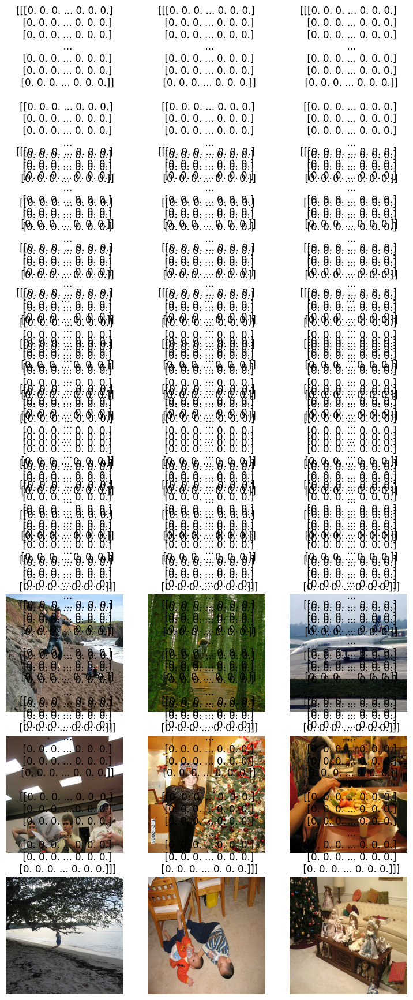

``` python
learn.fit(epochs, cbs=[ProgressCB(plot=True)])
```

<style>
    /* Turns off some styling */
    progress {
        /* gets rid of default border in Firefox and Opera. */
        border: none;
        /* Needs to be in here for Safari polyfill so background images work as expected. */
        background-size: auto;
    }
    progress:not([value]), progress:not([value])::-webkit-progress-bar {
        background: repeating-linear-gradient(45deg, #7e7e7e, #7e7e7e 10px, #5c5c5c 10px, #5c5c5c 20px);
    }
    .progress-bar-interrupted, .progress-bar-interrupted::-webkit-progress-bar {
        background: #F44336;
    }
</style>

<table class="dataframe" data-quarto-postprocess="true" data-border="1">
<thead>
<tr style="text-align: left;">
<th data-quarto-table-cell-role="th">MeanAP</th>
<th data-quarto-table-cell-role="th">loss</th>
<th data-quarto-table-cell-role="th">epoch</th>
<th data-quarto-table-cell-role="th">train</th>
<th data-quarto-table-cell-role="th">time</th>
</tr>
</thead>
<tbody>
<tr>
<td>0.000</td>
<td>4073.525</td>
<td>0</td>
<td>train</td>
<td>06:23</td>
</tr>
<tr>
<td>0.000</td>
<td>6326.053</td>
<td>0</td>
<td>eval</td>
<td>00:59</td>
</tr>
<tr>
<td>0.002</td>
<td>2554.204</td>
<td>1</td>
<td>train</td>
<td>03:32</td>
</tr>
<tr>
<td>0.014</td>
<td>3933.714</td>
<td>1</td>
<td>eval</td>
<td>00:42</td>
</tr>
<tr>
<td>0.030</td>
<td>1555.705</td>
<td>2</td>
<td>train</td>
<td>03:55</td>
</tr>
<tr>
<td>0.068</td>
<td>2416.115</td>
<td>2</td>
<td>eval</td>
<td>01:02</td>
</tr>
<tr>
<td>0.084</td>
<td>1030.208</td>
<td>3</td>
<td>train</td>
<td>04:24</td>
</tr>
<tr>
<td>0.106</td>
<td>1800.721</td>
<td>3</td>
<td>eval</td>
<td>01:07</td>
</tr>
<tr>
<td>0.118</td>
<td>848.246</td>
<td>4</td>
<td>train</td>
<td>04:29</td>
</tr>
<tr>
<td>0.107</td>
<td>1615.993</td>
<td>4</td>
<td>eval</td>
<td>01:05</td>
</tr>
<tr>
<td>0.123</td>
<td>787.683</td>
<td>5</td>
<td>train</td>
<td>04:23</td>
</tr>
<tr>
<td>0.106</td>
<td>1543.894</td>
<td>5</td>
<td>eval</td>
<td>01:03</td>
</tr>
<tr>
<td>0.120</td>
<td>757.363</td>
<td>6</td>
<td>train</td>
<td>04:18</td>
</tr>
<tr>
<td>0.103</td>
<td>1502.395</td>
<td>6</td>
<td>eval</td>
<td>01:04</td>
</tr>
<tr>
<td>0.120</td>
<td>736.230</td>
<td>7</td>
<td>train</td>
<td>04:17</td>
</tr>
<tr>
<td>0.102</td>
<td>1473.216</td>
<td>7</td>
<td>eval</td>
<td>01:03</td>
</tr>
<tr>
<td>0.118</td>
<td>716.683</td>
<td>8</td>
<td>train</td>
<td>04:13</td>
</tr>
<tr>
<td>0.100</td>
<td>1445.808</td>
<td>8</td>
<td>eval</td>
<td>01:02</td>
</tr>
<tr>
<td>0.114</td>
<td>701.659</td>
<td>9</td>
<td>train</td>
<td>04:11</td>
</tr>
<tr>
<td>0.102</td>
<td>1425.591</td>
<td>9</td>
<td>eval</td>
<td>01:03</td>
</tr>
<tr>
<td>0.107</td>
<td>688.869</td>
<td>10</td>
<td>train</td>
<td>04:10</td>
</tr>
<tr>
<td>0.099</td>
<td>1401.951</td>
<td>10</td>
<td>eval</td>
<td>01:07</td>
</tr>
<tr>
<td>0.111</td>
<td>678.630</td>
<td>11</td>
<td>train</td>
<td>04:14</td>
</tr>
<tr>
<td>0.103</td>
<td>1389.554</td>
<td>11</td>
<td>eval</td>
<td>01:01</td>
</tr>
<tr>
<td>0.110</td>
<td>668.484</td>
<td>12</td>
<td>train</td>
<td>04:09</td>
</tr>
<tr>
<td>0.097</td>
<td>1374.863</td>
<td>12</td>
<td>eval</td>
<td>01:01</td>
</tr>
<tr>
<td>0.104</td>
<td>661.353</td>
<td>13</td>
<td>train</td>
<td>04:12</td>
</tr>
<tr>
<td>0.096</td>
<td>1368.327</td>
<td>13</td>
<td>eval</td>
<td>01:00</td>
</tr>
<tr>
<td>0.104</td>
<td>654.398</td>
<td>14</td>
<td>train</td>
<td>04:11</td>
</tr>
<tr>
<td>0.098</td>
<td>1362.825</td>
<td>14</td>
<td>eval</td>
<td>01:01</td>
</tr>
<tr>
<td>0.104</td>
<td>649.071</td>
<td>15</td>
<td>train</td>
<td>04:11</td>
</tr>
<tr>
<td>0.093</td>
<td>1358.246</td>
<td>15</td>
<td>eval</td>
<td>01:01</td>
</tr>
<tr>
<td>0.101</td>
<td>646.394</td>
<td>16</td>
<td>train</td>
<td>04:10</td>
</tr>
<tr>
<td>0.096</td>
<td>1356.344</td>
<td>16</td>
<td>eval</td>
<td>01:01</td>
</tr>
<tr>
<td>0.106</td>
<td>644.981</td>
<td>17</td>
<td>train</td>
<td>04:08</td>
</tr>
<tr>
<td>0.096</td>
<td>1351.769</td>
<td>17</td>
<td>eval</td>
<td>01:01</td>
</tr>
<tr>
<td>0.104</td>
<td>642.134</td>
<td>18</td>
<td>train</td>
<td>04:09</td>
</tr>
<tr>
<td>0.097</td>
<td>1352.166</td>
<td>18</td>
<td>eval</td>
<td>01:02</td>
</tr>
<tr>
<td>0.102</td>
<td>641.413</td>
<td>19</td>
<td>train</td>
<td>04:09</td>
</tr>
<tr>
<td>0.090</td>
<td>1348.824</td>
<td>19</td>
<td>eval</td>
<td>01:01</td>
</tr>
</tbody>
</table>

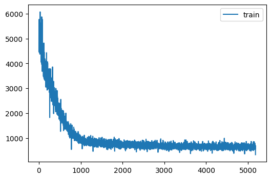

## Testing

Let’s see if the model learned about bounding boxes for the training
set.

Loading the weight from previous one:

``` python
# learn.opt_func = torch.optim.Adam(
#     learn.model.parameters(), lr=lr, weight_decay=0
# )

load_checkpoint(torch.load("yolov1_1e-6_20.pth.tar", map_location=torch.device('cpu'), weights_only=True),
                learn.model, learn.opt)
```

    => Loading checkpoint

``` python
learn.model.train(False)
for i in range(8):
    x0, y0 = trn_ds[i]
    bboxes = cellboxes_to_boxes(learn.model(x0.unsqueeze(0).to(DEVICE)))
    bboxes = non_max_suppression(bboxes[0], iou_threshold=0.5, threshold=0.4, box_format='midpoint')
    
    compare_ims(plot_image(x0, bboxes), plot_image(x0, cellboxes_to_boxes(y0.unsqueeze(0))[0]))
```


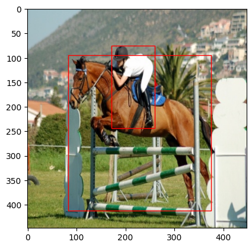

    TypeError: Image data of dtype object cannot be converted to float
    ---------------------------------------------------------------------------
    TypeError                                 Traceback (most recent call last)
    Cell In[19], line 7
          4 bboxes = cellboxes_to_boxes(learn.model(x0.unsqueeze(0).to(DEVICE)))
          5 bboxes = non_max_suppression(bboxes[0], iou_threshold=0.5, threshold=0.4, box_format='midpoint')
    ----> 7 compare_ims(plot_image(x0, bboxes), plot_image(x0, cellboxes_to_boxes(y0.unsqueeze(0))[0]))

    File ~/git/pilus_project/pilus_project/core.py:119, in compare_ims(img1, img2)
        117 plt.figure(figsize=(12,6))
        118 plt.subplot(121)
    --> 119 plt.imshow(img1, cmap='gray')
        120 plt.title('img1')
        121 plt.axis('off')

    File ~/miniforge3/envs/torch_latest/lib/python3.11/site-packages/matplotlib/pyplot.py:3592, in imshow(X, cmap, norm, aspect, interpolation, alpha, vmin, vmax, colorizer, origin, extent, interpolation_stage, filternorm, filterrad, resample, url, data, **kwargs)
       3570 @_copy_docstring_and_deprecators(Axes.imshow)
       3571 def imshow(
       3572     X: ArrayLike | PIL.Image.Image,
       (...)   3590     **kwargs,
       3591 ) -> AxesImage:
    -> 3592     __ret = gca().imshow(
       3593         X,
       3594         cmap=cmap,
       3595         norm=norm,
       3596         aspect=aspect,
       3597         interpolation=interpolation,
       3598         alpha=alpha,
       3599         vmin=vmin,
       3600         vmax=vmax,
       3601         colorizer=colorizer,
       3602         origin=origin,
       3603         extent=extent,
       3604         interpolation_stage=interpolation_stage,
       3605         filternorm=filternorm,
       3606         filterrad=filterrad,
       3607         resample=resample,
       3608         url=url,
       3609         **({"data": data} if data is not None else {}),
       3610         **kwargs,
       3611     )
       3612     sci(__ret)
       3613     return __ret

    File ~/miniforge3/envs/torch_latest/lib/python3.11/site-packages/matplotlib/__init__.py:1521, in _preprocess_data.<locals>.inner(ax, data, *args, **kwargs)
       1518 @functools.wraps(func)
       1519 def inner(ax, *args, data=None, **kwargs):
       1520     if data is None:
    -> 1521         return func(
       1522             ax,
       1523             *map(cbook.sanitize_sequence, args),
       1524             **{k: cbook.sanitize_sequence(v) for k, v in kwargs.items()})
       1526     bound = new_sig.bind(ax, *args, **kwargs)
       1527     auto_label = (bound.arguments.get(label_namer)
       1528                   or bound.kwargs.get(label_namer))

    File ~/miniforge3/envs/torch_latest/lib/python3.11/site-packages/matplotlib/axes/_axes.py:5945, in Axes.imshow(self, X, cmap, norm, aspect, interpolation, alpha, vmin, vmax, colorizer, origin, extent, interpolation_stage, filternorm, filterrad, resample, url, **kwargs)
       5942 if aspect is not None:
       5943     self.set_aspect(aspect)
    -> 5945 im.set_data(X)
       5946 im.set_alpha(alpha)
       5947 if im.get_clip_path() is None:
       5948     # image does not already have clipping set, clip to Axes patch

    File ~/miniforge3/envs/torch_latest/lib/python3.11/site-packages/matplotlib/image.py:675, in _ImageBase.set_data(self, A)
        673 if isinstance(A, PIL.Image.Image):
        674     A = pil_to_array(A)  # Needed e.g. to apply png palette.
    --> 675 self._A = self._normalize_image_array(A)
        676 self._imcache = None
        677 self.stale = True

    File ~/miniforge3/envs/torch_latest/lib/python3.11/site-packages/matplotlib/image.py:638, in _ImageBase._normalize_image_array(A)
        636 A = cbook.safe_masked_invalid(A, copy=True)
        637 if A.dtype != np.uint8 and not np.can_cast(A.dtype, float, "same_kind"):
    --> 638     raise TypeError(f"Image data of dtype {A.dtype} cannot be "
        639                     f"converted to float")
        640 if A.ndim == 3 and A.shape[-1] == 1:
        641     A = A.squeeze(-1)  # If just (M, N, 1), assume scalar and apply colormap.

    TypeError: Image data of dtype object cannot be converted to float

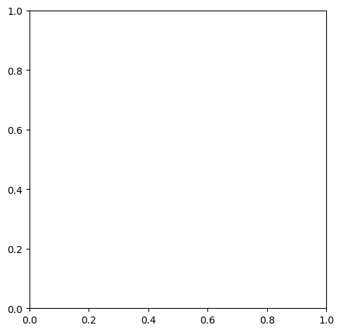

``` python
learn.model.train(False)
for i in range(8):
    x0, y0 = val_ds[i]
    bboxes = cellboxes_to_boxes(learn.model(x0.unsqueeze(0).to(DEVICE)))
    bboxes = non_max_suppression(bboxes[0], iou_threshold=0.5, threshold=0.4, box_format='midpoint')
    plot_image(x0, bboxes)
    plot_image(x0, cellboxes_to_boxes(y0.unsqueeze(0))[0])
```

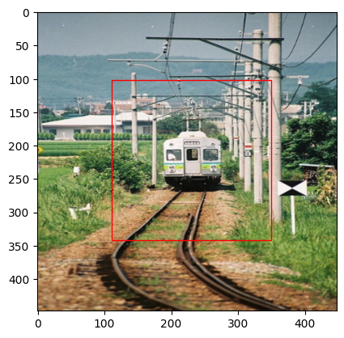

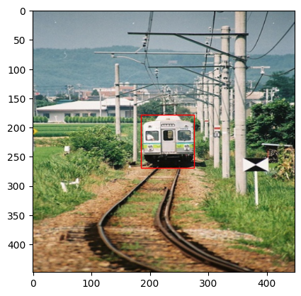

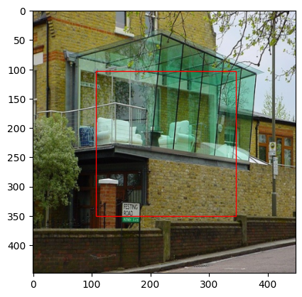


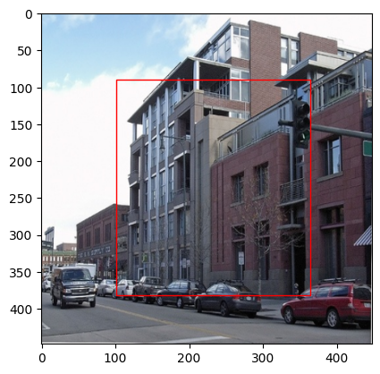

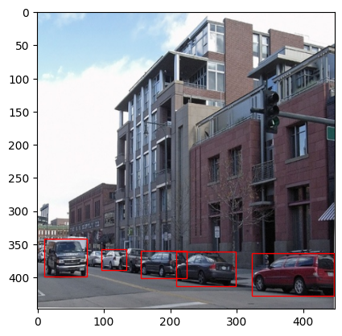

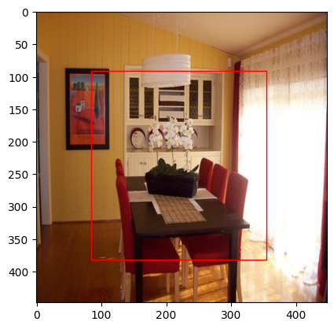

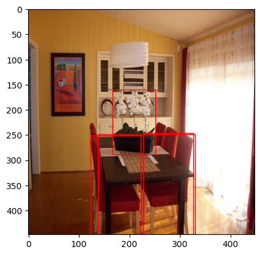

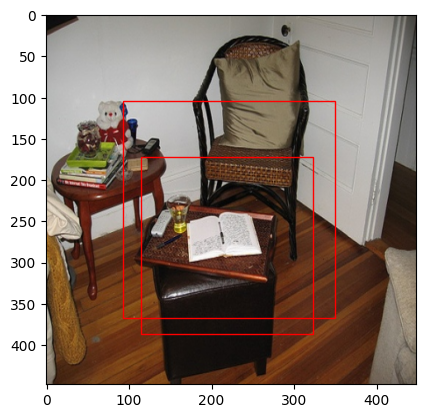

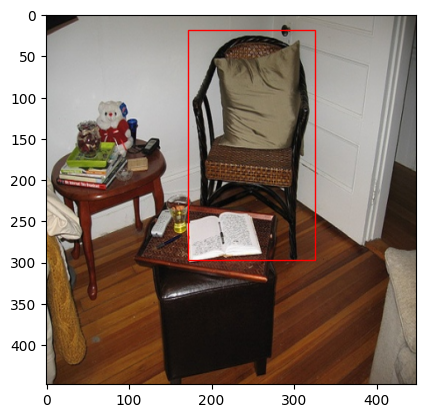

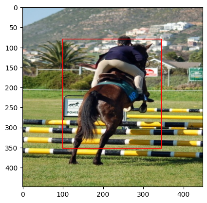

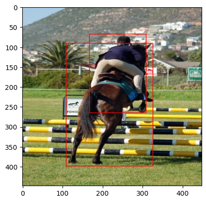


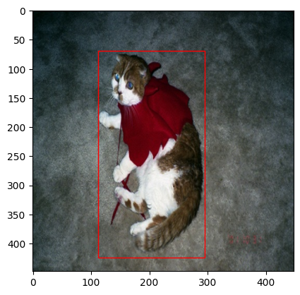

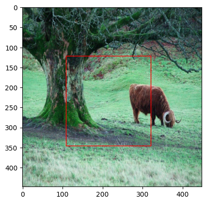


That doesn’t look that bad! Let’s save the model states.

``` python
checkpoint = {
   "state_dict": learn.model.state_dict(),
   "optimizer": learn.opt.state_dict(),
}
torch.save(checkpoint, "yolov1_1e-6_20.pth.tar")
```
