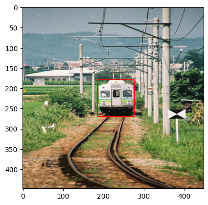
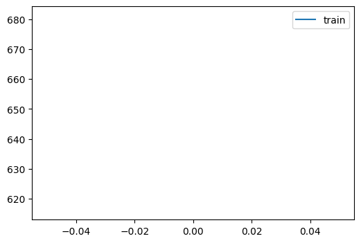

# Yolo v1 on bacteria


<!-- WARNING: THIS FILE WAS AUTOGENERATED! DO NOT EDIT! -->

``` python
import torch
import torchvision.transforms as transforms
from torch.optim import lr_scheduler

import numpy as np
import pandas as pd
import matplotlib.pyplot as plt
import fastcore.all as fc

from functools import partial
from collections import Counter

from minai import *
from pilus_project.yolov1 import *
```

``` python
set_seed(42)
```

``` python
transform = Compose([transforms.Resize((448, 448)), transforms.ToTensor(),])
IMG_DIR = "../data/images"
LABEL_DIR = "../data/labels"

bs = 8
```

``` python
!ls ..
```

    8examples.csv      _proc        pilus_project       test.csv
    8examples_val.csv  data         pilus_project.egg-info  train.all.txt
    LICENSE        generate_csv.py  pyproject.toml      train.csv
    MANIFEST.in    nbs          settings.ini        voc_dataset.sh
    README.md      old_txt_files    setup.py            voc_label.py

``` python
pd.read_csv("../8examples.csv")
```

<div>
<style scoped>
    .dataframe tbody tr th:only-of-type {
        vertical-align: middle;
    }
&#10;    .dataframe tbody tr th {
        vertical-align: top;
    }
&#10;    .dataframe thead th {
        text-align: right;
    }
</style>

<table class="dataframe" data-quarto-postprocess="true" data-border="1">
<thead>
<tr style="text-align: right;">
<th data-quarto-table-cell-role="th"></th>
<th data-quarto-table-cell-role="th">img</th>
<th data-quarto-table-cell-role="th">label</th>
</tr>
</thead>
<tbody>
<tr>
<td data-quarto-table-cell-role="th">0</td>
<td>000007.jpg</td>
<td>000007.txt</td>
</tr>
<tr>
<td data-quarto-table-cell-role="th">1</td>
<td>000009.jpg</td>
<td>000009.txt</td>
</tr>
<tr>
<td data-quarto-table-cell-role="th">2</td>
<td>000016.jpg</td>
<td>000016.txt</td>
</tr>
<tr>
<td data-quarto-table-cell-role="th">3</td>
<td>000019.jpg</td>
<td>000019.txt</td>
</tr>
<tr>
<td data-quarto-table-cell-role="th">4</td>
<td>000020.jpg</td>
<td>000020.txt</td>
</tr>
<tr>
<td data-quarto-table-cell-role="th">5</td>
<td>000021.jpg</td>
<td>000021.txt</td>
</tr>
<tr>
<td data-quarto-table-cell-role="th">6</td>
<td>000122.jpg</td>
<td>000122.txt</td>
</tr>
<tr>
<td data-quarto-table-cell-role="th">7</td>
<td>000129.jpg</td>
<td>000129.txt</td>
</tr>
</tbody>
</table>

</div>

``` python
trn_ds = VOCDataset("../8examples.csv", 
                    transform=transform,
                    img_dir=IMG_DIR,
                    label_dir=LABEL_DIR)
x0, y0 = trn_ds[0]
plot_image(x0, cellboxes_to_boxes(y0.unsqueeze(0))[0])
```


``` python
# examples_val_8 = pd.read_csv("../test.csv").iloc[:8]
# examples_val_8
```

``` python
# examples_val_8.to_csv('../8examples_val.csv', index=False)
```

``` python
val_ds = VOCDataset(
    "../8examples_val.csv", transform=transform, img_dir=IMG_DIR, label_dir=LABEL_DIR,
)
x0, y0 = val_ds[0]
plot_image(x0, cellboxes_to_boxes(y0.unsqueeze(0))[0])
```



``` python
len(val_ds)
```

    8

``` python
trn_dl, val_dl = get_dls(trn_ds, val_ds, bs)
xb, yb = next(iter(trn_dl))
xb.shape, yb.shape
```

    (torch.Size([8, 3, 448, 448]), torch.Size([8, 7, 7, 30]))

``` python
dls = DataLoaders(trn_dl, val_dl)
```

## Learner

``` python
class MeanAP:
    def __init__(self, num_classes=1, epsilon=1e-6, threshold=0.4, iou_threshold=0.5, box_format='midpoint'):
        self.num_classes = num_classes
        self.epsilon = epsilon
        self.threshold = threshold
        self.iou_threshold = iou_threshold
        self.box_format = box_format
        self.average_precisions = []
    
    def reset(self):
        self.average_precisions = []
    
    def compute(self):
        return sum(self.average_precisions) / len(self.average_precisions)
    
    def update(self, pred, label):
        # `get_bboxes` part
        all_pred_boxes = []
        all_true_boxes = []
        train_idx = 0
        batch_size = pred.shape[0]
        pred_boxes = cellboxes_to_boxes(pred)
        true_boxes = cellboxes_to_boxes(label)
        
        for idx in range(batch_size):
            nms_boxes = non_max_suppression(
                pred_boxes[idx],
                iou_threshold=self.iou_threshold,
                threshold=self.threshold,
                box_format=self.box_format,
            )

            for nms_box in nms_boxes:
                all_pred_boxes.append([train_idx] + nms_box)

            for box in true_boxes[idx]:
                # many will get converted to 0 pred
                if box[1] > self.threshold:
                    all_true_boxes.append([train_idx] + box)
        
        pred_boxes = all_pred_boxes
        true_boxes = all_true_boxes
        
        for c in range(self.num_classes):
            detections = []
            ground_truths = []

            # Go through all predictions and targets,
            # and only add the ones that belong to the
            # current class c
            for detection in pred_boxes:
                if detection[1] == c:
                    detections.append(detection)

            for true_box in true_boxes:
                if true_box[1] == c:
                    ground_truths.append(true_box)

            # find the amount of bboxes for each training example
            # Counter here finds how many ground truth bboxes we get
            # for each training example, so let's say img 0 has 3,
            # img 1 has 5 then we will obtain a dictionary with:
            # amount_bboxes = {0:3, 1:5}
            amount_bboxes = Counter([gt[0] for gt in ground_truths])

            # We then go through each key, val in this dictionary
            # and convert to the following (w.r.t same example):
            # ammount_bboxes = {0:torch.tensor[0,0,0], 1:torch.tensor[0,0,0,0,0]}
            for key, val in amount_bboxes.items():
                amount_bboxes[key] = torch.zeros(val)

            # sort by box probabilities which is index 2
            detections.sort(key=lambda x: x[2], reverse=True)
            TP = torch.zeros((len(detections)))
            FP = torch.zeros((len(detections)))
            total_true_bboxes = len(ground_truths)

            # If none exists for this class then we can safely skip
            if total_true_bboxes == 0:
                continue

            for detection_idx, detection in enumerate(detections):
                # Only take out the ground_truths that have the same
                # training idx as detection
                ground_truth_img = [
                    bbox for bbox in ground_truths if bbox[0] == detection[0]
                ]

                num_gts = len(ground_truth_img)
                best_iou = 0

                for idx, gt in enumerate(ground_truth_img):
                    iou = intersection_over_union(
                        torch.tensor(detection[3:]),
                        torch.tensor(gt[3:]),
                        box_format=self.box_format,
                    )

                    if iou > best_iou:
                        best_iou = iou
                        best_gt_idx = idx

                if best_iou > self.iou_threshold:
                    # only detect ground truth detection once
                    if amount_bboxes[detection[0]][best_gt_idx] == 0:
                        # true positive and add this bounding box to seen
                        TP[detection_idx] = 1
                        amount_bboxes[detection[0]][best_gt_idx] = 1
                    else:
                        FP[detection_idx] = 1

                # if IOU is lower then the detection is a false positive
                else:
                    FP[detection_idx] = 1

            TP_cumsum = torch.cumsum(TP, dim=0)
            FP_cumsum = torch.cumsum(FP, dim=0)
            recalls = TP_cumsum / (total_true_bboxes + self.epsilon)
            precisions = torch.divide(TP_cumsum, (TP_cumsum + FP_cumsum + self.epsilon))
            precisions = torch.cat((torch.tensor([1]), precisions))
            recalls = torch.cat((torch.tensor([0]), recalls))
            # torch.trapz for numerical integration
            self.average_precisions.append(torch.trapz(precisions, recalls))
```

``` python
cbs = [
    TrainCB(),
    DeviceCB(),
    MetricsCB(MeanAP(num_classes=20)),
]
opt = partial(torch.optim.AdamW, betas=(0.9,0.95), eps=1e-5)
```

``` python
model = Yolov1(split_size=7, num_boxes=2, num_classes=20)

lr, epochs = 1e-5, 150
tmax = epochs * len(dls.train)
sched = partial(lr_scheduler.OneCycleLR, max_lr=lr, total_steps=tmax)
xtra = [BatchSchedCB(sched)]

learn = Learner(model, dls, YoloLoss(), lr=lr, cbs=cbs+xtra, opt_func=torch.optim.AdamW)
```

``` python
learn.show_image_batch()
```


``` python
learn.fit(epochs, cbs=[ProgressCB(plot=True)])
```

<style>
    /* Turns off some styling */
    progress {
        /* gets rid of default border in Firefox and Opera. */
        border: none;
        /* Needs to be in here for Safari polyfill so background images work as expected. */
        background-size: auto;
    }
    progress:not([value]), progress:not([value])::-webkit-progress-bar {
        background: repeating-linear-gradient(45deg, #7e7e7e, #7e7e7e 10px, #5c5c5c 10px, #5c5c5c 20px);
    }
    .progress-bar-interrupted, .progress-bar-interrupted::-webkit-progress-bar {
        background: #F44336;
    }
</style>

<div>
      <progress value='0' class='' max='150' style='width:300px; height:20px; vertical-align: middle;'></progress>
      0.00% [0/150 00:00&lt;?]
    </div>
    &#10;

<table class="dataframe" data-quarto-postprocess="true" data-border="1">
<thead>
<tr style="text-align: left;">
<th data-quarto-table-cell-role="th">MeanAP</th>
<th data-quarto-table-cell-role="th">loss</th>
<th data-quarto-table-cell-role="th">epoch</th>
<th data-quarto-table-cell-role="th">train</th>
<th data-quarto-table-cell-role="th">time</th>
</tr>
</thead>
<tbody>
<tr>
<td>0.000</td>
<td>648.640</td>
<td>0</td>
<td>train</td>
<td>00:04</td>
</tr>
</tbody>
</table>

<p>
&#10;    <div>
      <progress value='0' class='' max='1' style='width:300px; height:20px; vertical-align: middle;'></progress>
      0.00% [0/1 00:00&lt;?]
    </div>



    KeyboardInterrupt: 
    ---------------------------------------------------------------------------
    KeyboardInterrupt                         Traceback (most recent call last)
    Cell In[15], line 1
    ----> 1 learn.fit(epochs, cbs=[ProgressCB(plot=True)])

    File ~/miniforge3/envs/torch_latest/lib/python3.11/site-packages/minai/core.py:264, in Learner.fit(self, n_epochs, train, valid, cbs, lr)
        262     if lr is None: lr = self.lr
        263     if self.opt_func: self.opt = self.opt_func(self.model.parameters(), lr)
    --> 264     self._fit(train, valid)
        265 finally:
        266     for cb in cbs: self.cbs.remove(cb)

    File ~/miniforge3/envs/torch_latest/lib/python3.11/site-packages/minai/core.py:198, in with_cbs.__call__.<locals>._f(o, *args, **kwargs)
        196 try:
        197     o.callback(f'before_{self.nm}')
    --> 198     f(o, *args, **kwargs)
        199     o.callback(f'after_{self.nm}')
        200 except globals()[f'Cancel{self.nm.title()}Exception']: pass

    File ~/miniforge3/envs/torch_latest/lib/python3.11/site-packages/minai/core.py:254, in Learner._fit(self, train, valid)
        252 if train: self.one_epoch(True)
        253 if valid:
    --> 254     with torch.inference_mode(): self.one_epoch(False)

    File ~/miniforge3/envs/torch_latest/lib/python3.11/site-packages/minai/core.py:245, in Learner.one_epoch(self, training)
        243 self.model.train(training)
        244 self.dl = self.train_dl if training else self.dls.valid
    --> 245 self._one_epoch()

    File ~/miniforge3/envs/torch_latest/lib/python3.11/site-packages/minai/core.py:198, in with_cbs.__call__.<locals>._f(o, *args, **kwargs)
        196 try:
        197     o.callback(f'before_{self.nm}')
    --> 198     f(o, *args, **kwargs)
        199     o.callback(f'after_{self.nm}')
        200 except globals()[f'Cancel{self.nm.title()}Exception']: pass

    File ~/miniforge3/envs/torch_latest/lib/python3.11/site-packages/minai/core.py:240, in Learner._one_epoch(self)
        238 @with_cbs('epoch')
        239 def _one_epoch(self):
    --> 240     for self.iter,self.batch in enumerate(self.dl): self._one_batch()

    File ~/miniforge3/envs/torch_latest/lib/python3.11/site-packages/fastprogress/fastprogress.py:41, in ProgressBar.__iter__(self)
         39 if self.total != 0: self.update(0)
         40 try:
    ---> 41     for i,o in enumerate(self.gen):
         42         if self.total and i >= self.total: break
         43         yield o

    File ~/miniforge3/envs/torch_latest/lib/python3.11/site-packages/torch/utils/data/dataloader.py:701, in _BaseDataLoaderIter.__next__(self)
        698 if self._sampler_iter is None:
        699     # TODO(https://github.com/pytorch/pytorch/issues/76750)
        700     self._reset()  # type: ignore[call-arg]
    --> 701 data = self._next_data()
        702 self._num_yielded += 1
        703 if (
        704     self._dataset_kind == _DatasetKind.Iterable
        705     and self._IterableDataset_len_called is not None
        706     and self._num_yielded > self._IterableDataset_len_called
        707 ):

    File ~/miniforge3/envs/torch_latest/lib/python3.11/site-packages/torch/utils/data/dataloader.py:757, in _SingleProcessDataLoaderIter._next_data(self)
        755 def _next_data(self):
        756     index = self._next_index()  # may raise StopIteration
    --> 757     data = self._dataset_fetcher.fetch(index)  # may raise StopIteration
        758     if self._pin_memory:
        759         data = _utils.pin_memory.pin_memory(data, self._pin_memory_device)

    File ~/miniforge3/envs/torch_latest/lib/python3.11/site-packages/torch/utils/data/_utils/fetch.py:52, in _MapDatasetFetcher.fetch(self, possibly_batched_index)
         50         data = self.dataset.__getitems__(possibly_batched_index)
         51     else:
    ---> 52         data = [self.dataset[idx] for idx in possibly_batched_index]
         53 else:
         54     data = self.dataset[possibly_batched_index]

    File ~/miniforge3/envs/torch_latest/lib/python3.11/site-packages/torch/utils/data/_utils/fetch.py:52, in <listcomp>(.0)
         50         data = self.dataset.__getitems__(possibly_batched_index)
         51     else:
    ---> 52         data = [self.dataset[idx] for idx in possibly_batched_index]
         53 else:
         54     data = self.dataset[possibly_batched_index]

    File ~/git/pilus_project/pilus_project/yolov1.py:405, in VOCDataset.__getitem__(self, index)
        401 boxes = torch.tensor(boxes)
        403 if self.transform:
        404     # image = self.transform(image)
    --> 405     image, boxes = self.transform(image, boxes)
        407 # Convert To Cells
        408 label_matrix = torch.zeros((self.S, self.S, self.C + 5 * self.B))

    File ~/git/pilus_project/pilus_project/yolov1.py:692, in Compose.__call__(self, img, bboxes)
        690 def __call__(self, img, bboxes):
        691     for t in self.transforms:
    --> 692         img, bboxes = t(img), bboxes
        694     return img, bboxes

    File ~/miniforge3/envs/torch_latest/lib/python3.11/site-packages/torch/nn/modules/module.py:1736, in Module._wrapped_call_impl(self, *args, **kwargs)
       1734     return self._compiled_call_impl(*args, **kwargs)  # type: ignore[misc]
       1735 else:
    -> 1736     return self._call_impl(*args, **kwargs)

    File ~/miniforge3/envs/torch_latest/lib/python3.11/site-packages/torch/nn/modules/module.py:1747, in Module._call_impl(self, *args, **kwargs)
       1742 # If we don't have any hooks, we want to skip the rest of the logic in
       1743 # this function, and just call forward.
       1744 if not (self._backward_hooks or self._backward_pre_hooks or self._forward_hooks or self._forward_pre_hooks
       1745         or _global_backward_pre_hooks or _global_backward_hooks
       1746         or _global_forward_hooks or _global_forward_pre_hooks):
    -> 1747     return forward_call(*args, **kwargs)
       1749 result = None
       1750 called_always_called_hooks = set()

    File ~/miniforge3/envs/torch_latest/lib/python3.11/site-packages/torchvision/transforms/transforms.py:354, in Resize.forward(self, img)
        346 def forward(self, img):
        347     """
        348     Args:
        349         img (PIL Image or Tensor): Image to be scaled.
       (...)    352         PIL Image or Tensor: Rescaled image.
        353     """
    --> 354     return F.resize(img, self.size, self.interpolation, self.max_size, self.antialias)

    File ~/miniforge3/envs/torch_latest/lib/python3.11/site-packages/torchvision/transforms/functional.py:477, in resize(img, size, interpolation, max_size, antialias)
        475         warnings.warn("Anti-alias option is always applied for PIL Image input. Argument antialias is ignored.")
        476     pil_interpolation = pil_modes_mapping[interpolation]
    --> 477     return F_pil.resize(img, size=output_size, interpolation=pil_interpolation)
        479 return F_t.resize(img, size=output_size, interpolation=interpolation.value, antialias=antialias)

    File ~/miniforge3/envs/torch_latest/lib/python3.11/site-packages/torchvision/transforms/_functional_pil.py:250, in resize(img, size, interpolation)
        247 if not (isinstance(size, list) and len(size) == 2):
        248     raise TypeError(f"Got inappropriate size arg: {size}")
    --> 250 return img.resize(tuple(size[::-1]), interpolation)

    File ~/miniforge3/envs/torch_latest/lib/python3.11/site-packages/PIL/Image.py:2293, in Image.resize(self, size, resample, box, reducing_gap)
       2290     msg = "reducing_gap must be 1.0 or greater"
       2291     raise ValueError(msg)
    -> 2293 self.load()
       2294 if box is None:
       2295     box = (0, 0) + self.size

    File ~/miniforge3/envs/torch_latest/lib/python3.11/site-packages/PIL/ImageFile.py:293, in ImageFile.load(self)
        290         raise OSError(msg)
        292 b = b + s
    --> 293 n, err_code = decoder.decode(b)
        294 if n < 0:
        295     break

    KeyboardInterrupt: 


## Testing

Let’s see if the model learned about bounding boxes for the training
set.

Loading the weight from previous one:

``` python
# learn.opt_func = torch.optim.Adam(
#     learn.model.parameters(), lr=lr, weight_decay=0
# )

# load_checkpoint(torch.load("overfit.pth.tar"), learn.model, learn.opt_func)
```

``` python
learn.model.train(False)
for i in range(8):
    x0, y0 = trn_ds[i]
    bboxes = cellboxes_to_boxes(learn.model(x0.unsqueeze(0).to(DEVICE)))
    bboxes = non_max_suppression(bboxes[0], iou_threshold=0.5, threshold=0.4, box_format='midpoint')
    plot_image(x0, bboxes)
```


``` python
learn.model.train(False)
for i in range(8):
    x0, y0 = val_ds[i]
    bboxes = cellboxes_to_boxes(learn.model(x0.unsqueeze(0).to(DEVICE)))
    bboxes = non_max_suppression(bboxes[0], iou_threshold=0.5, threshold=0.4, box_format='midpoint')
    plot_image(x0, bboxes)
```


